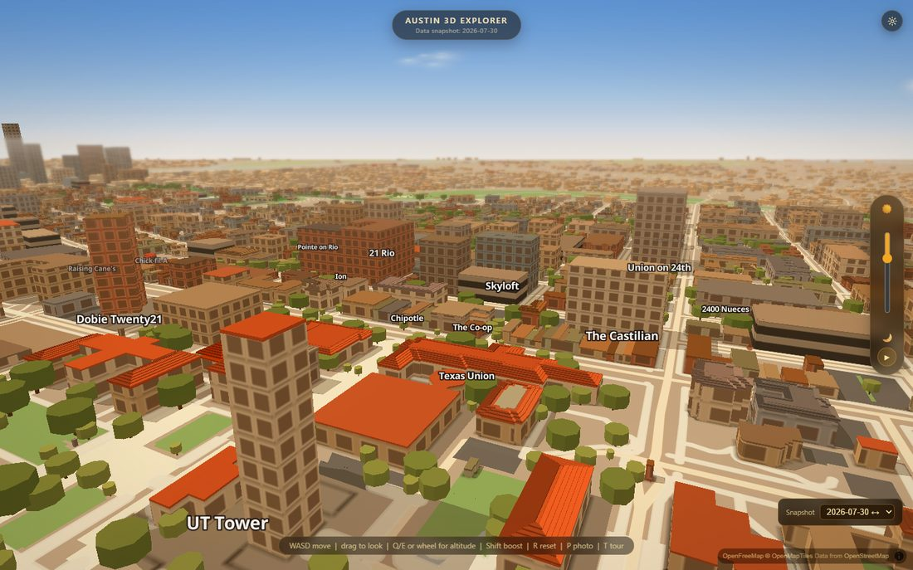
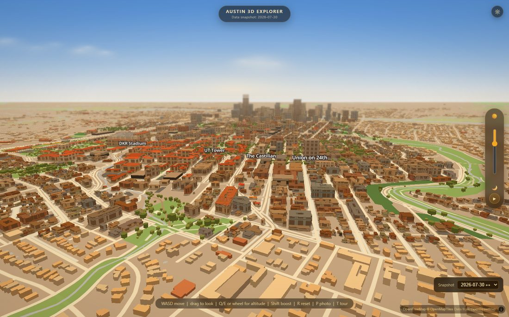
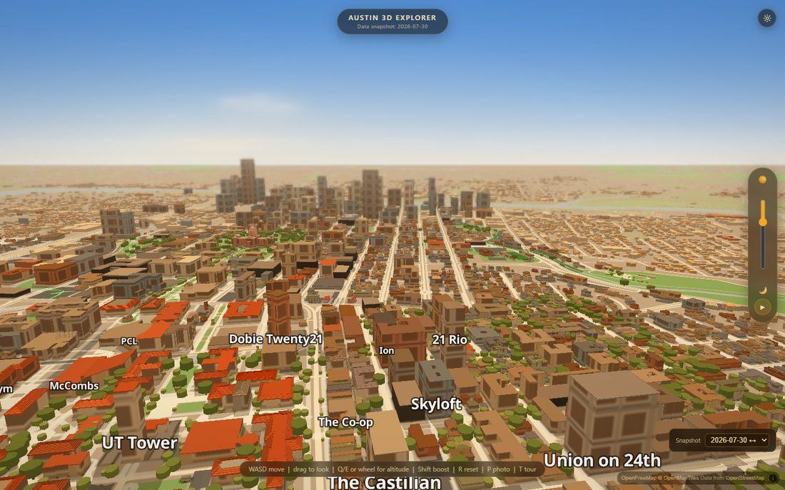
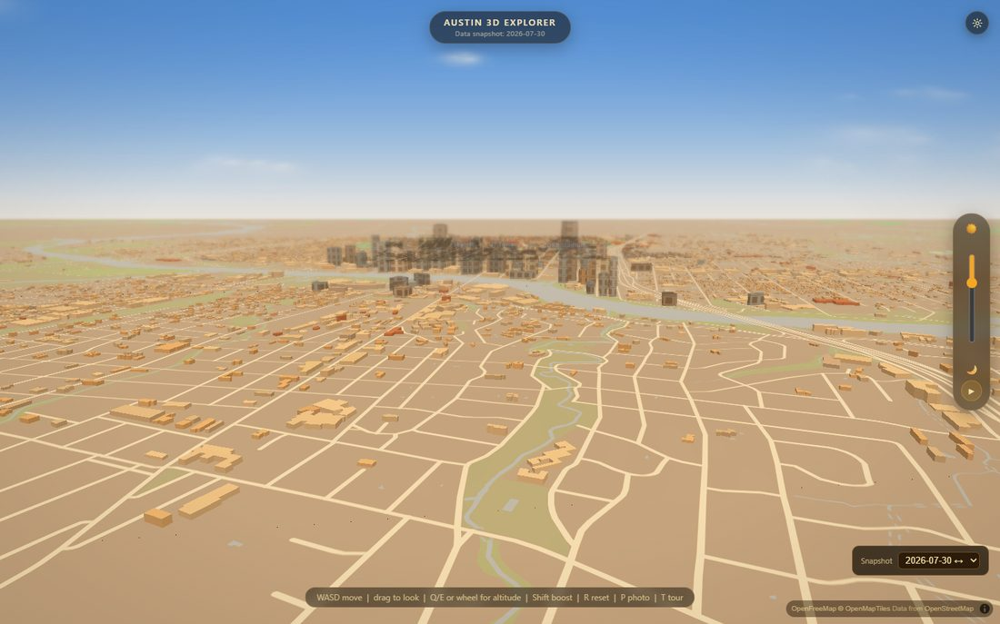
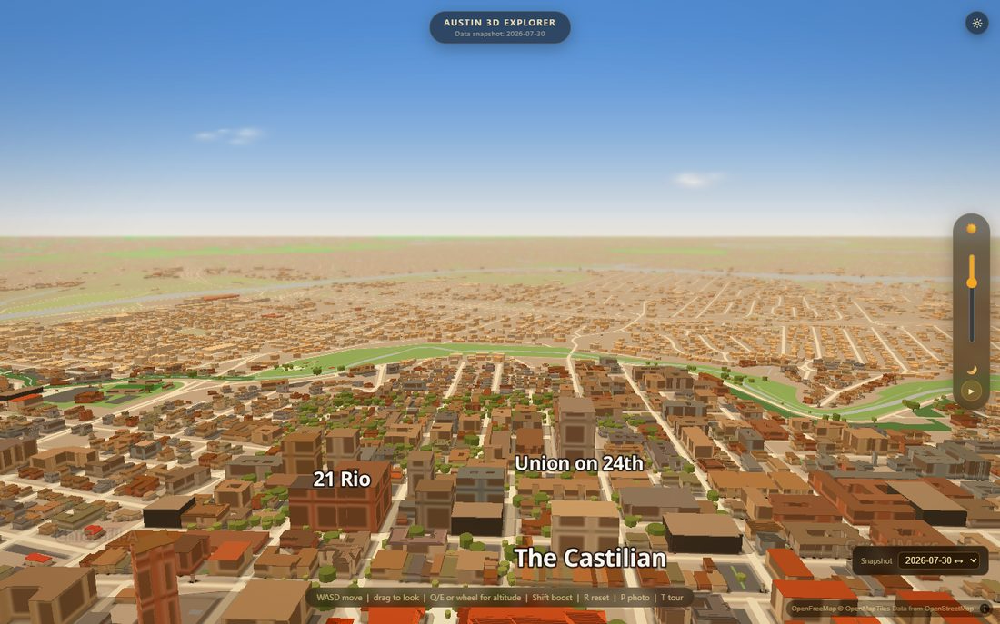
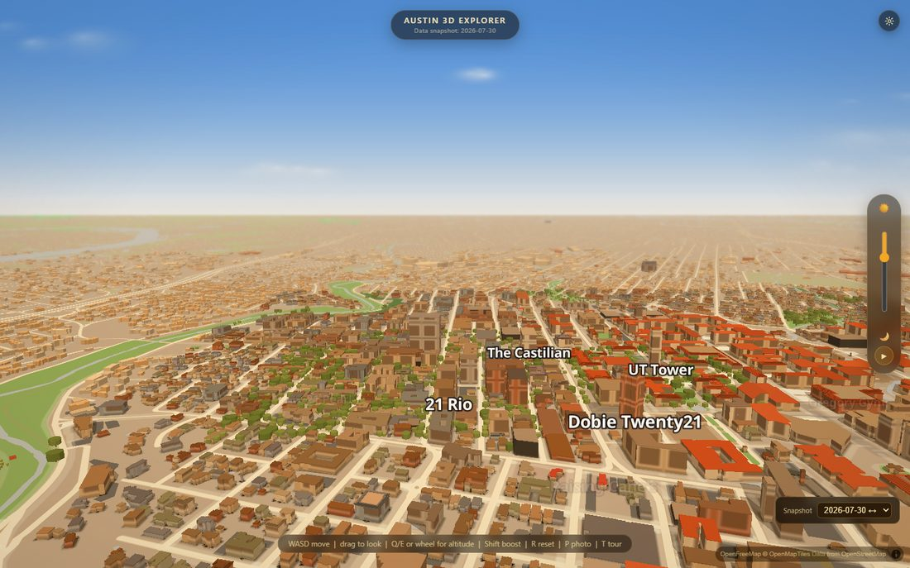
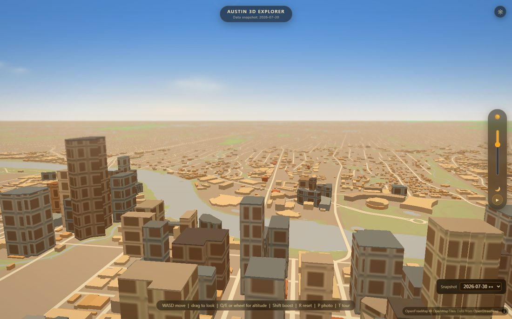
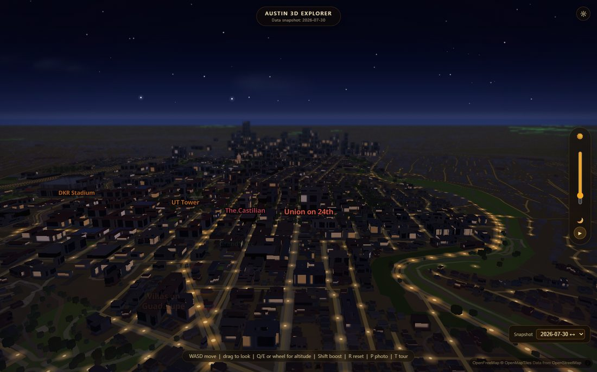

# The outer ring — tripling the radius without spending the frame

**Branch:** `data/extend-radius`

The modelled world used to be 2.5 × 2.2 km. Fly two blocks past its edge in any
direction and Austin stopped dead: no downtown, no Lady Bird Lake, no
neighbourhoods, just the basemap plain running to the horizon. This pass adds
the rest of the city — **deliberately cheaper than the core**, because the core
scene was already at its frame budget before any of this existed.

---

## ⚠️ ONE LINE TO PASTE (nothing renders without it)

`index.html` is owned by another pass, so it is untouched here. Add this line
**immediately before `<script src="js/app.js"></script>`**:

```html
<script src="js/outer.js"></script>
```

That is the entire wiring. `js/outer.js` bootstraps itself off `window.__map`,
waits for the core building layers and the facade atlas, and inserts itself
underneath them. Nothing in `js/app.js` changes.

`_harness.html` already has the line (the verification suite needs it), so
**until you paste it, the harness renders the ring and the live site does not** —
which is exactly the failure mode `_harness.html`'s own comment warns about.

---

## 1. The box, and why it is that box

|            | west      | east      | south    | north    | size            |
|------------|-----------|-----------|----------|----------|-----------------|
| **Core** (`scripts/config.sh`) | −97.752 | −97.726 | 30.276 | 30.296 | 2.50 × 2.23 km |
| **Capitol** (`bake_capitol.py`) | −97.752 | −97.726 | 30.271 | 30.276 | 2.50 × 0.58 km |
| **Outer** (`extract_outer.py`) | **−97.788** | **−97.702** | **30.240** | **30.315** | **8.27 × 8.35 km** |

**3.31× the east–west extent, 3.75× the north–south, 12.4× the area.**

It is asymmetric, and the asymmetry is about the **camera**, not the map:

- **South to 30.240** — past Lady Bird Lake and both bridges and clear of
  Oltorf, so the downtown towers have water in front of them when you look
  south from campus. This is the shot the whole extension is for.
- **West to −97.788** — the spawn pose faces WSW (bearing 250), so west is the
  direction the horizon is actually in frame the moment the app loads.
- **East to −97.702** — across I-35 into east Austin, so downtown has a backdrop
  instead of a cliff behind it when the camera is west of it.
- **North to 30.315** — the thinnest reach (2.7 km from spawn). No intended
  flight path looks north for long, but it is far enough that the idle-cinema
  orbit never frames the edge.

The south edge started at **30.250** and was moved by a screenshot, not by
reasoning. At 30.250 the along-the-lake pose came back with a perfectly correct
downtown skyline standing behind a **bare tan plain** — because at a flying
pitch the near half of the frame is the ground you are directly over, and that
ground was outside the box. Reaching to 30.240 costs 487 more buildings (7%) and
buys the entire foreground of one of the three intended flight paths.

```
   30.315 ┌──────────────────────────────────────────┐  Hyde Park / Hancock
          │                                          │
          │            ┌─────────────┐               │
   30.296 │            │    CORE     │               │  UT + West Campus
          │            │  untouched  │               │
   30.276 │            ├─────────────┤               │
   30.271 │            │  CAPITOL    │               │
          │        ┌───┴─────────────┴──┐            │
          │        │     DOWNTOWN       │            │  second cull anchor
   30.256 │        └────────────────────┘            │
          │  ~~~~~~~ Lady Bird Lake ~~~~~~~~~~~~~~~~ │
   30.250 │  ← the first south edge. Not far enough. │
          │        South Congress / Bouldin          │
   30.240 └──────────────────────────────────────────┘  Oltorf
       −97.788                                   −97.702
```

## 2. Building counts

| tier | buildings | vertices | avg verts/footprint |
|---|---:|---:|---:|
| Core snapshot (`buildings.detailed.geojson`) | 2,453 | 29,641 | 12.1 |
| Capitol Complex (`capitol.geojson`) | 604 | 6,217 | 10.3 |
| **Core total, before** | **3,057** | **35,858** | **11.7** |
| Outer ring (`outer_ring.geojson`) | **7,625** *(114 towers)* | **70,518** | **9.2** |
| **Scene total, after** | **10,682** | **106,376** | |

The ring was culled from **47,238** raw Overture footprints: **39,179 dropped
below the area threshold** and **434 as duplicates** of the core or the Capitol.
Vertex count fell **84.7%** (459,536 → 70,518) through simplification.

So the ring is **2.5× the building count and 12.4× the ground area of the core,
but only 2.0× its vertices** — and it pays for one layer instead of three.

## 3. The quality tiering — exactly what the outer ring does NOT get

This is the owner's instruction made concrete. The core is unchanged; the ring
is a second, cheaper class of building.

| the core gets | the outer ring gets |
|---|---|
| a facade pattern from the quantised 44-image atlas | a **flat baked colour** — *towers excepted* |
| `buildings-ao`, a 44 px blurred contact shadow per footprint | **nothing.** That layer alone measured 3.6 fps on 2,400 footprints |
| a parapet roof cap (a second extrusion per building) | **nothing** — *towers excepted* |
| a swept ground shadow (`shadows.js`) | **nothing** |
| an OSM name label | **nothing** |
| hero palettes (`hero_designs.json`), OSM `building:part` volumes, pitched roof facets, curated signage | **nothing** |
| full Overture geometry, holes and all | largest ring only, holes dropped, Douglas–Peucker at 1.2–4.5 m — **84.7% fewer vertices** |
| 14 colour buckets derived from the data | **5 city tones + 4 tower materials** |
| every footprint in the box | a **minimum-area cull that grows with distance** — 83% of candidates dropped |
| every property Overture and OSM supply | **five**: `h`, `wd`/`wg`/`wn`, `d`. No id, no name, no class, no source_height |
| tiles cut to z18 | source `maxzoom: 15`, permanently overzoomed — the LOD is the point |

**The one exception is downtown towers** (`t=1`, ≥ 40 m; 114 of them). They keep
the core's facade pattern and a roof cap, because the skyline silhouette is the
entire reason the box reaches south. They cost nothing extra in atlas terms:
`facades.js:quantiseOuterFacades` snaps each tower onto a pattern that **already
exists** and is the one quantiser forbidden from calling `addImage`. The atlas
cost is per *image* — a texture upload plus a repaint on every time-of-day tick —
not per building, so 114 towers are free and one new pattern would not be.

Roof colours (`rd`/`rg`/`rn`) are baked for the **towers only**. Three more hex
strings on every one of 7,625 houses would be most of the file for a roof plane
nobody ever sees.

## 4. Frame time

Short version: **the ring's cost is at or below this machine's measurement
floor.** Pooled across 15 paired runs, the median is **+2.3 ms of GPU time per
frame on a 44–66 ms frame at 2560×1400** — about 3% — and the pair-to-pair
spread (±16 ms) is far wider than the effect. On all three flight paths the
scene still reaches the **60 Hz vsync floor** with the ring on.

Getting to a number that means anything took four wrong measurements, and each
one is now a comment in `scripts/verify/outer-perf.mjs`:

| attempt | what it reported | what was actually wrong |
|---|---|---|
| median fps, 4 s, 2560×1400 | the ring makes the scene **faster** on 2 of 3 paths | the machine had three other agents on it (35 Chrome processes, 88% CPU). A median under that load measures the machine. |
| p10 frame time, 1440×900 | exactly **50.00 ms** vs 49.90 ms — quantised, identical | Chrome throttles rAF in a window it thinks is occluded, and it was. Fixed with `--disable-backgrounding-occluded-windows` + friends. |
| same, vsync **off** | fastest frames **1.9 ms** for 10,000 extrusions | with vsync off a frame delta measures how fast the CPU can *submit* draw calls, not how long the GPU takes to run them |
| same, vsync **on** | fastest frames **16.5 ms** for every configuration | that is the refresh rate. The statistic saturates and cannot resolve anything. |

What finally worked: issue a 1×1 **`gl.readPixels`** at the end of MapLibre's own
`render` event. `readPixels` cannot return until every draw submitted before it
has actually executed, so each frame becomes real GPU time. Then difference
**within** each rep — off and on run back to back, seconds apart — because
repeats of the *same* configuration swing 47–73 ms and drift upward as the GPU
heats, which is what gave three different signs for one change.

```
campus -> downtown, 6 paired runs, GPU ms (readPixels-stalled), 2560x1400:
  off  47.2  69.7  66.0  65.2  59.0  72.5
  on   64.0  77.2  54.8  59.4  64.7  58.4
  paired deltas  +16.8  +7.5  -11.2  -5.8  +5.7  -14.1   -> median -0.05 ms

all three paths, 15 paired runs pooled:
  median +2.30 ms   mean +1.62 ms   range -14.1 .. +16.8   IQR -5.8 .. +7.4
```

Read honestly: the effect is smaller than the noise floor of this machine. The
defensible claim is a **bound**, not a value — the ring costs no more than a few
percent of a frame, and it does not stop the scene hitting vsync.

The deterministic number is the better one to trust, and it is the reason the
measured cost is so small: the ring submits **2.0× the core's vertices across
one layer**, where the core submits its own across three plus a full-screen
blurred AO line. Reproduce:

```bash
cd scripts/verify && VERIFY_URL=http://127.0.0.1:8123 node outer-perf.mjs 6 --path downtown
```

### What protects the budget going forward

- **The cull is the budget lever**, and it is a bake-time number: `AREA_FLOOR`
  and `AREA_PER_KM` in `bake_outer.py`. Raising `AREA_PER_KM` from 120 to 170
  took the ring from 11,181 buildings to 7,625 in one re-bake.
- **The density knob** (`GFX.outerDensity`, §10) thins the ring at runtime
  without a re-bake, and the `performance` preset — which the auto-detect drops
  into at ~30 fps — already sets it to 0.45.
- **`scripts/verify/outer-check.mjs`** (20 assertions, all passing) is the tiering
  written down where a change trips over it. Most of them are negatives: no AO
  layer, no labels, no pattern on the bulk of the ring, zero new atlas images.

## 5. Heights — the part that actually shows at distance

At flyover altitude a facade texture is sub-pixel and a colour is a suggestion.
A wrong height is a wrong skyline, and that is the one error a stranger
scrolling past can see.

Overture's LiDAR heights are good across most of the box and **badly wrong for
recent downtown towers**, in the worst direction — the return is the podium:

| building | Overture 2026‑07‑22.0 | actual | how it was fixed |
|---|---:|---:|---|
| Sixth and Guadalupe *(tallest in Austin)* | 18.7 m | **267.0 m** | Wikipedia; OSM had levels only |
| Fairmont Austin | 20.6 m | **180.0 m** | Wikipedia; OSM had levels only |
| The Northshore | 19.9 m | **129.3 m** | Wikipedia; OSM had levels only |
| One American Center | 24.1 m | **122.2 m** | Wikipedia; OSM had levels only |
| The Waller | 12.3 m | **113.0 m** | Wikipedia; OSM had levels only |
| 360 Condominiums | 148.8 m | **177.1 m** | Wikipedia; not named in OSM |
| The Travis | *none at all* | **171.3 m** | Wikipedia; not named in OSM |
| Vesper | 7.9 m | **138.7 m** | Wikipedia; not named in OSM |
| Fifth & West Residences | 19.2 m | **139.9 m** | Wikipedia; not named in OSM |
| Austin Marriott Downtown | 11.6 m | **117.7 m** | Wikipedia; not named in OSM |
| Icon | 31.5 m | **93.6 m** | *unfixed — see §7* |

**Two sources, and they have to agree.** `scripts/make_outer_heights.py` builds
`scripts/outer_heights.json` (90 entries ≥ 45 m) from OSM `height` tags plus the
Wikipedia *List of tallest buildings in Austin* table. Where both exist and
agree within 8%, OSM wins and the entry is marked `agree` (27). Where they
disagree, or OSM has only a level count, the published figure wins (14) and the
disagreement is recorded in the entry itself.

The seven 200 m+ towers all land within 1 m of their published heights, and the
skyline silhouette from campus is Waterline (315) → Sixth and Guadalupe (267) →
The Republic (216) → The Independent (209) → The Austonian (208) → ATX Tower
(206) → Modern Austin (201).

Two traps that cost time:

- **Match by POSITION, never by name.** A loose containment match pinned nine
  towers onto one footprint ("W Austin" is a substring of a dozen unrelated
  names). Positions are unambiguous; names are not.
- **Assign override → footprint, not footprint → nearest override.** The other
  direction turned 89 entries into 148 "corrections": a tower's parking garage
  sits well inside the 45 m match radius and cheerfully took the tower's 267 m.
  `bake_outer.py` PASS B prefers point-in-polygon and spends each entry once.

There is also a **podium rule** for towers nobody has named: if Overture reports
≥ 8 floors and a height under 2.4 m/floor, the floor count wins at a generative
3.5 m/floor. It fires 6 times. Checked against the known-bad list with no
curated entry at all, it lands The Northshore at 133 m (true 129.3) and The
Waller at 112 m (true 113.0).

## 6. The Capitol — resolved by geometry, not by rectangle

The new box swallows both the core snapshot and the Capitol Complex, whose
design rule is *"add nothing new where something exists"*. Double-drawing is
prevented twice over:

1. `extract_outer.py` excludes **exactly** the set the core extraction took —
   the same "fully inside the box" predicate, negated. A footprint that
   *straddles* the core edge was rejected by the core for not being fully
   inside, so it is kept here; that is what stops a ring of holes along the seam.
2. `bake_outer.py` then runs a **geometric** pass with an STRtree over the real
   footprints of the core snapshot *and* `data/capitol.geojson` (3,057 of them),
   dropping any candidate that overlaps an existing one by more than 35% of the
   smaller area. **434 dropped**, all of them in the Capitol strip.

A rectangle rule alone would not have worked: the Capitol bake is OSM-sourced
with `osm:w…` ids and the outer extract is Overture with GERS ids, so there is
no common key to dedup on. Verified by spot-check — The Waller and Alexan
Waterloo both exist in `capitol.geojson`, and the ring correctly does not draw
a second copy of either.

> **Bug worth remembering:** the first version reported *0 duplicates*.
> `STRtree.query` returns a numpy `int64` array, and `isinstance(np.int64(3), int)`
> is **False** on Windows — so the index test fell through, the raw integer went
> to `intersection()`, the exception was swallowed, and a box overlapping 604
> Capitol footprints reported a clean bill of health. Cast, always.

## 7. Known limitations — stated, not hidden

- **`Icon` (93.6 m) is still at Overture's 31.5 m.** OSM does not name it and no
  exact-name match exists in the Overture extract. It is a 30-storey building in
  a cluster of taller ones, so it reads as a gap in the second rank rather than
  a hole in the skyline. Fix by adding one line to `MANUAL` in
  `make_outer_heights.py` once its footprint is identified.
- **`The Waller` renders at 102.4 m, not 113.0.** It falls inside the *Capitol*
  bake's area, so the dedup correctly keeps the Capitol's copy — and that copy
  derives its height from OSM `building:levels` × 3.2. Fixing it means touching
  `bake_capitol.py`, which this pass deliberately does not. 9% short on one
  113 m tower.
- **The ring has no trees.** `data/trees.geojson` is core-only and is owned by a
  parallel pass. The basemap's park polygons carry the green outside the core,
  and Zilker in particular reads tan rather than green from the air — that is
  the basemap's landuse, not this layer, but it is the most visible thing left
  in the along-the-lake frame.
- **`_harness.html` is missing `js/union24.js`**, which `index.html` has. That
  divergence predates this pass; flagged because the harness comment explicitly
  warns about exactly this class of bug.
- **The frame-time result is a bound, not a value** (§4). On a quiet machine the
  same harness would resolve it properly.

## 8. The snapshot / diff system is untouched

`data/outer_ring.geojson` sits at the **data root**, next to `capitol.geojson`,
`ground.geojson` and `trees.geojson` — not inside `data/snapshots/<date>/`. That
is deliberate and follows the Capitol precedent:

- the snapshots are the *tracked* dataset, the subject of `js/date-switcher.js`
  and `js/diff-tour.js`; the ring is *context*
- putting it in a snapshot folder would mean the three earlier dated snapshots
  do not have one, so switching date would pop the entire outer city in and out
- `scripts/diff_snapshots.py` and `manifest.json`'s `snapshots` / `diffs` arrays
  are unchanged in shape and content

`manifest.json` gains one **purely informational** `outer_ring` block recording
the bbox, the counts and the Overture release. Nothing reads it; both
`date-switcher.js` and `diff-tour.js` only touch `snapshots` and `diffs`.
`scripts/update_manifest.py` rebuilds the manifest from disk and would have
silently deleted that block on the next pipeline run, so it now carries unknown
top-level keys forward (`FOREIGN_KEYS`).

One live consequence of the date switcher: changing snapshot re-derives the
facade palette from the new data, which could leave the towers' pattern ids
pointing at colours that moved. `js/outer.js` keeps a palette signature and
re-snaps only if it actually changed — a no-op today, because all four snapshots
hold the same buildings.

## 9. The pipeline

```bash
# 1. pull Overture for the box, minus exactly what the core already took
python scripts/extract_outer.py            # ~7 min -> data/outer/outer_raw.geojson
```

```bash
# 2. cache the OSM tag layer (class + height signal), compactly
python scripts/fetch_outer_osm.py --force  # 47,827 buildings -> 40,978 usable rows
```

```bash
# 3. regenerate the curated height corrections (OSM + Wikipedia)
python scripts/make_outer_heights.py       # -> scripts/outer_heights.json
```

```bash
# 4. cull, dedup, simplify, colour, rank
python scripts/bake_outer.py 2026-07-30    # ~20 s -> data/outer_ring.geojson
```

Verification — serve the repo root first, **on a port nobody else is using**.
Three other agents were serving 8099 from three different worktrees; every
request went to whichever bound first, and `data/outer_ring.geojson` 404'd while
sitting on disk:

```bash
python -m http.server 8123 --bind 127.0.0.1
```

```bash
cd scripts/verify && VERIFY_URL=http://127.0.0.1:8123 node outer-check.mjs
```

```bash
cd scripts/verify && VERIFY_URL=http://127.0.0.1:8123 node shot.mjs v3 shots-outer.json
```

## 10. The pictures

Eight frames along the intended flight paths, in `docs/shots/` (downscaled to
1100 px; regenerate at full size with `node shot.mjs v3 shots-outer.json`).
Three of them deliberately face the new boundary.

| | |
|---|---|
|  **01 — the spawn pose.** The core is untouched: UT Tower, the Union, pitched roofs, trees, labels. The whole background is new. |  **02 — campus → downtown.** The shot the extension exists for. Core in the foreground, ring carrying the mid-ground, correct skyline on the horizon. |
|  **04 — the skyline.** Four tower materials, so downtown is not one grey slab. Waterline, Sixth and Guadalupe, The Republic, The Independent all at published heights. |  **07 — from south of the lake.** The pose that moved the south edge from 30.250 to 30.240; the foreground used to be a bare plain. |
|  **08 — facing the WEST boundary.** No cliff: the ring thins and fades into the haze band. |  **09 — facing the NORTH boundary**, the thinnest reach. Density falls off across ~2 km rather than at a line. |
|  **07b — facing the SOUTH boundary** across the lake into South Austin. |  **11 — night.** Ring walls go properly dark and silhouette; the towers keep the atlas, so downtown has lit windows at 2 km. |

## 11. The density knob

`js/graphics.js` gains **Outer city** (`GFX.outerDensity`), shaped exactly like
the existing tree-density knob. Every ring building carries a baked importance
rank `d` (0 = most worth drawing, from height, footprint size and distance), so
lowering the knob thins the small and the far **evenly, everywhere** rather than
punching a hole in one neighbourhood. Towers rank in the top 1.6% and survive
any setting above 0.02.

The `performance` preset sets it to **0.45**, so the machines that auto-detect
into that preset get roughly half the ring and all of the skyline.

> The rank formula put the towers **last** on the first attempt: every other
> rank is a negative number and the towers' sentinel was `0.0`, which made them
> the largest values in the list — so density 0.55 deleted the skyline before it
> deleted a shed. They sort at `-1e9` now, and `outer-check.mjs` asserts it.
