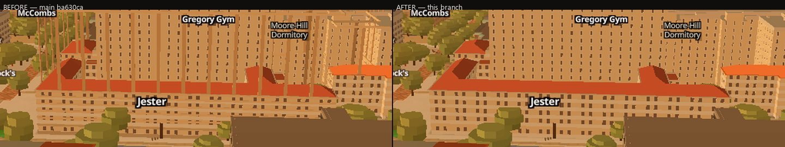
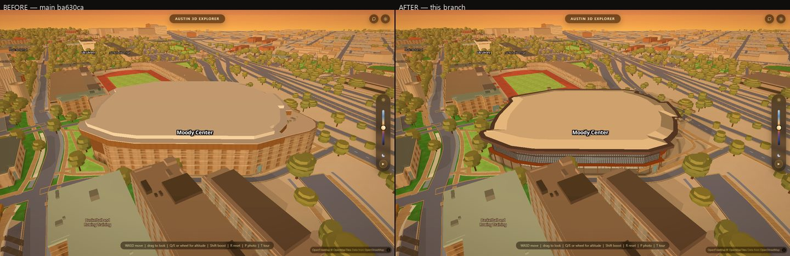
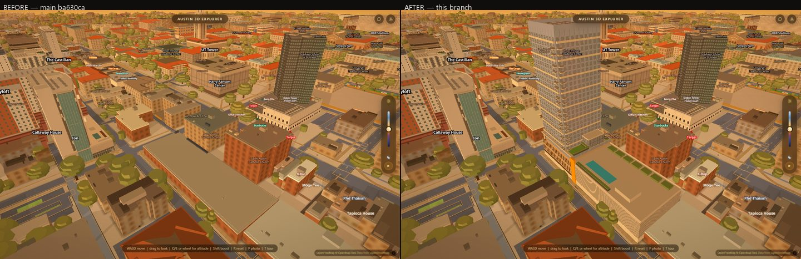
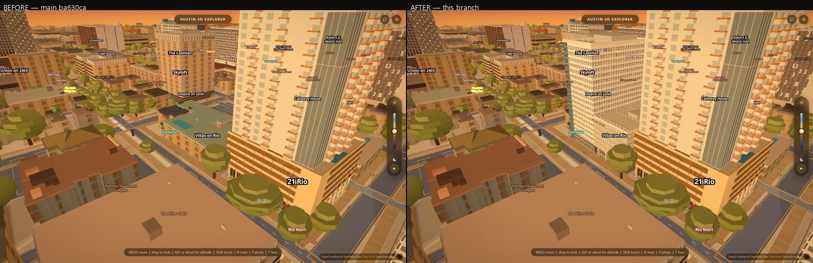
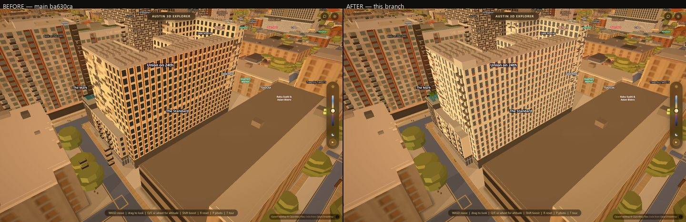

# The apartments pass, round two

The first apartments pass put twenty-five real buildings into West Campus. This
one fixes the defect you reported on the live site, adds three more buildings —
two of them the biggest things in the frame — and spends six rounds getting The
Standard's skin right against the architect's own photographs.

Everything below is a picture. The numbers are at the bottom if you want them.

---

## Look first

Every pair is **before on the left** — `main` at commit `ba630ca`, served from a
`git archive` on a second port and shot at the *same camera*, in the same order,
on the same machine, minutes apart — and **after on the right**.

### The scaffolding is gone

You said: *"the parts with 5 floors still have a scaffolding for the rest of the
floors that need to be removed (also present in rest of building)."* Look at the
left frame — thin poles standing up out of Jester West's orange wing roofs and
along the front of the tower, holding nothing. On the right they are gone and
the roof is a roof.

`shots/apartments/apts2-jester-west-scaffolding-before-after.jpg`

**What they actually were.** Not scaffolding, and nothing anybody drew on
purpose. The city's tiled-roof bake paints thin precast wall strips onto every
building it knows about, including the flat grey box our own Jester West
replaces — and that box is fourteen storeys tall, so its strips run to 50.55 m
over courtyard wings that stop at 18.6 m. The generator already meant to take
them away. Its rule was "hide anything that overlaps our footprint", and a
precast strip is drawn standing *proud* of the wall it belongs to: measured, 27
of the 44 strips on the West tower stand 8 to 11 centimetres **outside** the
outline, so the rule never caught them. Seventeen went, twenty-seven stayed, and
those twenty-seven were your poles.

The rule has a margin now — 60 cm, which is a number, not a guess: over the
whole roof bake the nearest thing that is *not* ours sits 1.8 m away, so 60 cm
takes every stray with 1.2 m to spare. The same sweep found one more of the same
family, a building-part prism standing to 94 m over Dobie Twenty21 where we draw
81.2, and hid that too. Two new assertions in the gate watch both, and both come
straight back when you switch the generator off — nothing was deleted from the
city's data.

### Moody Center

Before, a tan six-storey box with a window grid painted on it, standing where
the arena is — and standing *taller* than the arena, because a second, nameless
roof shape in the map data was sitting on top of the first. After: the real
building. The height is right, the aluminium fin screen that wraps the concourse
is drawn as what it is (12-inch blades on 4-foot centres), and the roof
cantilevers out over the plaza the way it does on Red River.

`shots/apartments/apts2-moody-before-after.jpg`

### Union on San Antonio

Before: a bare pad. The city's map data was captured while this block was still
a construction site, so there was nothing there at all. After: twenty-four
storeys on a four-level brick podium — 332 feet, off SkyscraperPage and the
operator's own corner photograph — with the ribbon balconies, the pool deck and
the orange sign pylon.

`shots/apartments/apts2-union-san-antonio-before-after.jpg`

### Villas on Rio

Before, a low block. After, nineteen storeys with the panel skin and the raking
glass wall that climbs the north end at 56 degrees — off Rhode Partners' own
photographs of the building they designed.

`shots/apartments/apts2-villas-on-rio-before-after.jpg`

### The Standard, six more rounds

This is the one you gave three photographs for. They were read again at full
resolution and the window system turned out to be different from every version
we had drawn: **the rust is not a stripe beside the window, it is a panel under
it** — a spandrel of the window's own width, about 65 cm tall, sitting inside
the window's thin charcoal frame. The generator had no way to draw a panel under
an opening, so it has one now.

Four more things came out of the same read: the podium's bays alternate strictly
between a window bay and a juliet-balcony bay on a 6.2 m module; the scattered
"pixel" marks in the skin are **one storey tall**, not two, so they stopped
clumping into blobs; the day glass reflects sky rather than reading near-black;
and there are three louvre panels in the podium's top storey, not two override
pieces that were shoving three rust strips into the corner. All four signs read,
the deck is furnished, and the projecting balcony stacks read as light slabs with
a dark line instead of a column of black cubes.

`shots/apartments/apts2-standard-sw-before-after.jpg`

---

## The numbers

All measured on this branch, on the Acer, on the real GPU —
`ANGLE (NVIDIA, NVIDIA GeForce RTX 3050 Ti Laptop GPU, Direct3D11)` — against a
local `scripts/serve.py`, graphics auto-detect cancelled first, every frame shot
twice with the second kept.

**What the generator builds now.** 28 buildings, 241 blocks, 2,403 faces,
248,728 wall cells, 33,803 windows, 1,361 balconies, 16 signs, 77 pitched roofs,
103 recesses and 3,671 framed windows — **873,242 triangles in one draw call,
built in 3.1 seconds** on the balanced preset. That is 120,000 more triangles
than the first pass, for three buildings and a rebuilt Standard.

**What it costs: nothing you can feel.** ON against OFF on **one page**, the two
generators toggled at runtime, interleaved A/B/B/A, 200 frames a rep, three reps
after two discarded warm-ups, the **minimum of the per-rep medians**, headed on
the real GPU with vsync and the occlusion throttles off. Every rep prints its own
triangle count so a null result cannot be a null toggle: **887,368 triangles on,
0 off, in all fifteen reps.**

| pose | ON p50 | OFF p50 | delta |
|---|---|---|---|
| The Standard, SW oblique | 12.40 ms | 12.50 ms | **−0.10 ms** |
| Moody Center, SW oblique | 11.30 ms | 11.20 ms | **+0.10 ms** |
| the mall cruise | 14.20 ms | 13.80 ms | **+0.40 ms** |

At p90 the three are +0.90, +0.40 and +0.70 ms. The bar for this pass was
+3 ms; nothing came near it. Nine hundred thousand triangles for four tenths of
a millisecond, because it is one draw call.

**The gates**, all on hardware, all on the merged tree:

- **`scripts/verify/slopes-layer.mjs --against`** — the layer gate, with a
  `git archive` of main `ba630ca` served on a second port, watchdog raised to
  70 minutes. **72/72, exit 0.** 28 of 28
  indexed buildings built (873,242 triangles in 3.1 s); the strips over Jester
  West's wing gone at a nadir query while the generator draws and **15 of 64
  back above 18.6 m** on the `?apartments=0` page, so the clause hid them and
  the city's own bake is untouched; the replaced city back inside Moody's ring
  when the generator is off; one settled page shot twice **0 of 1,296,000 px**;
  ON vs OFF 510,407 px; and both bake-identity lines against the main archive —
  `?slopes=0` at the mall cruise and `?apartments=0&slopes=0` at The Standard —
  **0 of 1,296,000 px, max channel Δ 0**. No page errors.
- **`art-slopes.mjs`** — **7/7, exit 0.** Both sculptures built
  (70 hulls, 8 towers, 64 fingers, 14,126 triangles in 71 ms); their flat slabs
  filtered out by name and only those two; a settled page shot twice 0 of
  1,080,000 px; the runtime-off frames equal the `?art3d=0` frames at **0 px**
  at both poses.
- **`westcampus-probe.mjs`** — **21/21, exit 0** — up from 20/21
  last pass, the old red (a layer `js/lod.js` was hiding at the probe's
  altitude) now green. 24 buildings emitted, all four band kinds, every wall
  band carrying a registered pattern, all ten generic prisms filtered out, no
  zero-height feature, no new vertical gap, nothing above `final_height`, no
  console errors.
- **`walkmeter.mjs`** — **PASS, exit 0.** Self-check drift 0
  over limit, 0 route errors, no building left outside 15 m, nothing stranded,
  57/57 reachable step-free, and the live "Avoid stairs" gate passes in both
  directions with a real mouse click (240 m → 47 m and back).
- **`facadegrid.mjs`** — **0 failing assertions, exit 0.**
  The tile carries its metre pitch at all six zooms on every measured building;
  worst residual 1.30× in the look band against a 1.4× ratchet and 2.61× in the
  walk band against 2.7×, both on Battle Hall, both unchanged by this branch.

**Three assertions in the layer gate were red and all three were the
instrument, not the city.** Each was looked at rather than reasoned about, and
each premise is fixed in the file with the reason written beside it:

1. and 2. Two lines ask "with the layer switched off, is this main's picture?"
   They were written when the only kind of archive you could point them at was a
   *pre-slopes* main — a build with no 3-D layer at all — so they asked that
   archive for a plain page. Point them at today's main, which carries the
   layer, and the archive draws 108 roofs, 24 arches, a dome and 25 apartment
   buildings that our switched-off side does not: 268,525 px at one pose and
   519,734 px at the other, all of it the mesh and none of it the bake. The
   switch now goes off on **both** sides. (On a pre-slopes archive the extra
   parameter is simply ignored, so the fix is safe either way.)
3. One line proves a window's `frame` is really cut into the wall by giving The
   Standard's podium windows a 0.3 m charcoal frame and reading the wall colour
   beside the pane. It assumed those windows had no frame to begin with — and
   round 4 of The Standard gave them one, off the photographs. So the count went
   3,671 → 3,671 (a replace, not an add), two rays already came back charcoal
   before the test touched anything, and putting it "back" deleted the
   building's real frame. The test now strips the file's own frame first, so it
   measures from a true zero, and restores the original spec exactly.

---

## What is still not done

Every builder writes down what they could not draw, with the measurement already
taken, in their own data file. The three new files carry **22 open items**
between them, and they are specific, not vague:

**Moody Center (6).** The wood soffit under the roof oversail cannot have its own
colour yet — the roof code paints the lip, the fascia and the soffit all one
tone, so the last 1.6 m of overhang is bronze where it should be Prodema wood
(the right colour is measured and sitting in the file waiting for the field).
The fin screen is drawn inside-out — the wall between the blades is recessed
instead of the blades standing proud — because there is no primitive for a strip
standing off a wall. The oversail and each recess are one number all the way
round, where the real building is strongly asymmetric. The gate portals, the
loading dock, the roof graphic, the Longhorn and BOX OFFICE signs and the arena's
own night lighting are not modelled. And the east face is up to 11 m too tall,
because the site falls 11 m across the building and the app has no terrain.

**Villas on Rio (7).** The glass slot in each panel sits on the same side of
every bay; on the building it alternates in a diagonal weave. The raking wall is
a stair of 20 steps rather than one plane — the silhouette is the right line
with a 1.5 m sawtooth on it — because the generator has no "shed" roof; the same
missing shape is why the rake's flanks carry an opening every 2.07 m where the
building's are every 3.20 m. Two notches in the footprint are filled in. The
diagonal creases in the custom panels are under a pixel and not drawn. The east
and south faces were never photographed and wear the rule from the faces that
were. The four-level garage underneath is not drawn.

**Union on San Antonio (9).** The tower's plan is the weakest number in the file
— read off the proportions of one corner photograph, because every aerial source
still shows a construction site over this block. One current overhead photo would
settle the plan, the split between the brick box and the garage, and the deck
layout in a single pass. Two storeys inside the tower are unresolved between two
sources that agree on the height. The south face is unphotographed. The ribbon
balconies are one continuous slab per third floor where the real one steps back.
The Union "U" mark is not drawn (the sign code draws letters, and the mark is not
a letter), the crown lettering is on the north face only, the amenity extents are
inferred rather than measured, and the podium's ground floor is blank ashlar
where the photograph has doors and lobby glazing.

**The Standard** keeps five, and they are honest ones: the south bar was never
photographed close and wears the window unit from the faces that were; a louvre
panel is an opening to the generator so it may light up at night; the juliet is a
1.2 m recess in the photographs and is drawn as a 0.35 m projecting rail, which
reads the same from every camera this app is judged at; the deck's blue-canopied
structure may be at the pool's east end rather than the west; and the app's
daylight is warm, so Earth's absolute white cannot be drawn under it.

The 147 items the first pass listed across the other twenty-five files are all
still open.

---

## Follow-ups

1. **Two missing generator fields would close nine of the 22 above in one go**: a
   `ribs` field (a strip standing proud of a wall — Moody's fins, and the
   trellises and screens on half a dozen other files), and a `shed` roof (one
   eave edge, the opposite edge standing at full rise — Villas' rake, drawn as
   twenty steps today).
2. **A per-face `over` and a per-face `inset`** on a roof and a band. Moody wants
   both; today one number is applied all the way round a 35-edge ring.
3. **The soffit wants its own tone** beside the lip's, in the roofs code. One
   field, one measured colour already in the file.
4. **A current overhead photograph of Union on San Antonio** settles three of its
   nine open items at once. Every source reachable without logging in is still
   construction-site imagery.
5. **The bake should skip authored buildings.** The generator hides the
   tiled-roof bake, the roofscape, the storey courses and now the building-part
   prisms at runtime, by id and by geometry. That works — this pass proved it —
   but it is a workaround, and it is why the scaffolding existed. The fix belongs
   in `scripts/bake_roofs.py` and `scripts/bake_roofscape.py`: skip every id in
   `data/apartments/index.json`.

---

## Housekeeping

Eleven scratch scripts the builders left in `scripts/verify/` are deleted. One
was worth keeping and is promoted with a real name and a header:
`scripts/verify/earth-reference.mjs` captures Google Earth's own photogrammetry
at a named centre, which is the reference every look-fix round is judged
against — it had been written from scratch and lost twice. `_aptsweep.mjs` is
now `apts-sweep.mjs`, because an underscore-prefixed scratch name should not
ship.
