# The apartments pass

The app is apartments → distance → classes. Until this branch, every apartment
building in West Campus was a flat grey box, or at best a stack of one-colour
bands with a repeating window grid painted on it. You could not tell The
Standard from The Mark from a parking garage.

Twenty-five of them are real buildings now — podium, towers, courtyards, the
pool on the deck, every window and balcony and rust strip a piece of geometry
of its own — each one drawn from a data file a builder authored by hand from
photographs, permits, OSM and Google Earth. Two campus sculptures are real
sculptures. GDC is two brick bars with a canyon between them. The road has a
kerb, so it stops at an edge instead of dissolving into the plaza. And every
front door now sits on the wall its building actually draws, instead of
floating in front of it.

---

## Look first

Every picture below is `before` on the left — `main` at commit `8b4b90c`,
served from a `git archive` on a second port and shot at the *same camera*,
in the same order, on the same machine — and `after` on the right. Where the
change is small on the ground (the kerb) or small in the frame (a 15 m
sculpture), the pair is a crop of the same two frames rather than a different
camera.

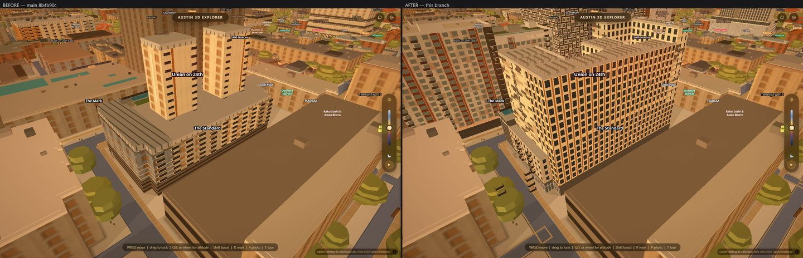

**The Standard at Austin**, 715 W 23rd. Two towers on a podium, a white-and-
rust bay skin, a one-storey charcoal base. Before, it was a single flat block
at Overture's guessed height — 20.5 m against a real 58.
`shots/apartments/standard-sw-before-after.jpg`

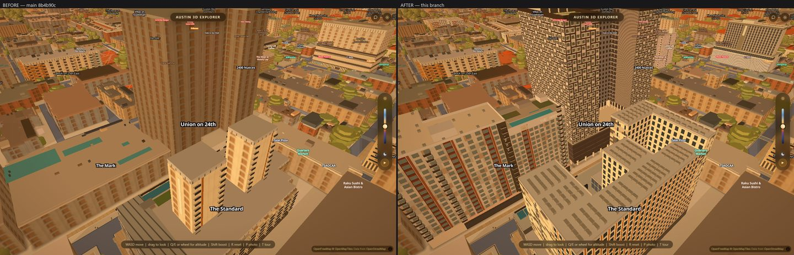

**Union on 24th.** The dark woven skin, the H-plan, the podium court with its
pool. `shots/apartments/union-sw-before-after.jpg`

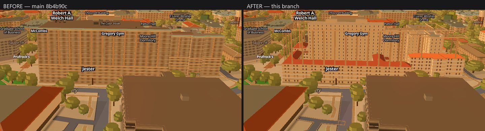

**Jester West Hall** — a dorm, and the biggest single building on campus. Before,
one flat tan slab with a repeating window grid painted on it; after, the
fourteen-storey bar with its own windows and four hipped wings round the
courtyard. `shots/apartments/jester-west-before-after.jpg`

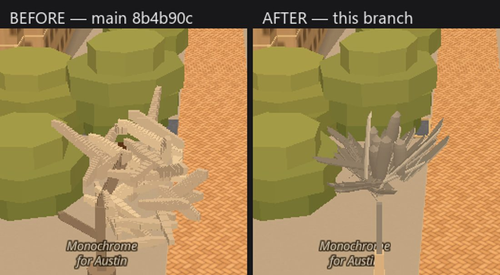

**Monochrome for Austin** (Nancy Rubins) — seventy aluminium boat hulls bolted
into a mass on a stainless column, with five metres of open air under it. Before,
it was a cream heap of flat slabs sitting on the ground.
`shots/apartments/monochrome-before-after.jpg`

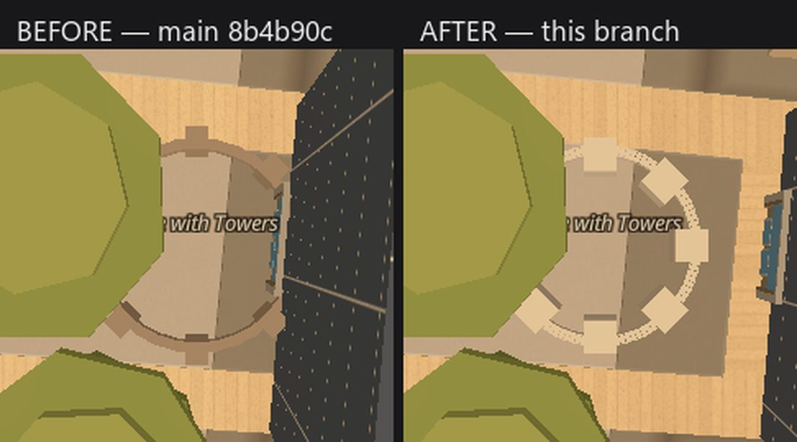

**Circle with Towers** (Sol LeWitt) — the concrete-block ring and its eight
towers, seen from above because two tree canopies stand on it from every
oblique. `shots/apartments/circle-with-towers-before-after.jpg`

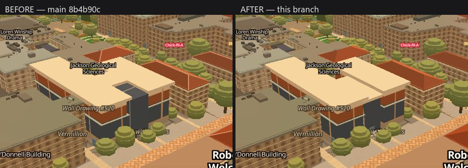

**The Gates Dell Complex.** Before, one continuous tan roof over an L-shaped
block with a dark glass corner. After, two brick bars with a real slot between
them and the atrium standing behind the face.
`shots/apartments/gdc-se-before-after.jpg`

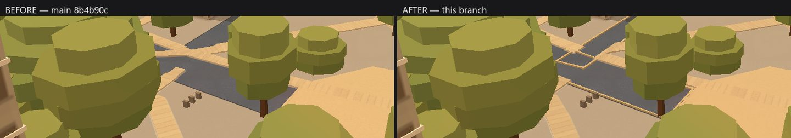

**The street outside Waggener Hall.** The 0.30 m kerb ring is the difference
between a road that ends and a road that fades out.
`shots/apartments/waggener-before-after.jpg`

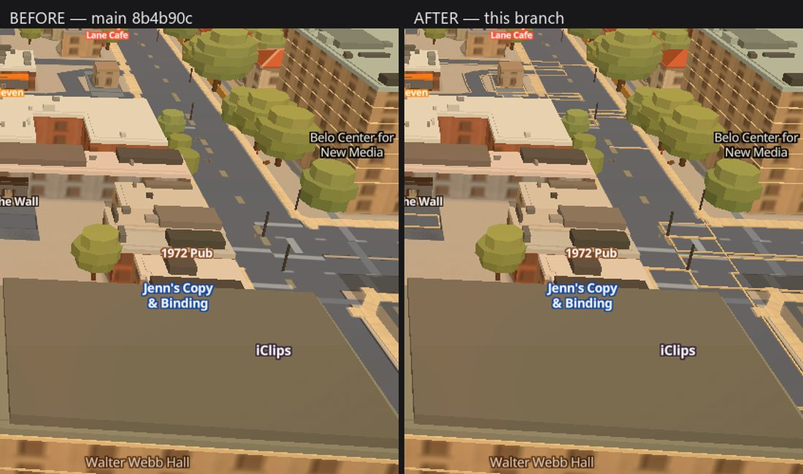

**Guadalupe at Sweetgreen.** Kerb, sidewalk, and street furniture standing on
the pavement rather than in the carriageway.
`shots/apartments/guadalupe-sweetgreen-before-after.jpg`

---

## The critics

Six pieces of this branch were photographed beside Google Earth's own
photogrammetry at a matched camera and handed to a fresh critic who did not
know which frame was ours. **The real thing won all six.** That is the point of
running it — each verdict named one gap, and each gap was closed. The pairs
below are the frames the critics actually judged, so they show the building
**as it was when it lost**, not as it is now; the fix for each is named under
it, and the before/after pairs above show the tip.

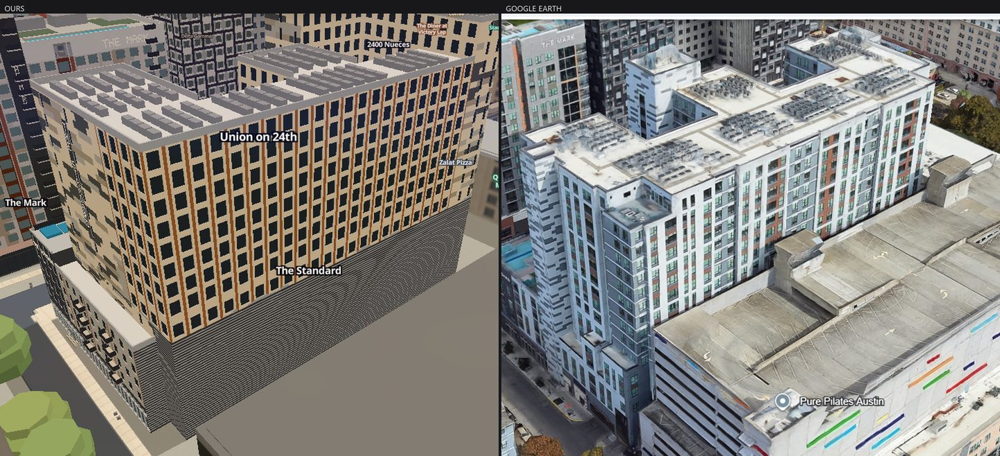

**The Standard.** Gap: our charcoal podium was drawn as a six-storey band with
a noisy texture, so the bottom half of the building read as a parking garage.
In reality the charcoal is the ground floor only. *Fixed* — the dark base is
one storey of flat charcoal and the white/rust bays come straight down to it.
`shots/apartments/critic-standard.jpg`

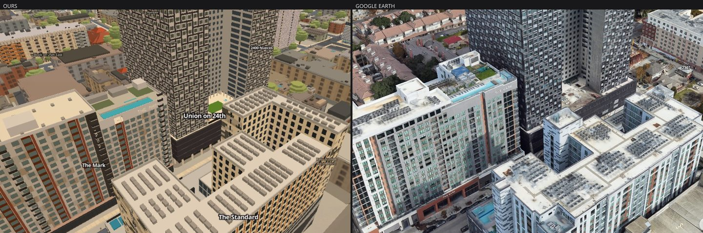

**Union on 24th.** Gap: the back of the court was drawn as three unrelated
buildings — a tan punched block, a tan slab and a navy slit block — where the
real thing is one pale-grey connector wing spanning between the two woven
wings, over a two-storey dark loggia. *Fixed* — one grey wing, every tone
re-sampled off the critic's own reference frame.
`shots/apartments/critic-union.jpg`

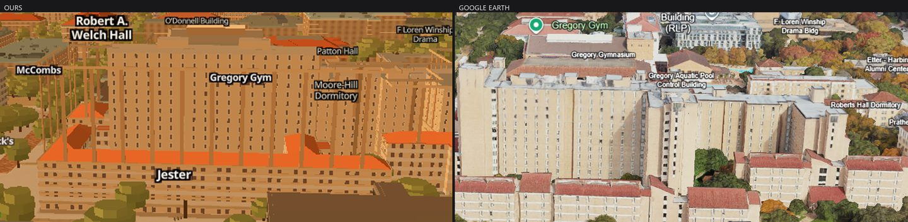

**Jester West.** Gap: the wing roofs read as one continuous flat orange slab
with no planes and no ridges. Half the report was a misread — the hips were
already there — but the cause of the flatness was real and was a *colour*: the
tile was rendering at 254 of 255 in the red channel, so no facet could shade
differently from the one beside it. *Fixed* — the tile came down to the
terracotta two independent reads of the real roof both give, and the wings
gained the eaves the reference shows.
`shots/apartments/critic-jester-west.jpg`

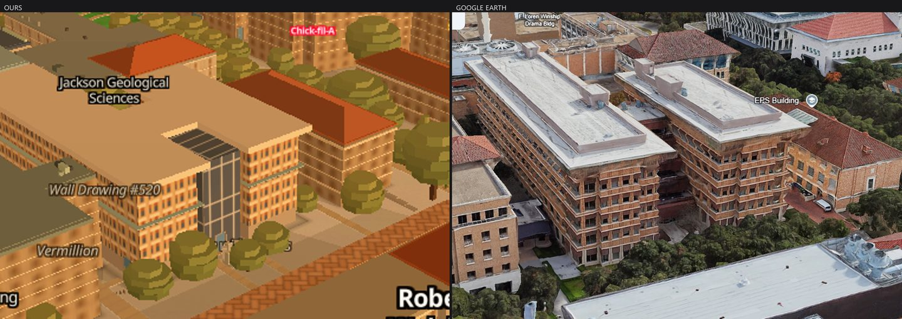

**GDC.** Gap: one roof with a glass corner infill instead of two bars with a
slot. *Fixed.* `shots/apartments/critic-gdc.jpg`

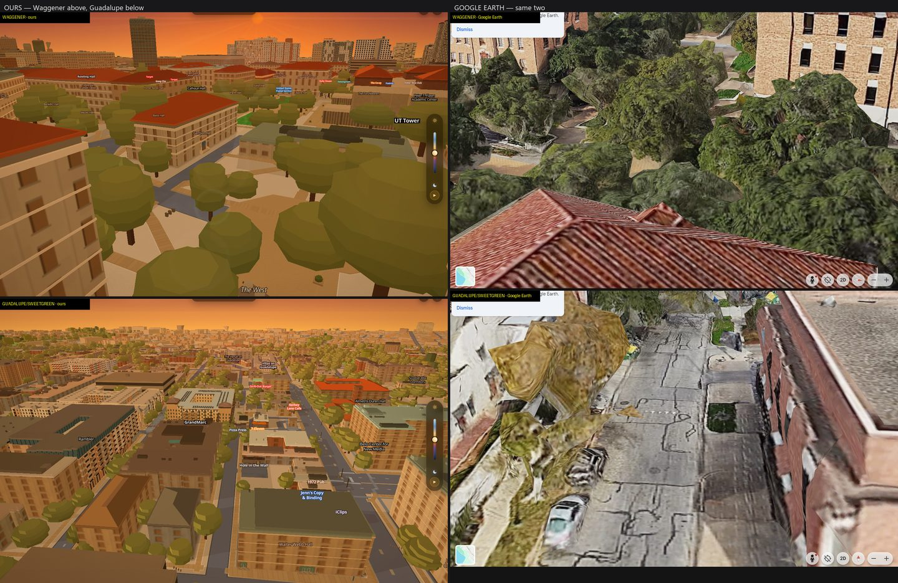

**The street.** Gap: the carriageway simply stopped in the middle of the West
Mall plaza at the same level as the paving, and at Guadalupe road and pavement
were separated by a colour change only. *Fixed* — a 0.30 m kerb ring taken off
each carriageway's own boundary. `shots/apartments/critic-street.jpg`

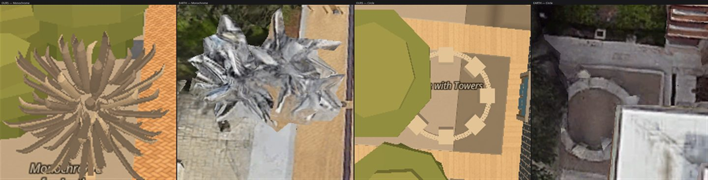

**The sculptures.** Gap on Monochrome: ours read as an agave — forty needle-thin
spikes radiating from a point, every tip curling up — against a reference that
is a lumpy asymmetric mass of blunt lobes. *Fixed* — the hulls have a real beam,
a straight keel and a squared stern, they are dealt round three clumps rather
than over a sphere, and five metres of column stands in open air under them.
Circle with Towers was judged too and its three secondary notes are **not**
fixed (below). `shots/apartments/critic-sculptures.jpg`

---

## The numbers

Everything below was measured on this branch, on the Acer, on the real GPU —
`ANGLE (NVIDIA, NVIDIA GeForce RTX 3050 Ti Laptop GPU, Direct3D11)` — against a
local `scripts/serve.py`, with the graphics auto-detect cancelled first and
every frame shot twice with the second kept.

**What the generator builds.** 25 buildings, 212 blocks, 2,128 faces, 211,304
wall cells, 29,780 windows, 1,165 balconies, 14 signs, 76 pitched roofs, 30
recesses, 1,933 framed windows and 642 woven dominoes — **752,829 triangles in
one draw call, built in 1.8 seconds** on the balanced preset. The sculptures add
70 boat hulls, 8 towers and a 64-finger ring: 14,126 triangles in 86 ms.

**Where it came from.** 25 hand-authored data files citing **269 sources**
between them — 8 to 15 per building. Not one height, tone or window pitch in
those files is a guess that does not say so.

**What it costs.** Nothing you can feel. ON against OFF (`?apartments=0&art3d=0`)
on **one page**, the two generators toggled at runtime, interleaved A/B/B/A,
200 frames a rep, three reps after two discarded warm-ups, the **minimum of the
per-rep medians**, headed on the real GPU with vsync and the occlusion throttles
off. Every rep prints its own triangle count so a null result cannot be a null
toggle: **766,955 triangles with it on, 0 with it off, in all twelve reps.**

- The Standard's oblique: **+0.20 ms** at p50 (12.50 on, 12.30 off), +0.40 ms at
  p90.
- The mall cruise: **+0.10 ms** at p50 (14.10 on, 14.00 off), +0.50 ms at p90.

Three quarters of a million triangles for a fifth of a millisecond, because it
is one draw call.

**The gates.** All on hardware, all on this branch's own tree:

- **`slopes-layer.mjs`** — the layer gate, three archives served
  (`--against` pre-slopes main `e232953`, `--against-tip` main `8b4b90c`,
  `--against-nogen` this same commit with both generators removed), watchdog
  raised to 70 minutes because a page with 25 buildings runs long. **69/69,
  exit 0.** 25 of 25 indexed buildings built with The Standard's top at 58.2 m;
  every planned filter clause in place and none missing; the tiled-roof rig over
  San Jacinto lifted out and put back; the sign font complete; the roofscape
  deck over Regents West gone at a nadir query while it draws and back on the
  `?apartments=0` page; a 30° hip on The Standard's gym found by raycast at
  31.31 m; a 2.0 m recess showing 189 mesh vertices on its own plane and 0
  without; 89 % of the woven skin's cells paired into dominoes; one settled page
  shot twice **0 of 1,296,000 px**; ON vs OFF **512,101 px**; and, against an
  archive of this same commit built without the two generators,
  `?apartments=0&art3d=0` is **0 of 1,296,000 px** at The Standard's pose and
  `?slopes=0` is **0 px** with the layer off as well.

  **Five lines were red before this pass and all five were instruments, not
  defects.** Each was diffed to an image and the pixels read. The off-and-on
  line was shooting 1.5 s after the switch, before the Main Building's hips —
  which are built on their own poll — had come back: 6,115 of its 6,126 deep
  pixels were *exactly* the OFF frame. The runtime-off line carried a 7,000-px
  ceiling written for a page with one building; at this pose two fresh
  `?apartments=0` loads of the same build land 273,197 px apart, so the ceiling
  sat two orders of magnitude under its own floor. And the three "is it main?"
  lines were measuring the four other pieces on this branch — their diffs are
  kerbs, road edges, crossings, sidewalks and doors, with not one differing
  pixel on The Standard. Each premise is fixed in the file with the reason
  written beside it; the two main archives are still served and still measured,
  and their numbers print as context beside the gate line
  (`?apartments=0` against main at The Standard's pose: 305,675 px).
- **`art-slopes.mjs`** — **9/9.** Both pieces built (70 hulls, 8 towers, 64
  fingers, 14,126 triangles in 86.3 ms); their flat slabs filtered out of
  `props-artpart` by name and only those two; one settled page shot twice 0 of
  1,080,000 px; ON vs OFF 89,172 px at Monochrome and 6,975 at Circle against a
  2,000 floor; the runtime-off frames equal the `?art3d=0` frames at 4 px and
  0 px; and against an archive of this branch without the generator, the whole
  frame is 4 px and 0 px, and **0 px inside each artwork's own screen box**.
- **`westcampus-probe.mjs`** — **20/21**, and the one red is not ours. It asks
  that all three `wc-` layers be *visible*; `wc-wall-cap` is hidden by
  `js/lod.js` at the probe's altitude. Run against a `git archive` of main
  `8b4b90c` on a second port it prints the identical line and the identical
  20/21. Everything the apartments generator could break there is green: 24
  buildings emitted, all four band kinds, every wall band carrying a registered
  pattern, all ten generic prisms filtered out, no zero-height feature, no new
  vertical gap, nothing above `final_height`, no console errors.
- **`facadegrid.mjs`** — **0 failing assertions.** The tile carries its metre
  pitch at all six zooms on every measured building; worst residual 1.30× in the
  look band against a 1.4× ratchet and 2.61× in the walk band against 2.7×,
  both on Battle Hall, both unchanged by this branch.
- **`walkmeter.mjs`** — **PASS.** Self-check drift 0 over limit, 0 route errors,
  no building left outside 15 m, nothing stranded, and the live-mouse "Avoid
  stairs" gate passes in both directions with a real click.
- **`ground-probe.mjs`** — **crashes, and it crashed before us.** It calls
  `setPaintProperty('ground-paths', 'line-color', …)` on a layer that has been a
  `fill-extrusion` since 2026-08-02. Rather than cite that, it was run on both
  main archives this pass: it throws the same `TypeError` at the same line on
  `8b4b90c` and on `e232953`. It is a dead gate and it belongs to the ground
  lane. What it *does* print before dying is that the ground source exists, is
  loaded, and renders — 11 path features at the pose, in the right layer order.
- **`doorstack.mjs`** — **two doors, not one drawn twice.** At walking height
  (eye 1.70 m) in front of the Harry Ransom Center's west wall, eid 186 alone
  draws 3,834 px in a box at x 622-659 and eid 187 alone draws 25,475 px in a
  box at x 698-848. The boxes do not overlap, and the two arms disagree over
  29,309 of the 33,638 pixels they draw between them.

---

## The switches

- `?apartments=0` — the twenty-five apartment buildings go; the flat prisms and
  the West Campus bands come back.
- `?art3d=0` — the two sculptures go; their flat slabs come back.
- `?slopes=0` — the whole three-dimensional layer goes, and takes both of the
  above with it.

**GDC, the streets, the doors and the street furniture have no switch.** They
are changes to baked data — `data/heroes.geojson`, `data/entrances.geojson`,
`data/ground.geojson`, `data/props.geojson` — and they change what the live
site looks like on purpose, with no way to turn them off. That is deliberate
and it is the part of this PR worth a second look before it merges.

---

## What is not done

Every builder wrote down what they could not draw, with the measurement already
taken, in their own file's `todo` / `open`. **147 of those are still open across
the twenty-five files** (30 more are marked `DONE` where a later round closed
them). They are not vague — you can read them, and the biggest groups are:

- **31** about a height or a storey count that no source states. Where nothing
  could be found, the file says so and uses Overture's guess for the top of a
  mechanical penthouse rather than for the roof.
- **17** about signage, storefronts, canopies and neon that are not drawn.
- **16** about a colour or a tone read off an oblique rather than sampled.
- **15** about balconies: a recessed balcony pocket is not a field in the
  generator yet, so a recessed balcony is drawn flush.
- **15** about trellises, screens, fins and louvres, which are drawn solid —
  the silhouette is right, the see-through is not.
- **14** about garage entries and porte-cochères, which are drawn as wall.
- **11** about a facade nobody ever photographed. Those faces wear the plainest
  skin the file defines, and say so.
- **9** about parapet steps, crowns and rooftop mechanical; **9** about
  chamfered corners drawn square; **6** about light wells and courtyard cuts;
  **4** about deck furniture — loungers, palms, planters.

**The generator's own step 6 was never started.** Per-bay plank tones, an open
trellis, a hole cut through a block, a storefront opening, and a recessed
balcony pocket are all still missing fields, and a handful of the todos above
are waiting on exactly those.

**Both Jesters keep todos of their own**: Jester West's tower windows read as
dark pips on tan where the reference reads light-framed vertical rectangles on
buff brick — an inverted value relation, not a one-line change — and its bar is
one window row tall. Jester East's dining hall is a single mass.

**Circle with Towers keeps all three of its critic's secondary notes.** The ring
wall is still 108 separate radial fingers and stipples to a dotted line at
zoom 20 (it wants one closed extruded ring behind the fingers); two tree
canopies still stand on the piece and hide it from every oblique, which is the
props/trees bake and not this lane's file; and tower height against wall height
cannot be judged until that canopy moves.

**Small known residue.** The Standard's podium coping shows as a thin light
line across the south face where Earth has a plain floor line. The kerb has no
dropped ramp at crossings — the ring steps back around the crossing aprons, so
a crossing is not kerbed over, but there is no modelled ramp. On a cold load
Jester West's precast strips can flash for a second before the re-apply catches
the roofs pass rewriting its filter.

---

## Follow-ups

1. **`scripts/bake_roofs.py` and `scripts/bake_roofscape.py` should skip every
   id in `data/apartments/index.json`**, the way `bake_roofscape.py` already
   skips authored roofs. Today the generator hides both of those bakes at
   runtime, by id and by geometry. That works and it is a workaround; the fix
   belongs in the bake.
2. **Eighty more buildings.** Within 1,500 m of the Tower the snapshot holds
   **105** residential candidates. Twenty-five are authored. Of the eighty left,
   **35** are in the major/minor tiers — the ones big enough to read from the
   air — and the tallest unauthored is Inspire on 22nd at 56 m. The list, with
   OSM ids, footprint areas and heights, is in the round's scratchpad
   (`apts/list/apartments.json`).
3. **Earth-capture lessons, so the next comparison round does not re-pay for
   them.** Google Earth's WebGL canvas returns black through `toDataURL` — use
   `page.screenshot`. Earth's field of view is 35° against this app's 58°, so
   two frames at the same nominal camera are only comparable after a rescale
   about the principal point; the practical method that worked was to walk
   Earth's `dist` in until a shared feature measured within ~10 % of ours
   (Union needed 300 → 280; The Standard landed at 220 first try). And a
   *matched camera* is not enough on its own — the frames have to be cropped to
   the same subject at the same apparent size, and the key file for each pair
   should record which shared feature was measured and what the residual was.

---

## Where the round's effort went

Research 0.77M tokens; building it — The Standard, twenty-four more apartments,
the generator's two rounds, the sculptures, GDC and the street — 16.4M; checking
and shipping it, which is this pass, 0.46M so far. The build-to-check ratio is the
one the project asks for, and the checking half is mostly the four full runs of
the layer gate it took to turn five red lines into five explained ones.
