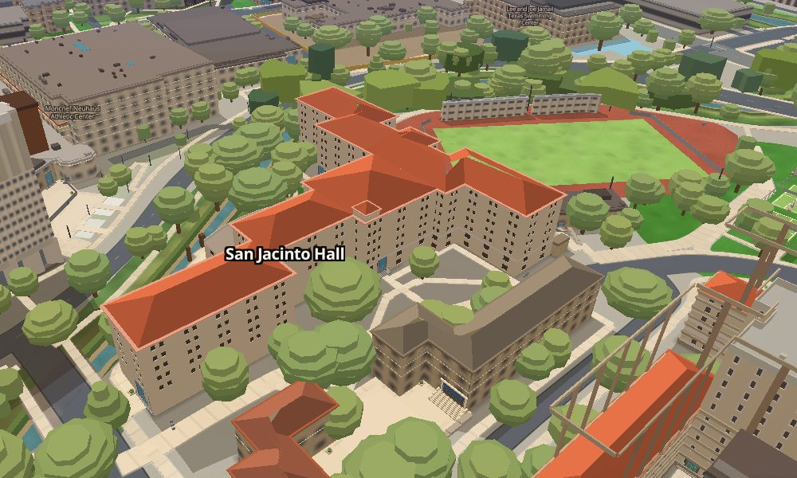
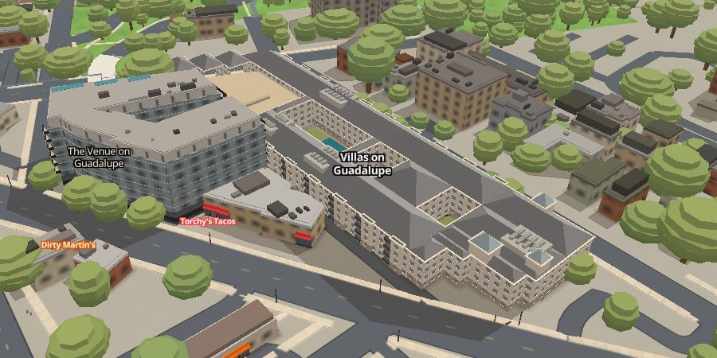
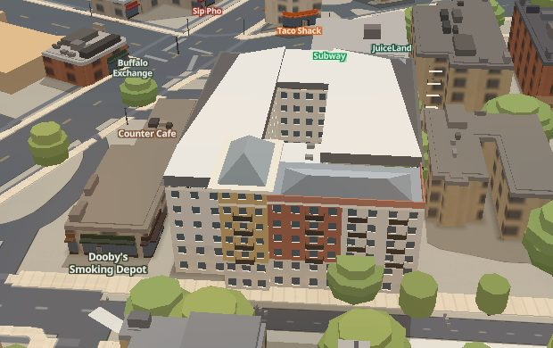
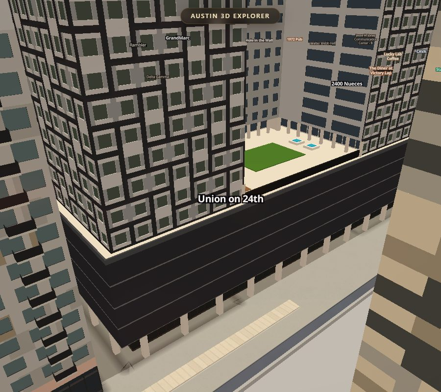
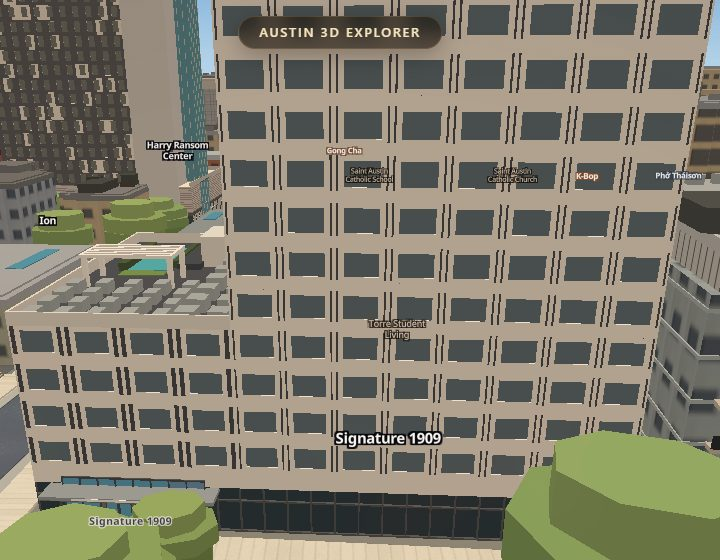
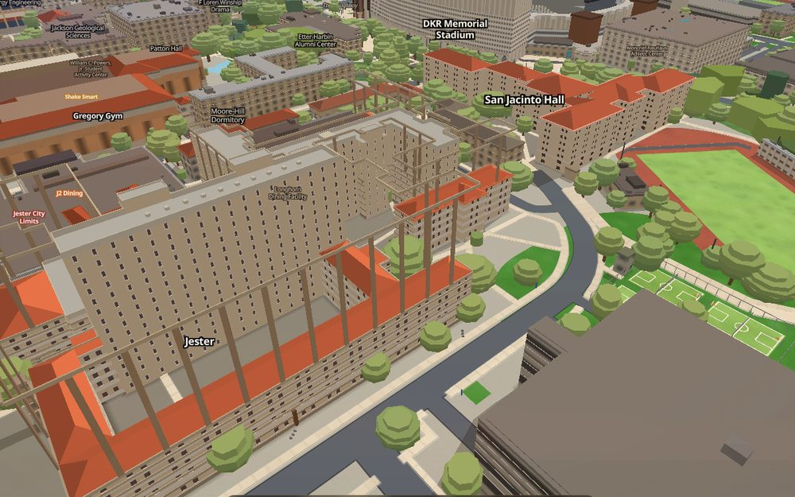

# Apartments as real geometry — `js/slopes-apartments.js` and `data/apartments/`

The app is apartments → distance → classes, and until 2026-09-05 every
apartment building in it was a flat prism, or at best a stack of one-colour
bands with a repeating window grid painted on (`js/westcampus.js`). This is
the generator that draws a building the way it is: podium, towers, light
wells, the pool on the deck, every panel and window and balcony a quad of its
own — from a data file a builder authors by hand from sources, one file per
building. The first one is The Standard at Austin, 715 W 23rd St.

Switch: `?apartments=0` at load, or `window.APARTMENTS.on = false` from the
console. Off, the page is what `main` draws: the flat prism and the
westcampus bands come back, because the generator hides them by *filter* and
puts the filters back. `?slopes=0` (the whole three.js layer) takes this with
it.

What it hides while it draws, and puts back when it does not:

- the replaced prism, by id, in `buildings-3d` and `buildings-roof`;
- the westcampus bands, by name, in `wc-wall`, `wc-wall-cap`, `wc-solid`,
  `wc-detail`;
- the campus-storeys courses (`js/facades.js`), by `host` — Kinsolving's
  four cream plates were the snapshot's 25.1 m divided into six, crossing
  the courts and standing above the authored roof;
- the roofscape pass (`roofscape-deck`, `-major`, `-minor`), by GEOMETRY:
  those features carry no id or name, only `k/b/h`, and they were baked from
  the SNAPSHOT height, so over a building authored lower than Overture's
  guess the deck plate floated (Regents West's 41 × 44 m slab 6.5 m over the
  roof, 2706 Rio Grande's ten metres up, the Villas' 12.6) and hid the roof.
  The clause is `['>', ['distance', <every footprint inset 1 m>], 0]`, which
  MapLibre answers 0 for a feature that overlaps the inset outline and
  positive for a neighbour's deck that only touches the boundary. Check it
  at a NADIR: `queryRenderedFeatures` on a fill-extrusion answers for the
  whole volume along the view ray, and from an oblique a neighbour's lower
  deck lands on the ray to your courtyard;
- the tiled-roof bake's WALL STRIPS (`roofs-pitched`'s `f: band` features),
  by GEOMETRY against every authored footprint GROWN BY
  `APARTMENTS.wallMargin` — not against the footprint itself. A precast
  strip is drawn PROUD of the wall, so most of them do not overlap the ring
  at all: 27 of the 44 over Jester West Hall stood 0.08-0.11 m outside it,
  and a `distance > 0` clause kept every one — 31 m poles (b 19 -> h 50.55,
  baked on the snapshot prism) standing in the air over courtyard wings that
  stop at 18.6 m. That is the "scaffolding" Simeon reported on 2026-09-06.
  Measured over the whole of `data/roofs.geojson`: 902 features at distance
  0, 179 in (0, 0.11], 3 at 0.4, then nothing until 1.8 m, which is a
  neighbour's own band on a party wall — so 0.6 m clears every stray with
  1.2 m of headroom;
- `js/moody.js`'s OWN ARENA (`moody-wall`, `moody-roof`, `moody-plant`,
  `moody-cap`), by geometry on the same inset outline as the roofscape. That
  pass was written when the arena was nobody's authored building. It is one
  now — `data/apartments/moody-center.json` — and its drum walls stand to
  28.7 m over a building this file authors at 17.4 m to the eave and 22.6 m
  to the membrane: a second arena, six metres of it in the air. It is hidden
  by GEOMETRY rather than by turning the pass off, because
  `data/moody.geojson`'s own `replacedBuildingIds` names three buildings and
  only one of them is ours; the other two are precinct neighbours that must
  keep being drawn;
- `data/parts.geojson`'s `building:part` prisms (`parts-3d`, `parts-roof`),
  by geometry on the same inset outline as the roofscape. They carry an
  `osm_id` and no snapshot id, and way/516187626 stands to 94 m over Dobie
  Twenty21, which this file authors at 81.2;
- the tiled-roof rig `js/slopes-roofs.js` draws over San Jacinto Hall from
  `data/roofs.geojson` (a hip on Overture's 28.1 m, six metres over the roof
  this file draws): its entries keyed by a replaced id are lifted out of
  that generator's data and it is rebuilt; off, they go back. That
  generator has no skip list; the right fix is in `scripts/bake_roofs.py`
  (skip every id in `data/apartments/index.json`) and is asked for in
  `HANDOFF.md`.

`window.slopesApartments.hidden` lists the plan, any layer whose clause is
missing (a layer that booted after the generator gets it within a minute),
and the rigs lifted out.

Gate: `scripts/verify/slopes-layer.mjs`, section 2b (`apartments:` lines).
Two archives can stand in for `main` there and answer different questions:
`--against-tip URL` is a `git archive` of the commit the branch was cut from
(main with the slopes layer), and ours at `?apartments=0` must be its frame
at the pose with that page's ridge courses switched off as this branch's
are; `--against URL` stays the pre-slopes main the gate's bake-identity
lines are written for, and ours at `?apartments=0&slopes=0` must be its
frame — the data, the index and the script tags changed nothing the slabs
draw here.


*Above: The Standard at the brief's oblique (Google Earth
`@30.28699,-97.74578,190a,220d,35y,45h,55t`, ours at zoom 18.66 / pitch 55 /
bearing 45) and from the north-west (heading 135), ours in daylight. Google
Earth's imagery is 12/2023.*


*Above: the gate's two frames at the brief's pose, golden hour, the same
page load: `?apartments=0` — what `main` draws, `js/westcampus.js`'s bands
with two slab towers standing on what the nadir shows to be the two light
wells — and the generator on.*

## Round 2 (Sep 6 2026): what the builders could not draw, drawn

Twenty-two buildings were authored after The Standard, and their files
wrote down what the generator could not draw. These frames are ours after
the fields below landed (hardware GL, `page.screenshot`, the builders' own
poses; every one is a real hip, recess, frame or weave, not a box stack):








*Two instrument lessons from this round, both learned the hard way. A
`queryRenderedFeatures` on a fill-extrusion answers for the whole extruded
volume along the view ray: at pitch 55 the "deck still there" over Regents
West's courtyard was a neighbour's deck at 17 m sitting on the ray — ask at
a nadir. And a row of "poles" over Jester West's tower was not ours: a
bisection of the apartments mesh (build one building alone, count vertices
above 54 m, drop blocks and skin parts one at a time) found nothing, and one
`queryRenderedFeatures` on one pole named `roofs-pitched` — the tiled-roof
bake's kept `f: band` features, the tower's precast strips baked on the
snapshot. They are hidden by geometry now, against the footprint itself,
because they stand on the wall line.*

*(And that last sentence was half a fix, which is why Simeon was still
looking at poles a day later. "Against the footprint itself" hid what
OVERLAPS the ring, and a strip drawn proud of the wall does not: the clause
took 17 of Jester West's 44 and left 27. `APARTMENTS.wallMargin` is the
number that finishes it — see the hide list above.)*

## Round 3 (Sep 8 2026): the fields the generator lacked, from the builders' own notes

Twenty-seven files wrote down what they could not draw, and a survey ranked
the gaps by how many buildings faked the same thing and how visible the fake
is from the two cameras this app is judged at. This round is those fields.
Every one is proved on The Standard's own numbers by a gate line in
`scripts/verify/slopes-layer.mjs` (a one-field patch, a rebuild, a measurement
on the real mesh, the field taken back), and every frame below is the
builder's own file patched at runtime with the builder's own measured numbers
— nothing in `data/apartments/` changed in this round; the three builders
convert their files next.


*Above, left is the branch's own build before the field, right is after, same
camera, same page, cameras placed by hand at the sidewalk and at the air
(`H.eye` in the session's `run.mjs`: a camera at (u, v, h) looking along a
bearing at a pitch, the target derived from it, the zoom from the distance).*

### `rake` — a wall plane that leans (Villas on Rio)

```jsonc
{ "id": "rake", "plan": [0, 20.74, 22.51, 37.42], "z0": 24.2, "z1": 54.95,
  "rake": { "face": "u0" },                       // run: the plan's depth behind that face (20.74) unless given
  "bands": [{ "z0": 24.2, "z1": 54.95, "skin": "panel" }],                    // the flanks, clipped to the wedge
  "faces": { "u0": { "bands": [{ "z0": 24.2, "z1": 54.95, "skin": "rakeGlassSkin" }] },   // the plane
             "u1": null } }
```

`rake: { face, run? }` on a block leans the named face (a rectangle's `u0 |
u1 | v0 | v1`, a polygon's edge index): its **foot** is that edge of the plan
at `z0`, its **head** the same edge moved `run` metres into the block at
`z1`, and the plane between them is ONE surface — Villas on Rio's twenty
blocks of run 1.037 m and rise 1.538 m (`_rake` in its file: eave 24.2 m at
u 0, top 54.95 m at u 20.74, pitch 56.0°) become the block above. The
plane is tiled by the face's own bands as any wall is, in the plane's own
metres: `s` along the foot, `t` up the slope, `d` out of it, so a 1.55 m
mullion module is 1.55 m on the glass and the reveal is normal to the plane.
A band's `z0`/`z1` are metres of height as everywhere else and land where
those heights cut the plane; so do the building's floor lines (windows and
`louvre` bands sit where the floors meet the glass; `APARTMENTS.rakeFloors:
false` drops them). Every other wall of the block is tiled as usual and
**clipped to the wedge** — the tiler cuts each cell at the plane and drops
any opening the line would cross — so the flank is a trapezoid in one skin
at the building's own 3.20 m bay, not twenty slivers rounded to one bay
each. The cap covers only what lies beyond the head; a parapet stops at the
head line. Overrides, balconies and canopies are not applied on the raked
face; a `roof` on a raked block is ignored (the plane is its roof).
`slopesApartments.built[i].rakes` lists each: `{ block, face, pitch, run,
rise, len }`. Measured on the patched Villas: nadir raycasts at u 3, 10.37
and 17 along the slope land at 28.65, 39.58 and 49.41 m — the plane's own
numbers to the millimetre, where the treads had answered 28.81, 39.58 and
50.34 — and no vertex of the block stands above the plane.

### `fins` — blades standing OFF the wall, in their own tone (Moody Center, 21 Rio, The Castilian)

```jsonc
"fins": { "kind": "bays", "field": "glass", "bay": 1.219, "glass": "glass", "frame": "fin", "reveal": 0,
          "bands": [{ "z0": 6.4, "z1": 7.0, "tone": "mcm" }, { "z0": 11.7, "z1": 12.3, "tone": "mcm" }, { "z0": 17.0, "z1": 17.4, "tone": "mcm" }],
          "fins": { "pitch": 1.219, "w": 0.305, "d": 0.30, "tone": "fin" } }
```

`fins: { pitch | at: [s...], w, d, tone, off?, from?, to?, on?, z0?, z1?,
frontTone?, horizontal?, every? }` — on a **skin** (drawn with every piece
that wears it, the pitch from the piece's own start) or on a **band** (one run
along the whole face, like its balconies; a list of them is allowed). Each fin
is a box `w` along the wall, standing `d` proud of it from `off` (a bracket
gap; 0 sits it on the wall, and then its back is left open so nothing shares
a plane), the band's height or its own `z0`..`z1`, in `tone`; `frontTone`
colours the outer face alone (an airfoil's nose); `horizontal: true` lays the
blades across the wall at a vertical `pitch` (`start` from the band's foot),
`w` their height — a sunshade, a trellis. Moody's file already carried every
number: 12 in blades (0.305 m) on 4 ft centres (1.219 m, the luminance
autocorrelation in S13), 0.30 m of relief, Dark Bronze; the example above is
its `fins` skin turned right side out — the glazing is the field and the
blades stand in front of it, instead of 0.91 m of wall recessed between 0.31
m of fin. 21 Rio's are `{ pitch: 4.3, w: 0.30, d: 0.25, off: 0.1, tone:
"bronze" }` on brackets; The Castilian's garage screen `{ pitch: 0.57, w:
0.20, d: 0.15, tone: "finShade" }`.

### `soffitTone` — the underside of an overhang in its own material (Moody Center)

```jsonc
"roof": { "kind": "hip", "pitch": 9.1, "over": 3.0, "lipH": 2.0, "tone": "apron", "lipTone": "fascia",
          "soffitTone": "soffit", "deck": "membrane", "d": 9.0 }
```

`js/slopes-roofs.js` draws an eave lip's top, fascia and soffit in one tone.
A roof with `soffitTone` gets no lip from the emitter and this file draws the
three itself from the same profile — the top and the fascia in `lipTone`, the
soffit in this one — so Moody's 70,000 sq ft of wood-composite soffit is wood
(`#884420`, measured in its file and unused until now) under the dark bronze
fascia. A canopy's `soffitTone` (below) is the same idea on a slab.

### `pier` — a member on the bay lines that groups the bays (The Standard)

```jsonc
"podium": { "kind": "bays", "bay": 6.2, "field": "podiumPanel",
            "pier": { "w": 0.6, "d": 0.22, "tone": "white" },       // every bay line; every: 2 for every second
            "window": { "w": 1.3, "h": 1.95, "sill": 1.0, "frame": { "w": 0.1, "tone": "charcoal" },
                        "offsets": [[-1.55, 1.3, { "h": 0.62, "tone": "rust" }], [1.55, 1.6, null]] } }
```

`pier: { w, d, tone, every?, at?: "joints" | "centres" | [s...], from?, to?,
off?, frontTone?, z0?, z1? }` on a `bays` skin stands a box `w` wide and `d`
proud of the wall on every bay line (or every `every`th, or on the bay
centres), the band's full height, so the wall reads as bays GROUPED between
piers and not as windows scattered on a field. It composes with everything
the skin already does — `frame`, `spandrel`, `offsets`, `strip`, `louvre` —
and with a recess (the piers stand proud of the recessed wall) and an
override piece (each piece sets its module from its length, as its strips
do). The numbers above are a look, not a measurement: The Standard's file has
no pier width yet, and the first authored one is the builder's.

### `openings` — a recess of its own depth and tone in a band (garage mouths, entry courts)

```jsonc
{ "z0": 0, "z1": 6.0, "skin": "storefront",
  "openings": [{ "s0": 6.0, "s1": 14.0, "z0": 0.3, "z1": 5.0, "d": 3.0, "tone": "charcoal" }] }
```

`openings: [{ s0, s1 | w, z0?, z1?, d?, tone? | glass?, lit? }]` on a band —
`s` along the face for the face's own bands, along the piece for an
override's (as its balconies and signs are placed), `z0`/`z1` metres (the
band's when omitted), `d` the depth (`APARTMENTS.openingD`, 2 m, when
omitted). The tiler draws it as an opening with its OWN reveal depth and
tone: the back wall `d` behind the plane, the sill (the floor), the head
(the soffit) and the two jambs in `tone`; with `glass` a pane in that glass
tone with the reveals in `tone` (the skin's frame tone otherwise), lit at
night when `lit`. Any window of the skin under it goes. 2706 Rio Grande's
service opening at u 6-14 on W 28th, Signature 1909's lit garage mouth, 2819
Rio Grande's leasing frontage under the overhang.

### `inset` on a balcony stack — a loggia, not a slab (The Villas on Guadalupe, 2819 Rio Grande)

```jsonc
"balconies": [{ "s0": 5.3, "s1": 6.9, "inset": 1.2, "insetTone": "wall", "railTone": "rail" }]
```

A stack with `inset: d` is cut INTO the wall once per floor line — an opening
`d` deep from the floor line, `h` tall (the storey less `slabT` when
omitted), in `insetTone` — and all that stands at the face is the rail (`railH`,
`railT`, `railTone`) on the floor of the recess. Nothing projects, so the
balcony reads as the shadowed void the photographs show and not as a lit
slab edge; the Villas on Guadalupe's 0.55 m projection that "landed the dark
line where the photograph puts it" is the real inset now.

### `canopies` — a slab standing off a wall (GrandMarc's awnings, Skyloft's sky-lounge soffit)

```jsonc
"canopies": [{ "s0": 12.0, "s1": 15.85, "z": 3.6, "d": 1.4, "t": 0.15, "tone": "awning", "soffitTone": "awningSoffit",
               "posts": { "pitch": 3.5, "w": 0.15, "tone": "awning" } }]
```

`canopies: [{ s0, s1 | w, z, d, t?, tone, soffitTone?, off?, posts? }]` on a
band — a slab `d` out from the wall (from `off` when it does not touch it),
`t` thick (`APARTMENTS.canopyT`, 0.2) with its top at `z`, in `tone`, its
underside in `soffitTone` when given; `posts: { pitch | at, w, tone, z0? }`
stand under its outer edge. GrandMarc's two awnings were boxes in `deck`
standing against the wall; they hang on the face now.

### `fields` and `flip` — tone and handedness by bay and storey (2623 Salado, Villas on Rio)

```jsonc
"wall": { "kind": "bays", "bay": 4.0, "field": "cream", "fields": ["cream", "terracotta", "blueGrey", "ochre"], "fieldRule": "checker" }
"panel": { "kind": "bays", "bay": 3.20, "window": { "offsets": [[-0.55, 0.95]], "flip": true, ... } }
```

`fields: [tone, ...]` on a `bays` skin cycles the field tone per bay, or per
bay AND storey with `fieldRule: "checker"` (index = bay + storey), so an
alternating elevation is one rule and not one face per tone. `flip: true` on
a `window` mirrors its `offsets` about the bay centre where bay + storey is
odd — the diagonal weave of a slot that changes hands bay to bay and row to
row, which `mod4` (a light frame round dark glass on a dark field) was the
wrong shape for.

### `chamfer` — a 45° cut on a rectangle's corner (Dobie Twenty21, Skyloft, 26 West)

```jsonc
{ "id": "tower", "plan": [10, 50, 5, 35], "chamfer": { "u1v0": 2.5, "u1v1": 2.5 }, ... }
```

Metres — one number for all four corners or `{ u1v0, u0v0, u0v1, u1v1 }` by
corner — cut at 45°, clamped to half the shorter side. The cut face is keyed
by the corner's name (`faces.u1v0`, `parapetSides`, `roof.sides`) and the
four sides keep theirs, so an override on the two returns still works and a
face may wear its own bands. `count.chamfers` counts the corners cut.

### `plan: { ring, holes }` — a block with light wells (Skyloft, 2706 Rio Grande, GrandMarc)

```jsonc
{ "id": "ring", "plan": { "ring": [[0, 0], [62.5, 0], [62.5, 35.8], [0, 35.8]],
                          "holes": [[14, 24, 12, 24], [[38, 12], [48, 12], [48, 24], [38, 24]]] }, ... }
```

The outer ring is the plan as ever (a rectangle, a polygon, `"footprint"`);
each hole is a (u, v) ring or a rectangle. A hole's walls face INTO the well
and are keyed `h<i>.<j>` (hole i, edge j from the hole's point j to j + 1 as
authored) for `faces`, `parapetSides` and overrides; the cap is triangulated
round the wells; a hole's edges take a parapet like any other. A pitched
`roof` on a holed block ignores the holes (and says so). Skyloft's six blocks
round two wells are one block with two holes; GrandMarc's H-shaped court is
one H-shaped hole.

### Taste values added

| key | default | what it is |
|---|---|---|
| `fins`, `piers`, `canopies`, `openings` | `true` | draw those features at all (like `balconies`) |
| `openingD` | `2.0` | an opening's depth when its file gives none |
| `canopyT` | `0.2` | a canopy slab's thickness when its file gives none |
| `rakeFloors` | `true` | a raked face carries the building's floor lines where they cut the plane |

## What is in the frame, and where it came from

The building has one outline in OSM (way 380916747: `building=apartments`,
no height, no levels, no `building:part`) and one polygon in our snapshot at
20.5 m — Overture's guess, wrong by 2.8×. Nothing about its shape is in any
data source. It was authored from:

- Humphreys & Partners' own photographs in
  `research/union24th-area/imagery/web/the-standard-at-austin/` — the corner
  at 23rd and Pearl, the dusk aerial from the north, the pool deck, the sky
  lounge.
- The architect's page (17 storeys, 287 units, the 7th-floor amenity deck
  with the pool, the double-volume gym) and SkyscraperPage (191 ft to top of
  structure).
- `data/roads.geojson`, which says which corner is which: 23rd St runs along
  the building's *north* edge and Pearl ends at its north-west corner. The
  research pass had the towers' compass directions garbled for want of this.
- Six Google Earth captures (nadir, two obliques at 220 m, three at 300 m),
  taken with `scripts/verify/chrome.mjs` on hardware GL and
  `page.screenshot()`. The nadir was *rectified* into the building's own
  frame (below) at 0.164 m/px — the scale bar is 183 px for 30 m and the
  footprint polygon overlaid lands on the roof edges — so every plan
  dimension was read in metres off a gridded plan, not eyeballed.
- `js/westcampus.js`'s TIER4 block, whose deck features (pool, spa, turf,
  cabana, jumbotron, rail) were read off the same frame from the z20 nadir
  and land on the imagery's own features when overlaid. Its two "tower
  slabs" do not: overlaid on the nadir they are the two light wells. The
  towers are the bars round them.

Every number in `data/apartments/the-standard.json` carries a `_src` naming
one of those, or says it is derived or unknown. The per-floor heights are
derived (17 storeys to 58.2 m, the podium top at the LiDAR's 21.5 m, the
rest divided); tower B's and the bars' 15 storeys are read off the
photogrammetry mesh at ±1 storey; the garage louvre pitch is a plausible
number and says so.

## The frame every building is authored in

A building's numbers are metres in its footprint's **oriented bounding box**
— the same `obbOf` `js/westcampus.js` uses, ported unchanged, so a `(u, v)`
read for that file means the same thing here. `+u` runs along the long axis,
`+v` across it; the generator logs `L`, `W` and the compass bearing of `+u`
at boot (`[slopes-apartments] The Standard: obb L=94.9 W=46.4, +u at bearing
274.7°`), which tells a builder which end is which. For The Standard `u=0`
is the east end, `+u` runs west along 23rd St, `v=0` is the north (street)
edge and `+v` runs south.

A block's plan is one of:

- `"footprint"` — the outline itself (the ring in the file), for a podium;
- `[[u, v], ...]` — a polygon in the frame, for a podium you have split
  (The Standard's is three pieces at three heights) or an L-shaped tower;
- `[u0, u1, v0, v1]` — a rectangle, for a tower, a corner bay, a wing.

### The metre, and the two constants that make it

A ring's longitude/latitude becomes metres with **two different scales**, and
the generator, `js/westcampus.js` and the westcampus bake all use the same
two: **110,540 m per degree of latitude** (`M_LAT`) and **111,320 · cos(lat)
m per degree of longitude** (`mLon`; 96,118 m at UT's 30.29°). A builder who
converts a ring with 111,320 on both axes, or with the longitude factor on
the latitude axis, lands a plan 0.7 % long on one axis and 16 % short on the
other, and the numbers read off it disagree with the frame the generator
builds by that ratio — the file's `L`, `W` and every `(u, v)` are in the
generator's metres. So:

```python
M_LAT = 110540
m_lon = 111320 * math.cos(math.radians(lat0))      # lat0: the ring's mean latitude
x = (lng - lng0) * m_lon                            # metres east
y = (lat - lat0) * M_LAT                            # metres north
```

Those are true ground metres to 0.03 %, so a scale bar on a rectified nadir
agrees with them. `slopes.toLocal` (Web Mercator, scaled by cos lat) is what
places a vertex on the pixel MapLibre puts it on, and `frameFor` builds the
frame through it at three points, so the `(u, v)` metres above land on the
map's own metres to 1e-6 over a building. Do not mix the two: convert the
ring with the constants above, author in that frame, and let the generator
carry it to the map.

To read a plan off a nadir: capture it at tilt 0 with `chrome.mjs`
(`page.screenshot`, wait 35 s), find the metres-per-pixel from the scale
bar, project the snapshot polygon on to it with the view centre at the
canvas middle, check the red outline sits on the roof edges, then resample
the image into the `(u, v)` frame at 10 px/m with a 10 m grid. The scripts
that did it for The Standard are in the session scratchpad
(`apts/build/standard/`), thirty lines of PIL each; the rectified plan is
what the block extents were read from.

## The schema, field by field

```jsonc
{
  "id": "<snapshot feature id>",       // the prism this replaces (buildings-3d / buildings-roof)
  "name": "<name>",                    // the westcampus bands this replaces (wc-* layers), and the label
  "sources": { "S1": "...", ... },     // named sources; every `_src` below cites them
  "footprint": { "ring": [[lng, lat], ...] },   // the snapshot polygon, verbatim
  "frame": "obb",                      // or { "obb": {...} } to pin one by hand
  "levels": { "floors": [0, 6.0, 9.1, ...] },   // every floor line, metres; skins put windows on them
  "colours": { "<tone>": { "hex": "#day" } | ["#day", "#golden", "#night"] },
  "skins":   { "<skin>": { "kind": "pixel" | "bays" | "storefront" | "flat" | "mod4", ..., "fins", "pier" } },
  "balcony": { "proj", "slabT", "railH", "railT" },   // the building's balcony module
  "blocks":  [ { "id", "plan" | { "ring", "holes" }, "z0", "z1", "bands", "faces", "overrides",
                 "roofTone", "parapet", "parapetSides", "roofItems", "roof", "inset", "rake", "chamfer" } ],
  "deck":    { "z", "items": [ { "plan", "z0", "h" | "z1", "tone" } ] }
}
```

**colours** — a day hex gets golden and night from `js/westcampus.js`'s
`ramp()` (the same relationship its own bands use, so a mesh panel and the
fill-extrusion band next door age the same way); a full trio is taken as
given. Keys starting `_` are notes.

**skins** — a rule for one face treatment. All of them derive their column
count from a module, never a hard-coded count.

- `pixel`: horizontal planks in a running bond. `course` (m tall), `plank`
  (m long), `bond` (fraction of a plank the alternate rows shift), `tones`
  and `weights` (the field's tones and their shares), `runMax` (a run of
  1..n cells shares a tone), `macro` (`[rows, planks]` per decision cell —
  The Standard's dark runs are two courses by two planks), `window`
  (`cols` as fractions of the face, `w`, `h`, `sill`).
- `bays`: a flat `field` cut into bays of `bay` metres; `strip` (`w`,
  `tone`, `at: "joints" | "centres"`, `every`) puts a vertical strip of
  another tone on the bay lines; `window` (`w`, `h`, `sill`) one per bay per
  floor; `louvre` (`pitch`, `w`, `tone`, `start`) covers the band in
  horizontal slats (a garage screen); `bands` explicit horizontal bands.
- `storefront`: full-height glazing between `mullion`-spaced mullions of
  `mullionW`, a `transom` line at that fraction of the height, a `fascia`
  band on top in `fasciaTone`, panes set `reveal` behind the fascia line.
- `flat`: one tone, with optional `window` bays.
- `mod4`: Union on 24th's outer wall — a square `cell` per bay per floor,
  every cell a window in a light frame (`frameTone`) with a light strip
  (`stripTone`) above and below it on the dark `field`, and the cells merged
  into two-cell dominoes by k = (c − r) mod `period`: `pairs[k]` = `"h"`
  pairs a cell with the one to its right, `"v"` with the one below, any
  other k stands alone. The rule, the fractions (`fractions: { fi, wi, ws,
  st }`, the dark margin, the frame beside the glass, the glass and each
  strip as shares of the cell) and the seams (an H-pair's is frame, a
  V-pair's the light strip) are the owner's own `utx-diorama/workbench/js/
  union.js`, ported. r = 0 is the top row; `colOffset` continues the column
  index round a corner so the diagonals wrap on to the end caps, and `wrap:
  [lo, hi]` lets a pair straddle the corner as two halves whose frames run
  to the edge.

Every skin takes `glass`, `frame` (the reveal strips' tone) and `reveal`
(metres a pane sits behind the wall plane; `APARTMENTS.reveal` otherwise),
and may carry `fins` (blades standing off the wall on their own pitch); a
`bays` skin may carry `pier` (a member on its bay lines) and `fields` (a tone
per bay). Round 3 above has each with a worked example.

A `window` spec (on `pixel`, `bays`, `flat`) also takes:

- `frame: { w, h?, tone }` — a picture frame round the opening, `w` wide at
  the jambs and `h` (default `w`) at the head and sill, in `tone`
  (Signature 1909's white precast surround; Jester West's 1.31 × 2.31 m
  precast round a 0.72 × 1.76 window is `{ w: 0.295, h: 0.275 }`). It is
  cut into the wall's own cells, so it is coplanar with nothing and exactly
  as wide as the number says.
- `offsets: [[off, w], ...]` — several openings per bay, each `off` metres
  from the bay centre and `w` wide: a mirrored pair about a party wall
  (Jester West's and San Jacinto's wings: `[[-1.5, 0.72], [1.5, 0.72]]`), a
  wide light with two narrow ones beside it (Skyloft). Without it, one
  window of `w` at the bay centre.
- `spandrel: { h, tone }` — a panel of the opening's own width directly
  under it, `h` tall downward from the frame's sill strip (or the sill), in
  `tone`, cut into the wall's cells like the frame (The Standard's rust
  panel under every window on the bays that carry one: Ext_14 and Ext_41 at
  full resolution show a wood-look panel under the sill inside the window's
  charcoal frame, and a column of them reads from 220 m as the interrupted
  rust strip). An `offsets` entry may carry its own as a third element
  (`[off, w, { h, tone }]`, or `null` for none), so the window bay and the
  juliet-door bay beside it differ.

**blocks** — each one is walls plus a roof plus parapets:

- `bands`: `[{ z0, z1, skin, balconies?, signs?, fins?, canopies?, openings? }]`
  up the wall, the default for every face.
- `faces`: per face, keyed `v0 | u0 | v1 | u1` for a rectangle (the side
  each faces) or `"0", "1", ...` (edge index) for a polygon, and `"*"` for
  the rest. `null` skips a face that stands against another block (never
  draw two same-facing coplanar faces — they z-fight; back-to-back ones are
  fine). `{ z0 }` starts a face higher (it shows only above a neighbour);
  `{ bands }` replaces the bands for that face.
- `overrides`: `[{ region: [u0, u1, v0, v1], bands }]` — the part of any
  axis-parallel wall inside the region wears these bands instead (The
  Standard's corner bay, the wall above the lower east wing).
- `balconies` on a band: `[{ s0, s1, lift }]` — a stack, one per floor line
  in the band, `s` measured along the face (a rectangle's `v0` face runs
  from its `u1` end to its `u0` end). The slab, projection and rail come
  from the building's `balcony`.
- `signs` on a band: `{ text, s0, z0, dot, gap, tone }` horizontal
  (`s0` = the low-`s` edge of the text block; it reads left to right for a
  viewer in front whichever way the wall winds) or `{ vertical: true, s,
  zTop, back: { w, tone, pad } }` stacked letters on a backing strip. A 5×7
  dot font, one quad per dot.
- `roofTone`, `parapet` (m), `parapetTone`, `parapetSides` (which edges get
  one — never an edge another block of the same height stands on),
  `roofItems`: `{ plan, h, tone }` boxes, or `{ plan, grid: [nu, nv], size:
  [w, d], h, tone }` for a cluster of them (condensers), or `{ plan, h,
  tone, roof }` — a box `h` tall (0 for none) with a pitched roof on it
  (2706 Rio Grande's two hipped masses on the wing's plate, 26 West's
  turret caps, the Villas' bay caps).
- `roof`: a pitched roof over the block, in place of the flat cap — nine
  buildings came in with theirs as stacks of five to twenty-three inset
  boxes. `{ kind: "hip" | "gable", pitch }` in degrees; `over` metres of
  eave overhang beyond the wall (0), `lipH` the fascia's height there
  (`APARTMENTS.roof.lipH` when `over` > 0), `tone` and `lipTone` (the
  roof's and the fascia's; `roofTone` and `coping` otherwise); `deck: tone`
  with `d` metres stops the slope `d` in from the eave and fills the middle
  with a flat deck of that tone (Regents West's mitred cap round a membrane
  roof); `inset` metres stands the eave inside the wall (a roof behind a
  parapet — The Block on Rio's wing), keeping the flat cap under it; `base`
  is the eave height (the block's `z1`); `sides: [face keys]` makes only
  those edges slope — the rest STAND: a gable end on a full hip, the deck's
  own vertical edge on a deck roof (a shingle band round three sides of a
  membrane roof); `gable: [face keys]` names a gable's standing ends (a
  rectangle's two short edges when omitted) and `gableTone` colours the
  wall drawn up to the ridge there. The eave profile is solved by the same
  straight-skeleton arithmetic `scripts/bake_roofs.py` uses (ported into
  the generator), packed into that bake's rig schema and drawn by
  `js/slopes-roofs.js`'s emitter, the way the Capitol's wings are: a
  rectangle gets a ridge, a square a point, an L two ridges over a valley,
  and every strip is shaded as the campus roofs are. The boot log counts
  the roofs; `slopesApartments.built[i].roofs` lists each with its ridge
  height for a raycast to check.
- `inset` on a band (or on a face, or on the block, for every band of it):
  metres the band's wall stands behind the face plane — a ground floor set
  back under an oversailing podium (Union on 24th, 2.4 m; The Castilian,
  2 m), a loggia (Union's L6 court glazing, 3.3 m). A number, or `{ d, tone,
  columns: { pitch | at: [s...], w, d, tone } }`. The wall is tiled by the
  band's skin on a frame `d` behind the plane, and the generator closes the
  recess: the soffit at the band's top, the floor at its foot when that is
  above the block's own foot, columns on the face line from floor to
  soffit (`pitch` apart on the bay centres, or on the bay lines with `on:
  "joints"`, or at the `at` list of s), and at each end either a return wall (where the neighbouring
  face or piece is not recessed at the same band) or nothing — two faces
  recessed by the same depth over the same band meet at the mitre of their
  offset lines, so an open corner on columns is open round the corner. The
  corner arithmetic is in the file's `recess` comment.

**deck** — boxes on a roof at `z`: `plan` rectangle, `z0` and `h` (or `z1`)
above the deck, `tone`. The Standard's pool, spa, turf, cabana, jumbotron
and guard rail.

## Authoring a building when OSM has one outline

1. Get the outline and the id from the snapshot; put the ring in the file
   verbatim. Run the page with the file listed in `index.json` and read the
   frame line off the console: which way `+u` runs.
2. Get the storey count and height from a source that states them
   (SkyscraperPage, the architect, a leasing page). Overture's height in the
   snapshot is a guess for any building OSM never tagged; say so in `_src`.
3. Capture the nadir and rectify it. Read every block's extents off the
   gridded plan — towers, wings, wells, the deck's features. Overlay any
   numbers you inherit (a westcampus TIER4 block) and keep only the ones that
   land on the imagery.
4. Capture two obliques and get the photographs. Decide each face's skin
   from what was photographed; for faces nobody photographed use the
   plainest rule the building has and say the face is unphotographed.
   Decide heights per block by counting rows against a known floor line,
   and write the uncertainty.
5. Take tones from measurements that already exist (the westcampus bake's
   crops are the model: a crop, its clusters, the blue-hour lift) before
   sampling new ones; a sampled tone cites the photograph and the crop.
6. Split the podium where its height changes and skip the faces blocks
   share. Put every roof edge's parapet on the list, and none between blocks
   of one height.
7. Look: ours at the matched camera beside the reference, at least twice.
   Fix the biggest thing you see each time before anything else.

## The taste block (`window.APARTMENTS`)

| key | default | what it is |
|---|---|---|
| `on` | `?apartments` ≠ `0` | the switch |
| `index` | `data/apartments/index.json` | the list of buildings and the ids/names they replace |
| `lod`, `minzoom` | `null`, `14` | the tier of buildings-3d, which has none |
| `byPreset` | performance 0.5 | geometry density per graphics preset (reserved) |
| `balconies`, `signs`, `deck`, `reveals` | `true` | draw those features at all |
| `reveal` | `0.12` | m a window sits behind its wall |
| `nightLit`, `nightLitTone` | `0.45`, `#d9b46a` | the share of windows lit after dark, and their tone |
| `signDot`, `signProud` | `0.18`, `0.06` | the dot font's stroke, and how proud of the wall the letters stand |
| `parapetT` | `0.25` | parapet thickness |
| `floorSlack` | `1.0` | a band that starts within this of the floor line below it keeps that storey's windows, clipped to the band; beyond it the storey is dropped — either way the boot log names the band |
| `hideRoofscape`, `roofscapeInset` | `true`, `1.0` | hide the roofscape pass over every authored footprint (inset this many metres so a neighbour's own deck, which shares the boundary, stays) |
| `hideStoreys` | `true` | hide the campus-storeys courses whose `host` is a replaced id |
| `hideParts` | `true` | hide `data/parts.geojson`'s `building:part` prisms standing on an authored footprint (same inset as the roofscape) |
| `hidePrecinct` | `true` | hide `js/moody.js`'s own arena (`moody-wall`, `moody-roof`, `moody-plant`, `moody-cap`) where it stands on an authored footprint — by geometry, because the same pass draws two precinct neighbours we do not author |
| `wallMargin` | `0.6` | metres OUTSIDE an authored footprint that a baked wall detail (`roofs-pitched`'s `f: band` strips, drawn proud of the wall) may stand and still be hidden — the scaffolding number |
| `roof.pitch`, `roof.lipH`, `roof.gableLean` | `25`, `0.25`, `0.30` | a roof's pitch when the file gives none; the fascia height where a roof oversails its wall; how far a gable end leans in over its rise so the emitter's strip on that edge stands behind the wall drawn there |
| `insetSoffit`, `insetReturns` | `true`, `true` | draw a recess's soffit and floor; draw its returns |
| `fins`, `piers`, `canopies`, `openings` | `true` | draw those fixtures at all (round 3) |
| `openingD`, `canopyT` | `2.0`, `0.2` | an opening's depth and a canopy's thickness when the file gives none |
| `rakeFloors` | `true` | a raked face carries the building's floor lines where they cut the plane |

Everything that is a measurement is in the building's file, not here.

## Why quads and not textures

The brief allowed a canvas-texture path in the shared shader, as
`utx-diorama`'s `union.js` does for its brick and rib. Measured against the
cameras this app is judged from — the oblique at ~0.3 m/px and the walking
height at ~0.05 m/px — every feature the photographs show is at least half a
metre on its short side: a 2.2 × 0.56 m panel, a 0.9 m slit window, a 0.5 m
rust strip, a 0.18 m sign dot. All of it reads as geometry, and geometry
needs no change to `slopes.js`, no second material, no texture seam at a
building's edge. The one thing a texture would add — brick coursing at 7 cm
— is under a pixel at every camera here. Should a later building need one
(a mural), the place is a second `THREE.Mesh` in the same group, the way the
contract in `slopes.js`'s header already allows.

## What it costs

The Standard: 9 blocks, 55 faces, ~11,700 cells, ~1,600 windows, 26
balconies, 4 signs, ~45,000 triangles in one draw call, built in ~220 ms.
The whole slopes layer was ~74,000 triangles before it.

## Open

- Tower B's and the bars' heights are ±1 storey off the mesh; a drawing or
  a street photograph of the south face would settle them.
- The faces on the light wells, tower B's south and east faces and tower
  A's west face were not photographed and wear the plainest skin.
- The deck's furniture is the owner's photographs placed by eye against the
  rectified nadir's pool, spas, turf and cabana (HANDOFF 228); the z20 nadir
  shows a blue-canopied structure at the pool's EAST end where the file's
  cabana is at the west, and at that resolution a canopy and an umbrella are
  the same thing, so it stays. The juliets are drawn as 0.35 m projecting
  rails where the photographs show a ~1.2 m recess with the rail at the face.
- `applyWestcampusSettings()` (the westcampus perf A/B, nothing on the site)
  rewrites buildings-3d's filter from its own snapshot and would drop this
  generator's clause; the next `applySlopesApartments()` puts it back.
