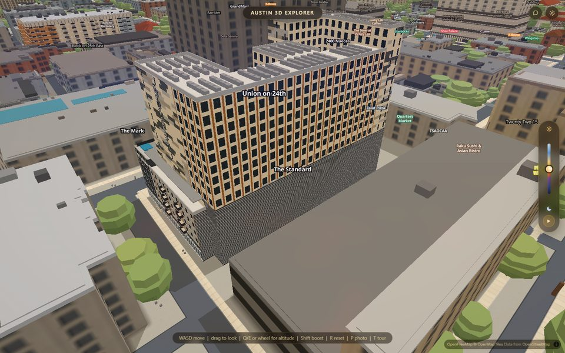
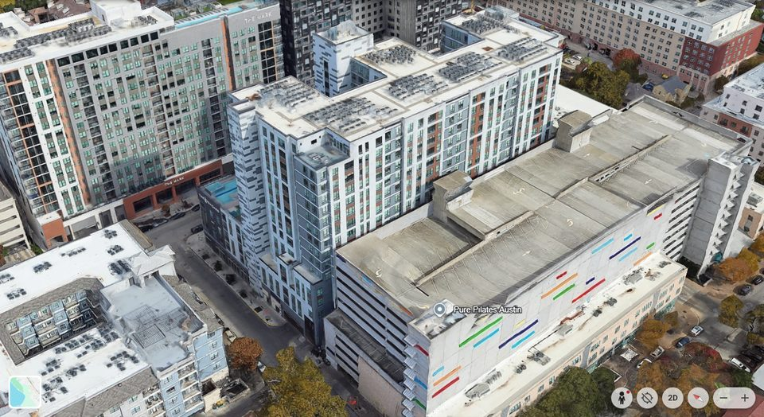
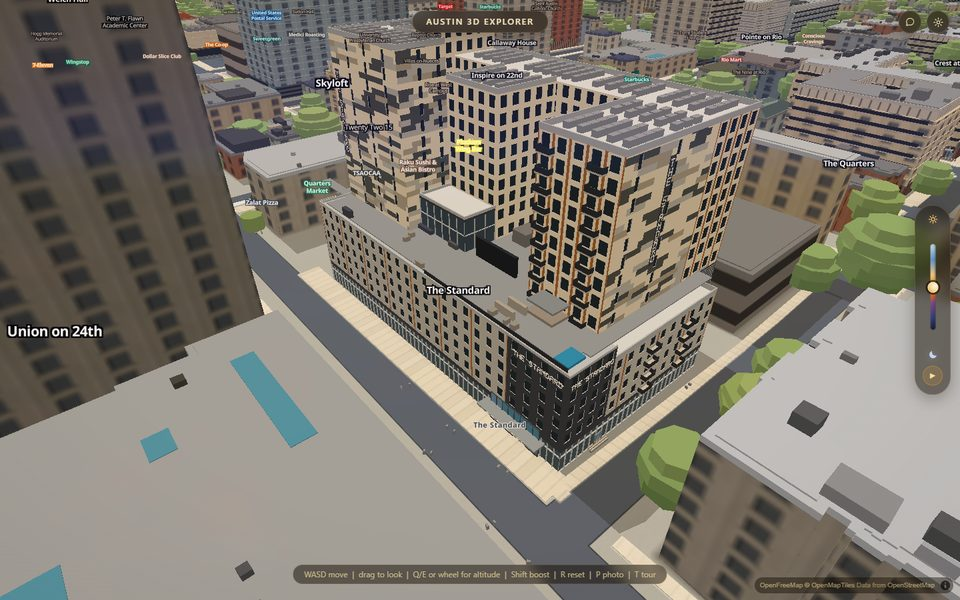
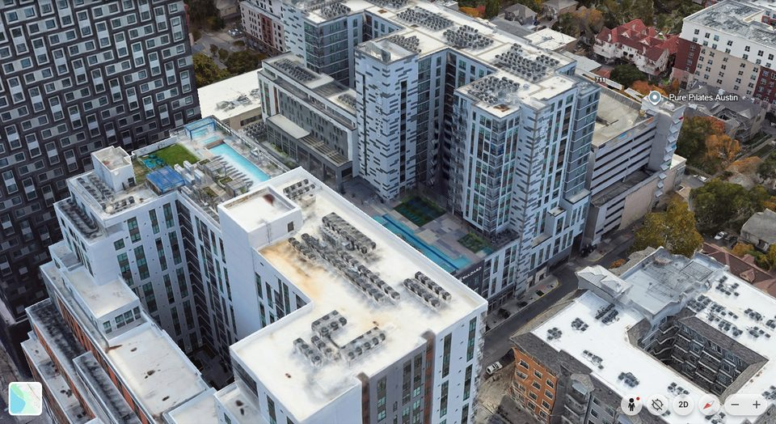
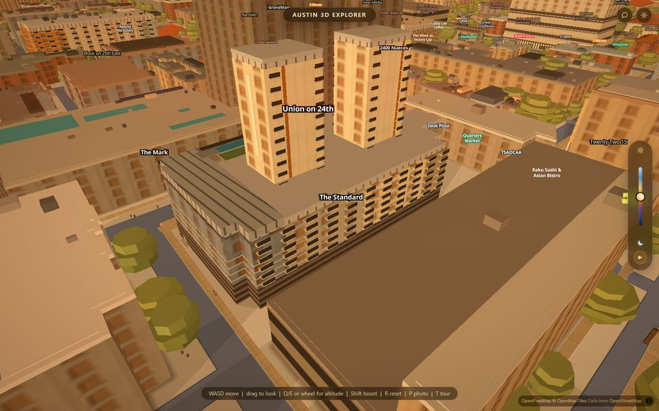
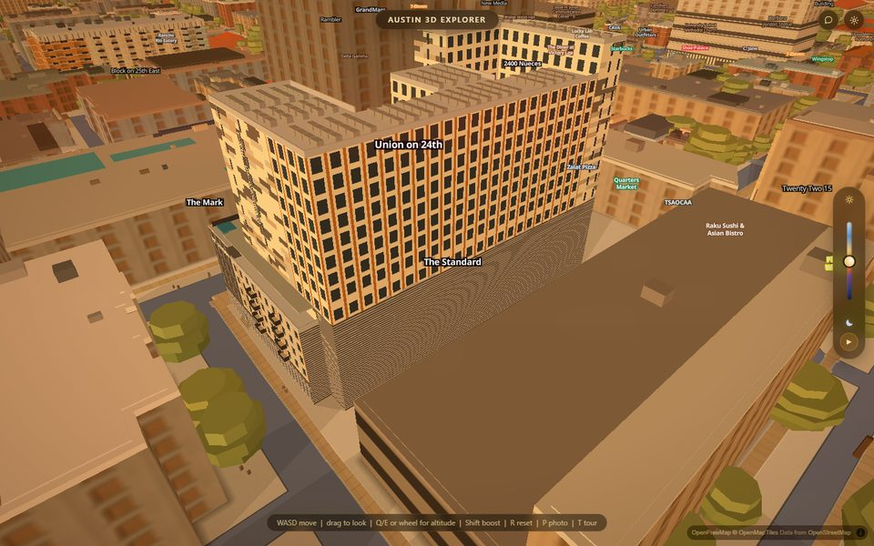

# Apartments as real geometry — `js/slopes-apartments.js` and `data/apartments/`

The app is apartments → distance → classes, and until 2026-09-05 every
apartment building in it was a flat prism, or at best a stack of one-colour
bands with a repeating window grid painted on (`js/westcampus.js`). This is
the generator that draws a building the way it is: podium, towers, light
wells, the pool on the deck, every panel and window and balcony a quad of its
own — from a data file a builder authors by hand from sources, one file per
building. The first one is The Standard at Austin, 715 W 23rd St.

Switch: `?apartments=0` at load, or `window.APARTMENTS.on = false` from the
console. Off, the page is what `main` draws: the flat prism and the
westcampus bands come back, because the generator hides them by *filter* and
puts the filters back. `?slopes=0` (the whole three.js layer) takes this with
it.

Gate: `scripts/verify/slopes-layer.mjs`, section 2b (`apartments:` lines).






*Above: The Standard at the brief's oblique (Google Earth
`@30.28699,-97.74578,190a,220d,35y,45h,55t`, ours at zoom 18.66 / pitch 55 /
bearing 45) and from the north-west (heading 135), ours in daylight. Google
Earth's imagery is 12/2023.*




*Above: the gate's two frames at the brief's pose, golden hour, the same
page load: `?apartments=0` — what `main` draws, `js/westcampus.js`'s bands
with two slab towers standing on what the nadir shows to be the two light
wells — and the generator on.*

## What is in the frame, and where it came from

The building has one outline in OSM (way 380916747: `building=apartments`,
no height, no levels, no `building:part`) and one polygon in our snapshot at
20.5 m — Overture's guess, wrong by 2.8×. Nothing about its shape is in any
data source. It was authored from:

- Humphreys & Partners' own photographs in
  `research/union24th-area/imagery/web/the-standard-at-austin/` — the corner
  at 23rd and Pearl, the dusk aerial from the north, the pool deck, the sky
  lounge.
- The architect's page (17 storeys, 287 units, the 7th-floor amenity deck
  with the pool, the double-volume gym) and SkyscraperPage (191 ft to top of
  structure).
- `data/roads.geojson`, which says which corner is which: 23rd St runs along
  the building's *north* edge and Pearl ends at its north-west corner. The
  research pass had the towers' compass directions garbled for want of this.
- Six Google Earth captures (nadir, two obliques at 220 m, three at 300 m),
  taken with `scripts/verify/chrome.mjs` on hardware GL and
  `page.screenshot()`. The nadir was *rectified* into the building's own
  frame (below) at 0.164 m/px — the scale bar is 183 px for 30 m and the
  footprint polygon overlaid lands on the roof edges — so every plan
  dimension was read in metres off a gridded plan, not eyeballed.
- `js/westcampus.js`'s TIER4 block, whose deck features (pool, spa, turf,
  cabana, jumbotron, rail) were read off the same frame from the z20 nadir
  and land on the imagery's own features when overlaid. Its two "tower
  slabs" do not: overlaid on the nadir they are the two light wells. The
  towers are the bars round them.

Every number in `data/apartments/the-standard.json` carries a `_src` naming
one of those, or says it is derived or unknown. The per-floor heights are
derived (17 storeys to 58.2 m, the podium top at the LiDAR's 21.5 m, the
rest divided); tower B's and the bars' 15 storeys are read off the
photogrammetry mesh at ±1 storey; the garage louvre pitch is a plausible
number and says so.

## The frame every building is authored in

A building's numbers are metres in its footprint's **oriented bounding box**
— the same `obbOf` `js/westcampus.js` uses, ported unchanged, so a `(u, v)`
read for that file means the same thing here. `+u` runs along the long axis,
`+v` across it; the generator logs `L`, `W` and the compass bearing of `+u`
at boot (`[slopes-apartments] The Standard: obb L=94.9 W=46.4, +u at bearing
274.7°`), which tells a builder which end is which. For The Standard `u=0`
is the east end, `+u` runs west along 23rd St, `v=0` is the north (street)
edge and `+v` runs south.

A block's plan is one of:

- `"footprint"` — the outline itself (the ring in the file), for a podium;
- `[[u, v], ...]` — a polygon in the frame, for a podium you have split
  (The Standard's is three pieces at three heights) or an L-shaped tower;
- `[u0, u1, v0, v1]` — a rectangle, for a tower, a corner bay, a wing.

To read a plan off a nadir: capture it at tilt 0 with `chrome.mjs`
(`page.screenshot`, wait 35 s), find the metres-per-pixel from the scale
bar, project the snapshot polygon on to it with the view centre at the
canvas middle, check the red outline sits on the roof edges, then resample
the image into the `(u, v)` frame at 10 px/m with a 10 m grid. The scripts
that did it for The Standard are in the session scratchpad
(`apts/build/standard/`), thirty lines of PIL each; the rectified plan is
what the block extents were read from.

## The schema, field by field

```jsonc
{
  "id": "<snapshot feature id>",       // the prism this replaces (buildings-3d / buildings-roof)
  "name": "<name>",                    // the westcampus bands this replaces (wc-* layers), and the label
  "sources": { "S1": "...", ... },     // named sources; every `_src` below cites them
  "footprint": { "ring": [[lng, lat], ...] },   // the snapshot polygon, verbatim
  "frame": "obb",                      // or { "obb": {...} } to pin one by hand
  "levels": { "floors": [0, 6.0, 9.1, ...] },   // every floor line, metres; skins put windows on them
  "colours": { "<tone>": { "hex": "#day" } | ["#day", "#golden", "#night"] },
  "skins":   { "<skin>": { "kind": "pixel" | "bays" | "storefront" | "flat", ... } },
  "balcony": { "proj", "slabT", "railH", "railT" },   // the building's balcony module
  "blocks":  [ { "id", "plan", "z0", "z1", "bands", "faces", "overrides",
                 "roofTone", "parapet", "parapetSides", "roofItems" } ],
  "deck":    { "z", "items": [ { "plan", "z0", "h" | "z1", "tone" } ] }
}
```

**colours** — a day hex gets golden and night from `js/westcampus.js`'s
`ramp()` (the same relationship its own bands use, so a mesh panel and the
fill-extrusion band next door age the same way); a full trio is taken as
given. Keys starting `_` are notes.

**skins** — a rule for one face treatment. All of them derive their column
count from a module, never a hard-coded count.

- `pixel`: horizontal planks in a running bond. `course` (m tall), `plank`
  (m long), `bond` (fraction of a plank the alternate rows shift), `tones`
  and `weights` (the field's tones and their shares), `runMax` (a run of
  1..n cells shares a tone), `macro` (`[rows, planks]` per decision cell —
  The Standard's dark runs are two courses by two planks), `window`
  (`cols` as fractions of the face, `w`, `h`, `sill`).
- `bays`: a flat `field` cut into bays of `bay` metres; `strip` (`w`,
  `tone`, `at: "joints" | "centres"`, `every`) puts a vertical strip of
  another tone on the bay lines; `window` (`w`, `h`, `sill`) one per bay per
  floor; `louvre` (`pitch`, `w`, `tone`, `start`) covers the band in
  horizontal slats (a garage screen); `bands` explicit horizontal bands.
- `storefront`: full-height glazing between `mullion`-spaced mullions of
  `mullionW`, a `transom` line at that fraction of the height, a `fascia`
  band on top in `fasciaTone`, panes set `reveal` behind the fascia line.
- `flat`: one tone, with optional `window` bays.

Every skin takes `glass`, `frame` (the reveal strips' tone) and `reveal`
(metres a pane sits behind the wall plane; `APARTMENTS.reveal` otherwise).

**blocks** — each one is walls plus a roof plus parapets:

- `bands`: `[{ z0, z1, skin, balconies?, signs? }]` up the wall, the default
  for every face.
- `faces`: per face, keyed `v0 | u0 | v1 | u1` for a rectangle (the side
  each faces) or `"0", "1", ...` (edge index) for a polygon, and `"*"` for
  the rest. `null` skips a face that stands against another block (never
  draw two same-facing coplanar faces — they z-fight; back-to-back ones are
  fine). `{ z0 }` starts a face higher (it shows only above a neighbour);
  `{ bands }` replaces the bands for that face.
- `overrides`: `[{ region: [u0, u1, v0, v1], bands }]` — the part of any
  axis-parallel wall inside the region wears these bands instead (The
  Standard's corner bay, the wall above the lower east wing).
- `balconies` on a band: `[{ s0, s1, lift }]` — a stack, one per floor line
  in the band, `s` measured along the face (a rectangle's `v0` face runs
  from its `u1` end to its `u0` end). The slab, projection and rail come
  from the building's `balcony`.
- `signs` on a band: `{ text, s0, z0, dot, gap, tone }` horizontal
  (`s0` = the low-`s` edge of the text block; it reads left to right for a
  viewer in front whichever way the wall winds) or `{ vertical: true, s,
  zTop, back: { w, tone, pad } }` stacked letters on a backing strip. A 5×7
  dot font, one quad per dot.
- `roofTone`, `parapet` (m), `parapetTone`, `parapetSides` (which edges get
  one — never an edge another block of the same height stands on),
  `roofItems`: `{ plan, h, tone }` boxes, or `{ plan, grid: [nu, nv], size:
  [w, d], h, tone }` for a cluster of them (condensers).

**deck** — boxes on a roof at `z`: `plan` rectangle, `z0` and `h` (or `z1`)
above the deck, `tone`. The Standard's pool, spa, turf, cabana, jumbotron
and guard rail.

## Authoring a building when OSM has one outline

1. Get the outline and the id from the snapshot; put the ring in the file
   verbatim. Run the page with the file listed in `index.json` and read the
   frame line off the console: which way `+u` runs.
2. Get the storey count and height from a source that states them
   (SkyscraperPage, the architect, a leasing page). Overture's height in the
   snapshot is a guess for any building OSM never tagged; say so in `_src`.
3. Capture the nadir and rectify it. Read every block's extents off the
   gridded plan — towers, wings, wells, the deck's features. Overlay any
   numbers you inherit (a westcampus TIER4 block) and keep only the ones that
   land on the imagery.
4. Capture two obliques and get the photographs. Decide each face's skin
   from what was photographed; for faces nobody photographed use the
   plainest rule the building has and say the face is unphotographed.
   Decide heights per block by counting rows against a known floor line,
   and write the uncertainty.
5. Take tones from measurements that already exist (the westcampus bake's
   crops are the model: a crop, its clusters, the blue-hour lift) before
   sampling new ones; a sampled tone cites the photograph and the crop.
6. Split the podium where its height changes and skip the faces blocks
   share. Put every roof edge's parapet on the list, and none between blocks
   of one height.
7. Look: ours at the matched camera beside the reference, at least twice.
   Fix the biggest thing you see each time before anything else.

## The taste block (`window.APARTMENTS`)

| key | default | what it is |
|---|---|---|
| `on` | `?apartments` ≠ `0` | the switch |
| `index` | `data/apartments/index.json` | the list of buildings and the ids/names they replace |
| `lod`, `minzoom` | `null`, `14` | the tier of buildings-3d, which has none |
| `byPreset` | performance 0.5 | geometry density per graphics preset (reserved) |
| `balconies`, `signs`, `deck`, `reveals` | `true` | draw those features at all |
| `reveal` | `0.12` | m a window sits behind its wall |
| `nightLit`, `nightLitTone` | `0.45`, `#d9b46a` | the share of windows lit after dark, and their tone |
| `signDot`, `signProud` | `0.18`, `0.06` | the dot font's stroke, and how proud of the wall the letters stand |
| `parapetT` | `0.25` | parapet thickness |

Everything that is a measurement is in the building's file, not here.

## Why quads and not textures

The brief allowed a canvas-texture path in the shared shader, as
`utx-diorama`'s `union.js` does for its brick and rib. Measured against the
cameras this app is judged from — the oblique at ~0.3 m/px and the walking
height at ~0.05 m/px — every feature the photographs show is at least half a
metre on its short side: a 2.2 × 0.56 m panel, a 0.9 m slit window, a 0.5 m
rust strip, a 0.18 m sign dot. All of it reads as geometry, and geometry
needs no change to `slopes.js`, no second material, no texture seam at a
building's edge. The one thing a texture would add — brick coursing at 7 cm
— is under a pixel at every camera here. Should a later building need one
(a mural), the place is a second `THREE.Mesh` in the same group, the way the
contract in `slopes.js`'s header already allows.

## What it costs

The Standard: 9 blocks, 55 faces, ~11,700 cells, ~1,600 windows, 26
balconies, 4 signs, ~45,000 triangles in one draw call, built in ~220 ms.
The whole slopes layer was ~74,000 triangles before it.

## Open

- Tower B's and the bars' heights are ±1 storey off the mesh; a drawing or
  a street photograph of the south face would settle them.
- The faces on the light wells, tower B's south and east faces and tower
  A's west face were not photographed and wear the plainest skin.
- The corner glazing stack on the charcoal bay and the deck's furniture
  (loungers, palms, hammocks) are not drawn.
- `applyWestcampusSettings()` (the westcampus perf A/B, nothing on the site)
  rewrites buildings-3d's filter from its own snapshot and would drop this
  generator's clause; the next `applySlopesApartments()` puts it back.
