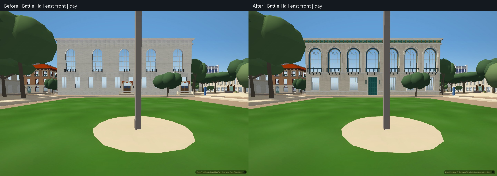
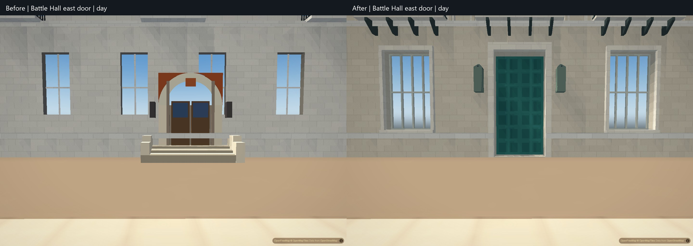
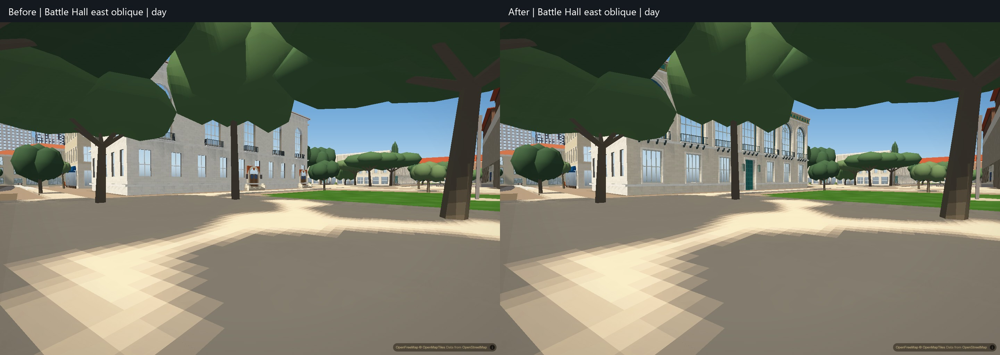
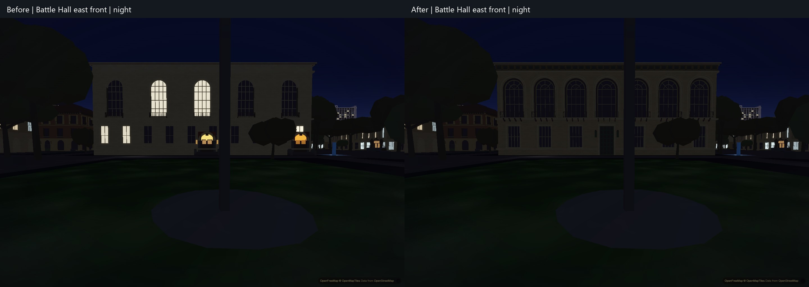

# Battle Hall east facade

The east reading-hall facade now has seven large upper arches and Juliet guards, six lower sash windows and one central rectangular teal paneled door. The old model had five upper bays, eight lower windows and two superimposed arched entrance assemblies. Nested pale arch surrounds, divided sash and fanlights, recessed blue/teal/gold strips, balcony supports, a flat-lintel entrance and a connected bracketed eave restore the photographed composition.

The existing mapped footprint, heights, roof rig, other elevations, trees and ground remain. Only a narrow central notch through the 1.1 m stone course lets the doorway reach its low threshold. This is an exterior door representation; no building interior or new walkable route is claimed. The entrance bake retires precisely the two old east assemblies, including the path-inferred secondary entry in a window bay. Other entrance records, arch records and Gearing ramp slabs retain their exact values and order.

The dedicated `scripts/bake_battle.py` owns `data/apartments/battle-hall.json`. Its base reproduces the prior asset exactly; `scripts/campus_battle.py` holds adjustable exterior dimensions and colors. The existing all-model authoring entrypoint delegates to this owner. Entrance migration uses `python scripts/bake_entrances.py --retire-battle-east-only`; it checks identity, position and piece counts before retirement, and verifies repeat runs as no-ops. The full bake applies the same retirement after assigning stable entrance identifiers.

Validation: `python scripts/verify/battle-east-data.py 669fd317` verifies deterministic immutable generation, 1,637 closed outward solids / 19,900 detail triangles, fourteen nonoverlapping openings, the exact course notch, unchanged other geometry and unrelated entrance/landscape/truth data. Broken triangles, reversed winding and three entry-drift controls fail as intended. Harness drift also passes. Full-city hardware verification uses 1440x960, DPR 1, CPU 1x, balanced settings, 74-degree field of view, fixed exposure, disabled graphics auto-detection and WAYFIND off. Three matched actual 1.8 m camera positions are captured twice in daylight and at night, using the second frames. Final runtime asset hashes, all 196 authored buildings, finite geometry and error-free loading are checked. No timing or performance improvement is claimed.

A continuous 987-frame keyboard walk reaches the retained building collision boundary, stops without drift, then backs away 4.92 m and stops again. The approach remains on ground zero with approximately 1.8 m eye clearance throughout. The first test used too little walking time to reach the wall; that failure is retained locally, and the corrected durations preserve the same contact, support and retreat thresholds. No controls or collision behavior changed.

The seven/six/one arrangement is directly visible in exterior sources. Dimensions and depths are approximate, constrained by the retained shell and stone courses. Fine carving, mosaic figures, heraldic ornament, weathering, unseen elevations and roof surface detail remain simplified or unverified. Existing glazing/light behavior remains; this pass does not establish full photographic, citywide window-motion or physical-phone acceptance. Reference images and camera metadata remain private.
