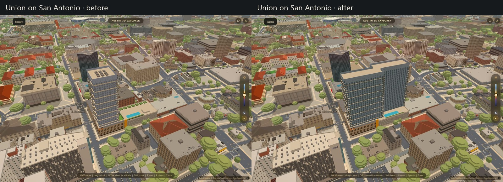
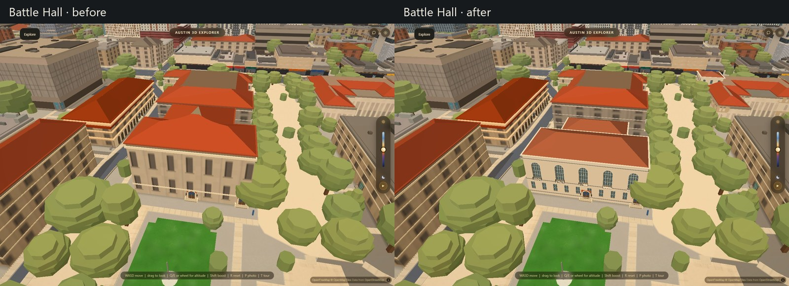
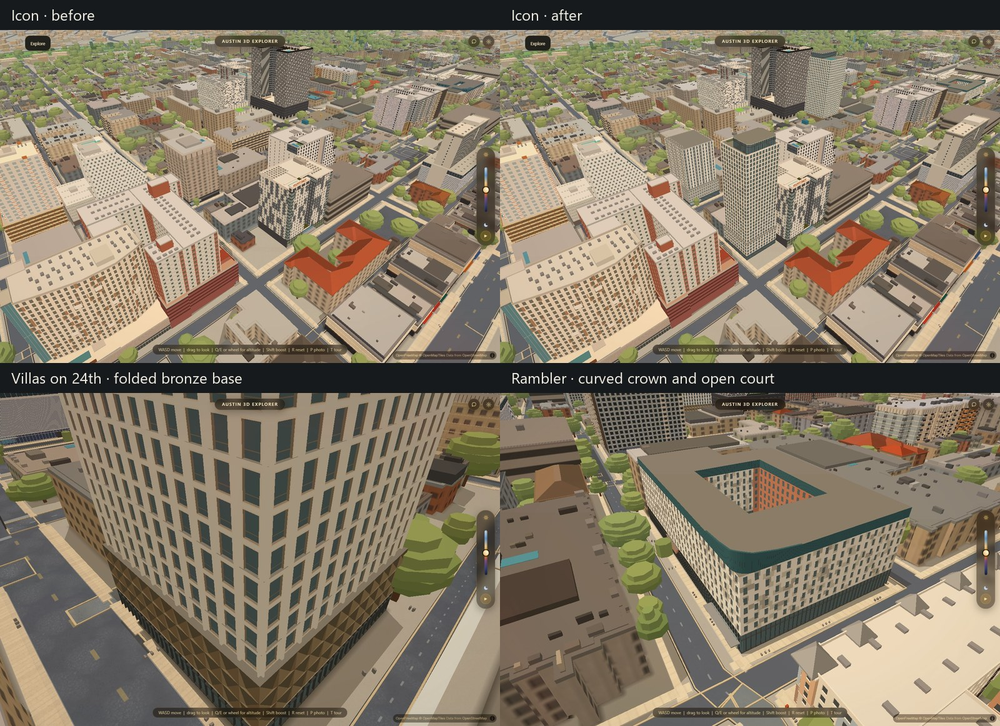
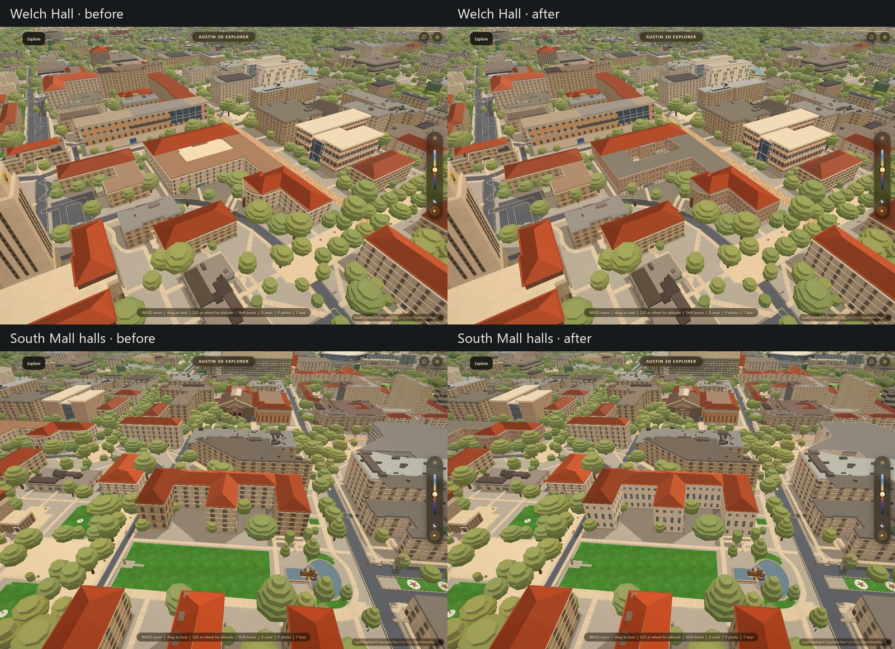

# Campus and apartment architecture — September 12, 2026

Branch: `codex/campus-apartment-visuals`.

Fourteen places received architectural work: twelve dedicated models, a rebuilt
Union on San Antonio, and Gregory's gable windows. The apartment renderer now
contains forty models. This pass concentrates on building shapes and facades;
campus paving, planting and smaller sculptural details still need another pass.

## Look at the changes

Union on San Antonio now extends across its site in two offset wings. Its former
short, square tower left most of the block empty. The new model has thin balcony
edges, open rails, corner glazing and a lower pool terrace.

Battle Hall gains its lower reading-room roof, five tall arched windows with
recessed glazing and divided sashes, limestone courses and small iron balconies.

Icon replaces the former church footprint with a tower and a glass amenity crown.
Villas on 24th has a white facade grid above actual folded bronze panels. Rambler
has an open court, checkerboard facade, brick entry and curved teal crown.

Welch and the South Mall halls retain their existing roof assemblies while
receiving modeled windows, frames, courses and corner stonework.

Other changes:

- Texas Union: entrance tower, paired windows, arches and stone trim. Existing
  wing roofs remain; the replacement wall cap sits below the original roof deck.
- Gregory Gym: three arched glazed assemblies and nine small gable windows in
  the existing roof geometry.
- PCL: the irregular limestone mass and recessed vertical window stacks.
- Inspire on 22nd: glass lobby, small-window podium, light tower and open metal
  rooftop frame.
- Pointe on Rio: two open courts, tall glass doors, wood panels, Juliet rails
  and rooftop rooms.
- Benedict, Mezes and Batts: different window rhythms on the lower, upper and
  attic floors, divided sashes, stone corners and stringcourses.

The Standard and Villas on Rio retain the preceding pass's work; their building
and route regression checks were rerun. Downtown and product features did not
receive changes in this pass.

## Sources and limits

Dimensions, colors, facade placement and roof details live in the per-building
JSON files in `data/apartments/`. Sources and outstanding uncertainties are
included there. These are architectural interpretations of photographs, with
existing geographic footprints where available, not surveyed replicas.

- [Rhode Partners: Villas on 24th](https://www.rhodepartners.com/villas-on-24th),
  [Icon](https://www.rhodepartners.com/icon),
  [Inspire on 22nd](https://www.rhodepartners.com/inspire-on-22nd) and
  [Pointe on Rio](https://www.rhodepartners.com/the-pointe-on-rio) supplied the
  principal exterior references and published building descriptions.
- [Icon's official site](https://www.iconataustin.com/) establishes the address
  at 2200 San Antonio. The tower envelope is derived from visible bays and
  neighboring spacing. Its old church polygon is retired for mesh and collision;
  the map label also follows the authored building name.
- [LV Collective's Rambler photographs](https://lvcollective.com/case-study/rendering-to-reality-rambler-atx/)
  establish its facade pattern, entry and raised curved corner. The precise
  courtyard bounds are approximate.
- [Union on San Antonio's official photographs](https://www.uniononsanantonio.com/austin/union-on-san-antonio/photos/)
  establish the facade details. Esri World Imagery's construction aerial gives
  evidence of the long offset floorplate. Setbacks remain approximately derived
  (roughly two-metre uncertainty); this was a construction view, not a completed
  roof survey. Unseen elevations repeat the photographed facade module.
- UT's official building pages supplied campus exterior photographs:
  [Battle](https://utdirect.utexas.edu/apps/campus/buildings/information/nlogon/maps/UTM/BTL/),
  [Union](https://utdirect.utexas.edu/apps/campus/buildings/information/nlogon/maps/UTM/UNB/),
  [Gregory](https://utdirect.utexas.edu/apps/campus/buildings/information/nlogon/maps/UTM/GRE/),
  [PCL](https://utdirect.utexas.edu/apps/campus/buildings/information/nlogon/maps/UTM/PCL/),
  [Welch](https://utdirect.utexas.edu/apps/campus/buildings/information/nlogon/maps/UTM/WEL/),
  [Benedict](https://utdirect.utexas.edu/apps/campus/buildings/information/nlogon/maps/UTM/BEN/),
  [Mezes](https://utdirect.utexas.edu/apps/campus/buildings/information/nlogon/maps/UTM/MEZ/) and
  [Batts](https://utdirect.utexas.edu/apps/campus/buildings/information/nlogon/maps/UTM/BAT/).
  Window spacing and hidden elevations remain approximate; carved ornament and
  interior spaces are outside this pass.

## Implementation and verification

The shared generator supports arched window heads, divided sashes, folded
cladding, continuous variable-height roof-edge ribbons and optional preservation
of existing roof rigs. Their appearance is editable in each model or the
`APARTMENTS`/`SLOPES_ROOFS.gableWindows` settings. `labelOverride` opts a model into
replacing its outdated snapshot label while its mesh is enabled.

`scripts/author_visual_pass.py` is a one-time authoring recipe against the frozen
September 12 snapshot, not a scheduled bake. The JSON files are the editable
model inputs; rerunning the recipe overwrites these twelve models. No Mac-owned
bake, output or stadium file changed. Other open lanes' code is untouched; the
required handoff entry is the only shared documentation change.

Verified in local Chrome with hardware graphics, 1440×960 viewport, graphics
auto-detect canceled. Each evidence frame was captured twice; the second is
shown. Before frames use `d549ef0` and matched camera/light settings.

- `campus-apartment-check.mjs`: all forty models, finite geometry, retained roof
  rigs, hidden old meshes, open courts, Icon collision/label, arched recesses and
  folded panels. The old Union footprint and square window heads are deliberately
  restored and observed failing their probes. Runtime fallback, performance and
  cinematic presets, day/night and console checks pass.
- `live-here-buildings.mjs`: The Standard, Villas' real roof openings and all
  nineteen existing route pairs pass. Its comparison is now pinned to pre-fix
  commit `4493d54`; a moving `origin/main` had stopped representing the old defect.
- Window-rule regression, harness parity, JavaScript syntax, JSON/plan validity
  and whitespace checks pass.
- Interleaved rotating-overview frame test: three samples per state, 150 frames
  each, first twenty discarded, hardware GPU, no CPU throttling, frame limiter
  and vsync disabled. Minimum median was 17.1 ms after versus 16.1 ms before on
  this machine. This compares apartment model sets under the current renderer,
  not a cold-load benchmark or a universal device claim. Later changes adjusted
  the crown edge, panel tones, a roof cap and a label; final geometry checks were
  rerun, the frame benchmark was not repeated for those small changes.

Reproduce with `VERIFY_URL` pointing at a Range-capable local server and
`VERIFY_OUT` at a scratch directory. Run `campus-apartment-check.mjs`; add
`VISUAL_PERF=1` for the repeated frame comparison. For the twelve matched poses,
run `campus-apartment-visuals.mjs` with `VISUAL_STAGE=before` or `after`.
