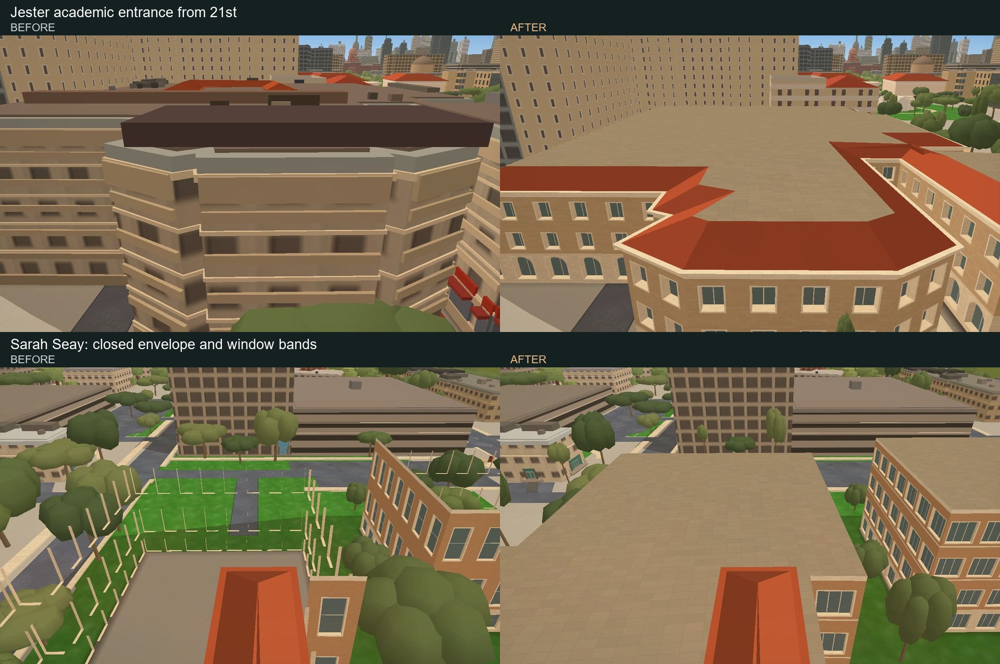
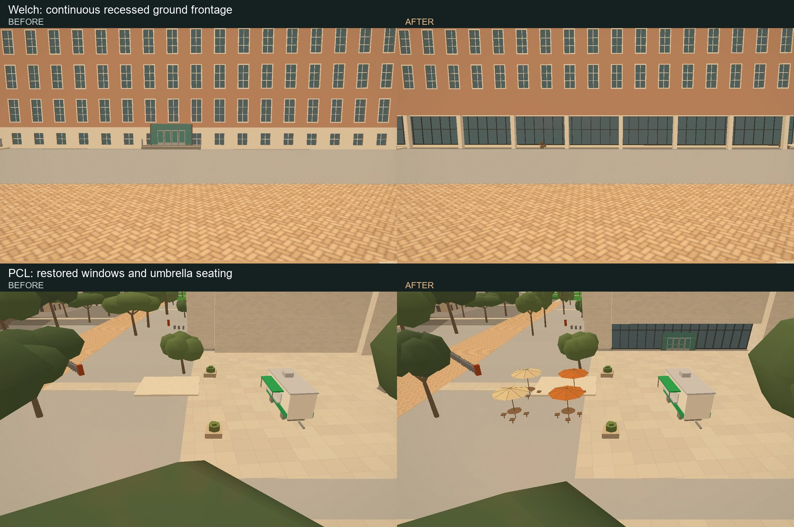
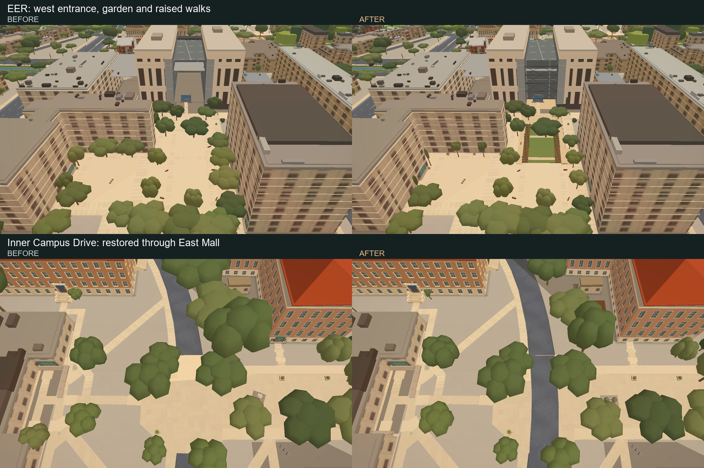
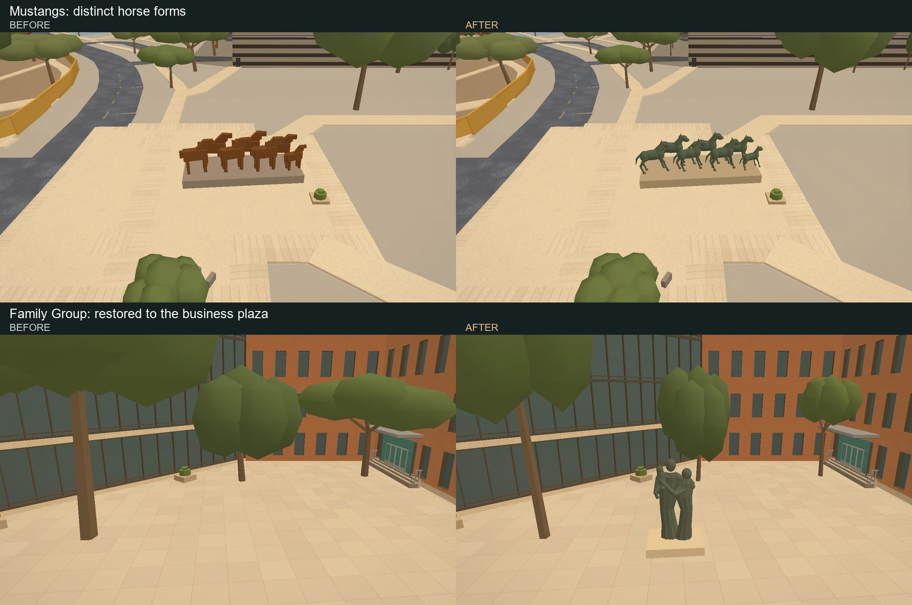
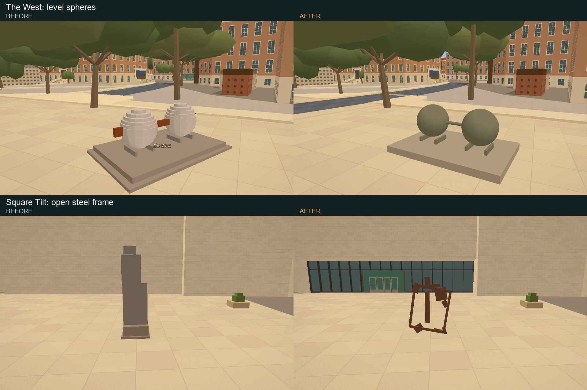
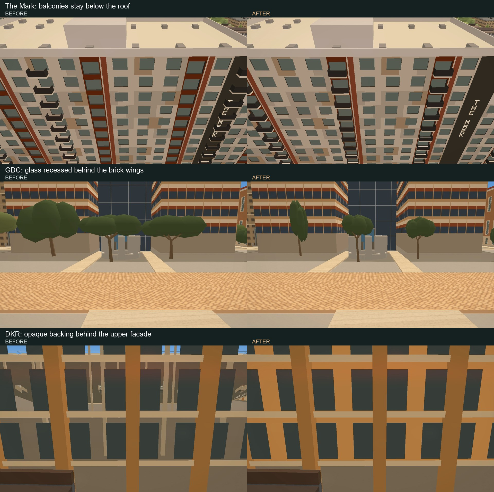

# Campus bug and ground pass — September 14, 2026

Branch: `codex/campus-bug-ground-pass`. Comparisons use main at `14d2bc1`
and the repaired scene, at identical cameras and time of day. Both frames wait
for model, artwork, landscape and entrance readiness. Each capture is taken
twice; the second is used. The same crop is applied to both images.

## Building repairs

Jester's academic entrance block on 21st is now a separate three-storey model
with a terracotta roof, recessed windows and ground arches. Its former generic
portal is retired. The dorm towers retain their separate window treatments.
Sarah Seay has four rows of horizontal windows. Apartment envelopes render on
both sides and flat roof gaps are capped, closing the disappearing surfaces
visible in Sarah's before view. This is an envelope repair, not proof that every
original face winding has been corrected.

Building references: UT's [Jester](https://utdirect.utexas.edu/apps/campus/buildings/information/nlogon/maps/UTM/JES/)
and [Sarah Seay](https://utdirect.utexas.edu/apps/campus/buildings/information/nlogon/maps/UTM/SEA/)
photographs. Unphotographed elevations, heights and roof dimensions remain approximate.

## Connected entrances and ground

Welch's long Speedway frontage now sits under the upper building, with a
continuous recessed glazed ground floor and columns. PCL has its narrow window
slots restored on selected walls, with a recessed glazed entrance and four
umbrella tables beside the existing cafe kiosk. Its blank diagonal stone wings
remain blank. References: [Welch renovation and plan](https://www.payette.com/projects/construction-update-ut-austin-welch-hall-renovation/)
and [UT's PCL photographs](https://utdirect.utexas.edu/apps/campus/buildings/information/nlogon/maps/UTM/PCL/).

EER's garden is on the west side, between the surrounding science buildings.
It now has planting, upper and lower walks connected by stairs and a ramp, and
the large entrance X frames. The glass curtain planes leave the entrance canyon
open. Placement follows [Coleman's garden photographs](https://www.colemanandassoc.com/projects/ut-engineering-education-research-center)
and [Ennead's building photographs](https://ennead.com/work/eerc/). The model's
walk heights and detailed dimensions are photo-informed approximations, not a
survey of engineering campus terrain.

The East Mall pavement had removed a section of Inner Campus Drive between Welch
and Waggener. The crossing repair restores the existing mapped road centreline
and width, then trims the overlapping path. It does not invent a new road route.
The repair runs in the full ground bake and with `bake_ground.py --repair-crossings`.

Across campus, trees inside building footprints are removed and oversized crowns
are reduced to clear those footprints. Speedway crowns have an additional size
limit. The renderer also retires 215 inferred entrance assemblies, including
their speculative stairs and canopies; recorded entrances remain. This removes
unsupported clutter, but it does not establish that every remaining entrance is
correct or that the campus ground survey is complete.

## Sculpture forms

Mustangs now has seven individually posed horse forms with necks, heads, legs
and tails. Family Group is restored to the business school plaza as three
embracing figures. These remain stylized models, especially at close range.
Family Group location and subject references: [McCombs](https://blogs.mccombs.utexas.edu/mpa-students/tag/umlauf-sculpture/)
and [The Alcalde](https://alcalde.texasexes.org/2019/09/one-ut-alumnus-mission-to-own-a-genuine-piece-of-campus-history).

The West now uses two smooth, level spheres with the published 60-inch diameter,
cradles and a connecting shackle. Square Tilt uses an open steel frame and welded
plates instead of a generic solid column. References: Landmarks' [The West](https://landmarks.utexas.edu/artwork/west)
and [Square Tilt](https://landmarks.utexas.edu/artwork/square-tilt).

## Geometry and first load

Mark balconies stop below the roof and invalid balcony offsets no longer leave
stray geometry across a window. The shared bounds check also rejects malformed
balcony patterns on Grandmarc and 2819 Rio. Nineteen diagnostic warnings identify
those rejected patterns; they are intentional, rather than silently drawn.

GDC's glass is recessed behind the brick prows, following [PCP's photographs](https://pcparch.com/work/gates-dell-complex-the-university-of-texas-at-austin).
The five-metre recess is approximate. DKR's upper facade now has continuous
opaque backing between the existing piers, preventing the field from showing
through that wall. Ground gates stay open. This is not a full stadium exterior
redesign; other stadium geometry still needs review.

Initial loading now waits for authored buildings to render and their old roofs
and map layers to retire. Independent model files load concurrently. A failed
request retains its fallback; a stalled replacement has a terminal 90-second
fallback for that visit, preventing an indefinite loading screen or a later
surprise replacement. This makes no claim of a measured load-time improvement.

## Verification and remaining work

Hardware Chrome captures passed without page errors. Graphics auto-detection
was cancelled; no CPU throttling was applied. The delayed-startup regression
holds Standard's file for 21 seconds, beyond the former 18-second tile ceiling:
the loading cover remains, and old geometry is retired before reveal. Running
that check with the old app code fails as expected. A separate unavailable-file
check verifies that Standard keeps its legacy facade and roof when its model
returns HTTP 503, while the other authored buildings still render.

Passed checks: `harness-drift.mjs`, `campus-walking-check.mjs`,
`campus-walking-data.py`, `campus-repairs-data.py`, `bug-pass-data.py`,
`bug-pass-crossings.py`, `bug-pass-geometry.mjs`, `bug-pass-startup.mjs`,
`bug-pass-fallback.mjs`,
JavaScript syntax and `git diff --check`. The geometry regressions demonstrate
the original balcony overrun and missing stadium backing; the crossing check
demonstrates the original gap and verifies idempotence. These checks guard the
specific defects, not architectural acceptance of the whole city.

Reproduce the comparisons with `scripts/verify/bug-pass-visuals.mjs`, setting
`VERIFY_URL` to a server using `scripts/serve.py`, `VERIFY_OUT` to a scratch
directory, and `WALK_STAGE` to `before` or `after`. `WALK_ONLY` selects named
poses. The before run routes changed scene files from commit `14d2bc1`.

**Open:** the unnamed glowing wall across from Union on 24th apartments has not
been identified or reproduced. North-side night inspection did not show the
reported glow. Exact engineering terrain, remaining generic entrance placement,
stadium exterior clutter and close-up sculpture fidelity need further work.
The broad gray ground outside the repaired places remains a limitation.

No Mac-owned stadium bake or output, and no open Drag experiment code or output,
was changed. HANDOFF is the sole shared documentation overlap with #164/#189.
