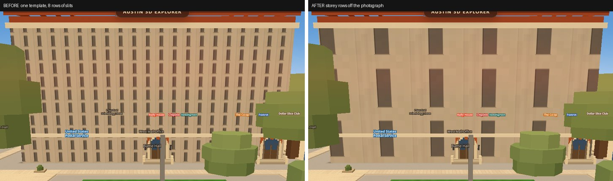
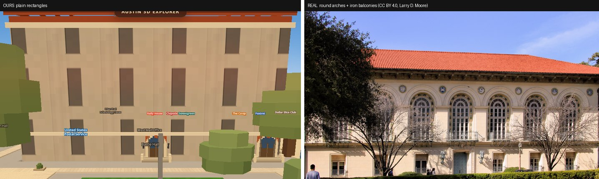
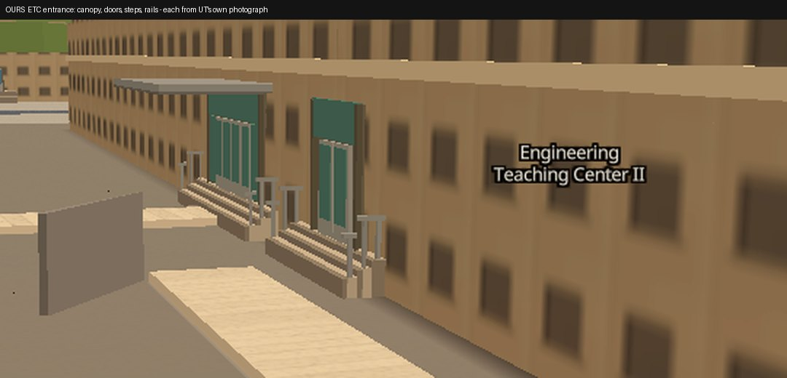
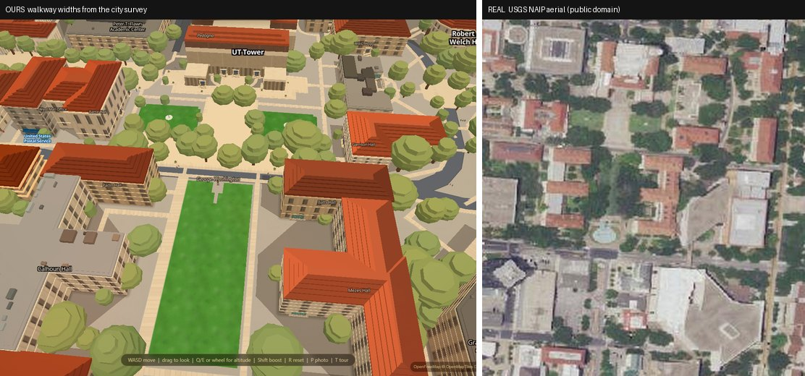

# The campus detail pass — what shipped, what did not, and what it cost

**Ship lane, 2026-08-27.** Three pieces (entrances, facades, walkways) were built
and independently criticised over three rounds each. This is the integration
verdict: every number below was re-measured by this lane on the **merged** tree,
served from `python scripts/serve.py 8841`, not read off any piece's write-up.

Simeon's brief was: *"entrances are so horrible and innacurate, windows on walls
are just a template copied and pasted. I want this to be the real thing."*

**Short answer: campus is meaningfully more real, and it still does not look like
the photograph.** The row counts, door positions and path widths are now measured
off real sources. The *shapes* are still generic. Details below.

---

## 1. Facades — the template is gone; the rectangle is not



Left is the old behaviour (`?facademul=1`, the same build with the measured tile
sizes switched off): one 8-row template stamped on a two-storey monumental hall,
which reads as corduroy. Right is what ships now — storey courses at the pitch
counted off the building's own photograph.

Measured, both arms, same build, same machine:

| | before | after |
|---|---|---|
| worst wall, LOOK band (z16–19) | 2.61× its real storey count | **1.30×** |
| worst wall, WALK band (z20–21) | 10.43× | **2.61×** |
| window crawl, Battle Hall at walking height | 44.28 % | **24.15 %** |

Both ratchets are watchable failing: with `--mul1` the gate goes red on exactly
those two assertions and exits 1. I ran both arms.

**And here is the honest half.** Beside the real building:



Ours draws plain rectangles. The real Battle Hall has round-arched Palladian
windows, wrought-iron Juliet balconies, carved roundels and a dentil cornice.
The mechanism that landed this round only ever fixes **repeat pitch** — how many
window rows fit on a wall. There is no arch primitive, no balcony, no
rustication anywhere in `js/facades.js`. So a wall can now have the right *number*
of windows and still be the wrong *shape*, and shape is what the eye reads first.

Reference photo: [File:Battle hall 2014.jpg](https://commons.wikimedia.org/wiki/File:Battle_hall_2014.jpg),
Larry D. Moore, CC BY 4.0. Licence checked per-file through the Commons API, not
assumed.

**Scoreboard.** The fallback metric (does the app's *height-class family* match
the photograph) is still **0 of 7** — that metric describes the old template
system and cannot move. The metric that describes what the wall actually draws is
**3 of 5** scoreable buildings now rendering the photographed number of rows.
Columns are not scored: only 1 of the 16 measured buildings has a bay count
anchored to a real wall length.

---

## 2. Entrances — doors where UT says the doors are



| | before | after |
|---|---|---|
| doors within 10 m of UT's own surveyed entrance | 64 of 204 | **74 of 181** |
| invented doors carrying no source | 118 | **0** |
| drawn canopies citing a photograph | 0 of 335 | **39 of 39** |
| door shelter correct on a **held-out** set | 10 of 22 (era guess) | **19 of 22** |

Read the denominator honestly: it went 204 → 181 because **118 doors that no
source supported were deleted**. That is most of the value of the round — the
score went up *and* the invented geometry went away.

The shelter instrument is held out on purpose: the survey was split
`blind iff sha1(code)[0] in "0123"` before a row was written, 76 rows train and
22 rows the bake has never read. `campusmeter.mjs` asserts the two sets are
disjoint and exits 1 if a code appears in both, so pasting the answers across
fails the harness instead of raising the score.

I checked the ETC canopy against UT's own photograph of that door
(`utdirect.utexas.edu`, no login). The canopy's shape and position match. UT's
building photos carry no stated licence, so they were measured from and **not**
committed.

**Still wrong:** `recess` and `arcade` shelters are recorded for 34 of 98
photographed entrances and cannot be drawn — the wall is an extruded footprint,
so depth in this renderer is a colour, not a distance. A colonnade needs real
geometry. That is a bigger, more visible error than the one this round fixed.

---

## 3. Walkways — 2.4 metres for everything, until now



Every footway in the city was a flat 2.4 m ribbon, because **no** OSM footway on
campus carries a `width` tag. 782 ways (44.6 % of drawn walk metres) now carry a
width measured off the City of Austin's planimetric impervious-surface survey —
real digitised pavement, independent of OSM. **578 of those 782 (73.9 %) were
more than half a metre off the template.**

| | before | after |
|---|---|---|
| drawn points within 5 m of a fresh OSM way | 624 of 625 | 624 of 625 |
| drawn points sitting on vegetation in the aerial photo | 105 of 624 (16.8 %) | **83 of 625 (13.3 %)** |

`walkwidth.mjs` checks the ribbon *in the rendered scene*, not the file, and
passes on all four sample ways. The remaining 46.7 % of ways are honestly left at
the default with nothing invented in their place — where the city survey has no
coverage, the tool declines to guess.

The router also crosses plazas now: 1,577 chords, **every one confirmed against
USGS NAIP aerial photography, 134 refused for running over open turf.** Both
endpoints of every chord are existing OSM nodes, so no geometry is invented. Of
42,233 candidate "desire paths" considered, **zero shipped.**

---

## 4. The walking record moved, and here is why

The veto was the walking record. It reads:

```
excess over ground truth   87.0 m  ->   2.0 m
signed total              -393.7 m -> -541.4 m
ends at the right door      38/38  ->  38/38
Dijkstra drift               0.00  ->   0.00
live UI gate                 PASS  ->   PASS
```

It moved in the right direction, but **most of the move is an instrument repair,
not a routing win.** `walk-pairs.json` freezes each ground-truth door as an
*index* into `walk_graph.json`'s door array, and a re-bake renumbers that array.
The shipped graph was stale against the entrance file in the same tree; re-baking
renumbered every door and all thirty frozen indices came to point at a different
building, while metric A went on printing plausible numbers. So `87.0` was
measured against the wrong doors.

There is now a self-check asserting the door at index *i* belongs to the building
the pair names. **I watched it fail**: rotating one index by seven makes it print
the mismatch and exit 1. I then restored the file byte-identical. I also
independently confirmed all 30 frozen indices resolve to the right buildings.

---

## 5. What it costs

| | before | after |
|---|---|---|
| cruise frame time, median (min of 3 interleaved reps) | 579.7 ms | **571.1 ms** |
| atlas repaint when nothing changed ("no-op") | 0.8 ms | **0.8 ms** |
| facade atlas size | 5,250 KB | **10,050 KB** |
| full atlas repaint on an hour change | 323.6 ms | **780.8 ms** |

**Per-frame cruise cost did not regress** — the measured arm is marginally
faster, inside noise. The real cost is the atlas: it doubled, and a full repaint
when the time-of-day bucket changes went from ~324 ms to ~781 ms of main-thread
canvas work. That is not a cruise cost (cruise frames pay the 0.8 ms no-op), but
it is a longer hitch when the sun slider crosses an hour.

These are headless-SwiftShader numbers, quoted with their instrument:
`facade-perf.mjs` wants a real GPU and this machine rasterises in software
(0.9 fps at 2560×1400), so it hit its watchdog and is **not** reported here. The
arm-to-arm comparison above is on one instrument, one machine, interleaved,
minimum of reps.

---

## 6. A wrong number I found and corrected

`docs/walkways-widths.md` §8 shipped a table saying **no** stranded island was
within 5 m of the routable network, and the largest was 118 m out — and used that
to conclude the gaps were upstream OSM's problem with nothing to do here.

That is false. I decoded `data/walk_graph.json` from scratch (delta-coded
coordinates, cumulative edge indices), found components by union-find over all
13,751 edges, and brute-forced every island node against all 10,744 main-network
nodes by haversine with no spatial shortcut. The decode reproduces every *other*
anchor in that section exactly — 219,041 m, 47 islands, 5,647 m stranded, largest
island 1,824.8 m — which is why the distances, not the decode, were the broken
part.

| | doc said | actually |
|---|---|---|
| islands within 5 m | 0 | **4, carrying 913 m** |
| islands within 10 m | 3, 387 m | **12, 1,324 m** |
| largest island's distance | 118 m | **19.00 m** |
| nearest island | — | **2.45 m** |

19 m is well inside tolerances this codebase already trusts (`DOOR_LINK_MAX_M`
30 m, `UT_VIRTUAL_SNAP` 75 m). The doc and `HANDOFF.md` are corrected and the
real job is queued.

---

## 7. Every source used

| source | what for | licence |
|---|---|---|
| OpenStreetMap via Overpass | footways, entrance nodes, building footprints | ODbL 1.0 |
| City of Austin open GIS | building heights, impervious-surface pavement widths | public domain |
| USGS NAIP orthoimagery | plaza-chord confirmation, path-vs-vegetation check | US federal, public domain |
| Wikimedia Commons | facade photographs for storey counts | per-file, checked via API (Battle Hall: CC BY 4.0) |
| UT Direct `nlogon` building pages | entrance shelter type, floor counts | **no stated licence — measured from, never committed** |
| UT Facilities "Celebrated Entrances" | surveyed door locations | UT internal, already in-repo |

Mapillary and Google Street View were confirmed unreachable without a paid key
and were not worked around. HABS/HAER is reachable and free but has nothing for
UT Austin's main campus — four targeted searches, zero hits.

---

## 8. The one thing to do next

**Give windows a shape.** Row counts are now right on the measured buildings and
the walls still read generic, because every opening in the city is a rectangle.
An arch primitive plus a per-building "arched / square" flag — sourced the same
way the storey counts already are — would do more for how campus reads than any
further work on counts. Battle Hall, Gregory Gym, the Main Building arcade and
Littlefield House all fail on shape, not on number.
