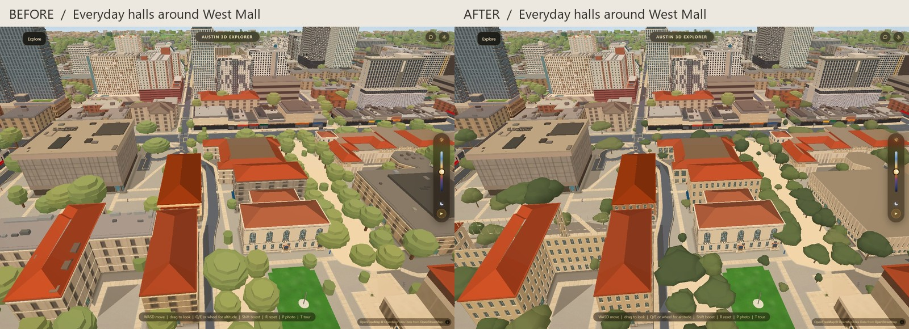
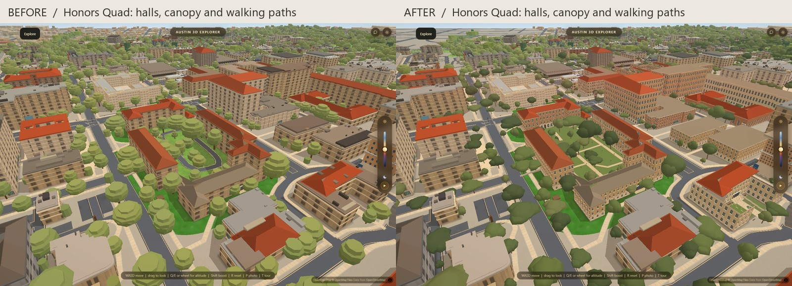
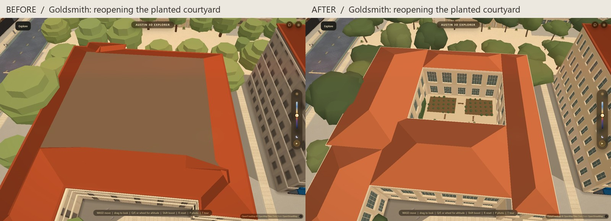
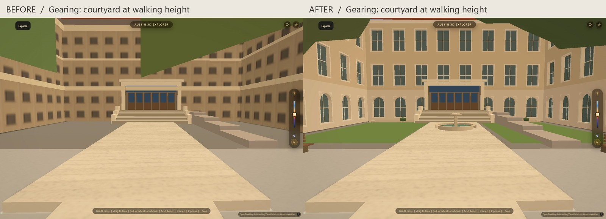

# Campus beyond the landmarks

Branch: `codex/campus-everywhere`. September 12, 2026.

This pass adds 36 smaller academic and residence buildings, replaces the stacked
canopies of 3,090 recorded campus trees, and treats six courtyard/garden areas.
The graphics preset still controls how many trees are drawn. The collection now
contains 76 building models including the previously shipped apartments and
landmarks.

## What changes on screen

Goldsmith, Sutton, Homer Rainey, Calhoun, Parlin, West Mall Office, Flawn and Hogg
receive individual facade profiles. The other academic profiles cover Biology,
Gearing, Painter, Gebauer, Will Hogg, Garrison, Waggener, Burdine, Pharmacy, Anna
Hiss, Rapoport, Schoch, Winship, Art, Student Services, Seay, Moffett, NMS and BME.
Materials, bay spacing, sash divisions, arched heads, reveals, blank walls and
cornices vary by profile. Anna Hiss gets tall gym glazing rather than stacked
office floors; Flawn gets deep narrow screen openings.

Andrews, Blanton, Carothers, Littlefield Dormitory, Brackenridge, Roberts,
Prather, Moore-Hill and Creekside receive residence-specific profiles. The false
asphalt loop inside the Honors Quad is covered by the lawn and concrete paths
traced from aerial imagery. Service access outside the court remains.

Goldsmith's old roof filled its courtyard. Five separate pitched roof wings now
surround the mapped opening. Planted panels, benches, paving and a simplified
living wall occupy the court. The camera's height field now respects polygon
holes as well, so the open courtyard has no invisible collision roof. A separate
building inside a courtyard still contributes its own collision height.

Gearing gains two lawn panels, planting, benches and a small fountain. Turtle
Pond retains its mapped water outline with a low rim and garden planting.
Additional garden pockets address the Brackenridge/Roberts/Prather courts and
north science walks. New surfaces and beds are clipped clear of mapped
buildings, paths, parking and access lanes, except the explicitly corrected
Honors Quad surface. East Mall construction remains as mapped.

## Evidence and limits

The 36 profiles each link the relevant [UT building information page](https://utdirect.utexas.edu/apps/campus/buildings/information/nlogon/),
whose exterior photographs informed the material and opening treatments. The
exact per-building links and observations are retained in
`data/campus_buildings.json`. Geometry uses the September 12 snapshot; 26
existing roof rigs remain in place. Goldsmith's roof is explicitly subdivided
around its court instead of preserving the defective rig.

The [UT Green Tour](https://sustainability.utexas.edu/campus-sustainability/self-guided-green-tours/bleed-orange-live-green-self-guided-tour)
documents Goldsmith's living wall, Turtle Pond and campus garden spaces. UT's
[Landscape First interview](https://soa.utexas.edu/news/landscape-first-stringfellow)
identifies the Hal and Eden Box Courtyard. [Esri World Imagery](https://server.arcgisonline.com/ArcGIS/rest/services/World_Imagery/MapServer)
informed court paths and planting boundaries. Trace extents and pixel coordinates
are recorded in `data/campus_gardens.json`.

This is a stylized, photo-informed interpretation. Window dimensions,
unphotographed elevations, plant morphology, small furniture placements and
fountain proportions are approximate. Sculpted ornament and complete historic
elevation surveys remain outside this pass. The work does not claim every
campus building is now fully modeled or every planting is surveyed.

## Implementation and checks

`bake_campus_buildings.py` owns only `data/campus_buildings.json`.
`bake_campus_landscape.py` owns only `data/campus_landscape.json`. The editable
profiles and garden recipes are separate inputs. The building collection uses
the existing renderer. Planting shares the existing slopes material and is
divided into spatial chunks for culling. Appearance controls are exposed in
the input JSON and `CAMPUS_LANDSCAPE`.

Canopy replacement uses recorded compound identifiers. MapLibre's `within`
expression did not match the polygon canopies in the initial browser probe;
the final gate explicitly catches old tiers showing through new trees. Trunk
keys that also identify an unrelated trunk are left alone. Disabling
`CAMPUS_LANDSCAPE.on` restores the original trees and ground; the building and
slopes switches retain their existing fallbacks.
Old tree and building geometry is disposed when replaced so preset changes do
not retain obsolete GPU buffers. The material remains shared with the scene.

Matched frames use the same camera and daylight, with the before building
index frozen at `8ba4920` and the new planting disabled. Each frame is captured
twice and the second used. Only these four cited comparison images are tracked.

Frame comparison: hardware Chrome, 1440 x 960, balanced preset, no CPU
throttling, 150 animation frames per rep with the first 20 discarded. Three
interleaved median frame times per state were 21.6 / 19.9 / 20.1 ms before and
21.9 / 20.2 / 20.3 ms after. Comparing the minima gives 19.9 to 20.2 ms, about
1.5%, within the 35% + 2 ms relative guard. This is one desktop GPU and view,
not a mobile performance claim. A subsequent disposal fix changes resource
cleanup, not visible geometry; its repeated rebuild behavior is checked
separately.

Passed: `campus-everywhere-check.mjs` (76 models, all source footprint holes,
Goldsmith open roof and collision court, separate courtyard pavilion, old-tree
removal, garden meshes, presets, fallback and disposal),
`campus-apartment-check.mjs` (existing original-defect probes, roof alignment,
day/night and fallback), `live-here-buildings.mjs` (roof cuts and all 19 existing
route pairs), `harness-drift.mjs`, `apartment-window-rule.mjs` and syntax checks.
An intentional failure after browser cleanup was also observed exiting 1.
The height field retains its existing conservative 6 m cells; this is not a
claim of doorway-scale collision precision.
