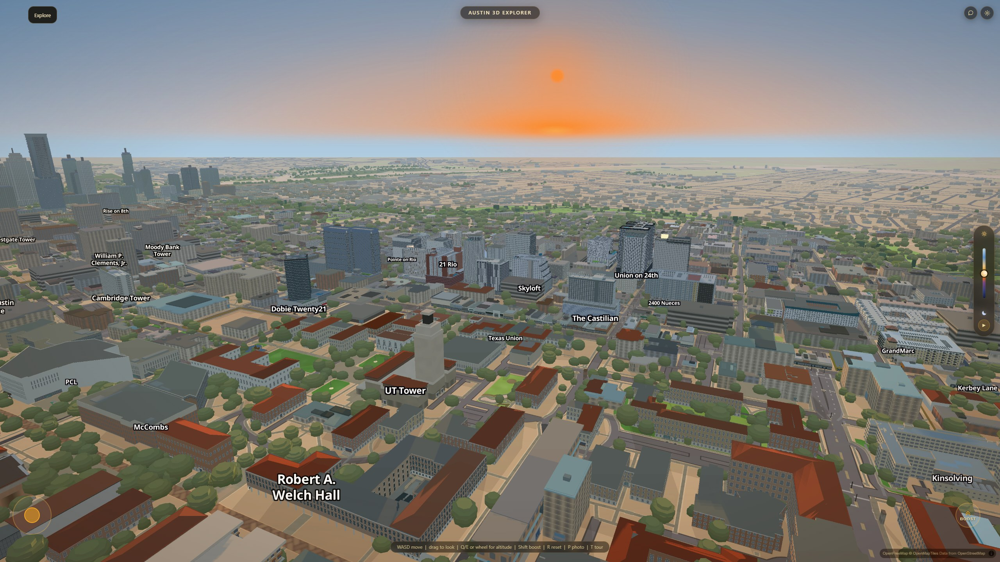
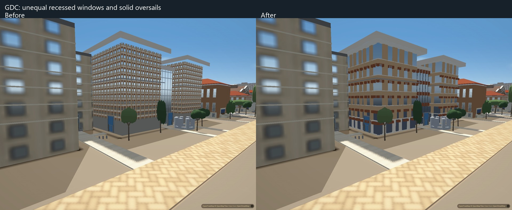
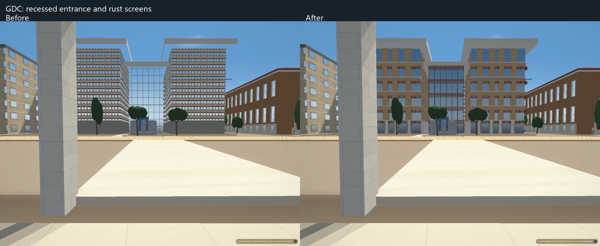
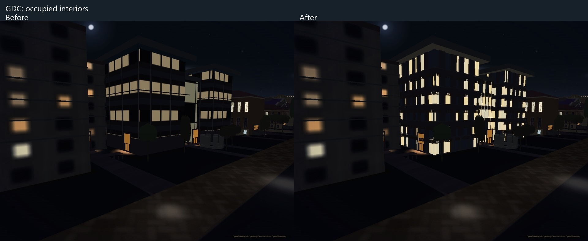
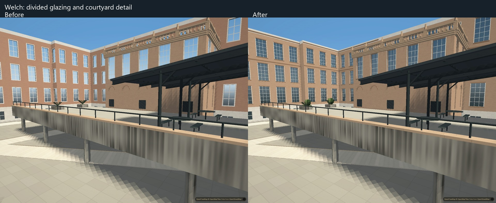
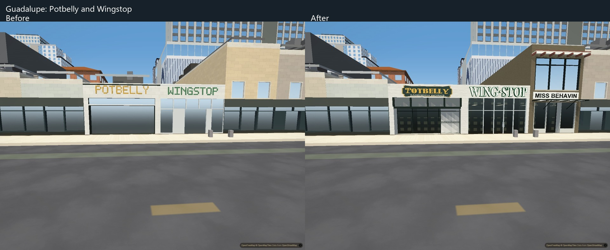
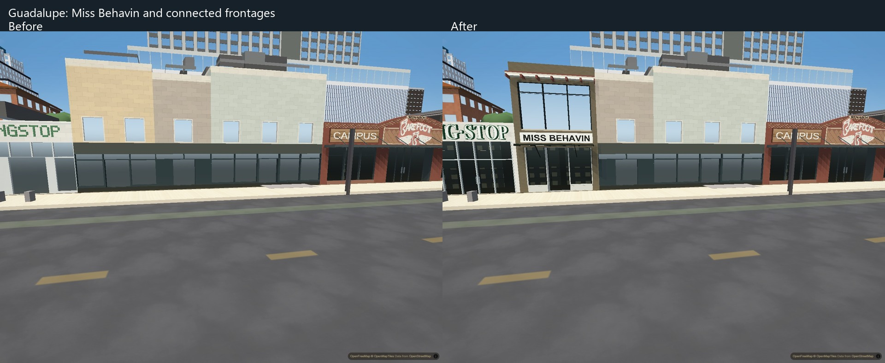
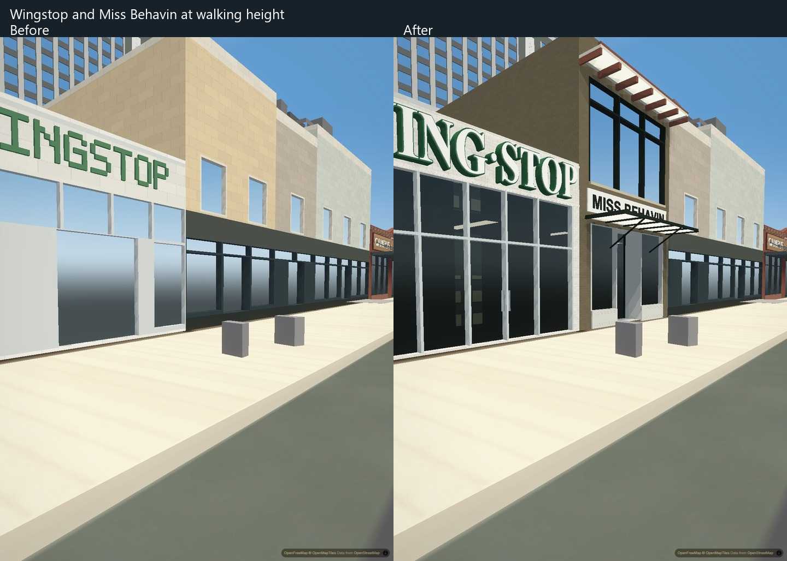
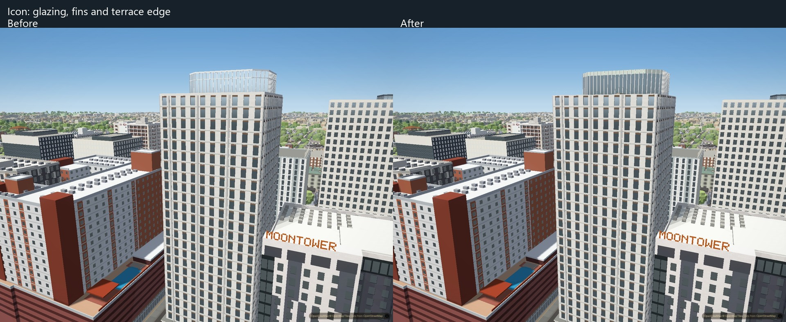

# Campus facade depth and connected Guadalupe frontages

This pass gives GDC literal recessed window pairs and projecting shades, deepens
Welch's courtyard glazing and entrance, and rebuilds the connected Potbelly,
Wingstop and Miss Behavin frontages. Icon's crown now separates its pale upper
infill, dark glazing and open terrace edge.

## Architectural changes

- GDC keeps the existing building plans and roof heights. Its unequal window
  pairs, masonry ribs, ledges, ground piers and entrance screens are geometry
  rather than a repeated window image. Three downward-facing roof planes close
  the missing undersides of the existing oversails. Occupied night windows use
  authored interior colors rather than directionally darkened wall colors.
- Welch keeps its historic and modern wings distinct: deep divided windows and
  projecting brick surrounds on the historic facade, narrow laboratory glazing,
  a recessed terrace entrance, and fuller planting. The heights, preserved roofs
  and split courtyard levels from the preceding pass remain.
- Potbelly gains a deep entrance court, gate and transom; Wingstop gains divided
  silver-framed glazing and substantial raised lettering; Miss Behavin gains its
  upper windows, red eave rafters, braced steel canopy and recessed entrance.
  Cached curved sign outlines replace the old block alphabet. The Potbelly mark
  is a hand-authored approximation, not an official logo asset.
- Icon's existing chamfered crown receives continuous pale fins, upper infill,
  darker glass and a lower terrace curb with slender guard edges. The apartment
  coverage review identified an existing building; it does not justify adding a
  duplicate tower.

GDC uses locally verified public exterior references; it was not confidently
identified in the owner-phone collection. Welch's additional owner angles remain
unconfirmed, so unrelated facades were not copied into the model. Guadalupe and
Icon use confirmed owner-photo matches. Source photographs, source identities and
private camera records stay outside Git.

## Boundaries and controls

The hero bake preserves EER, NHB and top-level metadata. The Guadalupe bake
preserves the other 64 shop models. The Welch and Icon scripts modify only their
own apartment files. Building counts and existing footprint inputs are retained;
small detail dimensions remain architectural approximations.

The shared pane renderer accepts validated per-building glass strength and scale
without changing global glass defaults or converting masonry openings to glass.
Welch and Icon use this to retain darker, less reflective glazing. GDC has a
separate solid-glass material path without the downtown analytical facade grid;
ordinary solid extrusions retain their previous shader branch. The oversail
undersides use the existing baked roof polygons and shared time-of-day material.

Appearance controls live in the respective authoring scripts, Guadalupe profiles,
apartment material descriptors and `CityLighting.campusMaterials`.

The device check also exposed callbacks reading MapLibre's absent style during
context loss. Apartment labels and replacement filters now defer until a style
exists, including restoring the fallback when graphics were switched off during
the interruption. Source loading alone does not delay replacement filters. Map
removal cancels owned timers and prevents late model attachment. Delayed shadow
construction similarly stays pending until the style returns. Both regressions
have tests that reproduce the original errors when deliberately broken.
Collision scans pause while keeping the frame clock current; deferred LOD,
night lighting and shadow updates resume after the style returns. These guards
address the loss interval without serializing the style on periodic callbacks.
Time-of-day playback and deferred Capitol mirrors also wait for loaded style
JSON without waiting for every source tile. The shared Three.js pass skips
rendering on a lost context, including loss during shadow-state queries; null
viewport/scissor values leave the shadow update pending for a later frame.

## Verification

Ten application before/after pairs use identical camera position, bearing, pitch,
FOV and fixed exposure at 1440 x 1080, balanced graphics. Every capture waits for
all 196 authored buildings, replacement readiness and loaded sources. Auto-detect
and drift are disabled; the second settled screenshot is retained. Both sides
use the same raw GeoJSON delivery path. Photo viewpoints are approximate; the
application pairs are matched exactly. No page or shader errors occurred.

Real-scene ray tests hit the three roof undersides at the original base heights
with downward normals. The lifecycle test catches the original repeated-toggle
resource leak when run with `--break`; normal toggles reuse the same mesh, and
map removal disposes it and cancels delayed initialization. Material tests cover
per-building overrides, ordinary-glass preservation and invalid descriptors.
GDC geometry tests check unequal window ratios, pane clearance, stable occupied
night colors, unchanged roof plans/heights and preservation of EER/NHB. Frontage
and roof fallback, deterministic bakes and harness parity pass. The full data
build passes without further baked changes.

Six fresh-browser visits interleave baseline/current three times at 390 x 844,
DPR 3, touch/mobile Chromium, hardware RTX 3050 Ti graphics and CPU throttle 1x.
The normal phone profile selects `performance`; the effective map canvas is
877 x 1899 after the app's phone scaling. Real vector tiles are used. Each visit
requires the complete city both after loading and at the test view, then records
15 seconds of controlled pan and 15 seconds stationary. All six visits pass,
with no page/shader errors, context loss or document reloads.

Minimum full-city initial readiness was 42.16 seconds before and 43.96 seconds
after (ranges 42.16–45.74 and 43.96–48.04). Minimum per-run pan render p95 was
20.5 ms before and 20.1 ms after (ranges 20.5–21.3 and 20.1–21.5). These runs
show similar rendering performance, not a performance improvement. They do not
test the separate automatic idle-spin defect.
This A/B swaps eight architectural assets against the earlier baseline while
keeping the other runtime modules current in both arms. It is not a whole-PR
comparison against current main. The subsequent recovery guards are verified
separately with fault injection and normal full-city rendering.

After forced CDP garbage collection, minimum JS heap was 79.94 MB before and
82.26 MB after. Retained Three.js geometry buffers were 274.56 MB before and
275.76 MB after, an increase of 1.20 MB. CDP backing storage was approximately
928.93 MB before and 932.08–932.25 MB after. These are distinct measurements,
not values to add: they exclude total browser/process memory and complete GPU
allocation. The substantial existing storage footprint makes physical-phone
verification necessary; desktop success does not establish phone headroom.

Four further views at 2560 x 1440 verify GDC, Welch, Guadalupe and Icon using
normal PMTiles delivery. A separate 1080 x 1440 before/after pair verifies
Wingstop/Miss Behavin at the same measured 1.70 m camera height, with the normal
camera limits and collision system active. All views have 196 ready buildings,
loaded vector sources and no page/shader errors. Raised white letter faces and
green sides are visible from this oblique view; the typeface remains approximate.

The final full-city context-recovery integration gate now passes on current main
integrated into `codex/campus-photo-depth`. The reusable
`scripts/verify/device-recovery.mjs` observes actual loss on the connected shared
MapLibre/Three.js canvas during active time-of-day playback, actual restoration,
and exactly one application recovery reload. All 196 authored buildings return
ready, indexed and tiled; keyboard and touch-joystick movement resume. Portrait (390 x 844 DPR3), landscape
(844 x 390 DPR3) and large (2560 x 1440 DPR1) second screenshots pass with no page,
console or shader errors. The large view retains the recovered touch graphics
profile; it is not a fresh desktop-default benchmark.

Earlier probes that saw no loss event remain rejected attempts. The new probe
asserts canvas identity, records direct canvas events outside the reloading page,
and rejects extra reloads, partial cities and incorrect capture dimensions.
These results establish desktop Chromium recovery, not iPhone hardware behavior.
Focused callback, style-loading and GL-state regression tests also pass.
The deliberate `--break-injection` run reaches the complete city but exits 1
with `No actual context-loss event observed`, as required.

## Remaining fidelity and device work

These are approximate architectural models, not photogrammetry. Fine masonry,
shop displays, sign fidelity, planting and unphotographed elevations remain less
specific than the references. The full owner-photo backlog remains open.

The target phone browsers are iPhone Safari and Chrome; no physical device was
available for this pass. Physical-phone acceptance requires an actual device:
open the normal production site with its default graphics, wait for the complete city, walk through campus
and Guadalupe, rotate to landscape, switch away and return, then reload. Record
the phone, browser and OS, missing buildings, context loss, page reloads and
visible stalls. Desktop mobile emulation cannot establish phone memory headroom,
thermal behavior or mobile GPU performance.

Citywide moving window patterns, idle pauses, DKR and further glare refinement
remain separate queued work.

## Matched application comparisons

### GDC window depth and roof undersides

### GDC entrance screens

### GDC occupied interiors

### Welch courtyard

### Potbelly and Wingstop

### Miss Behavin and its neighbors

### Walking-height sign depth and entrance

### Icon crown

