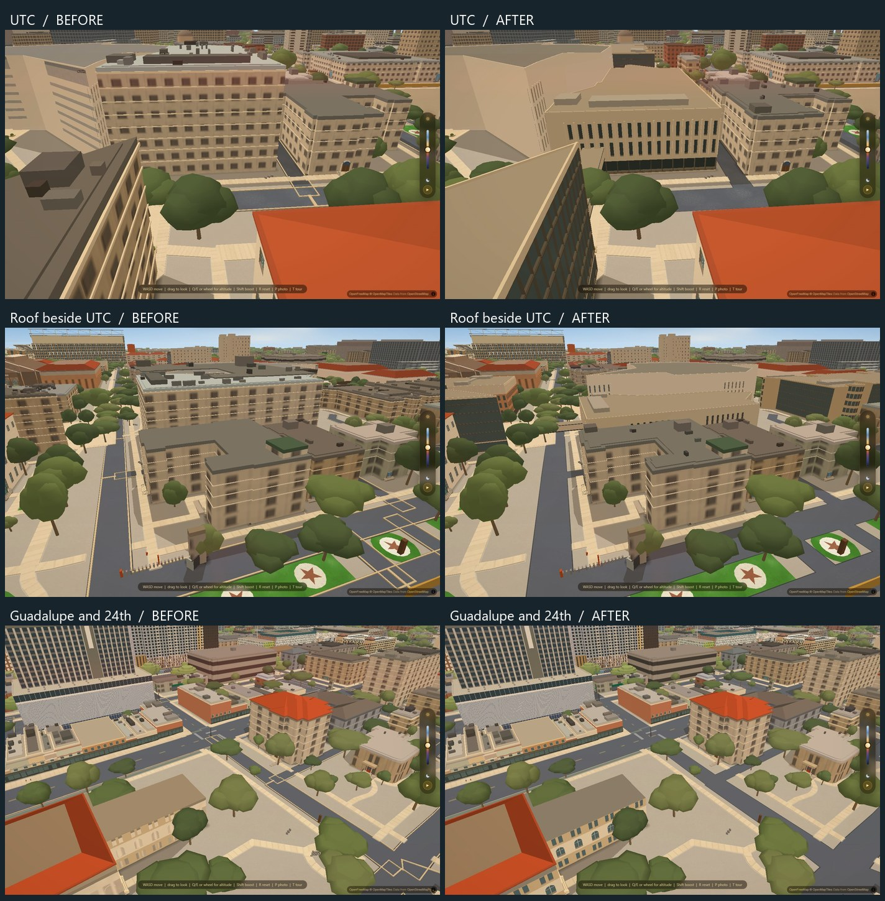
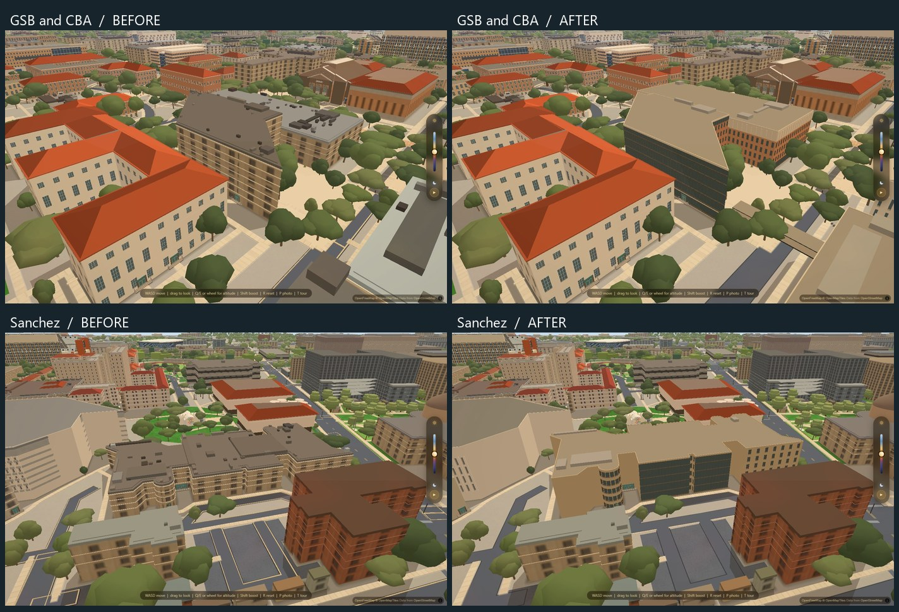

# Campus visual repairs — September 13, 2026

UTC's generic window grid becomes a recessed limestone facade with a dark lobby,
two tall upper opening rows, blank structural piers and the bridge across 21st.
GSB gains its angled glass elevations and brick wing; CBA gets punched brick
windows and a recessed upper row under its cornice; Sanchez gets five visible
storeys, broad glass fields and blank masonry ends around its irregular plan.

## Roofs

University Christian Church's roof deck was baked at 38m although its current
walls end at 16.5m. It now sits on the building's existing 17.5m parapet cap.
The Catholic Center had the opposite defect: its 8.4m deck was buried below its
12.8m walls. That deck now sits at 13.8m. Major and minor equipment move with
each deck, including the streamed PMTiles tier.

`bake_roof_anchors.py` joins decks to current mapped footprints and emits only
`data/roof_anchors.json`. Height guards prevent a later roofscape rebake from
being translated twice. The snapshot workflow refreshes these anchors after
publishing the new manifest. No roof geometry or roof-detail tiles are rewritten.

The engine predicate is polygon distance. The initial `within` predicate was
rejected after viewing: MapLibre supports point and line features there, not
roof polygons ([expression reference](https://maplibre.org/maplibre-style-spec/expressions/#within)). The runtime gate now evaluates the actual predicate against
rendered features, and `--break` substitutes that invalid predicate to ensure
the guard catches it.

Legacy Drag walls and roof caps are also retired for every authored building.
PCL and Texas Union had retained those older surfaces over their replacement
meshes, producing conflicting facade rows and roof edges. The original
surfaces return when the authored-building renderer is switched off.

## Pavement

The earlier ground resolver used narrower road segments as cutters. Thin rims
survived where those segments meet and appeared as cream rectangles and zigzags
across intersections. Hiding the outline alone left physical paving there.

The final ground stage now clips both the raised walking surfaces and their
scoring against the actual rendered road polygons, after the pedestrian malls
have been excluded from those roads. This repairs 1,164 path features and 2,507
texture features, plus 737 raised curb features. The curbs had been drawn
around each road class separately, so their ends crossed adjoining roads.
Clipping the curb geometry against the complete carriageway removes those
remaining outlines. Every other ground feature is unchanged, including roads,
gardens, channels and planted areas. No runtime source or layer is added.

The incremental command is `python scripts/bake_ground.py --resolve-pavement`.
A full ground bake includes the same final stage. The road recipe is now pure;
`scripts/bake_roads.py` owns `data/roads.geojson` separately. Its generated road
features were compared with the shipped road file and are identical. The full
ground regeneration was stopped before writing; this pass uses the incremental
stage over the existing, verified ground inventory.

## Reference and limits

The facade references are UT's exterior photos for [UTC](https://utdirect.utexas.edu/apps/campus/buildings/information/nlogon/maps/UTM/UTC/),
[GSB](https://utdirect.utexas.edu/apps/campus/buildings/information/nlogon/maps/UTM/GSB/),
[CBA](https://utdirect.utexas.edu/apps/campus/buildings/information/nlogon/maps/UTM/CBA/)
and [Sanchez](https://utdirect.utexas.edu/apps/campus/buildings/information/nlogon/maps/UTM/SZB/).
The [College of Education](https://education.utexas.edu/about/campus-buildings/)
also describes the occupied fifth floor of Sanchez.

Mapped footprints are retained. Heights, opening dimensions and unphotographed
elevations are approximations. UTC's below-grade level, exact bridge profile,
business-school entry stairs and the 2026 Sanchez plaza/artwork remain simplified.
All facade proportions, materials and massing choices are editable in
`data/south_campus_profiles.json`; its bake owns only `data/south_campus.json`.

## Verification

- `campus-repairs-data.py` checks the rendered pavement against asphalt around
  campus and West Campus, retains all unrelated ground, and verifies reproducible
  roof anchors and campus models. `--before` fails on the shipped pavement
  crossing the asphalt.
- `campus-repairs-check.mjs` checks real loaded geometry, all three roof layers,
  retirement of UTC's old roof, nearby routes and the night/performance preset.
- `campus-repairs-visuals.mjs` captures matched cameras against `9b9aacb`, freezes
  exposure and time of day, cancels graphics auto-detection, and saves the second
  screenshot. Frames use hardware Chrome at 1440×960 without CPU throttling.

Branch: `codex/campus-visual-repairs`. No Mac-owned or open Drag experiment
code/output is changed. HANDOFF is the only overlap with the older open PRs.
