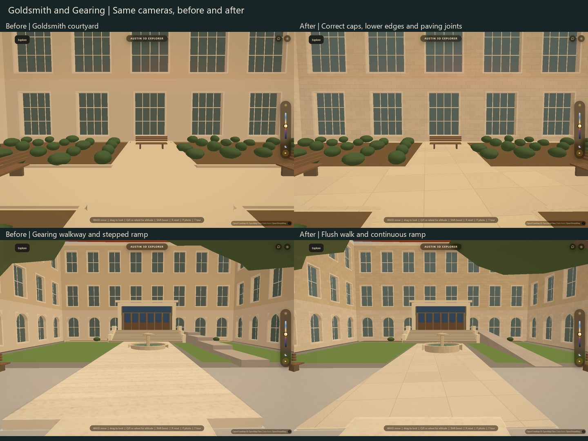
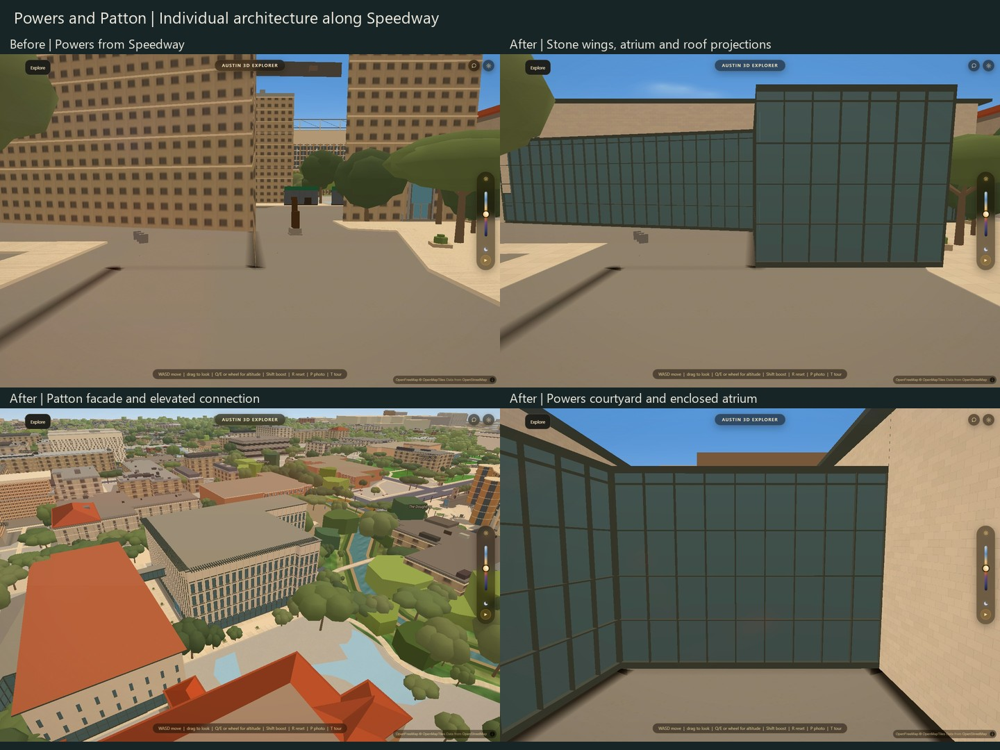

# Campus at walking height

The pilot connects UTC, PCL, Gregory and Speedway, with focused repairs at
Goldsmith and Gearing. Powers and Patton now have individual envelopes instead
of the repeated generic window grid. This is a visual pass; no new app flow.

## Visible changes

- Goldsmith courtyard caps handle repeated closing vertices left by rounded
  geometry. The former index shift made triangles cross the planted panels.
  Lower borders and scored paving keep the paths readable.
- Gearing's interior walk sits near grade. Its four-block entrance ramp becomes
  one continuous plane, retaining the existing outline and upper landing.
- Interior pilot paths use a 25 mm construction depth; road-side paths retain
  a 140 mm curb. The split preserves the existing paved area and road clearance.
  The close concrete treatment uses 1.5 m joints instead of screen-sized strips.
- Campus stone and brick receive restrained coursing and grain. Window panes
  retain their materials when lit at night, and a view-dependent sky tint gives
  glazing more depth. This is an approximate sky response, not scene reflection.
- Recorded trees keep their positions, species and overall scale while gaining
  irregular branch-end crowns. Small push bars follow existing modern door
  leaves in the entrance register; their source confidence is retained.
- Powers has pale stone wings, roof overhangs, a divided glass atrium and the
  elevated connection to Patton. Patton has recessed glazing, tall stone piers,
  dark floor edges and a projecting roof screen. Projecting slabs and the
  bridge have closed undersides; the ground below the bridge stays open.

## Evidence

Matched cameras, 1440 x 960 hardware Chrome, fixed daylight (time parameter 0.12) and exposure and the second
capture. Before is runtime f919494. Scratch frames remain outside the repository. Reproduce with
`VERIFY_URL` and `VERIFY_OUT` set, then run
`node scripts/verify/campus-walking-visuals.mjs`. Point `VERIFY_URL` at the
separately served previous build for a baseline; `WALK_ONLY` accepts a
comma-separated pose list and `WALK_STAGE` labels the output.

The second sheet pairs the west-facing Powers view; its lower row shows two
additional after views of Patton and the Powers courtyard.

## Sources and limits

- [UT Powers exterior photographs](https://utdirect.utexas.edu/apps/campus/buildings/information/nlogon/maps/UTM/WCP/): images 100473462-465 and 100474709.
- [UT Patton exterior photographs](https://utdirect.utexas.edu/apps/campus/buildings/information/nlogon/maps/UTM/RLP/): images 100536570 and 100536843-847.
- [UT Gregory exterior photographs](https://utdirect.utexas.edu/apps/campus/buildings/information/nlogon/maps/UTM/GRE/) and [UT PCL exterior photographs](https://utdirect.utexas.edu/apps/campus/buildings/information/nlogon/maps/UTM/PCL/) for surrounding context.
- [UT landscape project account](https://soa.utexas.edu/news/landscape-first-stringfellow).
- Existing building footprints, tree inventory and entrance geometry in this
  repository. The ramp's old slabs sample a slope at their centres; fitting
  those samples recovers its upper end without inventing a new landing.

The ground remains on the existing flat datum. These heights describe visual
construction depth, not surveyed terrain or accessibility. Powers/Patton floor
heights, roof slopes and unphotographed elevations remain approximate. Downtown,
the broader campus terrain and additional apartment coverage are outside this pass.

## Ownership and controls

`bake_ground.py` alone writes `ground.geojson`. Its `--resolve-walks` stage uses
`pedestrian_geometry.py` and the editable `campus_walk_profiles.json`.
`bake_campus_landscape.py` alone writes `campus_landscape.json`, consuming the
resolved paths, registered doors and ramp slabs. `campus_ramps.py` only computes
geometry. `bake_speedway_buildings.py` alone writes `speedway_buildings.json`;
its dimensions and observations live in `speedway_profiles.json`.

Material strength, coursing, sky response and distance fade are controlled in
`SLOPES.surfaces` and `APARTMENTS.materials`; planting, garden edges and paving
are controlled in `CAMPUS_LANDSCAPE` and the profile JSON. `surfaces=0` disables
the new material shading; the existing campus landscape and slopes switches
restore the original tree, ramp and paving representations.

No Mac-owned or open Drag experiment code/output changes. HANDOFF is the sole
shared documentation overlap with #164/#189. Existing facade/roof fallback
checks are included in verification.

## Verification

Data checks verify unchanged path coverage, repeated level resolution, asphalt
clearance, reproducible building bakes and the retained roof anchors. The
browser gate checks finite aligned material buffers, the physical camera used
for glass, visible/repeatable material changes, texture fallback, preset/night
transitions, courtyard triangulation, the continuous ramp surface and the bridge passage. Its rounded-ring
fixture measures 96 m2 correctly; the original routine produces 106 m2.

The campus-repairs, Guadalupe and campus-everywhere browser checks pass,
including existing roof/facade fallback, all 36 campus halls, courtyard holes,
planting replacement, night and graphics presets. The live-here regression
passes all 19 shipped route pairs, registered buildings, facade references and
both current and original roof-cut cases. Harness-drift and apartment-window-rule
also pass. An intermittent CDN failure interrupted browser loading; the final
route and walking runs use locally cached bytes of the same four pinned CDN assets without
changing app code or relaxing its page-error assertion.
The bridge's upward ray hits its closed underside at 12.4 m; the downward ray
finds no building in the ground passage. The final non-performance gate uses
normal frame pacing; unrestricted frame rate is reserved for `WALK_PERF=1`.

The expensive shared shader and tree shape were measured in six interleaved
hardware runs at 1440 x 960, balanced, with CPU throttling off and vsync/frame
limiting disabled. The minimum per-run median was 22.1 ms with the previous
shader/tree proportions and 22.2 ms with the new treatment. The two new models
and pilot paths remain present in both states: this isolates the shader/planting
cost, not total page-load time or mobile performance.
