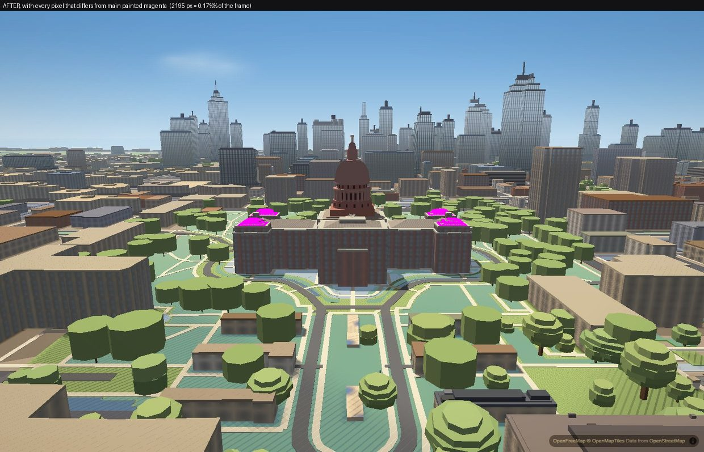
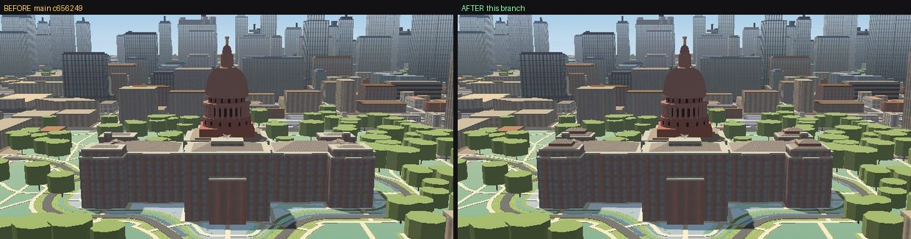
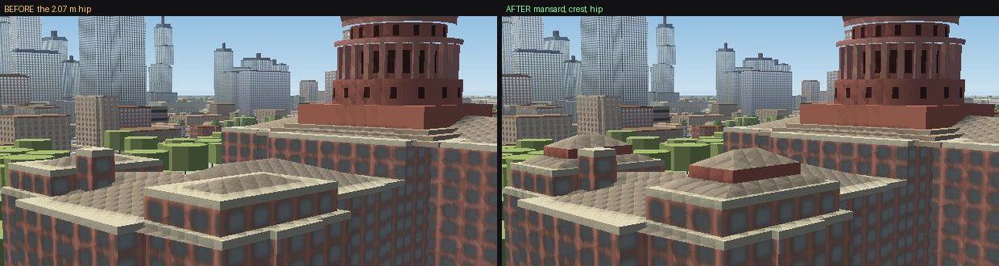
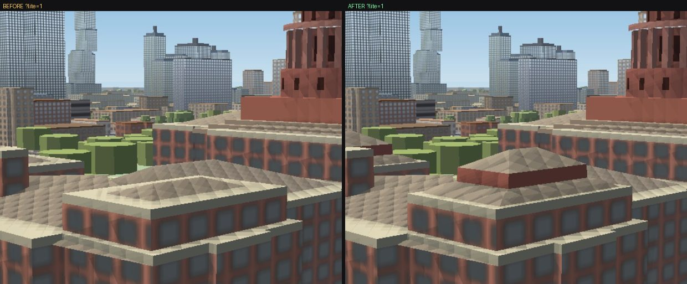
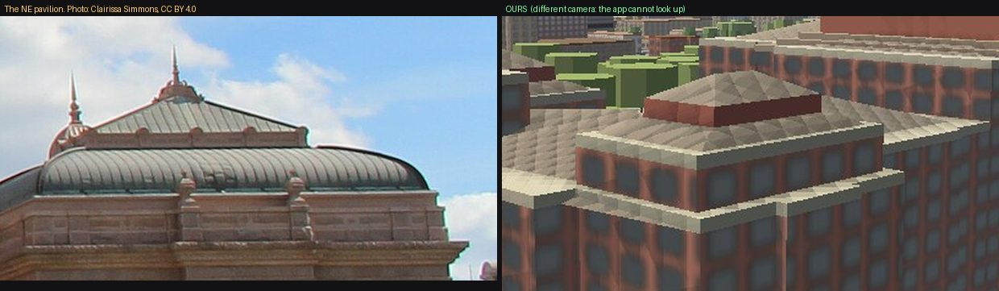

# The Capitol's angled top

Branch `acer/capitol-roof`, 2026-09-19. Reported: *an inaccurate angled top
on the Texas Capitol.* This is the second time. The first report (2026-08-03,
HANDOFF §49) read *"the thing on the top of capitol buildings looks like its
angled"*, and the fix then took a seven-metre stepped skirt off the drum. The
angle survived that fix, because the skirt was not what made it.

## What it was

**The square block under the drum was twisted 17.9° against the building.**

`scripts/bake_capitol.py` builds the attic (the square granite block the drum
stands on, 37.6–42 m) and the three roof-collar steps under it (35–37.6 m) with
`square()`, and `square()` puts its edges on true north and true east. The
Capitol does not stand on that grid. Every long wall of its OSM outline and of
all 13 of its parts runs at **17.9° / 107.7°** — the Congress Avenue grid. So
the one square thing on the roof was the one thing out of square:

| piece | its edges (compass) | the building's edges |
|---|---|---|
| attic, 30.8 m square | 0.0° / 90.0° | 17.9° / 107.7° |
| collar steps, 44 → 35 m | 0.0° / 90.0° | 17.9° / 107.7° |

From the south you saw two faces of the attic at once, which reads as a
sloped red wedge under the drum; from the east and west the collar's corners
stuck out past the 47.7 m-wide centre block over the wings at the same skew;
from above it is a square sitting visibly crooked on a rectangle. The skirt
removed on 2026-08-03 was built from the same `square()` and carried the same
twist. The previous pass measured the dome's **axis** for a lean (0.0 px — the
axis was never the problem) and concluded "angled" meant a slope; nobody
checked the squares' **rotation** against the walls.

How it was found — hiding one piece at a time and painting the suspects
(scratchpad, not committed): hiding the wing roofs, the drum tiers, the cupola,
the parts' roof slabs and the parts' walls each left the wedge in place;
painting `capitol-dome`'s `attic` magenta and `collar` cyan put the wedge
exactly under the paint. Then the edge bearings, straight off the data:

```
collar 35.0  edges [90.0, 0.0]      building parts: edges 107.7 / 17.9
attic  37.6  edges [90.0, 0.0]
```

Nothing else in the stack is out of square: the drum tiers, dome, lantern and
cupola are circles; the wing and pavilion roofs (`rig`) are built on the OSM
outlines themselves; the columns are rotated to face the axis.

### The fix

`ALIGN_TO_GRID` (default `True`) in the bake, and the angle is **derived, not
typed**: `grid_rotation()` takes the length-weighted mean edge direction of the
Capitol's own outline, modulo 90° (the mean is taken on 4× the angle, so a wall
and its perpendicular vote for the same grid instead of cancelling). It reads
**−17.8°** (i.e. edges at 17.9° / 107.9° compass), and the collar and attic are
built on it. Their sizes and heights are unchanged; only their rotation moved.

## And the very top was a cone

The five metres above the lantern (83–88 m) were four discs thinning linearly
from 3.1 m to 0.9 m radius, lathed into a straight 25° cone — a pencil point
on top of the dome. No photograph has a cone anywhere in that stack. What is
there, measured off the Library of Congress telephoto of the lantern (Carol M.
Highsmith, [LCCN 2014632686](https://commons.wikimedia.org/wiki/File:The_Texas_state_capitol_in_Austin_LCCN2014632686.tif),
public domain; 1920 px rendition, silhouette rows against the sky), scaled on
the Goddess of Liberty's own 4.75 m from her feet to the star:

| rows (px) | element | height (m) | width (px → m) |
|---|---|---|---|
| 163–218 | the Goddess, star to feet | 92.2 – 87.5 | — |
| 218–225 | pedestal | 87.5 – 86.9 | 19 → 1.6 |
| 225–258 | **small bell dome, convex** | 86.9 – 84.0 | 20 → 57 (1.7 → 4.9) |
| 258–278 | vertical band with oculi and brackets | 84.0 – 82.3 | 60 → 5.2 |
| 278–292 | lantern cornice (widest) | 82.3 – 81.1 | 81 → 7.0 |
| 292–338 | lantern colonnade | 81.1 – 77.1 | 62 → 5.4 |

The bake now writes a `lathe.cupola` profile (read by `js/slopes-dome.js`
exactly as `lathe.dome` already was — no code change there) between its own
`Z_LANTERN_TOP` 83.0 and `Z_CUPOLA_TOP` 88.0, which span 5.0 m against the
photograph's 5.2 m: a vertical band (1.6 m, r 2.70), a set-back ledge, an
elliptical bell dome from r 2.45 to r 0.85 (vertical at its springing, flat at
its neck), and a 0.7 m pedestal under the Goddess's disc. The fill-extrusion
stand-in (`?slopes=0`, the phone's crash fallback) is five discs off the same
profile instead of four off the cone. The Goddess and her star are unchanged.

## Verified

Hardware GL (ANGLE / RTX 3050 Ti), `?intro=0&drift=0&clip=1`, auto-detect
cancelled, `readyToReveal()` and `slopesDome.count.done` awaited, day
(`p` 0.25), second of two screenshots. BEFORE is main `c656249` with its own
`capitol_dome.geojson`, `slopes-dome.js` and `capitol.js` served in place of
the branch's by route interception; AFTER is the branch. Identical poses.

**The angle, measured on the frame.** Top-down (pitch 0, bearing 0, zoom
18.6), `capitol-dome`'s `attic` painted magenta and `collar` cyan, the
min-area bounding rectangle of each colour's pixels:

```
                    main (before)        this branch (after)      the building's walls
attic   (magenta)   edge 89.7 = -0.3°    edge 17.7°               17.9° / 107.7°
collar  (cyan)      edge  0.0°           edge 17.7°
```

The painted pieces are ours (the paint lands on them and nowhere else), and
the 0.2° left over is the raster: the data's own edges are at 17.9° / 107.7°.


**Close, from 60 m up, 170 m out, square to each facade** — the wedge under
the drum (south, north), the skewed flare over the west wing, and the cone:


**From lower and farther** — 25 m up and 260 m south (about the height of
the office buildings across 11th Street), and the 150 m-up obliques from the
south and east, 400 m out. At 25 m the old attic's corners stuck out past the
pediment on both sides; square, it sits behind it:


From eye level (1.7 m, 150–230 m out, S / SE / N) the attic is behind the
south wing's cornice and the lawn's trees, and the before and after frames
are the same frame. That is why nobody standing on the lawn would see it and
everybody flying the camera does.

**The phone** (`?lite=1`, 390 × 844 at DPR 2, which also applies
`campuslandscape=0` and `preset=performance`; the lathe still runs there —
`slopesDome` 3 parts, 7 wings, 5 drum tiers, done). Same four views,
identical poses:


**The fallback** (`?slopes=0`, what the phone drops to after a crash): the
flat stand-in discs are built by the same bake, so the attic squares up
there too, and the cupola is five discs instead of the four-step taper:


**The lantern's cap**, 100 m up from the south, and from the SE at 70 m,
beside the photograph it was measured from (Carol M. Highsmith, Library of
Congress, public domain — the one photograph in this doc's images):


Not a match to the photograph's detail — the band has no oculi or brackets,
and it takes the dome's colour where the real one is the lantern's stone —
but the silhouette is now a band and a small dome, not a spike.

## What the photographs show that the FIRST pass did not change

Each is written down so the next pass does not rediscover it; none is an
"angle" in the sense reported, and each is a silhouette change a critic
should see before it ships. **The second pass below took the second of
these and left the rest, with a reason for each.**

- **The attic is probably in the wrong place, not just the wrong angle.** The
  seals and the pediment it was modelled on belong to the south pavilion's
  front, ~40 m in front of the drum; the z20 nadir shows the crossing's four
  brown hips running straight into the round drum with no square block around
  it. Removing it means lowering the drum's base tier (`Z_ATTIC_TOP`, the
  `drum` member) to meet the hips — a drum change, not a roof one.
- **The corner pavilions' roofs are curved mansards with small domed turrets**
  (reference 02, 04, 05, 07), taller than the 2.1 m straight hip they carry now.
- **The wings' hips have large flat decks** (skylights, in the nadir and in
  reference 02); the mesh runs them to a ridge at 16.7°. From the street the
  real ones are nearly hidden behind the cornice.
- **Street level** — from the ground, the wings render grey with pale window
  grids at 150 m (they are granite-red from 60 m up); not investigated here.

---

# Second pass, same day: the four corner pavilions

The first pass shipped (PR #269, merged into `main` as 87f6ec4) and its own
list above says the corner pavilions are wrong. They are also *an inaccurate
angled top*, in the plain sense of the report: four straight 16.7° hips where
the building has four curved roofs. So this pass finished them.

## What was there

One `hip_rig` per pavilion at the wings' pitch — `CAP_HIP_PITCH` 0.30 over the
pavilion's 13.8 m span, so **2.07 m** of roof on a 21.5 × 13.8 m block whose
walls stop at 32 m. Before that (until 2026-09-19) it was a four-step pyramid
6.8 m tall that the critics read as "corner wing masses taller than the centre
block ... separate towers" (2026-09-03). The pyramid was replaced by the
flattest thing available rather than by the right thing.

## What is really there, measured

File:Texas_Capitol_Building_-_North.jpg (Clairissa Simmons, CC BY 4.0) at its
**3840 px** rendition — the 1920 px copy the first pass used is too small, the
pavilion is 250 px wide in it and its roof has four parts stacked inside that.
The NE pavilion's north face is square to that camera, so one scale reads both
axes: that face is 21.5 m in the OSM part and spans **390 px → 18.1 px/m**.

| y (px) | feature | m above the parapet |
|---|---|---|
| 1663 | main cornice, top | −2.54 |
| 1617 | parapet top — the roof starts here | 0.00 |
| 1578 | the curb: top of the convex mansard | **+2.15** |
| 1550 | top of the stone crest band on the curb | +3.69 |
| 1515 | apex of the shallow hip above it | **+5.62** |
| 1477 | finial tip (not modelled) | +7.72 |

and in plan, the crest band spans 226 px = 12.46 m of that 21.5 m face, so the
curb ring is the outline **scaled to 0.58 of itself**. The two measurements
check each other: a 26° hip over a ring shrunk that much rises 1.93 m, which is
exactly the 5.62 − 3.69 measured off the silhouette, and the hip's visible
slope in the photograph is 24°. One shrink fraction fits the plan *and* the
height.

Error: the camera is tilted up, so verticals converge — the apex sits 55 px
left of the pavilion's centre. Correcting that lean puts the crest band
centred on the pavilion to within 3 px, which is the check that the 12.46 m is
real. Call the heights ±10%.

## The fix

`PAV_ROOF_PROFILE` in `scripts/bake_capitol.py` (False restores the single
hip). Six `rig` entries per pavilion instead of one, all in the schema
`js/slopes-roofs.js` already reads — **no JavaScript changed in this pass**:

- four frusta for the **convex mansard**, `z(t) = 2.15 · (1 − (1−t)^1.8)`
  against a linear inset to the curb, so it is steep at the eave (38°) and
  flat at the curb (9°) — a bell, not a cone;
- the **crest band**, 1.54 m, granite, on the curb ring, battered 0.10 m;
- a real **hip** on top, no deck, 1.93 m to a ridge at 37.62 m.

`band_rig()` writes a frustum by giving each profile point a ray that is the
whole step to the next ring and a cap of 1: `pts[k] + rays[k]·min(d, caps[k])`
then lands the ring exactly where it should be. That is a use of the schema,
not a change to it, and it is safe only because `js/slopes-dome.js` emits these
with `lines: false` — `roofLines` is the one reader that treats `rays` as
mitres and `caps` as reach, and it never runs here.

Every number above is a module constant, so any of them is a one-line edit.

## Verified

Hardware GL (ANGLE / RTX 3050 Ti), `?intro=0&drift=0&clip=1`, auto-detect
cancelled, `readyToReveal()` and `slopesDome.count.done` awaited, day
(`p` 0.25), second of two screenshots, identical poses. BEFORE is `main`
c656249 with its own `capitol_dome.geojson` served in place of the branch's by
route interception; AFTER is the branch. `slopesDome` reports **7 wing roofs
before, 27 after** on the desktop profile and the same on the phone; no page
errors and no `[slopes-roofs] rig` warnings in any of the four runs.

**Only the four pavilions changed.** Every pixel of the 90 m north view that
differs from `main`, painted magenta — 2 195 px, 0.17% of the frame, in four
clusters, and the four clusters are the four corner pavilions:



The same count for the other poses: 4 clusters at 60 m NE, 2 at the 45 m
macro, 4 at eye level on the north mall. The 150 m SE oblique also shows a
13 592 px blob 1.5 km away in the far city — that is **tile-load
non-determinism between two page loads, not this change**: the crop shows
buildings present in one frame and not yet loaded in the other, and nothing in
this branch can reach them.

**From 90 m over the north mall** — the roofline had four flat corners and now
has four roofs, which is what the drone photograph (reference 02) shows:



**Close, 45 m up and 80 m out from the NE pavilion:**



**The phone** (`?lite=1`, 390 × 844 at DPR 2, which also applies
`campuslandscape=0` and `preset=performance`), same poses:



**Beside the photograph it was measured from.** Not a matched camera — the
app's camera cannot look up, so ours is from 45 m and the photograph is from
the ground:



`python scripts/bake_capitol.py 2026-07-30 --rebake` twice in a row leaves
`data/capitol_dome.geojson` byte-identical, and the other five outputs
untouched.

**Does it read as a tower again?** No. The apex lands at 37.62 m, level with
the crossing collar (`Z_COLLAR_TOP` 37.6), 4.4 m below the attic and 22 m
below the dome's springing; in the 90 m frame the corners read as roofs under
the drum. That was the 2026-09-03 complaint and it is worth re-checking on any
future change to these numbers.

## What is still not right

- **The crest reads dark where the real one reads light.** Its colour is not
  the error: measured against the wall below it, the photograph's crest is
  1.26/1.26/1.33 and ours is 1.26/1.20/1.35. The inversion is that our roof
  metal (`CAP_ROOF`, sampled off a nadir tile and worn by every Capitol roof)
  is *paler* than our granite, while the real patinated metal is *darker* than
  the real stone. Fixing it properly means re-measuring `CAP_ROOF` against a
  photograph rather than a noon nadir tile, which changes the wings too and is
  not this lane's to do. `PAV_CREST_STONE = False` paints the crest in the
  roof metal and the cap becomes one pale mass — a taste call, left to Simeon.
- **No finial and no turret.** The photograph has an ornate finial ~2.1 m
  above the apex and reference 05 shows a small louvred turret with a dome.
  Both are 1–3 px at the distances the app is flown; not invented here.
- **No bell-cast flare.** The real eave turns outward before it rises. The
  model's mansard starts at the wall line.

## What this pass looked at and deliberately did NOT change

- **The wings' "large flat skylit decks"** the first pass wrote down are not
  what the evidence shows. The only frame in the corpus that sees them is
  reference 02 at 889 px, where a wing roof is ~120 px: the planes carry rows
  of skylights and run to a ridge. There is no frame here that demonstrates a
  deck, and the wings are the largest roof surfaces on the building — so they
  keep their hips. Get a real aerial before touching them.
- **The attic under the drum.** The drone frame shows the drum standing on a
  broad, low stone terrace at roof level, with figures on it — not obviously
  the 4.4 m square block the mesh carries from 37.6 to 42 m, and not obviously
  *not* it either. Unresolved at this resolution.
- **Eye level.** From the north mall the pavilions are behind the Capitol
  Extension's above-ground structures, and from the south lawn the lawn's
  trees fill the frame. The pavilion caps do appear in the eye-level diff
  (4 clusters) but nobody standing there would notice them, which is the same
  conclusion the first pass reached about the attic.

## Where things are

- `scripts/bake_capitol.py` — `PAV_ROOF_PROFILE`, `PAV_MANSARD_RISE`,
  `PAV_MANSARD_BANDS`, `PAV_MANSARD_POWER`, `PAV_CURB_FRAC`, `PAV_CREST_H`,
  `PAV_CREST_BATTER`, `PAV_CREST_STONE`, `PAV_HIP_RISE`; `ring_scale()`,
  `band_rig()`, `pavilion_rigs()`, and `hip_rig(..., poly_m=, rise=)`.
- `data/capitol_dome.geojson` — `rig.roofs` goes from 7 entries to 27
  (3 wings unchanged; 4 pavilions × 6). Nothing else in the file moves.
- References: `austin-reference-images/texas-capitol/notes.md` (local),
  which now records the two bigger renditions this pass downloaded.

## Where things are (first pass)

- `scripts/bake_capitol.py` — `ALIGN_TO_GRID`, `grid_rotation()`,
  `CUPOLA_*`, `cupola_profile()`, `cupola_discs()`. Run it as
  `python scripts/bake_capitol.py 2026-07-30 --rebake`; **the date must come
  first** — `--rebake` alone lands in `sys.argv[1]`, which is the snapshot
  date, and silently bakes against an empty snapshot (it emptied
  `capitol_overrides.json` and rewrote `capitol.geojson` the first time this
  pass ran it). With the date, the other five outputs are byte-identical.
- `data/capitol_dome.geojson` — 8 features replaced (3 collar, 1 attic, 4 → 5
  cupola), `lathe.cupola` added; `rig`, `drum`, `lathe.dome` byte-identical.
- References: `austin-reference-images/texas-capitol/notes.md` (local).
