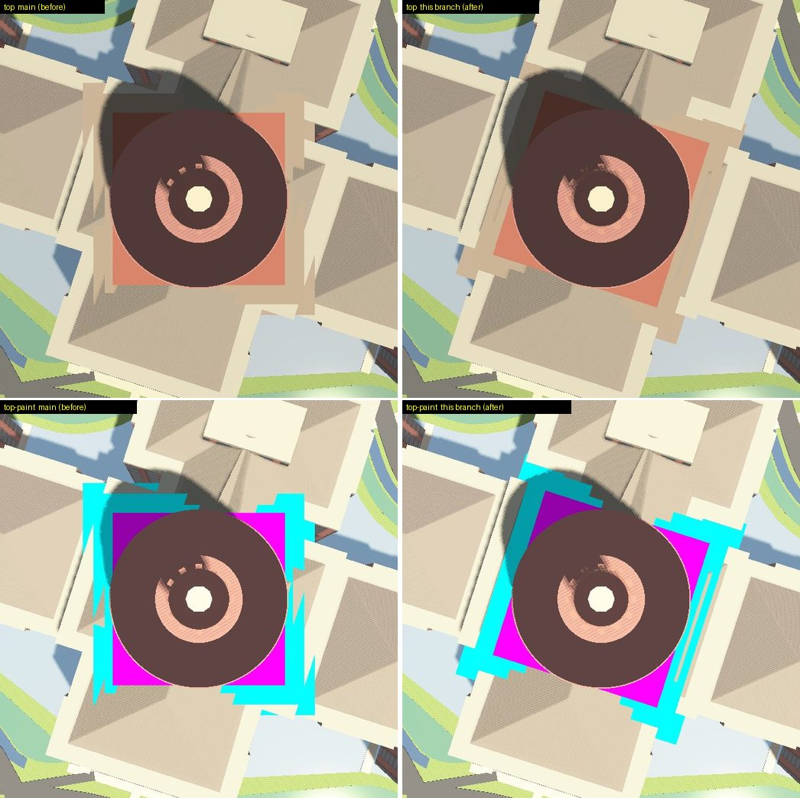
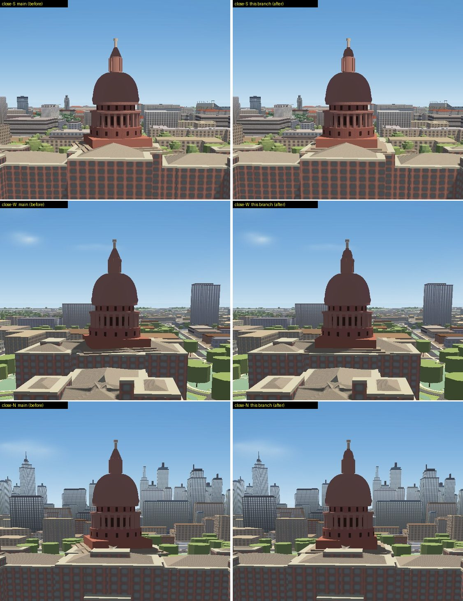
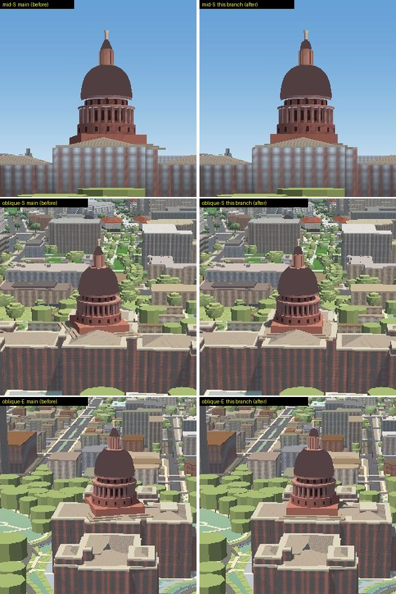
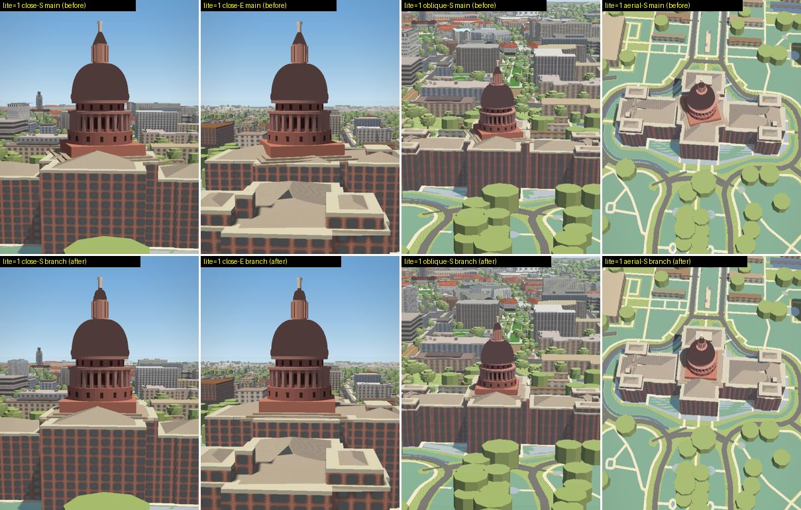
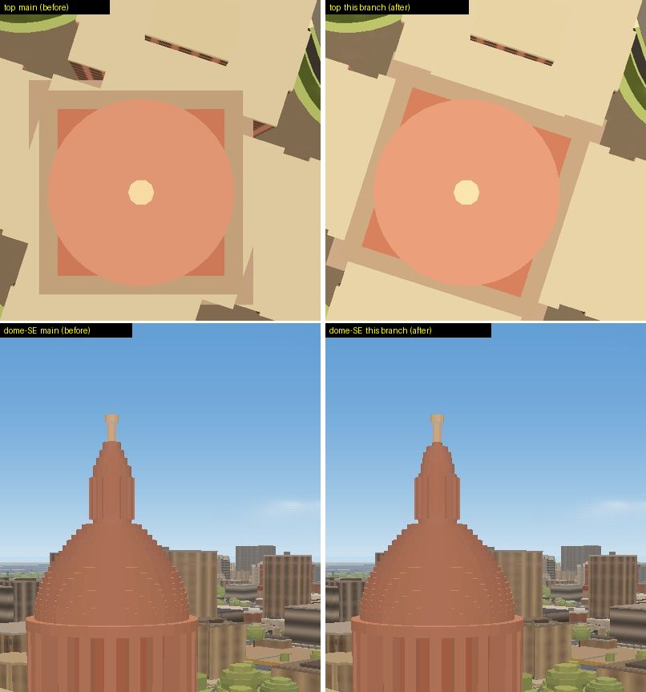
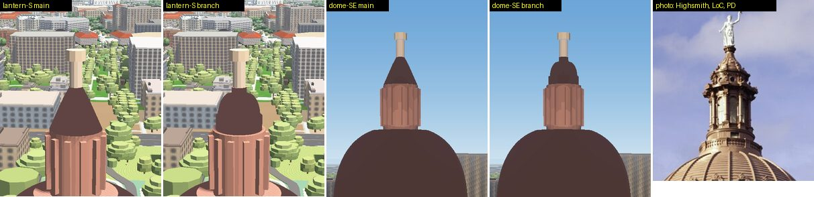

# The Capitol's angled top

Branch `acer/capitol-roof`, 2026-09-19. Reported: *an inaccurate angled top
on the Texas Capitol.* This is the second time. The first report (2026-08-03,
HANDOFF §49) read *"the thing on the top of capitol buildings looks like its
angled"*, and the fix then took a seven-metre stepped skirt off the drum. The
angle survived that fix, because the skirt was not what made it.

## What it was

**The square block under the drum was twisted 17.9° against the building.**

`scripts/bake_capitol.py` builds the attic (the square granite block the drum
stands on, 37.6–42 m) and the three roof-collar steps under it (35–37.6 m) with
`square()`, and `square()` puts its edges on true north and true east. The
Capitol does not stand on that grid. Every long wall of its OSM outline and of
all 13 of its parts runs at **17.9° / 107.7°** — the Congress Avenue grid. So
the one square thing on the roof was the one thing out of square:

| piece | its edges (compass) | the building's edges |
|---|---|---|
| attic, 30.8 m square | 0.0° / 90.0° | 17.9° / 107.7° |
| collar steps, 44 → 35 m | 0.0° / 90.0° | 17.9° / 107.7° |

From the south you saw two faces of the attic at once, which reads as a
sloped red wedge under the drum; from the east and west the collar's corners
stuck out past the 47.7 m-wide centre block over the wings at the same skew;
from above it is a square sitting visibly crooked on a rectangle. The skirt
removed on 2026-08-03 was built from the same `square()` and carried the same
twist. The previous pass measured the dome's **axis** for a lean (0.0 px — the
axis was never the problem) and concluded "angled" meant a slope; nobody
checked the squares' **rotation** against the walls.

How it was found — hiding one piece at a time and painting the suspects
(scratchpad, not committed): hiding the wing roofs, the drum tiers, the cupola,
the parts' roof slabs and the parts' walls each left the wedge in place;
painting `capitol-dome`'s `attic` magenta and `collar` cyan put the wedge
exactly under the paint. Then the edge bearings, straight off the data:

```
collar 35.0  edges [90.0, 0.0]      building parts: edges 107.7 / 17.9
attic  37.6  edges [90.0, 0.0]
```

Nothing else in the stack is out of square: the drum tiers, dome, lantern and
cupola are circles; the wing and pavilion roofs (`rig`) are built on the OSM
outlines themselves; the columns are rotated to face the axis.

### The fix

`ALIGN_TO_GRID` (default `True`) in the bake, and the angle is **derived, not
typed**: `grid_rotation()` takes the length-weighted mean edge direction of the
Capitol's own outline, modulo 90° (the mean is taken on 4× the angle, so a wall
and its perpendicular vote for the same grid instead of cancelling). It reads
**−17.8°** (i.e. edges at 17.9° / 107.9° compass), and the collar and attic are
built on it. Their sizes and heights are unchanged; only their rotation moved.

## And the very top was a cone

The five metres above the lantern (83–88 m) were four discs thinning linearly
from 3.1 m to 0.9 m radius, lathed into a straight 25° cone — a pencil point
on top of the dome. No photograph has a cone anywhere in that stack. What is
there, measured off the Library of Congress telephoto of the lantern (Carol M.
Highsmith, [LCCN 2014632686](https://commons.wikimedia.org/wiki/File:The_Texas_state_capitol_in_Austin_LCCN2014632686.tif),
public domain; 1920 px rendition, silhouette rows against the sky), scaled on
the Goddess of Liberty's own 4.75 m from her feet to the star:

| rows (px) | element | height (m) | width (px → m) |
|---|---|---|---|
| 163–218 | the Goddess, star to feet | 92.2 – 87.5 | — |
| 218–225 | pedestal | 87.5 – 86.9 | 19 → 1.6 |
| 225–258 | **small bell dome, convex** | 86.9 – 84.0 | 20 → 57 (1.7 → 4.9) |
| 258–278 | vertical band with oculi and brackets | 84.0 – 82.3 | 60 → 5.2 |
| 278–292 | lantern cornice (widest) | 82.3 – 81.1 | 81 → 7.0 |
| 292–338 | lantern colonnade | 81.1 – 77.1 | 62 → 5.4 |

The bake now writes a `lathe.cupola` profile (read by `js/slopes-dome.js`
exactly as `lathe.dome` already was — no code change there) between its own
`Z_LANTERN_TOP` 83.0 and `Z_CUPOLA_TOP` 88.0, which span 5.0 m against the
photograph's 5.2 m: a vertical band (1.6 m, r 2.70), a set-back ledge, an
elliptical bell dome from r 2.45 to r 0.85 (vertical at its springing, flat at
its neck), and a 0.7 m pedestal under the Goddess's disc. The fill-extrusion
stand-in (`?slopes=0`, the phone's crash fallback) is five discs off the same
profile instead of four off the cone. The Goddess and her star are unchanged.

## Verified

Hardware GL (ANGLE / RTX 3050 Ti), `?intro=0&drift=0&clip=1`, auto-detect
cancelled, `readyToReveal()` and `slopesDome.count.done` awaited, day
(`p` 0.25), second of two screenshots. BEFORE is main `c656249` with its own
`capitol_dome.geojson`, `slopes-dome.js` and `capitol.js` served in place of
the branch's by route interception; AFTER is the branch. Identical poses.

**The angle, measured on the frame.** Top-down (pitch 0, bearing 0, zoom
18.6), `capitol-dome`'s `attic` painted magenta and `collar` cyan, the
min-area bounding rectangle of each colour's pixels:

```
                    main (before)        this branch (after)      the building's walls
attic   (magenta)   edge 89.7 = -0.3°    edge 17.7°               17.9° / 107.7°
collar  (cyan)      edge  0.0°           edge 17.7°
```

The painted pieces are ours (the paint lands on them and nowhere else), and
the 0.2° left over is the raster: the data's own edges are at 17.9° / 107.7°.



**Close, from 60 m up, 170 m out, square to each facade** — the wedge under
the drum (south, north), the skewed flare over the west wing, and the cone:



**From lower and farther** — 25 m up and 260 m south (about the height of
the office buildings across 11th Street), and the 150 m-up obliques from the
south and east, 400 m out. At 25 m the old attic's corners stuck out past the
pediment on both sides; square, it sits behind it:



From eye level (1.7 m, 150–230 m out, S / SE / N) the attic is behind the
south wing's cornice and the lawn's trees, and the before and after frames
are the same frame. That is why nobody standing on the lawn would see it and
everybody flying the camera does.

**The phone** (`?lite=1`, 390 × 844 at DPR 2, which also applies
`campuslandscape=0` and `preset=performance`; the lathe still runs there —
`slopesDome` 3 parts, 7 wings, 5 drum tiers, done). Same four views,
identical poses:



**The fallback** (`?slopes=0`, what the phone drops to after a crash): the
flat stand-in discs are built by the same bake, so the attic squares up
there too, and the cupola is five discs instead of the four-step taper:



**The lantern's cap**, 100 m up from the south, and from the SE at 70 m,
beside the photograph it was measured from (Carol M. Highsmith, Library of
Congress, public domain — the one photograph in this doc's images):



Not a match to the photograph's detail — the band has no oculi or brackets,
and it takes the dome's colour where the real one is the lantern's stone —
but the silhouette is now a band and a small dome, not a spike.

## What the photographs show that this pass did NOT change

Each is written down so the next pass does not rediscover it; none is an
"angle" in the sense reported, and each is a silhouette change a critic
should see before it ships.

- **The attic is probably in the wrong place, not just the wrong angle.** The
  seals and the pediment it was modelled on belong to the south pavilion's
  front, ~40 m in front of the drum; the z20 nadir shows the crossing's four
  brown hips running straight into the round drum with no square block around
  it. Removing it means lowering the drum's base tier (`Z_ATTIC_TOP`, the
  `drum` member) to meet the hips — a drum change, not a roof one.
- **The corner pavilions' roofs are curved mansards with small domed turrets**
  (reference 02, 04, 05, 07), taller than the 2.1 m straight hip they carry now.
- **The wings' hips have large flat decks** (skylights, in the nadir and in
  reference 02); the mesh runs them to a ridge at 16.7°. From the street the
  real ones are nearly hidden behind the cornice.
- **Street level** — from the ground, the wings render grey with pale window
  grids at 150 m (they are granite-red from 60 m up); not investigated here.

## Where things are

- `scripts/bake_capitol.py` — `ALIGN_TO_GRID`, `grid_rotation()`,
  `CUPOLA_*`, `cupola_profile()`, `cupola_discs()`. Run it as
  `python scripts/bake_capitol.py 2026-07-30 --rebake`; **the date must come
  first** — `--rebake` alone lands in `sys.argv[1]`, which is the snapshot
  date, and silently bakes against an empty snapshot (it emptied
  `capitol_overrides.json` and rewrote `capitol.geojson` the first time this
  pass ran it). With the date, the other five outputs are byte-identical.
- `data/capitol_dome.geojson` — 8 features replaced (3 collar, 1 attic, 4 → 5
  cupola), `lathe.cupola` added; `rig`, `drum`, `lathe.dome` byte-identical.
- References: `austin-reference-images/texas-capitol/notes.md` (local).
