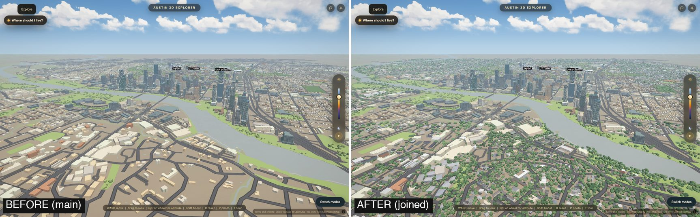
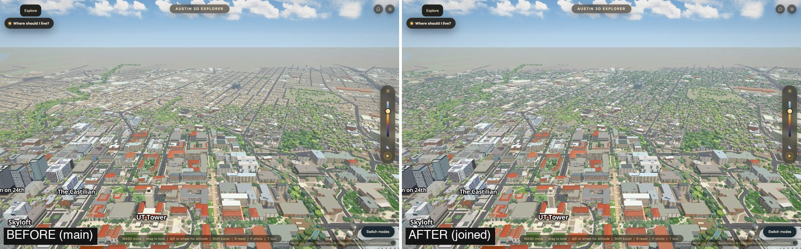
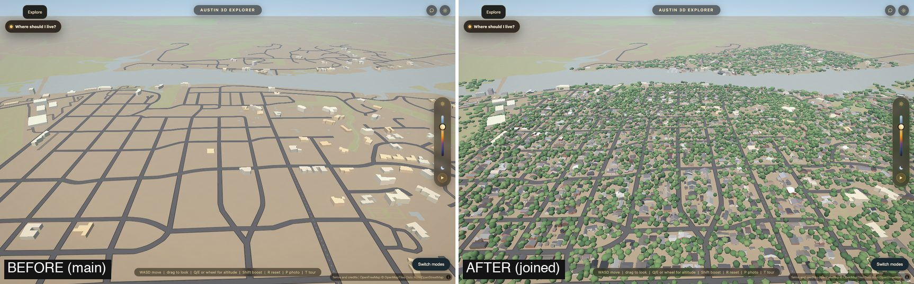
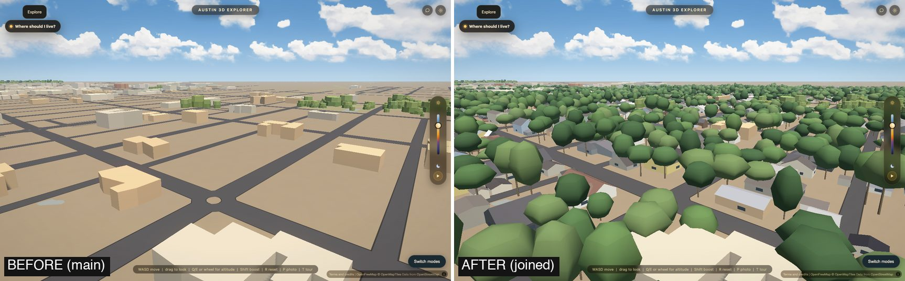
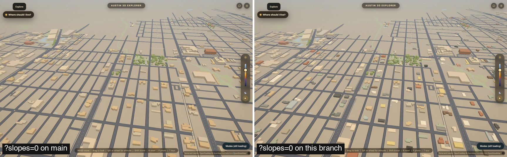
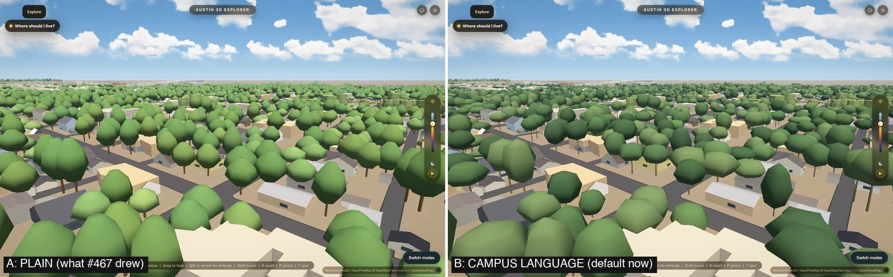
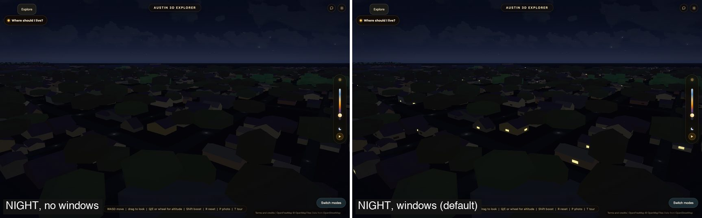
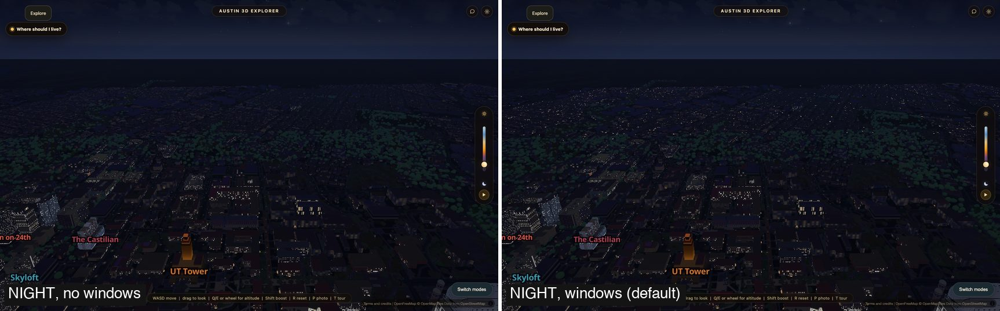

# The joined city: downtown and the outer city in one branch

Branch `mac/city-join`, 2026-10-10. It joins three pieces of work that each
changed `data/outer_ring.geojson` and `data/tiles/outer.pmtiles`:

- **downtown** (`mac/downtown`, #462): every downtown building's shape from the
  2021 laser scan. Write-up: `docs/downtown-accuracy.md`.
- **the houses** (`mac/outer-city`, #466) and **the trees** (`mac/outer-trees`,
  #467) of the outer city. Write-ups: `docs/outer-homes.md`,
  `docs/outer-trees.md`.

and adds four things on top: a gate for phones, a look for the trees that
follows the campus trees, windows that light at night, and the measurements
that say neither side lost anything in the join.









Every camera is made up; none is a photograph's. "Before" is `main`.

## How it was joined

The ring file is one line of JSON and the tile archive is binary, so git cannot
merge either. Both are rebuilt, in this order, from downtown's file:

```
python scripts/bake_outer.py --downtown-only     # downtown's bodies; byte-identical to its branch after the next step
python scripts/bake_outer_facades.py
python scripts/bake_outer.py --homes-split       # 4,882 house-sized boxes outside downtown leave the ring; 164 are raised
tippecanoe ... -x fp -x use -x fa -x fw -x lv -x yr data/outer_ring.geojson    # the `outer` line of scripts/tile.sh
```

`scripts/bake_outer.py` keeps both lanes' code (`settle_green`, PASS F and
`--downtown-only`; `apply_homes_split` and `--homes-split`); a full bake runs
downtown first and the split last. Only the `outer` archive was rebuilt, with
`scripts/tile.sh`'s own flags; the other four archives are untouched.

**One real overlap was found and fixed.** Downtown is the City's nine Downtown
Austin Plan districts, which reach past the rectangle the houses layer treated
as downtown (south to the lake shore below Rainey Street). Eleven buildings
there were drawn by both lanes or taken from downtown's ring. The houses bake
now stays out of the districts (`outer_homes_lib.excluded_building`), treats
downtown's stacked pieces as buildings, and never lists a box in another
lane's area for removal.

## Neither side lost: the numbers, side by side

All **measured**, each lane's own script, on each branch's own data and on the
joined data.

**Downtown** (`python scripts/verify/downtown-accuracy.py`):

| | `mac/downtown` | joined |
|---|---:|---:|
| buildings the ring draws | 652 | 652 |
| ... hand-modelled / measured from the scan / generic | 25 / 569 / 58 | 25 / 569 / 58 |
| missing | 12 | 12 |
| extra | 6 | 6 |
| median roof-height error (586 buildings) | 0.4 m | 0.4 m |
| within 2 m | 94 % | 94 % |
| median "volume agrees" per building | 92 % | 92 % |
| downtown as one solid: volume agrees | 78.7 % | 78.7 % |
| coplanar pairs in the ring file (`coplanar.mjs --gate`) | 372 | 371 |

Every one of the script's 56 numbers is equal. `data/outer_ring.geojson` after
the first two steps is byte-identical to the downtown branch's file.
`scripts/verify/downtown-data.py` passes; the coplanar gate passes (one pair
fewer: a twin outline in the low-rise ring went with its box).

**The outer city** (`python scripts/measure_outer.py`; truth: City of Austin
Building Footprints 2023 and the 2021 scan):

| | `main` | `mac/outer-trees` | joined |
|---|---:|---:|---:|
| City buildings in the outer city | 37,612 | 37,625 | 37,612 |
| present | 15.6 % | 93.8 % | 93.8 % |
| missing | 31,740 | 2,318 | 2,315 |
| extra drawn pieces | 56 | 1,619 | 1,615 |
| height error, every building, a missing one counted 0 m | 5.64 m | 1.21 m | 1.20 m |
| roof flat or pitched, right (147 blind labels, set 3) | 6.8 % | 98.0 % | 98.0 % |
| buildings in the houses layer | none | 39,820 | 39,807 |
| ground under tree cover: the scan says 38.0 % | 2.4 % | 34.6 % | 34.6 % |
| trees in the trees layer | none | 196,109 | 196,109 |

The 13 fewer City buildings are the ones inside downtown's districts, which are
downtown's to answer for now.

## Bytes (measured, the joined result against `main`)

On the wire: the tile archive as it is (compressed inside), text as `gzip -9`,
and the two new `.bin` files as each host compresses them (see below).

| File | `main` | joined, GitHub Pages | joined, Vercel |
|---|---:|---:|---:|
| `data/tiles/outer.pmtiles` | 2,392,254 | 1,469,057 | 1,469,057 |
| `data/outer_homes.bin` (new; 645,424 on disk) | 0 | 424,689 | 414,554 |
| `data/outer_trees.bin` (new; 369,866 on disk) | 0 | 142,269 | 137,827 |
| `js/outer-homes.js` (new) | 0 | 14,339 | 14,339 |
| `js/outer-trees.js` (new) | 0 | 10,444 | 10,444 |
| `js/mobile.js` | 13,335 | 13,747 | 13,747 |
| `index.html` | 5,984 | 6,181 | 6,181 |
| `data/outer_tower_palette.json` | 1,151 | 1,151 | 1,151 |
| **Total** | **2,412,724** | **2,081,877** | **2,067,300** |

**331 KB smaller than `main` on GitHub Pages, 345 KB on Vercel.** On their own
branches the archive was 2,367,623 bytes (downtown) and 1,492,898 (outer). The
two new files are fetched whole, after the loading veil lifts; a phone fetches
only the houses file.

**The two files are stored uncompressed, and that is a decision.** They used to
be gzip inside, opened in the page with `DecompressionStream`, which Safari
before 16.4 does not have. Both live hosts already compress a `.bin` on the
wire (checked 2026-10-10 on a served `.pmtiles`: Vercel answers
`content-encoding: br`, GitHub Pages `gzip`; their levels were found by
matching served sizes of three files: brotli quality 3, gzip about level 5).
Wire bytes of the two files together: own gzip -9 packing 560,012 on either
host; stored raw 552,381 on Vercel and 566,958 on GitHub Pages. Within 2 %
either way, so the design that needs no feature test wins. A host that did not
compress `.bin` would send 1.0 MB.

## Phones and weak chips

`node scripts/verify/outer-budget.mjs` (new; a measurement, not a gate) reports
per layer what is built, what is drawn at each camera, and the buffer bytes.
**Measured** on Intel Iris Plus 655 through desktop Chrome; the phone column is
Chrome's phone emulation (390 x 844, DPR 3, `?lite=1`), **not a phone**.

| | desktop (balanced preset) | phone tier |
|---|---:|---:|
| **Houses** built | 53,761 rectangles | 8,119 (15 %) |
| triangles a house | 20 (windows) | 14 (no windows) |
| triangles drawn, spawn view | 315,960 in 41 draws | 4,228 in 13 draws |
| triangles drawn, highest view | 657,260 in 76 draws | 10,528 in 24 draws |
| vertex buffers on the GPU | 2.26 MB | 0.34 MB |
| kept in JavaScript | 0.65 MB file + 2.26 MB copies | 0.65 MB file (copies freed on upload) |
| **Trees** built | 196,109 | none |
| triangles drawn, spawn view | 196,648 in 43 draws | 0 |
| triangles drawn, over Tarrytown | 766,352 in 13 draws | 0 |
| triangles drawn, highest view | 0 (below zoom 14, where the campus trees start too) | 0 |
| vertex buffers on the GPU | 6.48 MB | 0 |
| kept in JavaScript | 0.37 MB file + 6.48 MB copies | 0 |
| `data/outer_homes.bin` fetched | once, after the veil | once, 0.07 s after the veil lifted |
| `data/outer_trees.bin` fetched | once, after the veil | **never** |

**The gate** is three lines of the phone memory budget in `js/mobile.js`
(`LITE.budget`), read at parse time like every other line of it:

| Line | Phone tiers | What it does |
|---|---|---|
| `outerHomes: 0.15` | phone, lighter | a phone builds the biggest 15 % of each chunk's houses: about what the ring drew before this layer took its house-sized boxes (4,889 of 39,807), so it loses no building it had and gains their roofs. `0` = none, and the file is never fetched. |
| `outerHomeWindows: false` | phone, lighter | no windows (6 fewer triangles a house) |
| `outerTrees: false` | phone, lighter | no outer trees and no fetch. A phone drew no back-yard tree before either. A number is the share built. |

On the desktop the houses follow the "City beyond campus" slider (performance
preset: 0.45) and the trees the tree density slider (0.52 / 0.675 / 1);
`?homes=0`, `?homewindows=0` and `?outertrees=0` switch each off and skip its
fetch. `outer-budget.mjs --phone --budget outerHomes=0` (the budget line set
to 0 for one run), run once: **neither file is fetched** on the phone tier.

**Whole-page memory on the phone profile** (`mobile-memory.mjs`, `main` against
the join, three interleaved reps, minimum and range, MB):

| | `main` | joined |
|---|---:|---:|
| phone (JS heap + array buffers + every WebGL byte), peak | 1,235 [1,235 to 1,283] | 1,197 [1,197 to 1,251] |
| the same, settled | 658 [658 to 659] | 662 [662 to 759] |
| WebGL bytes, settled | 392 | 393 |

So with the gate the page is where it was: 4 MB more once settled, and the peak
is inside the run-to-run range. That is desktop Chrome pretending to be a
phone. `mobile-boot.mjs` (the phone boot gate; needs a graphics card) has not
been run on this branch here; it is dispatched on AWS after the push.

**Frame time, houses and trees, desktop** (Intel Iris Plus 655, 1440 x 900,
default preset, six interleaved reps, the minimum; load average 9, so read the
differences, not the absolutes):

| Camera | houses off -> on | trees off -> on |
|---|---:|---:|
| over a neighbourhood (Hyde Park / Tarrytown) | 20.0 -> 22.3 ms | 17.3 -> 22.9 ms |
| Hyde Park, low | 16.4 -> 18.4 ms | 15.8 -> 18.3 ms |
| campus looking north | 64.8 -> 68.8 ms | 63.2 -> 64.2 ms |
| like the spawn pose | 60.0 -> 64.0 ms | 59.2 -> 60.7 ms |

**A distance cull for the trees.** A chunk now draws one of three templates by
its distance from the eye: every tree with a trunk within 900 m; every fourth
tree at twice the width to 3 km; every sixteenth at four times the width
beyond. The ground covered is the same at each step.

## Nobody gets less city than `main`

The houses layer took 4,882 house-sized boxes out of the ring. Where the
three.js scene is off (the phone's `safe` tier, `?slopes=0`, three.js not
loaded, a lost scene) it cannot draw them back. So there `js/outer-homes.js`
draws plain MapLibre boxes instead, from the same file, with the ring's own
colour-by-the-hour rule and each house's own wall colour: flat tops, no
windows, no new download. Which buildings: the ring's own
kind of rule (footprint at least 100 m2 + 150 m2 per km from the core or
downtown; `OUTER_HOMES.flat`), so they stand where the ring's stood. That is
6,790 buildings, and **98.5 % of the boxes `main` drew get a box back on the
same spot** (most of the rest are outlines the 2021 scan found nothing on). The
boxes follow the same "City beyond campus" density as the ring.



`scripts/verify/outer-count.mjs` counts the outer city's buildings in five ways
of opening the page, on `main` and on this branch, and fails if any is lower.
**Measured**:

| Case | `main` | this branch | drawn how |
|---|---:|---:|---|
| desktop, default | 5,977 | 40,904 | 1,097 ring boxes + 39,807 houses in the scene |
| phone `safe` tier (`?lite=safe`) | 2,535 | 3,843 | 788 ring boxes + 3,055 plain boxes |
| `?slopes=0` | 5,977 | 7,887 | 1,097 ring boxes + 6,790 plain boxes |
| phone tier (`?lite=1`) | 2,535 | 3,700 | 788 ring boxes + 2,912 houses in the scene |
| no `DecompressionStream` | 5,977 | 40,904 | as the default: the files are no longer packed |

The phone rows are at the phone's own density (0.45) on both sides.
`outer-count.mjs --break` switches the houses off and fails all five, as it
must. The check runs in CI against `outer-count-baseline.json` (main's five
numbers, written by `--main URL --write-baseline`).

## The trees' look: the owner's call



- **A, plain**: what #467 drew. One smooth hexagonal crown, one green from
  `js/timeofday.js`'s canopy colours. `?outertreestyle=plain`.
- **B, campus language** (the default on this branch): the campus trees' crown
  from `js/campus-landscape.js` (#464) as far as one instance a tree allows: a
  ball with five lobes pushed out of it in the vertex shader from the tree's
  own seed, each ring of it one flat tone, in that file's four leaf colours,
  and four crown shapes by seed. A campus tree is six such crowns on limbs;
  this is one with deeper lobes (0.20 against 0.12).

Every number is in `OUTER_TREES` (`js/outer-trees.js`): `style`, `campus.leaf`,
`campus.lobeDepth`, `campus.forms`, `radius`. B costs 70 triangles a near tree
against 52.

## Night

Before, the outer city at night was a black field beside a lit campus. Now
every house has three windows (INFERRED, like its wall colour: no source says
where a house's windows are), a third of the houses have a light on, and a lit
window is drawn larger with distance (up to its own wall) so that a light
stays a light from far away.





`OUTER_HOMES.windows`: `litShare` 0.34, `litPerHouse` 0.6, `glowMetres` 500,
`on` (`?homewindows=0`). Off on the phone tiers.

## Sources and licences

| Used for | Source | Licence |
|---|---|---|
| Outlines, outer city | Overture Maps buildings (96 % OpenStreetMap, 4 % Microsoft ML Buildings) | ODbL; CDLA-Permissive-2.0 |
| Outlines, downtown | OpenStreetMap; City of Austin 2023 structures where it has none (see `docs/downtown-accuracy.md`) | ODbL; City of Austin |
| Heights, roof shapes, which buildings stand, the tree cover, downtown's massing | StratMap Bexar & Travis Counties Lidar 2021, TxGIO | CC0-1.0 |
| Roof colour, outer city | City of Austin 2025 aerial | copyright City of Austin, no licence grant found; one colour per building is read, no pixel is shipped |
| Downtown's district boundary | City of Austin, Downtown Austin Plan Districts | CC0-1.0 |
| Measuring only | City of Austin Building Footprints 2023 | no licence grant found; nothing from it is in the app's outer-city data |
| Tree crown shape and leaf colours | this repo's `js/campus-landscape.js` | ours |

The owner's photographs were not used.

## Checks run on the joined data

`downtown-accuracy.py`, `downtown-data.py`, `coplanar.mjs --gate`,
`measure_outer.py`, `harness-drift.mjs`, `suite-lint.mjs` (no browser);
`outer-count.mjs` (five cases against `main`);
`outer-homes.mjs` (14 assertions) and `outer-trees.mjs` (11) on hardware GL.
All pass. Pictures with the outer city or downtown in frame will move.

## What is still wrong

1. **Not seen on a real phone.** Every phone number here is desktop Chrome's
   emulation. The gate keeps the page where it was; whether a phone can afford
   more houses, or the far trees, needs a phone.
2. **Walls and windows are a guess** (colour by area mix, three windows a
   house), and there are no doors, porches or fences. At night there are no
   street lights anywhere outside the core.
3. **The big outer buildings are still flat tan boxes**: the 981 house-sized
   boxes the ring kept and every apartment block, school and shop outside
   downtown. Downtown's method (levels from the scan) would fit them.
4. Where the three.js scene is off, the houses that come back are plain boxes
   and the trees do not come back at all (`main` drew none there either).
5. 8,662 complex roofs are one gable; trees have no species; one tree per 10 m
   cell is a count for the cover, not a census.
