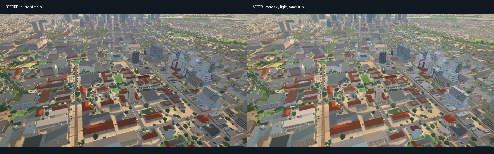

# Sky fill and citywide night

Branch: `codex/sky-fill-night`. Brighter campus fill accepted by the owner.
The lighting is enabled in the normal application, with the existing time
slider; the study page only provides comparisons and diagnostics.

## What changes

The same sky fill reaches MapLibre and authored buildings. The night clock
follows the sun below the horizon, so materials reach their night state during
twilight instead of staying sunset-coloured until the end of the slider.
Windows emit their source colour instead of being multiplied by blue moonlight.
Authored buildings have stable, distinct room occupancy and warm/cool room
colours; adjacent panes share a home. Signs can be explicitly luminous.

The first reference-specific additions are Waterloo lettering and amenity
glazing, plus downlights at Waterloo and the two Union buildings. The light
falloff affects nearby surfaces, in either building renderer. Frost's existing
crown geometry receives white architectural lighting. Its model shape is
unchanged. Night bloom preserves smaller highlights and uses a tighter halo;
background sky and clouds are less saturated and fewer stars show over the city.
Bloom now samples after the completed map render. Previously it could retain
a sunset-coloured capture over a stationary night view until the next move.

Streetlight discovery follows the camera beyond campus. It keeps nearby lamps,
loads new roads on movement, deduplicates points, and stops rewriting the source
when nothing changes. Its work is bounded to a 2.2 km radius, the city bounds,
and the existing point cap. Streetlight colours are warm white. Their opacity and radius are reduced from
the older street-only treatment: the old pools washed out road markings and
spilled over the lake once coverage reached downtown. Sidewalk pools now draw
after raised paving. Their locations
are sampled from road lines, not surveyed poles.

## Ground-light depth

The first raised-pavement version failed the wall check: 877 pixels in the
near-wall rectangle changed when the street pools were hidden. MapLibre 5.24's
`draw_circle.ts` uses `getDepthModeForSublayer`, which disables depth testing for
2D layers above the first 3D layer. Moving a glow later in the stack therefore
illuminated sidewalks but also painted across the base of an unrelated wall.

The adapter gives the seven known ground-light layers the same 3D depth range
as buildings, with depth writes disabled. A circle vertex uniform lifts those
pools to 0.25 m, just above the 0.22 m paving slab; other circle layers retain
normal MapLibre behavior. The drawing-method override is scoped to each lamp
call and restored even when drawing throws. The actual wall test also disables
this depth treatment deliberately, to prove it can detect the original overlap.
This uses the already pinned 5.24 shader contract; diagnostics report a changed
contract rather than silently accepting a different upstream shader.

## Controls and limits

- `CityLighting.balance`: accepted sky and roof fill.
- `CityNight.tune`: room palette, occupancy ranges, dusk timing, emission,
  wall readability, fixture budget/gain and night bloom.
- `CityNight.crown`: public model-space binding for Frost's illuminated crown.
- Building JSON `night`, storefront overrides and sign `light`: see
  [the apartment schema](apartments.md#shared-night-profiles).
- `NIGHT_TUNE`: streetlight spacing, colour, view radius and point cap.

This is a source-based approximation, not global illumination. Deck lights
have directional/range falloff but no independent shadow maps or reflection
probes. The distant city still uses repeated facade atlases, so those buildings
retain material-level occupancy patterns; the 196 authored buildings use their
own profiles. Rooftop source placement is an approximation from exterior
references, not surveyed fixture positions. The owner photos and rooftop
viewpoint remain private and are not committed. The public comparison poses
are illustrative, not calibrated replicas of that private camera.

## Findings from the continuation review

The inherited pass had several cross-system gaps: ground, entrances and some
facades still used the older dusk ramp; a closed storefront could retain a bright
night colour and emit anyway; delayed road tiles lost streetlight extension mode;
and the DKR shader still referenced the shared clock that had been renamed.
These paths now share the clock or retain the required compatibility uniform.
City uniforms are allocated before subclass materials copy the dictionary.

The desktop loading deadline also discarded healthy authored builds. During this
pass, a real load hit the 90-second cutoff and then finished all 196 buildings at
159 seconds with no group left to display. The deadline now releases the veil
while allowing the existing atomic handoff to finish, using the behavior already
established on phones. A deterministic deadline test covers both device paths;
the actual desktop integration run subsequently completed the 196-building group
after a 124-second build, with `modelLate` and no terminal fallback.

The cross-project review confirms that the recent phone fallback, intro camera,
Capitol roof, creek ripple, shadow, roof-cap and graphics-setting fixes are on the
main baseline. The lidar dataset is present but is not yet a renderer input.
That follow-up must resolve footprint identity and old flight dates before it
moves any geometry. Physical iPhone verification remains a separate device check.
The next requested visual pass is tracked in [QUEUE.md](../QUEUE.md): downtown comparisons
against the owner's local late-night photographs, including building accuracy.

## Verification

Use `dev/citywide-sunlight.html` on the real application. `Night checks` compares
emission on/off, confirms unchanged sunset pixels, counts actual mesh colour
variants, and reports shader/GL errors. `Break emitters` must make that check
fail. `Sources off` disables the shared night shader/clock but does not rebuild
room geometry or restore the previous sky/road palette; it is not a main-branch
baseline. Before/after images must use the saved main baseline instead.

Text gates: `node dev/city-night.test.mjs`, `node dev/night-coverage.test.mjs`,
`node dev/night-materials.test.mjs`, `node dev/night-rooms.test.mjs`,
`node dev/late-authored.test.mjs`, `node dev/night-depth.test.mjs`,
`node scripts/verify/harness-drift.mjs`, and
`node scripts/verify/apartment-window-rule.mjs`.

The actual-app integration is `scripts/verify/city-night.mjs`, with `VERIFY_URL`
pointing to the server and `VERIFY_OUT` to a scratch folder. `--break` removes
emission and must fail the rendered-image assertion. `--lite` checks a narrow
viewport and the lite renderer, not a physical phone. The older
`night-lights.mjs` now checks configured opacity and valid layers; the image test
owns the occlusion assertion instead of pretending layer indices prove it.
The comparison harness also rejects an unknown `--only` selector even when
another selector is valid, so a misspelled skyline route cannot silently vanish.

The [desktop report](verification/city-night-desktop.json) passes all checks:
unchanged raw sunset pixels, visible emission, the 88-section DKR shader variant,
ground-light occlusion, pavement illumination and no browser/GL/shader errors.
The near-wall source difference is now zero pixels; deliberately disabling depth
testing restores the 877-pixel overlap. The [emission sabotage](verification/city-night-emission-break.json)
fails only the emission assertion, with zero source difference and no browser errors.

The desktop timing uses a 1440 x 900 balanced scene at render scale 1, real
NVIDIA RTX 3050 Ti hardware and no CPU throttle. One warmup pair is discarded;
three interleaved pairs of 24 synchronous `map.redraw()` / `gl.finish()` frames
give minima of 93.89 ms with shared night sources off and 95.93 ms on, a 2.04 ms
increment. This isolates those sources in the same night scene. It is neither
interactive FPS nor total main-versus-branch cost. The room geometry, sky and
street-light changes remain present on both sides of that timing test.

The [lite report](verification/city-night-lite.json) passes the same sunset,
emission and DKR checks at a 393 x 852 viewport, performance preset and 0.75
render scale. This is desktop Chrome running the lite renderer, not an iPhone
performance claim. The deliberately broken emitter run uses that same lite path.

Verification tooling is excluded from the data workflow's push trigger so a
browser-check edit cannot create a new city snapshot behind a visual comparison.
Pipeline script edits still trigger a bake; workflow-only edits use the existing
manual dispatch when a rebuild is wanted.
