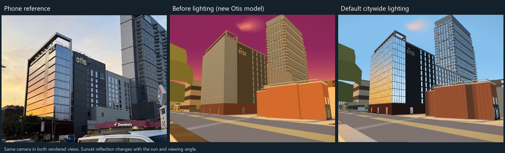
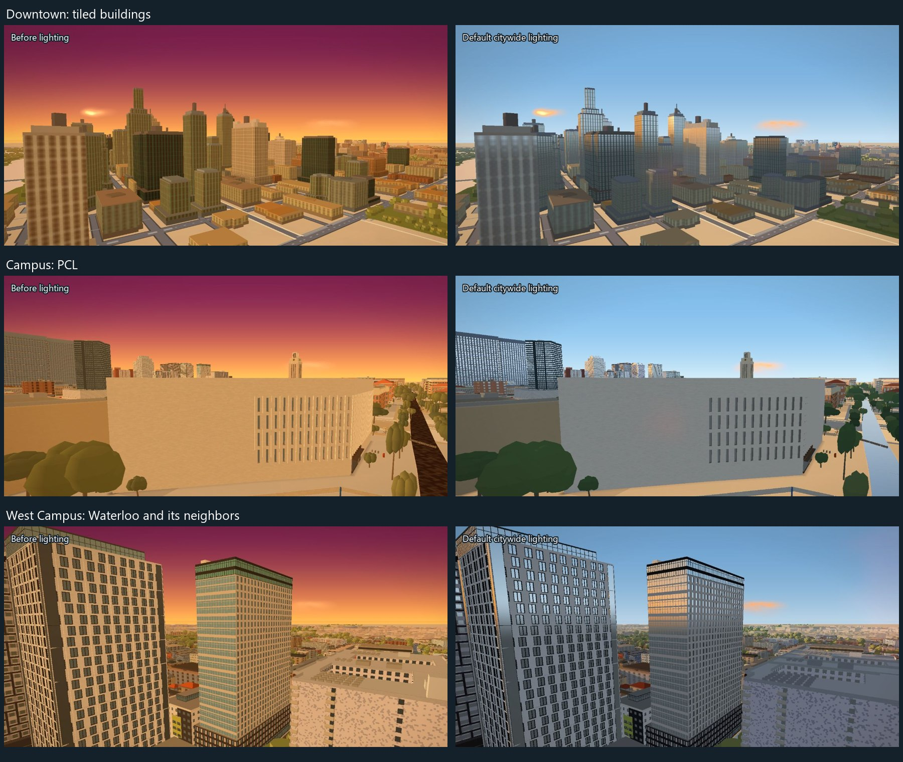

# Citywide sunlight and Otis

Branch: `codex/citywide-sunlight`, September 19, 2026.

The previous two-building, opt-in study missed the requested scope. Sunlight is
now on by default across the authored meshes and MapLibre building extrusions.
Window reflections, directional wall light and building-to-building shadows
share the same sun, camera and material shader. There is no building-name or
neighborhood allowlist. The regular Graphics menu exposes **Window reflections**
(100% on every preset) and **Building shadows**. The time slider controls when
the warm sunset reflection appears; daylight remains cooler and night keeps its
existing lights.

The two rendered panels keep the new Otis geometry and camera identical to
isolate the lighting change. They are not an old-model/new-model comparison.
Otis previously had an unmeasured 6.6 m base prism; it now has its eleven-story
hotel mass, slanted south curtain wall, east glass return, dark brick sign wall,
lower AC wing and open rooftop frame. The footprint comes from the loaded
snapshot. Absolute height and unseen setbacks remain estimates (about +/-3 m),
with provenance beside the geometry in `data/apartments/the-otis-hotel.json`.

## Implementation and maintenance

`js/city-lighting.js` owns the GLSL used by both rendering paths. The MapLibre
adapter targets the pinned 5.24 shader contract and instruments only that map's
WebGL context. Compiler/link errors are reported in `CityLighting.stats.failures`.
When upgrading MapLibre, run the browser checks and inspect both ordinary tiled
buildings and authored meshes; syntax checks alone cannot verify this adapter.

Facade atlas painters mark actual glass in alpha (191 versus opaque 255),
preserving RGB. The extrusion shader decodes that material mask and restores
the original opaque facade/layer opacity. The existing wrap filter now filters
the mask with the color so mullion edges stay aligned. Older band atlases use
their published drawing dimensions to identify glazing. Masonry, roof surfaces,
garage mouths and open concourses are not classified by color brightness.
The smaller glass paths are tagged too: Bass and Moody atlas panes, health-school
windows, Tower shaft glazing, arched transoms, Gregory gable sashes and the
stadium's authored curtain walls all use the shared material response.

Two nested shadow maps follow the camera's map center, covering 240 m and
1,400 m radii. Actual authored geometry casts shadows; ordinary loaded building
footprints supply depth-only proxies, including streamed outer-city tiles.
Detailed building parts replace parent prisms. Geometry changes, tile changes,
camera travel and the time slider invalidate the cache; a parked scene reuses it.
The shared GL bindings and viewport are restored before the other renderer runs.
A complete fallback texture keeps reflections independent of shadow-map creation.

Taste settings are in `SLOPES.sunlight`; the reflection slider scales
`reflectionStrength`. Broad amber near the sun's horizon fades toward blue at
higher reflected elevations. Fresnel response and the direct sun highlight move
with the view. These are analytic sky/sun reflections: nearby buildings and
trees are not rendered into the glass. Windows absent at a distant geometry LOD
cannot acquire detail from a lighting shader. Shadows soften and fade beyond
the far map; streamed areas only cast from loaded data. Ground, trees and roads
keep their existing renderers.

## Verification

Serve with `python scripts/serve.py PORT`, then open
`/dev/citywide-sunlight.html`. It embeds the real `index.html`, without a sunlight
opt-in flag. Otis, downtown, PCL, Waterloo and Callaway are selectable. Before/
After changes lighting in the same session. Day/Sunset/Night, a second angle,
the actual application controls, pixel checks and six interleaved benchmark
repetitions are available. Auto-detect is cancelled; captures wait for the real
loading veil and use the second settled screenshot.

Text checks: `node dev/pattern-lowpass.test.mjs` (48 RGBA cases checked against
independent direct convolution), `node scripts/verify/harness-drift.mjs`
(45 matching scripts), `node scripts/verify/apartment-window-rule.mjs`, JavaScript
syntax and `git diff --check`.

Browser results and timing settings are recorded in
`docs/citywide-sunlight-checks.json`. The pixel checks exercise both the reflection
and shadow controls, sun-direction coherence, stable shadow caching, unchanged
night pixels, successful shader compilation and a clean GL error state. A
runtime lighting-off benchmark retains the adapter, so it measures the added
shading cost, not the adapter's entire cost relative to an old checkout.

## Lane handoff

The Mac's stadium bake/output and the existing open decision PRs are untouched.
`HANDOFF.md` is shared with open PRs #164 and #189, so this document records the
pass and branch without editing their file. The Drag painter is likewise left
alone; the shared adapter reads its published dimensions. No data rebuild or
snapshot refresh is needed for this rendering/model change.
