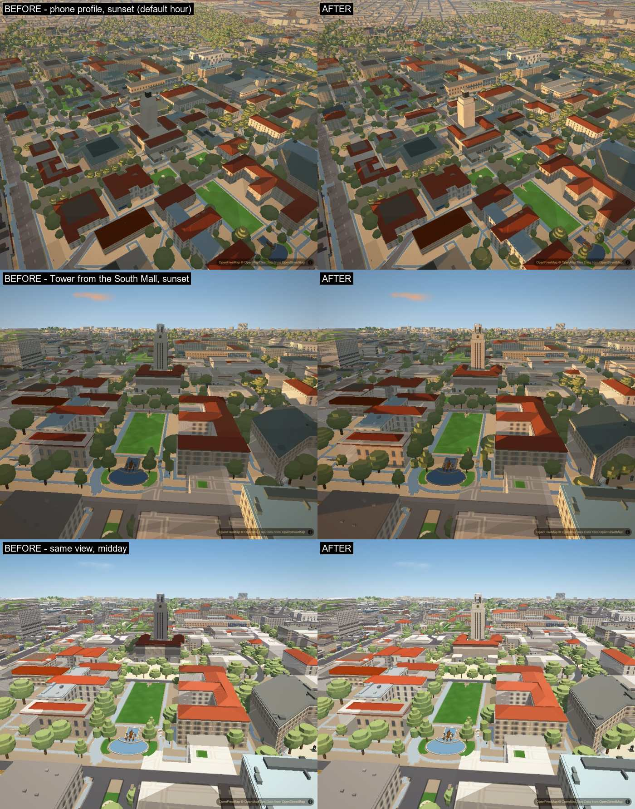
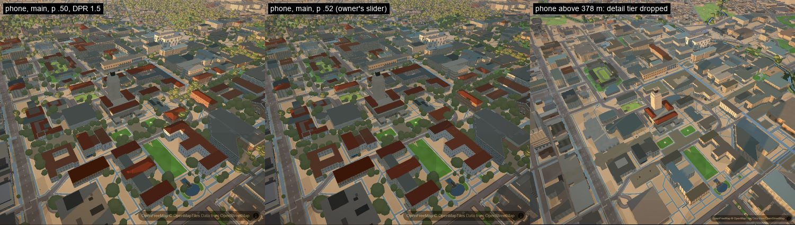
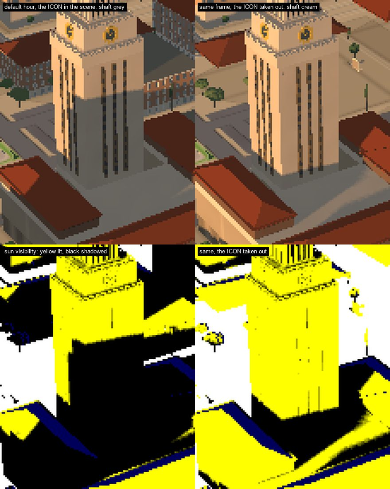
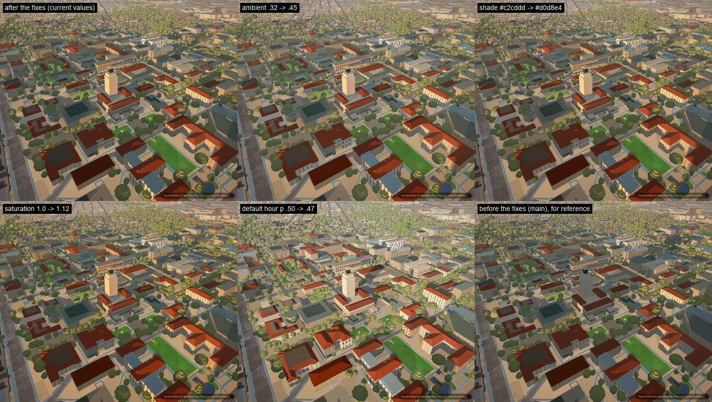
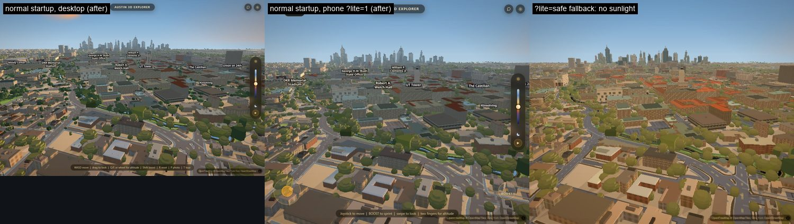

# Why campus looked dark after the sunlight change

Branch `acer/dark-campus`, 2026-09-19. Diagnosis of the owner's campus frame
(the phone screenshot with the joystick and BOOST button), measured in the real
app. Two shadow bugs are fixed here. Everything to do with taste is left
to Codex and set out as measured options at the end. The new look stays the
same: warm sun, cool shade and strong glare on windows.



## The short answer

1. **Which build it was.** The owner's frame is the **phone profile**
   (`?lite=1`: the `performance` preset with campus planting off) on the
   current production build (before these fixes), at the **default hour or
   just after it** (`p` 0.50-0.52, the sun 4-6 degrees up in the
   west-south-west), with the new sunlight **on**, on a screen with about 1.5
   device pixels per CSS pixel. A render with exactly that setup matches his
   frame's brightness and colour within 1-7 luma. The "flat prisms" are the
   pitched roofs under a 4-6 degree sun: both slopes get almost the same dim
   light, so they read flat. They are **not** the phone's detail drop, which
   removes the red roofs and the trees altogether (measured). The fallback
   phone mode (`?lite=safe`) and the desktop default do not match. See
   [section 1](#1-which-profile-made-the-owners-frame).
2. **Hidden buildings still cast shadows. Fixed.** Six passes replace a
   legacy building with their own model and hide the old box: the Tower, the
   hero buildings, the Drag, arts, Moody and West Campus. The hidden boxes
   stayed in the sun's shadow map, and the models replacing them cast
   nothing. The worst is the hidden "UT Tower" box, **94 m tall over the
   whole 79 x 87 m Main Building**: the Tower and the Main Building roofs sat
   in its shadow at every hour (sun-facing Main Building roofs at midday:
   visibility **0.44**, now **0.98**), and at the default hour it laid a
   shadow about 900 m long across campus.
3. **Lit surfaces shaded themselves (shadow acne). Fixed.** Every shadow
   lookup was offset by the same 9 cm, so any surface tilted toward the sun
   fell into its own shadow. At midday, when very little on campus is truly
   shaded, sun-facing campus pixels averaged **0.77-0.82** visibility; now
   **0.93-0.95**. Downtown, where nothing is hidden, the share of sun-facing
   pixels in shadow at midday drops from 0.24 to 0.04.
4. **The rest is not a bug. It is how the new lighting behaves at the
   default hour.** With the sun 6 degrees up, most visible walls get only the
   shade term: `ambient 0.32` times the cool `shade` colour. That comes out
   near **0.55 x albedo**, where the old lighting gave about 0.75. A flat roof
   gets only a tenth of the direct term. The opening camera (`INTRO.end`,
   bearing 202) also looks toward the sun, so only **6 %** of the walls in the
   first frame are sunlit. None of the fixes change this. It is a taste decision; see
   [section 5](#5-options-for-codex-measured-not-merged).
5. **Checked and ruled out:** flipped normals, MapLibre's own light
   double-counting, the ground-shadow layer darkening walls, and a preset
   quietly switching the lighting off. One real gap: the crash fallback
   `?lite=safe` gets no sunlight at all
   ([section 6](#6-profiles-and-presets)).

## 1. Which profile made the owner's frame

The owner's screenshot is `C:/Users/simip/AppData/Local/Temp/codex-clipboard-fca62b1d-424d-4777-bef5-6b13703d09b2.png`.
It is a phone original, so it is referenced here and not committed. I rendered
the same view in each profile and compared pixel statistics over the same crop
(x 150-860, y 90-640, with the UI excluded). "Chroma" is the mean of
max(R,G,B) minus min(R,G,B).

| frame | mean luma | p10 | p50 | p90 | chroma |
|---|---:|---:|---:|---:|---:|
| owner's screenshot | 89.8 | 47 | 88 | 143 | 26.5 |
| **phone `?lite=1`, main, `p 0.52`, 1.5 px per CSS px** | **89.4** | 51 | 83 | 136 | 26.1 |
| phone `?lite=1`, main, `p 0.50`, 1.5 px per CSS px | 94.5 | 51 | 88 | 147 | 29.5 |
| phone `?lite=1`, main, `p 0.50`, 1 px per CSS px | 96.7 | 52 | 93 | 149 | 30.3 |
| phone above 378 m (detail tier dropped), after the fixes | 114.5 | 80 | 107 | 159 | 26.9 |
| desktop default (balanced), main | 115.2 | 62 | 113 | 183 | 32.4 |
| crash fallback `?lite=safe` (no sunlight) | 118.9 | 81 | 117 | 157 | 71.4 |

The phone profile on the current build is the closest match on every column.
The fallback mode is twice as colourful and warm (the old golden-hour look).
The joystick and BOOST button do not prove it was a phone, because the desktop
also shows them below about 1000 px wide. Two details of his frame pin the rest
down:

- **Screen scale.** His slider, buttons and labels are about 1.5 times the size
  of mine at the same 966 x 820 image, so his screen had about 1.5 device
  pixels per CSS pixel (a CSS viewport near 644 x 547). Rendering that way,
  the match tightens from 96.7 to 94.5 luma at the same hour.
- **Hour.** His slider handle sits about 52 % of the way down the track (mine,
  at the default 0.50, sits at 51 %), and it has the orange ring the handle
  shows while it is being touched. Between `p 0.50` and `0.52` the sun sinks
  from 6 to 4 degrees and the frame darkens from 94.5 to 89.4 luma; at 0.52
  every column is within 1-7 of his. I cannot tell 0.50 from 0.52 more
  precisely from a screenshot.

**The flat prisms.** His frame shows dark red roofs with no visible slope and
dark round trees. I first suspected the phone's detail drop: `js/lod.js`
removes its `mid` tier (`roofs-pitched`, the three.js roofs, `trees-canopy`,
roofscape) when the eye is above the preset's detail distance plus 8 %:
**378 m on the phone's `performance` preset (350 m)**, 756 m on desktop
`balanced` (700 m). Measured, that is not it: above 378 m the red roofs and
the trees disappear completely and the city turns into grey boxes, 25 luma
brighter than his frame (right-hand image below). With the tier kept, the same
view at 4-6 degrees of sun reproduces his frame: the pitched roofs are there,
but both slopes get almost the same dim light, and on the current build most
of them also sit in the ghost shadow described in section 3 (70-83 % of
sun-facing pixels in this view are in cast shadow at `p 0.50-0.52`).



## 2. How it was measured

- **The real app.** It runs with `?intro=0&drift=0&clip=1` and graphics
  auto-detect cancelled. The phone profile is `?lite=1` in a 966 x 820 touch
  context. Desktop is 1200 x 800 on the balanced preset. The browser is
  hardware Chrome (ANGLE / D3D11) under `gpu-run.mjs`. Readings are taken only
  after the loading veil lifts and `slopesApartments.readyToReveal()` returns
  true. "Before" serves `origin/main`'s `js/city-lighting.js` to the same
  page, so before and after differ by that one file.
- **Per-pixel breakdown.** A debug branch is added to the shared GLSL at the
  top of `cityShade`, **inside the page only**, by wrapping
  `WebGLRenderingContext.shaderSource`. It reaches both the MapLibre extrusion
  shaders and the three.js meshes. The same frame is then rendered in several
  modes: the surface normal, the sun visibility and facing that the shader
  computed, the albedo, whether the surface faces the camera, and the world
  position. The buffer is read inside a MapLibre `render` event, taking the
  second of two renders. Trees, ground, props and the aerial fog are hidden
  only for the debug passes, and their previous visibility is restored exactly
  afterwards. The building mask comes from those passes, so the ground and sky
  are never counted.
- **Classes.** Roof means normal z above 0.6. Wall means |normal z| below 0.35,
  sorted into eight compass directions. A wall is "lit" when it faces the sun
  and its visibility is above 0.5. "Old look" means the same frame with
  `SLOPES.sunlight.on = false`. The luma figures are from the raw frame, before
  the CSS grade. Graded full-frame figures are given where the grade is the
  subject.
- **Views.** The owner's view (north-east over the Tower). The default opening
  view (`INTRO.end`). The Tower from the South Mall looking north. PCL from the
  west. The West Mall and Texas Union looking east. Speedway looking north.
  Downtown as a control. Each at `p 0.50` (the default, sun 6 degrees
  west-south-west) and `p 0.25` (midday, sun 64 degrees south-south-east).
  Together they cover walls facing every compass direction.

## 3. The bugs, measured

Phone profile, raw frame luma of building pixels only (0-255), matched views.
"Before" is `origin/main`. The other columns change one thing in the same page:
cast shadows off, only the acne fix (the committed shader change, injected), or
only the ghost casters removed (an in-page proxy without the hidden prisms).

| view | hour | old look | before | no cast shadows | acne fixed only | ghosts removed only | sun-facing px shadowed: before / acne fixed / ghosts removed |
|---|---|---:|---:|---:|---:|---:|---|
| owner's view | 0.5 | 117 | 91 | 112 | 93 | 100 | 0.68 / 0.64 / 0.36 |
| owner's view | 0.25 | 126 | 128 | 136 | 132 | 131 | 0.15 / 0.07 / 0.10 |
| Tower from South Mall | 0.5 | 111 | 87 | 103 | 88 | 95 | 0.65 / 0.61 / 0.23 |
| Tower from South Mall | 0.25 | 126 | 132 | 140 | 137 | 135 | 0.13 / 0.05 / 0.07 |
| West Mall / Union | 0.5 | 113 | 82 | 113 | 84 | 96 | 0.79 / 0.77 / 0.41 |
| West Mall / Union | 0.25 | 113 | 109 | 114 | 112 | 111 | 0.09 / 0.04 / 0.05 |

### Bug 1: hidden buildings still cast shadows

Six passes replace a legacy building with their own model and hide the old
box: the Tower, the hero buildings, the Drag, arts, Moody and West Campus.
Those hidden boxes were still in the sun's shadow map. The worst is the hidden
"UT Tower" box, **94 m tall over the whole 79 x 87 m Main Building
footprint**. Inside it the Main Building roofs sat in shadow at every hour,
and at the default hour it cast a shadow about 900 m long across campus.
Meanwhile the models that replace those boxes cast no shadow at all.

Removing only the hidden boxes from the shadow map more than halves the share
of sun-facing pixels in shadow at the default hour on the owner, Tower and
West Mall views (table above, last column). The committed fix goes further:
`shadowProxy` now builds from what is actually drawn.

- Scene buildings that `buildings-3d`'s filter hides (the shared
  `['!',['in',['get','id'],['literal',ids]]]` clause) are skipped. How many is
  not a fixed number: it counts the hidden footprints in the tiles currently
  loaded, so it grows as passes register and as the camera pulls in more tiles.
  Measured 73-77 on a bare boot and **224** over campus once every pass has
  loaded, out of 11,570 ids in the clause. The count is published as
  `CityLighting.stats.shadowProxyHidden`, and the verify script only requires
  it to be non-zero.
- The replacement passes cast. Those are `austin-tower`, `austin-heroes`,
  `austin-drag`, `austin-arts`, `austin-moody` and `austin-westcampus`, each
  queried through its visible layers' own display filters. Parts, stadium
  decks and details that no layer draws no longer cast either.
- `base` is now read as well as `b`. Before, parts and stadium decks were
  treated as standing on the ground. (Heroes and arts use `b` for a building
  key such as `'gdc'`, so only a finite number counts.)

### Bug 2: lit surfaces shaded themselves (shadow acne)

The 3x3 filter reaches about 1.9 texels from the receiver. A surface tilted
theta from the sun changes depth by tan(theta) per texel. A texel is 0.31 m on
the near map and 1.82 m on the far map. So the fixed 9 cm offset let every
tilted lit face shade itself. The shadow lookup is now offset
`2 texels x sin(theta)` along the normal. The texel size is read from each
map's own matrix, so the fix follows `shadowRadii` and `shadowSize` if they
change. A face pointing straight at the sun keeps the small constant offset,
so its contact shadows stay. Downtown is the cleanest control because nothing
there is hidden: at midday the share of sun-facing pixels in shadow drops from
0.24 to 0.04.

### The Tower shaft, checked pixel by pixel

The shaft is where the ghost box did the most visible harm, so it was checked
by world position (the debug pass writes each pixel's position, and only
pixels on the shaft's own faces are counted). Desktop, the default hour,
after both fixes, authored apartments not loaded, three page loads and two
views:

| shaft height | 16-24 m | 24-32 m | 32-40 m | 40-48 m | 48-56 m | 56-62 m |
|---|---:|---:|---:|---:|---:|---:|
| south face, sun visibility | 0.00 | 0.80-0.81 | 0.98-1.00 | 0.98-0.99 | 0.97-1.00 | 0.96-1.00 |
| west face (owner's view) | 0.00 | 0.68 | 0.99 | 1.00 | 0.99 | 0.98 |

Before the fix the whole shaft sat inside the 94 m box (0.00-0.07). The
shadow left at its foot is real: a ray cast from the shaft toward the sun hits
the Main Building's own hipped roof (the three.js `slopes-tower` roof, ridge
about 29 m) 10-11 m away, and nothing else. Above 32 m every ray reaches the
sky. The shaft now reads cream in the sun at the default hour instead of grey
(image at the top).

**Sometimes the shaft is shaded at the default hour, and that is correct.**
In some page loads the south face read as shadowed up to about 48-52 m, with a
slanted edge. It happens exactly when the authored apartments load (the app
drops them for the visit when they miss the 90 s handoff ceiling, which on
this loaded machine was about half the time). The caster is the authored
**ICON** tower (2200 San Antonio St, 30 storeys, 93.6 m), about 390 m
west-south-west of the Tower and within 15 m of the sun line through it. At 6
degrees a 93.6 m building shades everything up to 93.6 - 390 x tan 6 = 52 m.

I did not leave that as arithmetic. Rays cast from the shaft's south and west
faces toward the sun all hit the same three.js group, `slopes-apartments`, at
365-390 m, at world points that fall inside the ICON's own footprint (its ring
is 359.6-390.1 m west and 61.3-93.4 m south of the Tower). Taking that one
group out of the scene and rebuilding the proxy in the same page, at the same
camera, lifts the shaft from **0.35 to 0.88** mean visibility, and the shadow
edge sits exactly where the geometry puts it, between the 48 and 56 m bands:

| shaft band | 16 m | 24 m | 32 m | 40 m | 48 m | 56 m |
|---|---:|---:|---:|---:|---:|---:|
| south face, ICON in the scene | 0.00 | 0.01 | 0.01 | 0.02 | 0.29 | 1.00 |
| south face, ICON taken out | 0.00 | 0.80 | 1.00 | 0.99 | 1.00 | 1.00 |
| west face, ICON in the scene | 0.00 | 0.26 | 0.45 | 0.45 | 0.63 | 0.98 |
| west face, ICON taken out | 0.00 | 0.68 | 0.99 | 1.00 | 0.99 | 0.98 |

The 93.6 m is the top of the ICON's tallest block in `data/apartments/icon.json`
(its roof deck is at 87.1 m), not a guess. The 16 m band stays dark in both
columns because that is the Main Building's own hipped roof, 10-11 m away.



That is the new lighting doing what it should, so the verify script checks the
shaft at midday, not at the default hour.

### Before and after, every view

Phone profile, both fixes, building pixels only.

| view | hour | old look | before | after | after, no cast shadows | sun-facing px shadowed before → after | lit / shaded walls after |
|---|---|---:|---:|---:|---:|---|---|
| owner's view | 0.5 | 117 | 91 | 96 | 112 | 0.68 → 0.54 | 144 / 93 |
| owner's view | 0.25 | 126 | 128 | 135 | – | 0.15 → 0.03 | 140 / 101 |
| opening view | 0.5 | 107 | 92 | 93 | 96 | 0.33 → 0.23 | 130 / 90 |
| opening view | 0.25 | 123 | 125 | 127 | – | 0.09 → 0.02 | 124 / 97 |
| Tower from South Mall | 0.5 | 111 | 87 | 91 | 103 | 0.65 → 0.45 | 132 / 87 |
| Tower from South Mall | 0.25 | 126 | 132 | 139 | – | 0.13 → 0.02 | 138 / 94 |
| PCL from west | 0.5 | 120 | 101 | 105 | 123 | 0.53 → 0.40 | 155 / 86 |
| PCL from west | 0.25 | 123 | 123 | 125 | – | 0.07 → 0.03 | 129 / 91 |
| West Mall / Union | 0.5 | 113 | 82 | 86 | 113 | 0.79 → 0.72 | 145 / 82 |
| West Mall / Union | 0.25 | 113 | 109 | 112 | – | 0.09 → 0.03 | 130 / 93 |
| Speedway | 0.5 | 114 | 94 | 99 | 108 | 0.49 → 0.33 | 127 / 91 |
| Speedway | 0.25 | 132 | 141 | 146 | – | 0.11 → 0.02 | 142 / 92 |
| downtown (control) | 0.5 | 106 | 92 | 96 | 106 | 0.53 → 0.40 | 112 / 82 |
| downtown (control) | 0.25 | 109 | 109 | 116 | – | 0.24 → 0.04 | 104 / 80 |

**Is the remaining shadow correct?** After the fix the Texas Union's west
walls are still fully shaded at the default hour. With the sun 6 degrees up,
a 28 m Drag building across Guadalupe shades everything up to about 19 m, and
the 82 m West Campus towers shade the rest. I checked this by rebuilding the
proxy without the Drag and West Campus casters. The Union's west-wall
visibility went from 0.01 to 0.34 and its roof from 0.06 to 0.97. That is
correct for the geometry.

Desktop (balanced) gives the same picture; its auto exposure lifts a dark
frame, so the raw numbers sit a little lower than they look:

| view | old look | before | after |
|---|---:|---:|---:|
| owner's view | 114 | 88 | 92 |
| opening view | 105 | 89 | 90 |
| Tower from South Mall | 109 | 84 | 88 |
| West Mall / Union | 112 | 82 | 85 |
| downtown (control) | 107 | 93 | 97 |

## 4. Other suspects, measured

- **Normals.** Visible building pixels whose normal points away from the
  camera: **0.000 %** of extrusion pixels and 0.1-0.2 % of mesh pixels. The
  mesh figure is edge pixels plus the deliberately two-sided apartment
  envelopes. The extrusion adapter's `(-x, y, z)` normal is correct for
  MapLibre 5.24's inward-facing side normals (`perp = (p1 - p2)._perp()` on
  clockwise tile rings).
- **Double lighting from MapLibre.** During the day `cityShade` returns
  `mix(original, new, presence)` and presence is 1 whenever the sun is up. So
  MapLibre's own extrusion light is fully replaced, not multiplied in.
  `js/shadows.js` draws a ground-level fill that is tucked under every
  extrusion, so it never touches walls or roofs.
- **Exposure.** The tone curve is the same in every mode. Auto exposure
  (`balanced` and up) can lift a dark frame by at most 1.20x. At the owner's
  view on desktop it reached that ceiling (metered luma 0.23 against a 0.50
  target). **The phone profile has auto exposure off by design** (no preserved
  buffer), so a phone shows the full darkening that the desktop partly hides.
  The sunlight also resets the golden-hour grade's saturation from 1.14 to
  `SLOPES.sunlight.saturation = 1.0`.
- **Different results by rendering path (documented, not changed; changing
  either path is a look decision).**
  - *Albedo.* Meshes use their day colour (`cDay`), as the sunlit-materials
    doc intends. Extrusions use the hour-blended baked colour. At `p 0.50`
    that is the golden palette: walls about 3 % and roofs about 10 %
    brighter and warmer than day. So golden hour is partly counted twice on
    extrusions, with the baked warm tint plus the warm sun. Switching
    extrusions to day colours would make campus darker still at the default
    hour.
  - *Pitched roofs.* The `roofs-pitched` slabs keep `roofFacetColor`'s
    exaggerated 38-degree shading in their colour. Mesh roofs lose
    `facetShade`, because `cityShade` replaces the lit colour it was applied
    to. On the owner view at `p 0.50` (phone, after the fixes) the new
    lighting keeps mesh roofs at **0.63** of their old-look luma (59 against
    94) and extrusion roofs at **0.83** (97 against 117). The comment on
    `SLOPES.facetShade` promises "one look at every hour", which no longer
    holds while the sunlight is on.

## 5. Options for Codex (measured, not merged)

These run on top of the fixes, on the phone profile, with identical camera
views. Each is a one-line change, applied live in the page. "Lit R-B" and
"shaded R-B" are red minus blue on lit and shaded walls: the warm sun / cool
shade split the owner likes. Graded figures are the whole frame as displayed.

| option (one line) | view | buildings | lit walls | shaded walls | roofs | lit R−B | shaded R−B | graded frame luma | graded chroma |
|---|---|---:|---:|---:|---:|---:|---:|---:|---:|
| after fixes (current values) | owner's view | 96 | 144 | 93 | 79 | 58 | 10 | 94 | 38 |
| after fixes (current values) | opening view | 93 | 130 | 90 | 96 | 53 | 4 | 95 | 24 |
| after fixes (current values) | Tower from South Mall | 96 | 128 | 89 | 83 | 55 | 10 | 95 | 42 |
| after fixes (current values) | West Mall / Union | 86 | 145 | 82 | 65 | 66 | 11 | 81 | 29 |
| `ambient: .32 → .45` | owner's view | 104 | 150 | 103 | 87 | 56 | 12 | 102 | 40 |
| `ambient: .32 → .45` | opening view | 103 | 136 | 99 | 105 | 51 | 6 | 103 | 25 |
| `ambient: .32 → .45` | Tower from South Mall | 100 | 139 | 97 | 88 | 51 | 11 | 99 | 37 |
| `ambient: .32 → .45` | West Mall / Union | 95 | 150 | 93 | 74 | 62 | 12 | 90 | 31 |
| `shade: '#c2cddd' → '#d0d8e4'` | owner's view | 99 | 146 | 96 | 81 | 59 | 12 | 97 | 40 |
| `shade: '#c2cddd' → '#d0d8e4'` | opening view | 96 | 132 | 93 | 99 | 54 | 6 | 98 | 25 |
| `shade: '#c2cddd' → '#d0d8e4'` | Tower from South Mall | 94 | 134 | 90 | 82 | 55 | 13 | 93 | 37 |
| `shade: '#c2cddd' → '#d0d8e4'` | West Mall / Union | 89 | 146 | 86 | 68 | 66 | 14 | 84 | 31 |
| `saturation: 1.0 → 1.12` | owner's view | 96 | 144 | 93 | 79 | 58 | 10 | 94 | 43 |
| `saturation: 1.0 → 1.12` | opening view | 93 | 130 | 90 | 96 | 53 | 4 | 95 | 27 |
| `saturation: 1.0 → 1.12` | Tower from South Mall | 91 | 132 | 87 | 79 | 53 | 10 | 90 | 40 |
| `saturation: 1.0 → 1.12` | West Mall / Union | 86 | 145 | 82 | 65 | 66 | 11 | 81 | 32 |
| `TOD_DEFAULT_P: 0.50 → 0.47` | owner's view | 122 | 156 | 99 | 101 | 44 | 12 | 115 | 49 |
| `TOD_DEFAULT_P: 0.50 → 0.47` | opening view | 104 | 133 | 92 | 118 | 33 | 3 | 105 | 25 |
| `TOD_DEFAULT_P: 0.50 → 0.47` | Tower from South Mall | 114 | 146 | 91 | 102 | 44 | 9 | 109 | 43 |
| `TOD_DEFAULT_P: 0.50 → 0.47` | West Mall / Union | 104 | 163 | 82 | 77 | 50 | 10 | 97 | 36 |



**What the options do.**

- **`TOD_DEFAULT_P: 0.50 → 0.47`** (`js/timeofday.js`) moves the opening sun
  from 6 to 15 degrees up (azimuth 256 to 247). It is the only option that
  brings the buildings back to the old look's brightness (owner view 122
  against 117 for the old look; Tower 114 against 111), because it attacks
  the cause. At 15 degrees shadows are 2.6 times shorter, so on the owner
  view the share of sun-facing pixels in cast shadow falls from 0.54 to 0.14
  and the sunlit share of walls rises from 43 % to 78 % (West Mall: 29 % to
  51 %). A flat roof gets 2.5 times the direct light. The warm/cool split stays (lit
  walls R-B 44, shaded 12), but the sun is less orange than at 6 degrees
  (58 now) and the sunset glow in the sky drops (`u_sunPresence.y` 0.70 to
  0.23). Glare moves with the sun. The hero timelapse still starts at
  `TL_FROM = 0.50` in `js/app.js`, which says it is the hour the heroes were
  shot at.
- **`ambient: .32 → .45`** (`SLOPES.sunlight`) keeps the sunset hour and lifts
  every shaded wall by about 10 luma (93 to 103 on the owner view). It
  flattens the picture a little: lit walls over shaded walls goes from 1.55 to
  1.46.
- **`shade: '#c2cddd' → '#d0d8e4'`** is the same idea, much weaker: about 3
  luma.
- **`saturation: 1.0 → 1.12`** changes colour only (graded chroma 38 to 43)
  and does nothing for the darkness.

**Recommendation for Codex:** try `TOD_DEFAULT_P = 0.47` first. It keeps the
new lighting model, the warm sun, the cool shade and the glare, and fixes the
brightness at its source instead of lifting the shade everywhere. If the
opening shot must stay at sunset, use `ambient: .45` instead. Do not stack
both, and do not use the saturation or shade-colour lines for this problem.
Show the owner the options image before choosing; none of these is merged.

## 6. Profiles and presets

- **`?lite=1` (phone).** Same sun, shadows and window reflections as desktop.
  The uniforms are identical: `u_sunlight (1, .32, 1.45, .90)`, two 1536
  shadow maps, glass strength 1. The differences are auto exposure off,
  render scale 0.75, and the detail distance of 350 m, which removes pitched
  roofs and tree canopies above about 378 m eye height (desktop: 756 m).
  Nothing disables the lighting, but the detail drop changes how dark the
  city reads at the default hour (section 1).
- **`?lite=safe` (crash fallback).** **The citywide sunlight is completely
  off.** The extrusion shaders are patched, but without the three.js layer
  `CityLighting.frame()` is never called, so `stats.draws` stays at 0 and
  the old MapLibre light shows (right-hand image below). The code does
  not say whether that is deliberate. It is the one profile where the
  intended look silently disappears. Driving the sun uniforms without
  three.js would need a small uniform driver outside `js/slopes.js`, which is
  outside this lane's files, so it is not done here.
- **Presets.** `performance`, `balanced`, `cinematic` and `ultra` all keep
  `shadows: true` and window reflections at 100 %. The auto-detect probe only
  ever downgrades to `performance`, so it cannot switch the sunlight off.
- **Normal startup on this machine, which was under load.** The loading veil
  took 105-115 s. In every one of 4 startups the authored-apartment handoff hit
  its 90 s ceiling (`INTRO.authoredCeilingMs`), and the app kept the legacy
  boxes for that visit. That is a separate load-time problem, but it does
  change what the first frame shows.



## 7. What changed in code

- `js/city-lighting.js`, `shadowProxy`: casters now come from what is drawn
  (hidden ids skipped, replacement passes added, each layer's filter and
  visibility honoured, `base` read). The number of skipped hidden buildings is
  in `CityLighting.stats.shadowProxyHidden`, and query failures are reported
  in `stats.failures`.
- `js/city-lighting.js`, `sunlightVisibility`: the normal offset now scales
  with texel size and sun angle.
- `scripts/verify/dark-campus.mjs` (new) checks four things: no hidden prism
  in the proxy, the Main Building roofs lit at midday, the Tower shaft
  (30-62 m) lit at midday, and normals facing the camera. Pixels are picked by
  the world position the shader saw, not by a screen rectangle, so nothing in
  front of or behind the box is counted. `--break` puts the old proxy input
  back and has to fail.

Run on this branch against a local server, hardware Chrome (ANGLE / D3D11),
1200 x 800 desktop:

```
$ node scripts/verify/dark-campus.mjs
PASS shadow proxy leaves out 224 hidden legacy prisms (failures: [])
PASS main-building-noon: 2705 sun-facing roof px, mean visibility 0.981 (>= 0.85)
PASS main-building-noon: 0.271% of 577677 building px back-facing (< 0.5%)
PASS tower-shaft-noon: 2619 sun-facing wall px, mean visibility 0.993 (>= 0.85)
PASS tower-shaft-noon: 0.271% of 577677 building px back-facing (< 0.5%)
ALL PASS

$ node scripts/verify/dark-campus.mjs --break      # the pre-fix proxy
FAIL shadow proxy leaves out 0 hidden legacy prisms (failures: [])
FAIL main-building-noon: 2705 sun-facing roof px, mean visibility 0.036 (>= 0.85)
FAIL tower-shaft-noon: 2619 sun-facing wall px, mean visibility 0.001 (>= 0.85)
3 FAILED

$ node scripts/verify/dark-campus.mjs --q lite=1   # the phone profile
PASS shadow proxy leaves out 224 hidden legacy prisms (failures: [])
PASS main-building-noon: 1512 sun-facing roof px, mean visibility 0.982 (>= 0.85)
PASS tower-shaft-noon: 1467 sun-facing wall px, mean visibility 0.993 (>= 0.85)
ALL PASS
```

The broken run is the one that matters: with the hidden prisms back in the
shadow map the Main Building's sunlit roofs read 0.036 and the shaft 0.001 at
**midday**, which is the defect this fix removes.

Not changed: `SLOPES.sunlight` values, the grade, bloom, exposure and every
colour. Codex owns those.

## 8. Limits

- Shadow casters from the replacement passes come from loaded tiles only,
  the same as the outer ring always has. A replacement building off-screen
  in an unloaded tile does not cast.
- Only this laptop's GPU was measured (AMD Radeon, D3D11). The phone profile
  was emulated at 966 x 820 with touch. **No real phone was tested**, and the
  owner's exact camera altitude is inferred from what his frame lacks, not
  read from his device.
- Frame cost was not re-measured. The proxy holds about 200-250 k triangles,
  as before: the ghost boxes are gone and the models that replace them are
  added (measured 147-186 k over campus in this branch). It is rebuilt at the
  same times as before.
- **The caster source list is hand-kept and that is a trap for the next pass.**
  `casterSources` in `js/city-lighting.js` names the nine sources allowed to
  cast. A new pass that hides legacy prisms but is not added to that list gets
  the bug the other way round: the prism is skipped and nothing replaces it, so
  its buildings cast nothing. I left it hand-kept rather than derived, because
  the detail overlays that sit on top of buildings already in the list
  (`austin-places`, `austin-entrances`, `austin-roofs`, `austin-roofscape`,
  `campus-storeys`) must stay out, and no property in the style separates a
  volume from an overlay. The hazard is written at the list, and
  `dark-campus.mjs` fails if the skip list is ever empty — but it cannot catch
  a single pass being forgotten.
