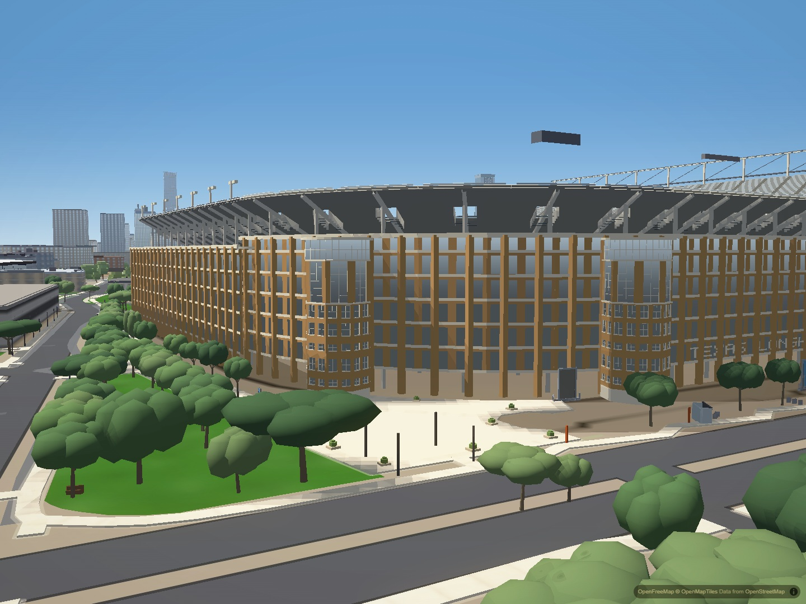

# DKR detached roof equipment

Two dark boxes floated above the north stands after the stadium mesh replaced
their supporting roof. The replacement mask hid the old roof because it crossed
the stadium boundary, but two small equipment polygons lay entirely beyond that
boundary and remained visible.

The roofscape-only mask now extends 5.3 m farther north to include the old roof's
full extent. Building, parts and collision bounds remain unchanged. The renderer
still restores the legacy layers when the stadium mesh is disabled.

## Matched full-city comparison

Before:

After:

The second screenshots use the same camera, time, exposure and field of view.
Both require all 196 authored buildings ready, normal loaded tiles, an indexed
city and no loading veil. Desktop Chromium uses hardware graphics, balanced
quality, 1440 by 1080 pixels, drift disabled, graphics auto-detection cancelled
and WAYFIND off. A temporary layer-isolation diagnostic established that the
boxes belonged to roofscape; the comparison above uses the normal scene.

## Verification and limits

`node scripts/verify/stadium-roof-filter.mjs` executes the renderer's actual
filter and checks its polygons against every baked roofscape feature with
Python/Shapely. Exactly two detail features are additionally excluded; every
other roof decision and every ordinary volume boundary is preserved. It checks
coexisting filters, repeated application and fallback restoration across absent
style. `--break` removes the margin and must fail on the two retained units.

The tower geometry and stadium/style recovery checks also pass. This corrects
stale replacement geometry, not the stadium's architectural proportions. The
generic north facade, tower-to-wall relationship, citywide window flicker,
production recovery-event delay and physical iPhone acceptance remain open.
