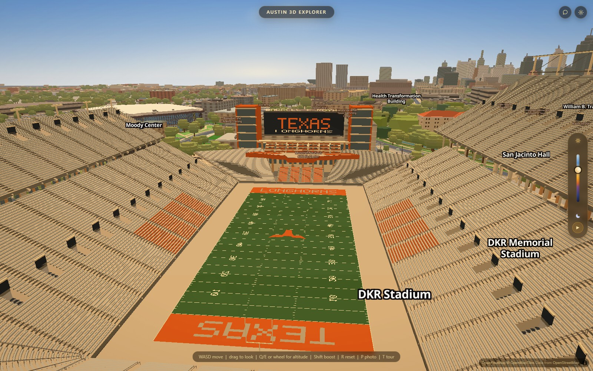
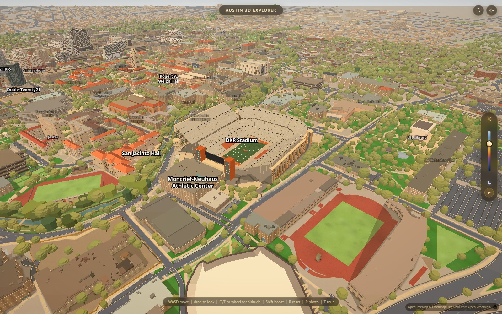
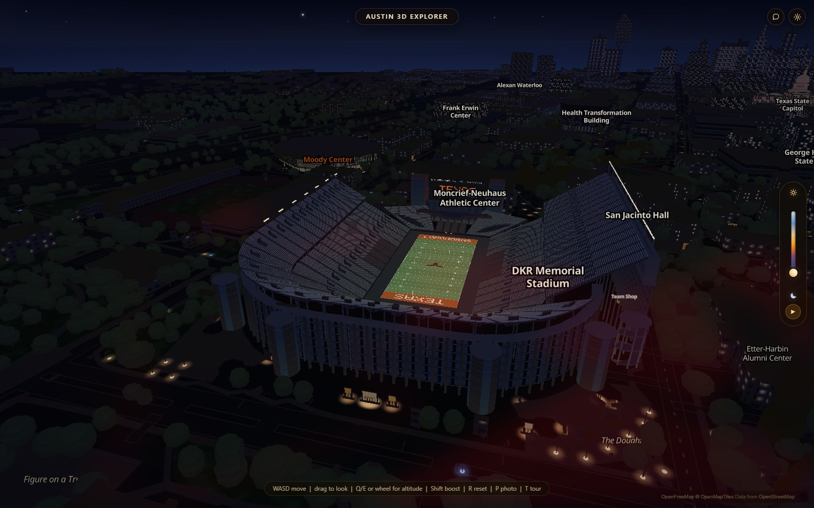

# DKR mesh rebuild

Implemented on `codex/dkr-mesh`, September 11, 2026.

The replacement has independent grandstands, 88 seating sections, stepped rows,
openings, exposed supports, spiral ramps, glazed exterior bays, and the south
Longhorn terrace and screen assembly. The current screen uses the published
160 by 44 foot dimensions. Field markings and lettering are generated geometry.
Reference links and uncertainty are recorded in `data/stadium.mesh.json`.

The new bake owns only that JSON. Legacy stadium data stays untouched and is
restored with `?stadiumMesh=0` or the global slopes switch. Nearby geometry filters
remove only the stadium contribution when switching off. Collision uses the
new field and deck surfaces. This is a heightfield: walking beneath decks is
not supported. Facade layouts, row counts and heights remain approximations;
this is not a surveyed replica. Thin distant lines still alias. Night lighting
is authored local illumination rather than real-time floodlights.

Verification: `dkr-mesh.mjs --perf` passed geometry, field/deck collision, old
layer suppression, close-detail selection, filter preservation, global switch
restoration and no browser errors. Screenshots were taken twice per pose.
Three interleaved hardware-WebGL repetitions at 1600x1000, 180 frames each,
after a discarded warmup pair: minimum median frame times 17.6 ms legacy and
17.7 ms replacement. Browser vsync defaults, no CPU throttle, auto-detection
cancelled. This is a relative headless comparison, not physical-screen FPS.

Edit the bake profiles/palette and `STADIUM_MESH` tuning object to adjust the
appearance. Run `python scripts/bake_stadium_mesh.py` to regenerate the model.
The original six-stage direction is in `dkr-reimagination-plan.md`; crowd and
game-day effects remain outside this core stadium pass.
