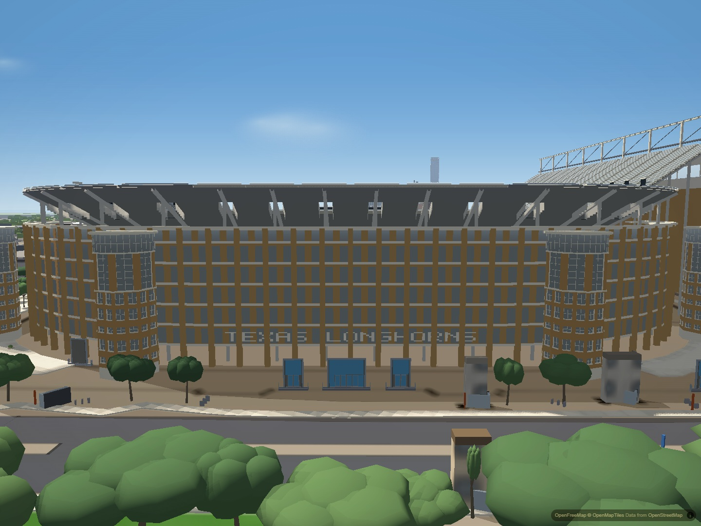
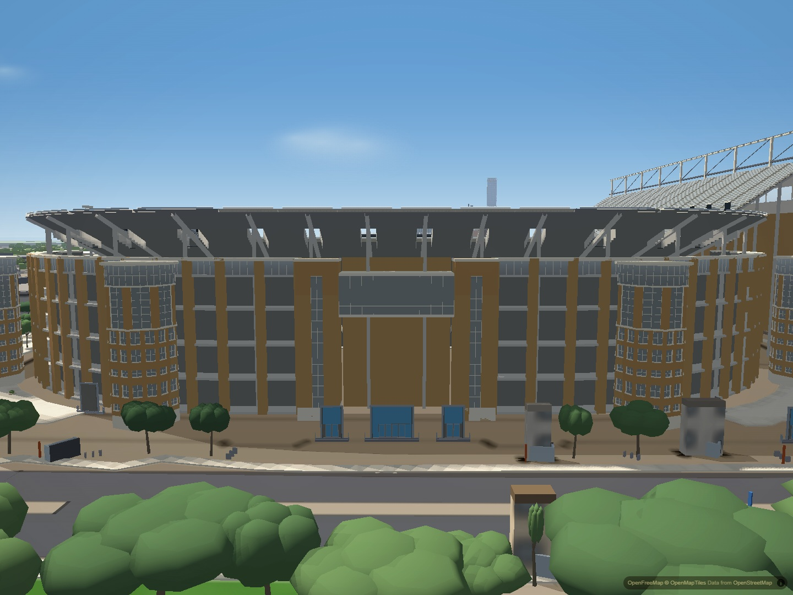
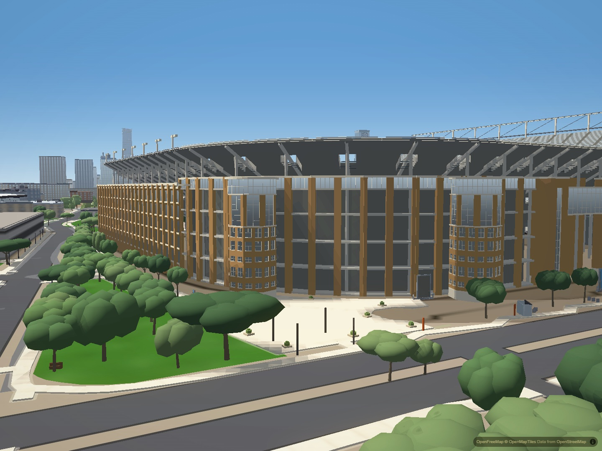

# DKR north concourse and entrance

The north exterior previously repeated the same glass grid around the whole
curve. It now has open concourse galleries with recessed floors and rails,
substantial brick piers, a divided glazed top register, and paired brick stair
shafts framing a recessed central entrance beneath a glazed bridge.

The composition follows public north entrance photographs and a context aerial.
The completed 2008 north facade establishes the central stair shafts and bridge;
the December 2025 exterior by Ajay Suresh confirms the open lower galleries and
glazed upper register. Small dimensions are approximate. The existing 31 m wall
envelope and lantern tower heights remain unchanged. Editable choices live in
`TUNE.north` in `js/slopes-stadium.js`.

## Matched city views

North exterior before:

North exterior after:

Northeast corner before:

Northeast corner after:

## Verification and limits

Four matched views cover the north exterior, northeast corner, northwest overview
and unchanged west facade. Retained second screenshots require all 196 authored
buildings ready and indexed, normal loaded tiles and no loading veil. Desktop
Chromium uses hardware graphics, balanced quality, 1440 by 1080, fixed camera and
time, disabled drift and exposure adaptation, cancelled graphics auto-detection
and WAYFIND off. Loaded runtime and mesh hashes match the checkout.

Focused geometry checks cover open galleries, oblique sightlines, recessed rails,
upper glass, stair shafts, and the unchanged height envelope. Restoring full-depth
piers deliberately fails the oblique sightline check. The bridge clearance check
covers the ground approach, solid rear wall, bridge roof, ordinary stadium slabs,
and forwarding eye altitude through every controls collision sample. Removing
the clearance rule deliberately fails. Existing tower geometry, roof exclusion,
style recovery and harness parity checks pass.

The central approach admits walkers beneath the overhead bridge while retaining
collision above it and at the recessed rear wall. Existing bowl geometry occupies
the deeper recess and stops further movement before that wall. This is a bounded
clearance rule for the bridge; the stadium is not a fully navigable interior.

Broader tower-to-wall proportions, fine material detail and interior furnishings
remain approximate. This pass makes no performance claim. Physical iPhone Safari
and Chrome performance/memory acceptance and the production recovery-event delay
remain open, as does citywide window flicker.
