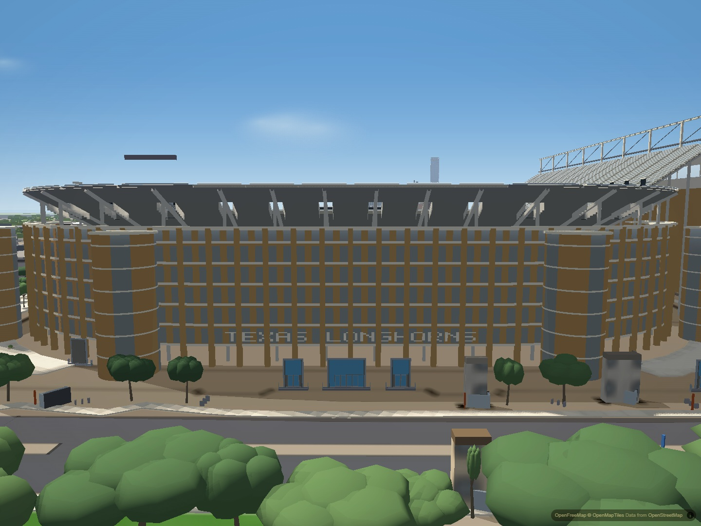
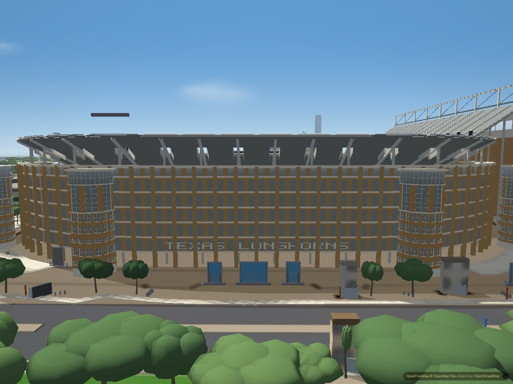
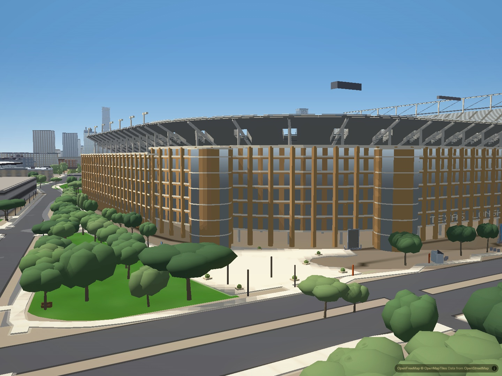
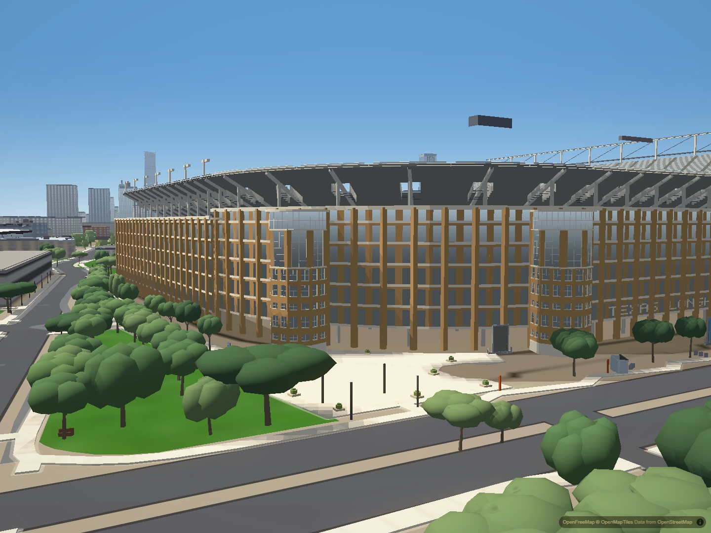

# DKR north tower exterior

The four north office towers previously used uninterrupted vertical glass stripes
and identical horizontal bands. They now have faceted masonry lower shafts with
paired recessed windows, tall upper glazing between brick piers, and separate
round glazed lanterns under overhanging pale caps.

The composition follows the public north entrance exterior photographed by Ajay
Suresh in December 2025 and a stadium context aerial. The separate flat-top stair
towers in older construction photographs are not these lantern towers. Positions,
radius and overall height remain unchanged; window subdivisions, recess depths
and small trim dimensions are reference-led approximations, not surveyed values.
Editable choices live in `OFFICE_TOWER` in the stadium mesh bake.

## Matched city views

North exterior, before:

North exterior, after:

Northeast tower, before:

Northeast tower, after:

## Verification and limits

Four matched full-city views cover the north exterior, northeast towers, west
facade regression and northwest overview. Each retained second screenshot requires
all 196 authored buildings ready and indexed, loaded map tiles and no loading veil.
Desktop Chromium uses hardware graphics, balanced quality, a 1440 by 1080 viewport,
fixed view/time/FOV, disabled drift and exposure adaptation, cancelled graphics
auto-detection and WAYFIND off. No performance claim follows from these captures.

The geometry check rejects degenerate faces and coplanar window glazing, and checks
the preserved cap height. A deliberate zero-recess mutation fails. The stadium
style-loss recovery test passes. Repeating the bake is deterministic; seating,
south structures, existing tower placement, palette and all other baked values
are unchanged. Ramp rendering is unchanged.

The surrounding generic north wall, unrelated floating stadium element and broader
DKR exterior proportions remain unfinished. Preserving the existing 30 m tower
height against a 31 m facade means these lanterns do not stand above every adjacent
wall as prominently as in the street reference. This pass does not resolve that
larger proportion question. Citywide flicker, the production context-loss event
delay, and physical iPhone Safari/Chrome performance and memory remain open.
