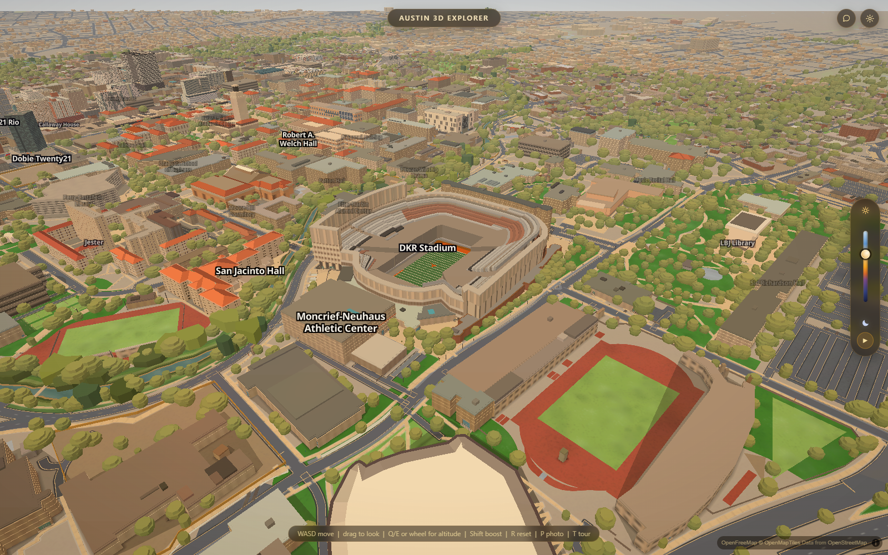
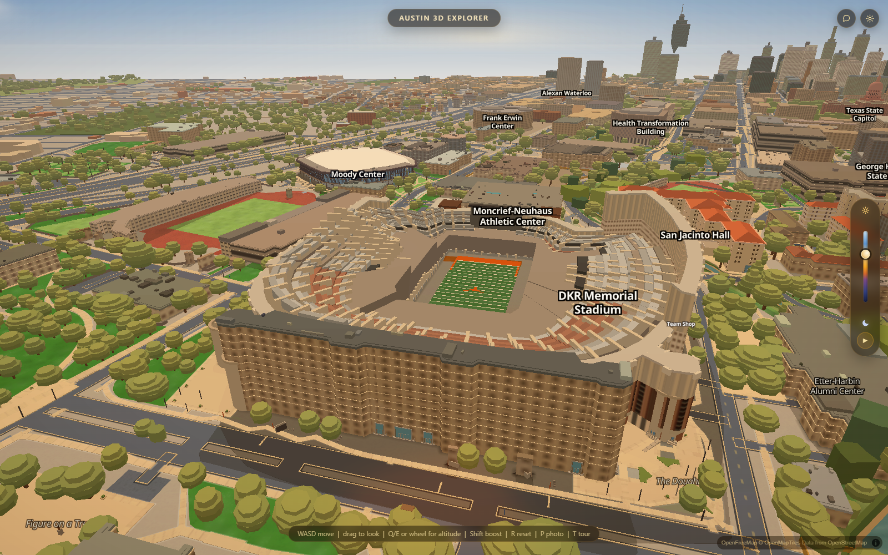

# DKR reimagination — proposed rebuild plan

Status: planning only, September 9, 2026. Current main inspected: 622ecb2.
Simeon's current assessment is that DKR is bad. Previous queue entries declaring
it fixed do not establish acceptance. No stadium implementation changed here.

## The target

Make DKR a recognizable architectural landmark from the campus flyover, an
impressive place from inside the bowl, and a believable structure at the gates.
Reconstruct the real stadium, with a restrained optional game-day presentation.
The empty stadium must look good before a crowd or lighting effects are added.

Current main, captured twice per pose with graphics auto-detect cancelled:

## What the inspection establishes

- The rendered bowl has huge flat terraces and chunky, disconnected-looking
  seating wedges. Fine seat rows and section structure do not read.
- The south-end screen, club terraces and Longhorn balcony do not read as the
  distinctive architectural assembly visible in the architect's photograph.
- The exterior reads as a fairly uniform wrapped building; it needs separate
  identities for the grandstands and entrances.
- `bake_stadium.py` emits detailed seats AND eight coarse solid under-mass
  features into `stadium-seating`. Its comments describe the detailed bowl as
  living in `stadium-detail`, but the actual emitted kind is now `seat`.
  The coarse mass is therefore a likely cause of the broad terraces; this is
  a code-based hypothesis to test by hiding just those features, not yet a
  proven pixel attribution.
- Deck tables use only 8-12 bands for several major seating tiers. Increasing
  that count alone would leave the same radial construction and guessed profiles.
- The repo now has a shared three.js mesh layer in `js/slopes.js`, with existing
  sun/time/haze/depth integration. DKR still uses vertical GeoJSON extrusions.
  It no longer needs to approximate every sloping or open structure as boxes.

## Build order and visual checkpoints

### 1. Establish the reference and remove competing geometry

Capture fixed cameras: campus overview, four corner obliques, midfield toward
south, midfield toward north, west street approach and north entrance. Add day
and night pairs for the final set. Audit every source that can draw over DKR:
stadium features, ordinary buildings, parts, roofs and distant substitutes.
Hide suspect layers one at a time to identify the terrace pixels.

Build a dated reference board from a current aerial, official seating map and
photos of each exterior. Use the field markings as a scale check, then record
independent north/east/south/west deck profiles and section boundaries. Every
measurement gets a source, uncertainty and measured/derived/unknown label.
The old bake explicitly says its reference aerial predates the 2021 south end;
it cannot establish the current whole-stadium plan.

**Checkpoint:** a measured footprint/section drawing and a clean baseline with
an explicit list of duplicate geometry. Do not carry inherited heights forward
merely because they already exist in code.

### 2. Rebuild the stadium's large shapes as meshes

Create separate grandstand assemblies: west decks and press/suite structure;
east decks; north enclosure and corners; south-end building and seating.
Describe each seating section by its own boundary, rows, rise/run and supporting
slab. Join the real corners explicitly instead of blending every side around a
single concentric ring. Model visible deck overhangs, undersides and concourse
voids. Keep field margins and sidelines in proportion.

**Checkpoint:** an untextured model must match the reference silhouette and
show the right deck count, footprint, voids and relative heights from every
fixed camera. This is the first taste review, before detail is expensive.

### 3. Make the seating read as seating

Lay out section wedges and aisle stairs first, including the actual access
openings through the stands. Add rows at measured pitch and distinct risers.
Map aluminum benches, orange seats and premium seating by section from the
references; avoid random patches as a substitute for a seating map.

Use near/mid/far representations: nearby rows and rails get geometry; middle
views retain continuous row detail; distant views retain the full deck shapes,
section divisions and open voids. Individual seats are only warranted where they
resolve on screen. No solid fallback is allowed to fill the bowl.

**Checkpoint:** from midfield, the rows, aisles and entrances are legible; from
the campus flyover, the section pattern survives without flicker or terraces.

### 4. Build the south end as the signature piece

Model the Longhorn-shaped balcony as real edges, setbacks and seating/terraces,
not a logo lying on a slab. Integrate the screen with its supporting building,
flanking towers, glazing, rust-colored framing, clubs and patio levels.
The Populous project page and photograph provide a strong starting reference:
[University of Texas South End Zone](https://populous.com/projects/university-of-texas-south-end-zone-project).
Its 2021 scope includes the balcony and premium seating spaces. A dated current
reference must confirm any subsequent changes before implementation.

**Checkpoint:** recognizable as DKR's south end from the opposite stands and
from above, with the screen at the right apparent scale and no floating pieces.

### 5. Give the exterior and field their identities

Rebuild the visible west structure, north facade and pedestrian ramps from
photos: open ramp flights, landings, supports, facade bays, gate openings and
structural transitions. Author the south and east as their own elevations.
Only detail interiors visible from the supported exterior/bowl cameras.

Finish the field with correctly scaled yard lines, numbers, hashes, end-zone
lettering, goalposts and sideline margins. Use authored graphics with appropriate
asset rights. Keep texture sizes and architectural colours editable in data.

**Checkpoint:** west/north walking approaches look like stadium entrances, and
the field has a coherent scale when viewed from the stands.

### 6. Light it, integrate it, and prove it in motion

Place visible fixtures from reference. The field should be the primary lit
surface, with plausible spill onto seating and concourses and a darker exterior.
Do not make seats emit their own light. Start with inexpensive material/shading
masks in the existing renderer; prototype true local lighting only if the visual
and hardware budget justify it. Give the screen controlled brightness without
washing out the surrounding architecture.

An optional game-day mode can add authored screen content, crowd colour and
subtle atmosphere after the architecture passes. It is an optional extension,
not part of the core rebuild's completion test.

Integrate collision and camera clearance so flying into the bowl and near decks
works. Test disabling/re-enabling the new stadium, all graphics presets,
near/far transitions, and startup/tour views. The fallback must preserve the
same silhouette and open bowl.

**Checkpoint:** day/night and moving-camera comparisons pass, no duplicate
geometry or disappearing bowl, no regressions to adjacent campus buildings.
Measure hardware frame time interleaved against main at the same cameras and
settings, minimum of repeated runs. Set a numeric budget after that baseline;
this planning pass makes no performance claim.

## Implementation shape and ownership

Suggested dedicated `js/slopes-stadium.js`, with stadium-only generated data
holding sections, deck profiles, materials, facade assemblies and reference
provenance. Reuse `slopes.add`, materials, shared lighting and switch hooks.
Do not force DKR into the apartment-building schema.

Keep exactly one writer for stadium data. The stadium owner owns its bake and
output together; reserve the new mesh module with that owner. Coordinate the
small integration surface in `js/app.js`, `js/lod.js`, collision if needed,
`index.html` and `_harness.html` before implementation. Existing MAC_QUEUE
ownership remains in force until explicitly reassigned. Recheck open PR files
at implementation time; no parallel browser runs.

Each milestone produces matching-camera screenshots and a short account of
what still fails. Build behind a switch and retain the old model as a comparison
until the complete replacement passes. Merge through a verified PR and remove
obsolete generated geometry only after the replacement/fallback paths work.

The first implementation pass should deliver reference measurements, isolation
of the competing bowl geometry, and the mesh massing prototype. Do not spend
that pass on signage, crowd effects or individual seat detail.
