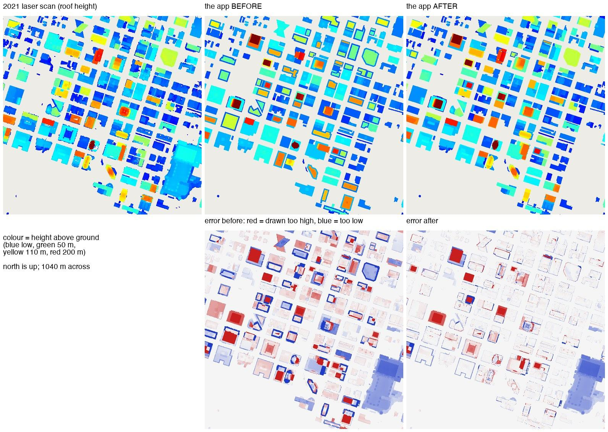
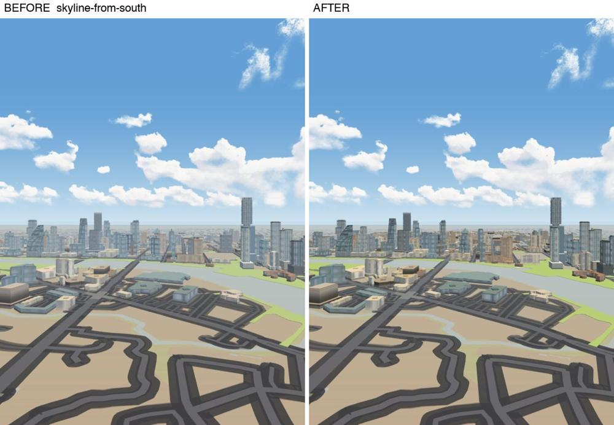
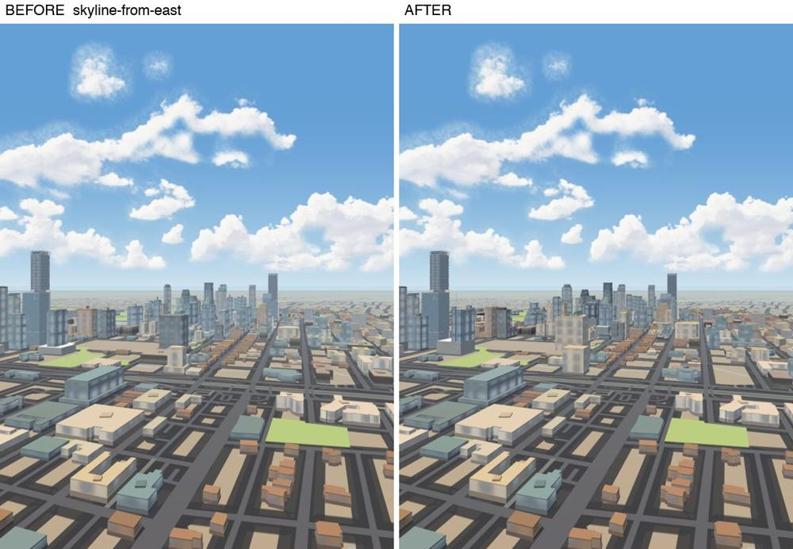
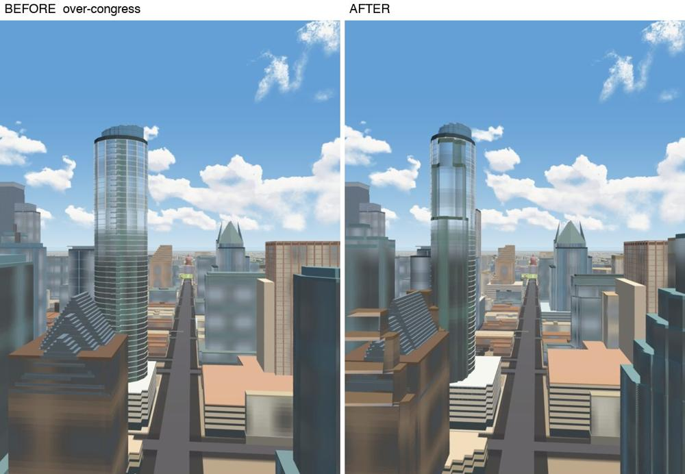
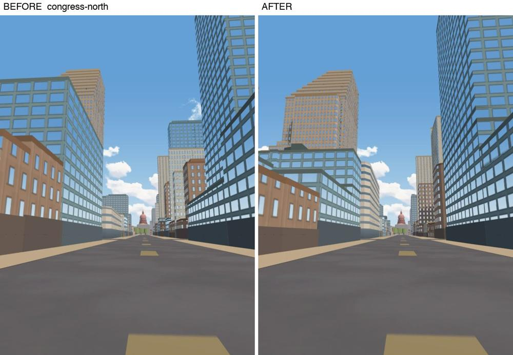
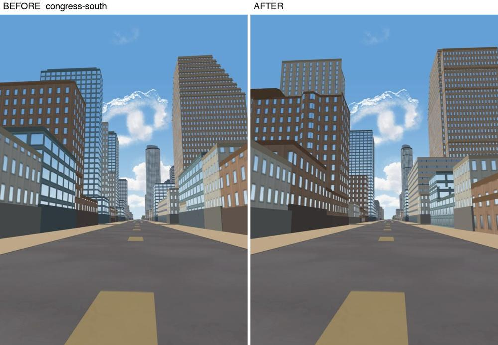
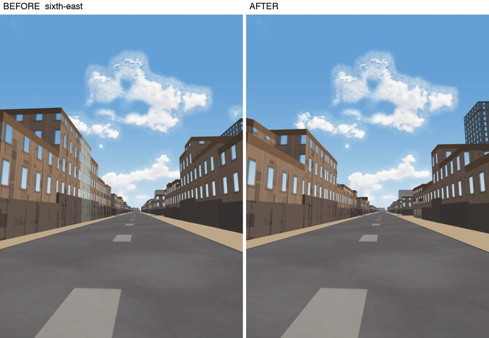
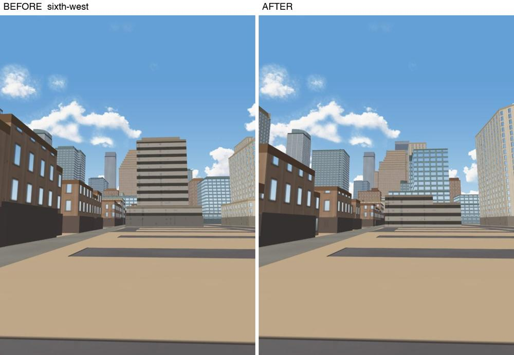
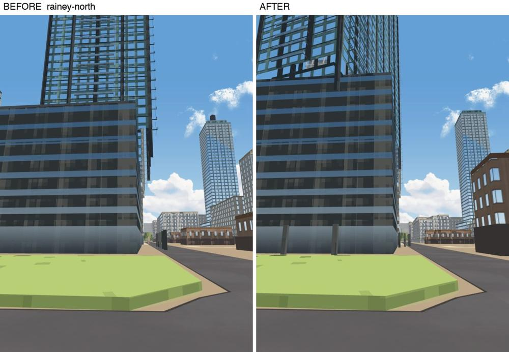

# Downtown, measured

2026-10-10, branch `mac/downtown`. Every number here is MEASURED by
`scripts/verify/downtown-accuracy.py` unless it says otherwise. The list of all
1,468 downtown buildings, one row each with its state and its biggest error, is
`docs/downtown-buildings.md` (written by the same script).

## What "downtown" is, and what was compared

- **Downtown** is the union of the City of Austin's nine Downtown Austin Plan
  districts (Lamar to I-35, the lake to MLK).
- **The reference buildings** are the 1,468 outlines inside it: OpenStreetMap's
  buildings as mapped today, plus City of Austin 2023 structure outlines where
  OpenStreetMap has none.
- **Ground truth for shape** is the 2021 airborne laser scan (Bexar and Travis
  Counties Lidar, TxGIO StratMap, flown 2021-01-26 to 2021-03-07, CC0, about 12
  points per square metre). Six tiles cover downtown. It is kept in the repo cut
  down to a 2 m roof-height picture (`data/outer/downtown_scan_2m.png`, 0.5 MB)
  so that anyone can re-run the comparison.
- **Ground truth for buildings finished after the flight** is the published
  height (`scripts/outer_heights.json`), then OpenStreetMap's `height`, then the
  City's 2023 photogrammetric height. Shape cannot be checked for those.
- **What the app draws** is `data/outer_ring.geojson` (the outer layer's tiles
  are cut from it), turned into a height field on the same 2 m grid.

Of the 1,468 outlines, **652** are drawn by the outer ring and are what this pass
changes. **747** are drawn by the core snapshot or the Capitol bake (north of
about 11th Street): listed, not changed, compared only as plain prisms. **69**
are in the City's 2023 survey but not on today's map (the Convention Center,
pulled down in 2025, is the largest): not drawn, on purpose.

## The table, before and after

Per building, inside its own outline: `dh` is drawn roof minus scan roof (90th
percentile of the cells well inside the outline); `mae` is the mean of
|drawn - scan| over all its cells (height, step and footprint errors in one
number); "volume agrees" is the volume both solids share over the volume either
claims.

| | before (`main`) | after |
|---|---:|---:|
| buildings the ring draws | 652 | 652 |
| ...hand-modelled | 25 | 25 |
| ...measured from the scan | 0 | 569 |
| ...generic (one outline, one height, guessed steps) | 627 | 58 |
| **missing** (reference building with nothing drawn on it) | 132 | 12 |
| extra (drawn where neither the scan nor the map has a building) | 6 | 6 |
| **against the scan** (586 buildings) | | |
| median roof-height error | 2.8 m | 0.4 m |
| mean roof-height error | 5.1 m | 0.9 m |
| within 2 m | 43 % | 94 % |
| within 5 m | 76 % | 98 % |
| off by more than 10 m | 61 | 5 |
| mean `mae` per building | 8.5 m | 1.9 m |
| median "volume agrees" | 64 % | 92 % |
| **hand-modelled towers the scan saw** (15) | | |
| median "volume agrees" | 50 % | 83 % |
| mean `mae` | 41.8 m | 16.8 m |
| top against the published height, median error | 0.0 m | 0.0 m |
| **not in the scan** (66; 45 with a public height) | | |
| median height error against the public figure | 2.8 m | 0.0 m |
| off by more than 10 m | 7 | 0 |
| **downtown as one solid** (the cells the ring owns and the scan can speak for) | | |
| volume in the scan | 21.39 Mm3 | 21.39 Mm3 |
| volume drawn | 19.28 Mm3 | 20.61 Mm3 |
| volume agrees | 50.5 % | 78.7 % |
| mean error on roof cells | 17.0 m | 6.4 m |
| footprint overlap (2 m cells) | 76.8 % | 77.5 % |

An independent check of the scan itself: the City's own photogrammetric height
for the same building agrees with the scan's highest roof point within 3 m for
74 % of 1,243 buildings (median difference +0.6 m), and OpenStreetMap's `height`
tag within 3 m for 90 % of 532.

## What changed, in plain words

1. **Every building that is not hand-modelled is drawn from its measurement.**
   The outline comes from OpenStreetMap as mapped (0.25 m simplification,
   courtyards kept) instead of an Overture outline simplified to 1.2 m. The
   height and the steps come from the scan: `scripts/bake_downtown_massing.py`
   cuts each roof into at most six levels, and each level is one extrusion
   standing on the one below. A tower now stands where it stands on its podium;
   a low wing is low; a penthouse is the size the scan saw. The old podium "of 2
   to 5 floors by tower height", the shaft "inset 15 % of the plan width" and
   the generic crown box are gone from every building the scan saw.
2. **120 buildings that were not drawn at all are drawn.** The old ring dropped
   any footprint under 115 m2. A two-storey shopfront on 6th Street is smaller
   than that.
3. **14 of the 23 hand-modelled towers moved onto the shaft the scan shows.**
   Their plan sizes were "photo fits" around the middle of the mapped block.
   The scan puts the JW Marriott's slab along the east edge of its block, the
   Fairmont's along the north edge (26 m from where it was drawn), and most
   podiums 5 to 30 m higher than drawn. `scripts/fit_tower_seats.py` fits each
   shaft's centre, direction, plan and podium height from the measured levels,
   builds the tower both ways, and keeps the new seat only where "volume
   agrees" rises by 3 points or more (`scripts/downtown_tower_seats.json` has
   both scores for every tower). The form, the colours, the crown and the
   published height do not change. What the scan saw beside the shaft (a garage
   block, a low wing) is added as plain measured walls in the tower's material.
4. **Buildings finished after the flight take their public height.** 46
   buildings; they keep the old podium-and-shaft recipe, because nothing
   measured their shape.
5. **No two colours share a top face any more.** The coplanar check counted
   2,101 pairs in this file: 1,406 of two colours inside the hand-modelled
   towers (a pier, rim or cap finishing flush with the glass it stands
   against), 529 of one colour, 166 park pads laid on each other. Now 372, all
   of one colour except 6 outside downtown. Fixed in the bake: the smaller part
   of each two-colour pair stands 2 to 8 cm proud; a park pad inside a bigger
   pad of its own tone is dropped (131 of them, city-wide) and each tone has
   its own height.

## Bytes

What the browser downloads for the outer city is `data/tiles/outer.pmtiles`,
by range request (the tiles inside are already gzip).

| file | before | after | |
|---|---:|---:|---|
| `data/tiles/outer.pmtiles` | 2,392,254 | 2,367,623 | **-24,631 (-1.0 %)** |
| `data/outer_tower_palette.json` | 4,592 | 4,592 | unchanged |
| `data/outer_ring.geojson` (fetched only when tiles are switched off) | 6,536,377 (gzip 773,852) | 6,763,190 (gzip 788,851) | +1.9 % gzip |

The new geometry alone would have added 25 KB (+1.0 %): better outlines, 120
more buildings, levels, taller podiums. It is paid for by not shipping six
properties the browser never reads (facade profile name, use, plan area, plan
width, levels, year: the bakes read them from the GeoJSON). On the old data
that saves 60,519 bytes (2,392,254 to 2,331,735, measured); `scripts/tile.sh`
now leaves them out.

New files in the repo that the app does NOT fetch (bake inputs, so the bake and
the comparison can be repeated): `data/osm_cache/downtown_buildings.json` 592 KB,
`data/osm_cache/downtown_pois.json` 51 KB,
`data/outer/downtown_city_structures.json` 772 KB,
`data/outer/downtown_districts.json` 11 KB,
`data/outer/downtown_massing.json` 1,196 KB,
`data/outer/downtown_scan_2m.png` 513 KB, `docs/downtown-buildings.md` 184 KB.

## Sources and licences

| source | used for | licence |
|---|---|---|
| Bexar & Travis Counties Lidar 2021, TxGIO StratMap (public S3 bucket, six tiles, 3.75 GB, not kept) | roof heights, levels, the comparison | CC0 1.0 |
| OpenStreetMap, through the Overpass API | outlines, names, use tags, `height` | ODbL 1.0, (c) OpenStreetMap contributors (the app already credits it) |
| City of Austin open data: `impervious_cover_2023` structures | outlines where the map has none, 2023 heights | public domain (CC0 1.0) |
| City of Austin open data: `Downtown_Austin_Plan_Districts` | what "downtown" is | public domain (CC0 1.0) |
| `scripts/outer_heights.json` (already in the repo: OpenStreetMap + Wikipedia's list of tallest buildings in Austin) | published tower heights | ODbL / CC BY-SA facts |

Looked at and not used: Overture 2026-09-23.1 for this box is 3,049 OpenStreetMap
outlines and 71 Microsoft ML ones, so it adds nothing OpenStreetMap does not
already give; Mapillary needs an account key; no street-level imagery was used.

## How to repeat it

```
python scripts/fetch_downtown_sources.py                    # OSM + City, compact
python scripts/lidar_raster.py grid|tile|merge ...          # the six scan tiles -> raster (outside the repo)
python scripts/bake_downtown_scan.py    --raster <dir>      # the 2 m picture
python scripts/bake_downtown_massing.py --raster <dir>      # the levels
python scripts/fit_tower_seats.py                           # the hand-modelled towers' seats
python scripts/bake_outer.py --downtown-only                # the ring's downtown, in place
python scripts/bake_outer_facades.py                        # facade ordinals
bash scripts/tile.sh                                        # tiles
python scripts/verify/downtown-accuracy.py --md docs/downtown-buildings.md
```

`--downtown-only` exists because a full `bake_outer.py` needs the raw Overture
extract, which is not in the repo and whose release is no longer published. A
full bake runs the same step at its end; that path was NOT run here (no raw
extract on this machine). Running `--downtown-only` twice gives the same file
(checked by checksum).

## What is still wrong

- **Walls and street level are not measured yet.** Facade system, wall colour
  and glass tone still come from the 17 shared profiles chosen by name, use,
  height and plan width. All historic masonry is one brick colour. The ground
  floor is one flat band per building: no awnings, arcades or doors. Two
  research passes for Congress Avenue and East 6th Street found names and a few
  dates in public records but no colours they could stand behind.
- **The hand-modelled towers agree with the scan for 83 % of their volume, not
  92 %.** Their forms carry insets in metres that only fit the plan they were
  drawn for, so most were moved without being resized, and Northshore could not
  be moved at all (45 %). Nine towers finished after the flight (Waterline,
  The Republic, Block 185, 415 Colorado, ATX, Modern, 44 East, Paseo, The
  Travis) and Sixth and Guadalupe have no measured plan.
- **North of about 11th Street nothing changed.** 747 downtown outlines are
  drawn by the core snapshot and the Capitol bake, as prisms from second-hand
  heights. This pass does not own those files.
- **The scan is from early 2021.** A building altered since reads as it was.
  46 newer buildings are generic.
- A roof that slopes or curves is drawn as steps (at most six).
- Four measured buildings are still off by more than 10 m: three are small
  outlines hard against a tower (the 2 m grid mixes the two), one is the garage
  under The Independent, where the scan sees the tower's overhangs.
- The 6 "extra" bodies and 31 old bodies with no outline under them were left
  as they were.

## The shape, seen from above



One kilometre of the core, north up, drawn straight from the data (no browser):
the scan, the app before, the app after, and under each the error against the
scan. Before, every tower is a centred shaft inside a rim of podium, and red and
blue (too high, too low) are everywhere. After, what is left is: the towers
finished since the flight (solid red: Sixth and Guadalupe, Block 185, The
Republic and others are RIGHT to be taller than a 2021 scan), the Convention
Center (blue, lower right: pulled down in 2025 and rightly not drawn), and thin
lines along walls where a 2 m cell straddles an edge.

## Pictures

Made-up cameras only, none fitted to a photograph: eye-level cameras in the
middle of the street and cameras 110 to 200 m up, drawn on a rented GPU (the
app at `main` on the left, at this branch on the right, the same camera).

| | |
|---|---|
|  from 200 m up, south of the lake |  from 200 m up, east of I-35 |
|  120 m over Congress Avenue, looking north |  Congress Avenue at street level, looking north to the Capitol |
|  Congress Avenue at street level, looking south |  East 6th Street at street level, looking east |
|  East 6th Street, looking west |  Rainey Street, looking north |

What to look for: podiums and steps where there was one shaft; the towers on
Congress standing on the right part of their blocks; lower, truer roof lines on
6th Street. What has NOT changed and still looks generic: every wall's window
pattern and colour, and the flat band at street level.

A check script for more views, including a straight-down plan and three roofs
turned 0.3 degrees to show any flicker, is `scripts/verify/downtown-shots.mjs`
(`shots-downtown.json`). It was queued on the laptop lane and had not run when
this was written, so the flush-top fix is proven by the coplanar count, not yet
by a moving picture.
