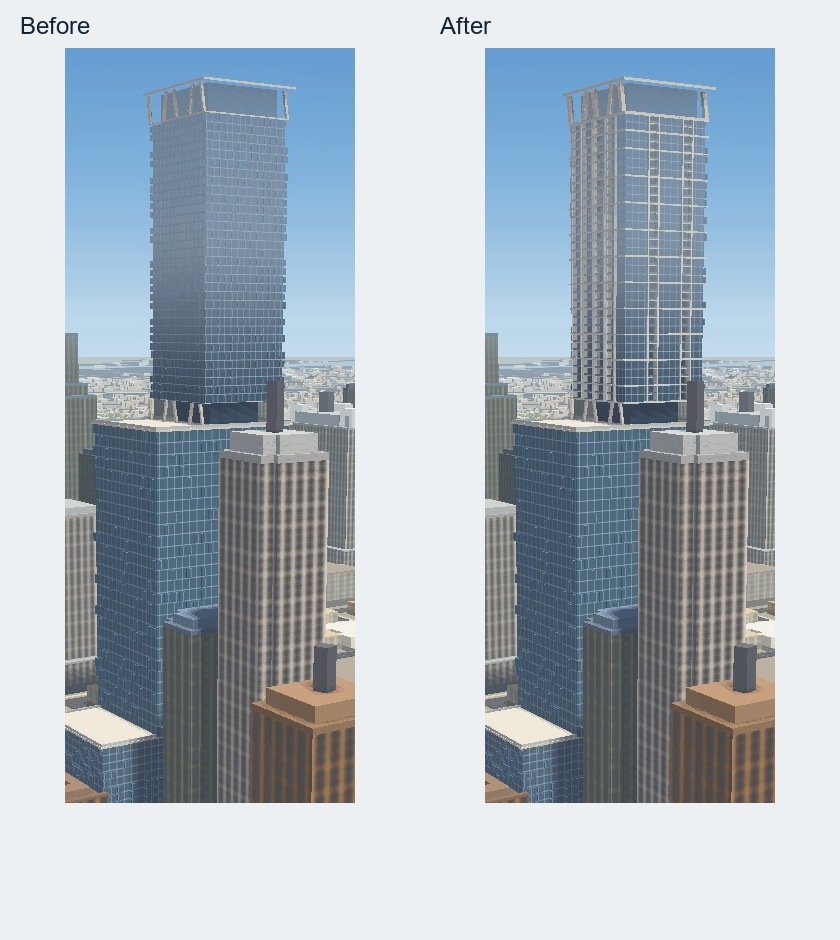
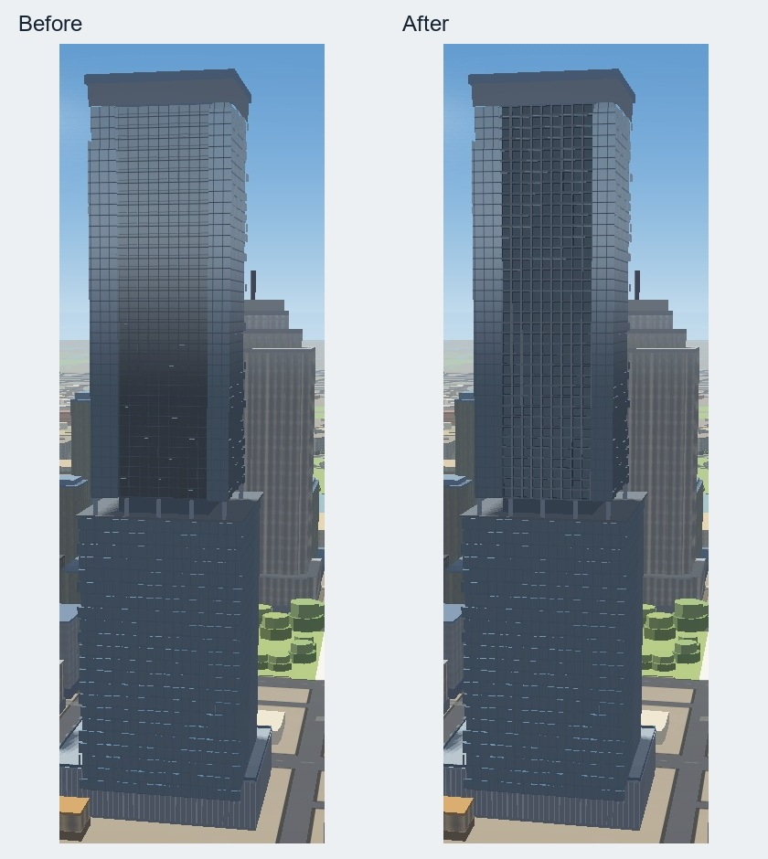

# Downtown balcony depth

This follows the dedicated tower geometry in PR #282. Waterline's upper volume
now has six physically recessed balcony stacks on the two reference-facing
elevations, floor decks, glass guards, pale jambs and grouped multi-storey frames.
The crown canopy and its inclined supports are thicker; the lower supports,
program volumes and existing 315 m height remain unchanged.

Sixth and Guadalupe now has a coherent recessed door field, visible partitions
and projecting slab edges. All rooms have daytime panels; selected rooms retain
their night tone. This avoids isolated reflective squares against a dark backing.
The existing 267 m height and cheek widths remain compatible with the current
shared shader. Changing those widths requires a coordinated shader pass after
PR #283 releases ownership of that file.

The comparisons are identical crops of second settled screenshots of the real
application at 1440 by 1080, balanced graphics, fixed camera/FOV/time and disabled
auto exposure, auto-detection and drift. Both sides use raw GeoJSON and load all
196 authored buildings, readiness and settled sources. Private camera records
and reference imagery remain outside Git. Photo viewpoints are approximate;
the application before/after cameras are identical.

Geometry tests sample empty balcony volumes on every residential storey, retain
the tower core, check visible material roles and reject deliberately filled
recesses, missing doors, reflective door materials and height overflows. Existing
unsupported-crown rejection, deterministic replacement and unrelated-feature
preservation pass. The 9,135 unrelated outer-ring features are unchanged.
Material partition/reset and harness checks also pass.

Normal PMTiles and larger-screen night verification are pending the data build.
This is a reference-supported architectural approximation. Fine railing detail,
exact glazing reflections, Sixth's broad cheek proportions, wider city facade
defects and physical-phone performance remain open. No owner-photo import or
physical-phone test is claimed by this pass.
