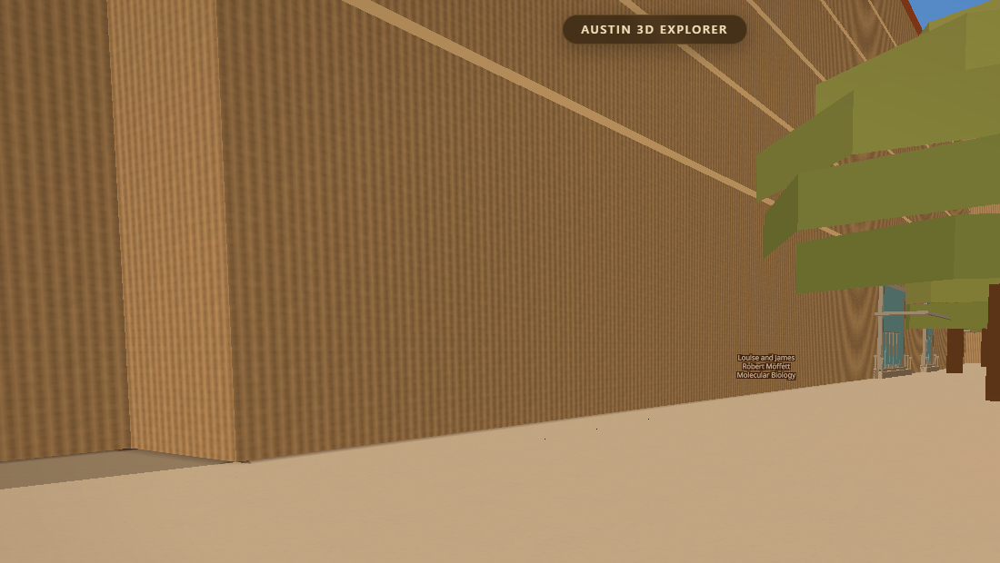
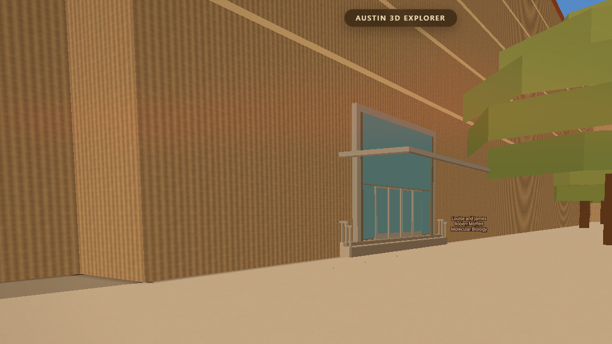
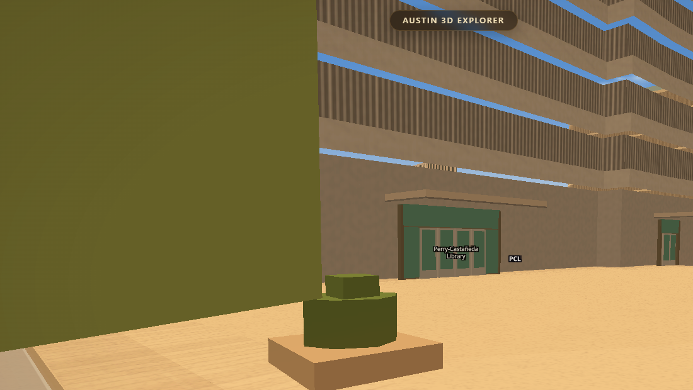

# Doors at the real doors — round 1

Branch `acer/cd-entrances`. One file changed in `scripts/`: `bake_entrances.py`,
which owns `data/entrances.geojson` and nothing else (CLAUDE.md lane rule 1).
No app code touched. `WAYFIND.on` untouched.

Simeon's words that started this: *"entrances are so horrible and innacurate."*
This round asked how many of the 477 hand-written rows actually are, and then
fixed the ones the evidence could reach.

---

## 1. The first thing found was that the shipped file was stale

`data/entrances.geojson` on `main` was older than the script that writes it.
Re-running `bake_entrances.py` with **no code change at all** moved the
entrance score from **64 to 70** of the drawn doors landing within 10 m of UT
Facilities' own surveyed door. Six points of the improvement below are that,
and this doc says so rather than banking them.

Every number here is `scripts/verify/campusmeter.mjs` against
`python scripts/serve.py 8821`, and every bake is pinned `SNAP_DATE=2026-08-16`
— the snapshot the shipped file was already built from — so a door diff never
smuggles in a snapshot roll (the rule the script's own header sets out).

---

## 2. UT's survey was setting the role and not the position

`maps.utexas.edu` publishes UT Facilities' hand-surveyed front door for 67
buildings. The file's own header says this "beats every heuristic in this
file". The stage that applies it had two branches and they disagreed about
whether that was true:

* **PLACE** — nothing of ours within 12 m → put a door at UT's coordinate.
  Used UT's position. Scored 44 of 47 within 10 m.
* **RELABEL** — one of ours within 12 m → mark it `main`, hang UT's
  barrier-free and auto-opener flags on it, **and keep our own coordinate.**

So a building could wear UT's survey flags on a door drawn 11.8 m from where
UT says the door is, and the bake counted that a success. Seven of the 31
relabel cases sat between 10.5 m and 11.8 m out.

**`UT_SNAP = True`** now moves a matched door onto UT's own point, projected
onto the host wall by the same `snap_to_edge` the PLACE branch already used,
and its `src` becomes `ut` — because `src` in this file means where the
POSITION came from, which is the contract the header states.

`UT_SNAP_OVER` limits it to heuristic provenances. An `osm` door is left alone:
it is not a heuristic, it is a second independent survey already sitting a
median 0.4 m from its own node, and overwriting one survey with another is a
coin toss, not an accuracy gain. 17 doors moved (mean 5.9 m); 12 were left to
their own survey.

**The picture.** Stand where UT says the front door of the Moffett Molecular
Biology Building is. Before, there is a blank wall — the door is 33 m away,
the faint sliver down on the right:



After, at the same camera station, the door is where UT put it (33.0 m → 1.2 m):



Same story at the Perry-Castañeda Library's north entrance, 12.3 m → 1.2 m:



**`UT_EDGE_SCAN = 24`.** UT's coordinate is a point inside the doorway, so on a
building with a re-entrant corner or a light well the nearest footprint edge
can be a wall whose outward normal points back into the mass. The old code
snapped to that one edge, failed `normal_test`, and threw the surveyed door
away — three doors a bake. Ranking the nearest 24 edges and taking the nearest
one that actually faces outward drops that to **zero**.

---

## 3. `derived` was two different claims wearing one word

On shipped `main`, **573 of 706 doors said `src: derived`.** Two stages wrote it:

| stage | what it knows |
|---|---|
| `stage2_paths` | a real OSM footway physically **crosses** this wall, or dead-ends against it |
| `stage3_public` | **nothing touches this wall.** It scores well on the publicness field and the building had perimeter budget left |

The first is evidence about a door. The second is a guess — a defensible one,
but a guess, and it should never have been able to hide behind the same word.
They are now **`path`** and **`field`**. Nothing in the repo branched on the
string `derived` (only `westcampus`, in `bake_walk.py`), so this is a
vocabulary change, not a behaviour change — and it is what made the next
section visible at all.

Measured the moment the split existed — 707 doors, after the stale rebake and
§2 but before §4: **`ut` 67 · `osm` 63 · `path` 221 · `field` 333 ·
`westcampus` 21 · `authored` 2.**

**47% of the doors on this campus existed because a wall faced a walkway.**

---

## 4. A guess may say "there is a door". It may not say "there are five"

Once the field doors were countable, the shape was legible. 141 buildings got
exactly one field door — and then 55 got two, 15 got three, 5 got four, 2 got
five, and one unnamed footprint got **seven**. The second and the seventh are
not a second opinion; they are the same single rule ("this wall faces a
walkway") run again on the next-best-scoring sample, because `budget_for`
sizes the budget off PERIMETER LENGTH and stage 3 spends whatever is left.

That is the mechanism behind the worst numbers on the scoreboard. The Seay
Building's five field doors are what put drawn doors 80–98 m from UT's own
surveyed Seay entrance.

**`FIELD_MAX = 1`.** The field may assert existence, once. Every door past the
first on a building must be evidenced by something in the world. This never
touches an `osm`, `path`, `ut`, `authored` or `westcampus` door — a building
with four real doors still gets four.

It removed **118 invented doors** (field 333 → 215) and left the bake reporting
**19 buildings with no entrance at all**, against the 18 recorded in that
stage's own docstring — one building. That was the check that mattered: the field
cannot be deleted outright, because 136 of 295 buildings have no evidenced door
of any kind and would go dark.

---

## 5. A rule that was tried and thrown away — read this before re-deriving it

UT publishes a `Directional` column on every celebrated entrance: W, SW, NE.
It looks exactly like the answer to the question a coordinate cannot settle —
WHICH WALL — so this round tried using it to pick the wall: rank the edges,
keep the nearest whose outward normal agrees with UT's compass point.

**It made the data worse.** Baked both ways and compared per door, the rule
moved ten doors and eight moved AWAY from UT's own surveyed coordinate:

```
ECJ W  17.8 -> 33.8 m      MBB SW  1.2 -> 13.1 m
PHR N   1.1 -> 11.1 m      WWH W  10.5 -> 20.4 m
JON S  12.3 -> 18.7 m      ECJ W   0.3 ->  4.3 m
JES NW  1.2 ->  3.9 m      FAC NW  2.2 ->  3.7 m
     (only WEL NE 14.7 -> 13.4 and JHH W 11.6 -> 10.7 improved)
```

UT doors with a drawn door within 10 m went 72 → 70 of 81.

The reason: **`Directional` is not a wall bearing.** It says which part of the
building you walk to — the south-west corner, the north end — and a door in a
corner or a recessed entry court very often has a leaf facing a direction the
corner is not named after. Moffett's SW entrance sits in a re-entrant corner
whose leaf does not face south-west; obeying the column marched the door 13 m
to a wall that does.

It is kept as an **audit** (a door on the OPPOSITE wall is still definitely
wrong, and the check is free) and not as a placement rule. The bake now prints:

```
side audit : 72 of 80 drawn UT doors face the side UT itself publishes
```

---

## 6. The numbers

`node scripts/verify/campusmeter.mjs 8821`, all from the running server.

| | shipped `main` | this branch |
|---|---|---|
| metric A — drawn doors within 10 m of UT's own surveyed door | **64 of 204** | **74 of 181** |
| median error | 21.2 m | 18.0 m |
| p90 | 65.3 m | 59.0 m |
| worst single door | 98.0 m | 89.2 m |
| metric B — within 10 m of any OSM entrance node | 69 of 619 | 68 of 514 |
| doors drawn | 706 | 591 |

Of the +10 on metric A, **+6 was re-running the stale bake** and +4 is the
change in this branch. The denominator falling from 204 to 181 is `FIELD_MAX`
removing invented doors from UT-surveyed buildings.

A second, more direct number, computed the other way round — *does every door
UT publishes actually get drawn near where UT says?*

| | shipped `main` | this branch |
|---|---|---|
| UT doors with a drawn door within 10 m | **62 of 81** | **72 of 81** |
| surveyed doors dropped for failing the outward-normal test | 3 | 0 |

**Nothing else moved.** `walkmeter.mjs` still reports **38 of 38** ends at UT's
own door, 87.0 m over pairs it makes worse, −393.7 m signed, drift 0.00 m, live
UI gate PASS — byte-identical to the figures recorded in HANDOFF §181. The
router was the one part that already worked and it still does.

---

## 7. What is still wrong, plainly

1. **Metric A cannot go much above ~40% and that is the metric's fault, not the
   city's.** UT publishes ONE celebrated entrance per building. The app draws
   real side doors from OSM nodes and real footway crossings that UT's table
   has no row for, and every one of them scores as a miss: on the 181 checked
   doors, `osm`-sourced doors score 8 hit / 22 miss purely because a real
   secondary door is not the one UT chose to celebrate. Deleting them would
   raise the score and make the city wronger. A future round needs a per-door
   oracle that admits secondary doors, not a per-building one.
2. **Nine surveyed doors sit 10–18 m inside the footprint** (ECJ W, WEL NW and
   NE, JON S, GAR S, JGB SW, JHH W, ETC W, WWH W). The door is drawn on the
   outer building line; UT's point is somewhere in a recessed entry court that
   Overture draws as solid mass. No amount of snapping fixes that — it needs
   the real entry recess in the footprint, or a photograph per building.
3. **333 → 215 field doors is still 215 doors nothing has ever seen.** They are
   now honestly labelled, and they are still guesses.
4. **`SSW` and `DMC` are inside the campus rectangle, have a UT surveyed door
   each, and no footprint carries their code**, so 3 real doors are not drawn
   at all. UT's own `Buildings_Simple` FeatureServer has authoritative
   `Building_Abbr` polygons that would fix the code-to-footprint join properly;
   that is a bigger change than this round.
5. **Six bakes are stale against `manifest.latest`** (`entrances`, `drag`,
   `campus_storeys`, `facade_palette` and two more read 2026-08-16, the app
   draws 2026-08-26). `snapshot_parity.py` reports no footprint moved between
   the two — 0 of 2453 geometries changed, only 3 property values — so no door
   is misplaced by it. It still wants its own pass.

---

## Sources

* UT Facilities, `Celebrated_Entrances_view`,
  `services9.arcgis.com/w9x0fkENXvuWZY26` — the surveyed front door of 67
  buildings with barrier-free and auto-opener flags, already frozen in this
  file as `UT_CELEBRATED` (fetched 2026-08-23). Re-checked live this round:
  the layer now holds 98 records, 86 of them active on the main campus (`Site`
  = `UTM`) across 57 buildings, the rest at the Pickle Research Campus. One row
  more than the frozen table; not refreshed here, because the identical table
  is also shipped in `js/wayfind.js` and `campusmeter.mjs` self-checks on 97 —
  a refresh has to move all three together and is its own pass.
* OpenStreetMap `entrance=*` nodes, frozen in this file as `_ENTRANCE_ROWS`
  (2026-08-04, 91 nodes). Re-queried live this round over the same SURVEY
  bbox: **93** nodes today (57 `yes`, 19 `main`, 8 `staircase`, 6 `emergency`,
  2 `exit`, 1 `parking`). Two nodes' growth in three weeks — OSM is not going
  to be the source that closes the gap on this campus.
* OSM footway / path / pedestrian / steps ways, via the existing
  `data/osm_cache/footways.json`, for every `path` door.
