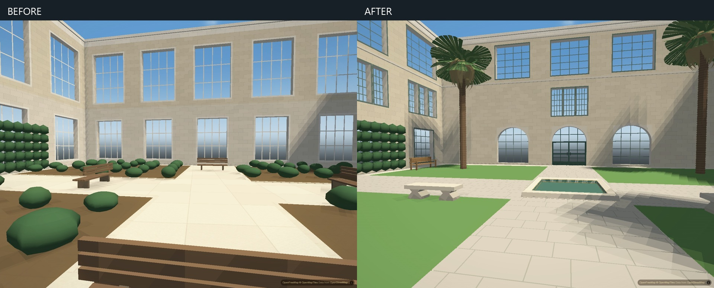
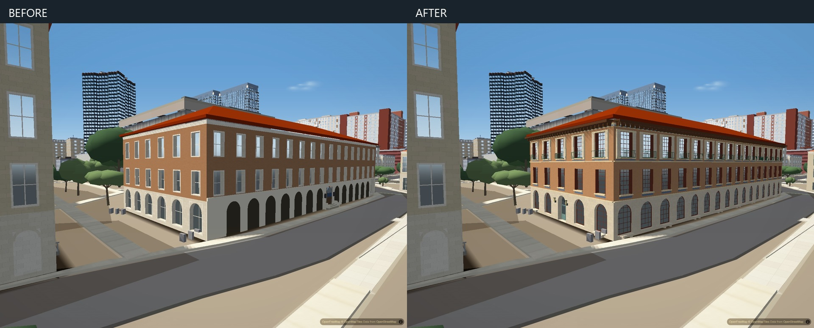

# Goldsmith courtyard and Sutton exterior

The Goldsmith courtyard previously used repetitive generic windows and shrubs.
It now has separate lower, middle and studio window registers, curved arch
surrounds, recessed green doors, four lawn panels, a small tiled pool, stone
seats, slatted benches, palms and quieter flagstone joints. The West Mall entry
also has grouped windows, a recessed entrance and paired lanterns.

Sutton's east and north elevations now distinguish red divided sashes, the
brick middle floor, pale upper surrounds and green Juliet rails. The central
east door has a fanlight, panels and ironwork; projecting timber eaves have
brackets and a simplified ceramic frieze.
The old arcade panels no longer cover these recessed windows. Only Sutton
opts into that replacement, and the legacy arches return if its mesh is absent.

These changes use the locally curated exterior-reference collection. They do
not claim a new owner-photo import or a calibrated photographic reconstruction.
References and camera positions remain outside the repository. The photographs
establish architectural features; small dimensions, furniture positions and
plant forms remain interpretations.

## Ownership and scope

- `scripts/bake_campus_buildings.py` still exclusively writes
  `data/campus_buildings.json`. Its Goldsmith and Sutton helpers refine only
  those models. Their footprints, wall heights and existing roof blocks remain
  unchanged; the other 35 halls are identical to the baseline.
- `scripts/bake_campus_landscape.py` still exclusively writes
  `data/campus_landscape.json`. Only Goldsmith's garden changes. The existing
  3,001 trees, other gardens, paths, doors, ramps, railings and retirement keys
  are unchanged. New palms are bounded courtyard detail meshes.
- `js/campus-landscape.js` consumes the authored garden meshes. It validates
  the complete feature before emitting triangles so malformed coordinates,
  indices or materials cannot partially corrupt the shared garden batch.
- Dimensions and colours are editable in the helpers' parameter dictionaries
  and the Goldsmith court's `courtDetails` profile in `data/campus_gardens.json`.

## Verification

The baseline is main at `1372df6`, which already includes the idle repaint fix.
Matched application views use the same camera, viewport, time, exposure and
balanced profile in both arms. The actual index loads all 196 authored
buildings with normal map tiles; each saved second screenshot requires complete
readiness and loaded tiles. Auto-detection, idle drift and wayfinding are off.
Goldsmith's two close views use a verified 1.7 m eye. Sutton's comparison is
an elevated northeast view. Earlier Sutton cameras that landed inside a
neighbor or were displaced upward are rejected and not used as evidence.

Focused checks: harness parity; garden malformed-feature rejection; both bakes
byte-identical on repetition; finite nondegenerate facade geometry; unchanged
non-target models and landscape inventories; arcade replacement lifecycle,
fallback, buffer disposal and no scans on unchanged render frames. The courtyard
also passed a 2560 by 1440 full-city check at the requested walking eye.
Verification results are kept in
`verification/everyday-campus.json` without private camera coordinates.

## Remaining limits

Goldsmith's taller entry pavilion/loggia and courtyard roof clerestory still
need a separate supported massing pass. The photographed end-wall arrangement
is mirrored at both courtyard ends because reference orientation is uncertain.
Sutton's carved and ceramic ornament is simplified. Existing vegetation and
the surrounding generic ground materials still limit close-view realism.
Physical-phone performance and memory have not been established by this pass.
