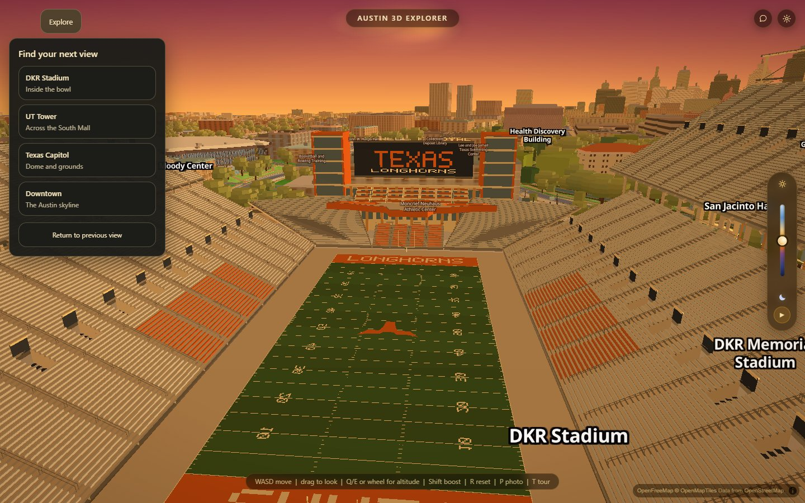
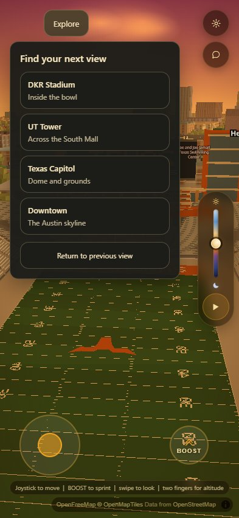

# Explore Austin

The Explore button beside the route control opens four landmark arrivals:
DKR's bowl, the UT Tower across the South Mall, the Capitol, and downtown.
Each selection closes the panel and keeps the current time of day. Return to
previous view restores the camera from before the most recent selection.

Camera poses and travel duration live in `window.EXPLORE` in `js/explore.js`.
Reduced-motion preferences skip the flight. Native buttons support Tab and
Enter; Escape dismisses the panel and returns focus. Clicking elsewhere also
closes it. Cinematic capture hides the whole control.

Run `VERIFY_URL=<server> VERIFY_OUT=<scratch> node scripts/verify/explore.mjs`
from a shell configured for the repository verification harness. The browser
gate checks all arrivals, camera return, dismissal, reduced motion, animated
arrival, phone bounds and uncaught errors.
