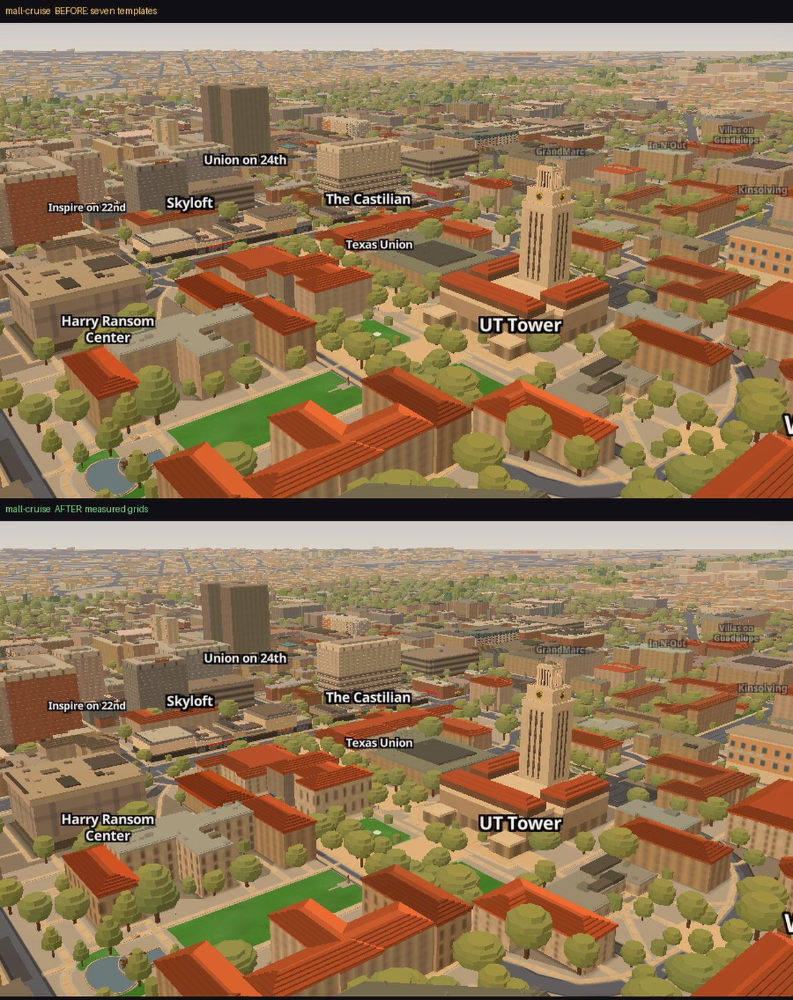
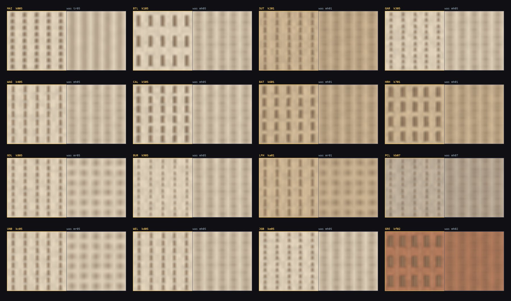
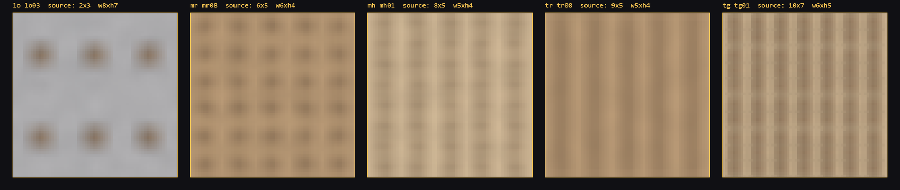
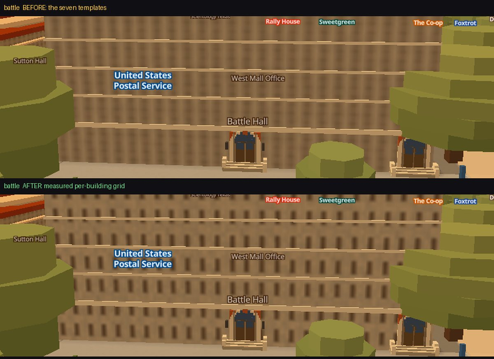

# Per-building window grids

*Round 1 of the campus-detail work. Branch `acer/cd-facades`.*

Simeon: **"windows on walls are just a template copied and pasted."** He was
right, and this is what was actually behind it, what changed, and what is still
wrong.

---

## What the template was

`js/facades.js` picked one of **seven** window grids by height class. Everything
between 12 m and 26 m tall with an academic class landed on `mh`: eight rows,
five columns, openings 5 px wide by 4 px tall. Battle Hall, Waggener, Calhoun,
Batts, Garrison, Welch, Burdine, Gregory Gym, the Perry-Castañeda Library — one
wall, nine buildings.

Two things were wrong with it, and only one of them was the one everybody
expected.

**The row count.** Battle Hall is a two-storey Beaux-Arts reading room. It was
wearing eight rows of windows.

**The window SHAPE, which nobody had noticed.** Every one of the seven templates
draws an opening WIDER THAN IT IS TALL — `mh` is 5×4, `mr` is 6×4, `tr` is 5×4.
Sixteen photographs were counted for this round and **every real window on this
campus is between 1.4× and 5.5× taller than wide.** The whole city was wearing
landscape windows. That is a bigger share of the "copied and pasted" feeling than
the row count is, because it survives every distance — a wrong rhythm reads as a
different building, but a wrong window shape reads as no building at all.



*The South Mall at the zoom the camera tours fly. Top: seven templates. Bottom:
measured grids. Same build, same pose, `?facadegrids=0` is the only difference.*

---

## What changed

The grid is now a **per-building property** read from ground truth, with the
seven templates surviving as the fallback for the ~2,437 buildings nobody has
measured.

* `data/facade_grids.json` — sixteen buildings, written by
  `scripts/bake_facade_grids.py`.
* `js/facades.js` — `familyFor()` looks the building up by the snapshot's own
  feature id and hands back a family of its own (`k0`..`kf`); everything else
  falls through to the seven templates, unchanged.
* `js/app.js` — fetches the file inside the existing `Promise.all`, before
  quantisation. `?facadegrids=0` turns the whole thing off for one load.

### The one subtlety, and it is the whole thing

**`rows` in the tile is NOT the building's storey count.**

The pattern is SCREEN-locked. One 64 px repeat covers a fixed number of METRES
of wall set by the camera, not by the building — `TIER_CSS × 67551 / 2^zoom`,
which is 32.98 m at zoom 16. So `rows` sets a FLOOR-TO-FLOOR PITCH, and how many
rows land on a wall depends on the wall:

```
rows on this building  =  tile rows  ×  height_m / REPEAT_M
```

Writing `rows: 2` for a two-storey building would draw two rows per 33 metres —
a 16 m floor-to-floor. That is not Battle Hall, that is a grain silo. So the
measurement is a **count on the real building** and the conversion is done in
code against the height the app actually extrudes:

```
rows = round(storeys × REPEAT_M / height_m)
cols = round(bays    × REPEAT_M / wall_m)
```

Battle Hall's tile has **three** rows. Three rows over its 21.5 m wall is 2.0 —
which is how many storeys Battle Hall has.

Because it is inverted from that identity rather than hand-tuned, a later fix to
the height bake moves the facade with it and needs no edit here.

### What was measured, and what deliberately was not

| | measured | how |
|---|---|---|
| **storeys** | all 16 | counted off a licensed photograph, cross-checked against UT Direct's facilities register. Where they disagree the photograph wins and the register's figure is recorded beside it. |
| **aspect** | all 16 | height ÷ width of one opening in photograph pixels. A ratio of two lengths in the same facade plane, so it survives an oblique camera far better than an absolute width does. |
| **bays** | **1 of 16** | only where both corners of the wall are in frame, the view is near-orthogonal, and the wall's length is known from the app's own footprint. Battle Hall alone clears that bar. |
| **glazing fraction** | **none** | measurable off these photographs and not measured this round. Every building keeps its template family's `want`, so the aspect only REDISTRIBUTES that area. |

Guessing a bay count off a foreshortened, tree-occluded wing is how you ship a
number that looks measured and is not. Fifteen of the sixteen keep their
template's column rhythm and the file says so on every row.



*Each pair: measured tile left, the template it replaced right, same colour
bucket, magnified 6×. Written by `scripts/verify/facadetile.mjs`.*

---

## The numbers

**`scripts/verify/campusmeter.mjs`, metric A (unchanged): 0 of 7 → 0 of 7.**

Metric A evaluates `familyFor` outside a browser, where the measured registry is
empty by construction, so it scores the FALLBACK TEMPLATES — which this round
deliberately did not change. It is now correctly read as "the seven templates
are still seven templates", and it should stay pinned at 0 until they change.
Its self-checks still pass and its table is byte-identical.

**`campusmeter.mjs`, metric B (added): 3 of 5 scoreable.**

Metric B scores what the wall RENDERS, against that file's own seven
photographed counts — which were made in a different pass off different
Wikimedia files, so they are a **held-out set** the measured grids were not
fitted to.

| building | renders | that file's photo count | |
|---|---|---|---|
| Battle Hall | 2.0 rows | 2 | match |
| Sutton Hall | 3.2 rows | 3 | match |
| Waggener Hall | 5.3 rows | 5 | match |
| Garrison Hall | 3.9 rows | 3 | no |
| Goldsmith Hall | 3.1 rows | 2 | no |
| Littlefield House | 2.0 rows | *no grid* | never scoreable |
| UT Tower | 25.6 rows | *approximate* | never scoreable |

The two misses are **two independent photo counts disagreeing**, reported rather
than reconciled: on Garrison this round counted the attic frieze band as a window
row and the earlier pass did not; on Goldsmith this round counted three storey
bands on the west wing off `Goldsmith Hall.JPG` and the earlier pass counted two
off the entrance pavilion. Moving a measurement to make a score go up is the one
thing that would make all of this worthless, so neither was moved.

**`scripts/verify/facadegrid.mjs` (new): 0 failing assertions, 3 height-limited.**

The pixel harness — it reads the RGBA bytes of the atlas image MapLibre is
actually sampling and counts the windows in it. Thirteen of sixteen draw the
photographed storey count on their own wall. Three cannot, and the harness names
why rather than going red:

```
BUR  Burdine Hall     8 storeys on 12.8 m — asks 20.6 rows, ceiling 10   needs ~26.4 m
PCL  Perry-Castañeda  7 storeys on 15.8 m — asks 14.6 rows, ceiling 10   needs ~23.1 m
JGB  Jackson Geosci   7 storeys on 16.7 m — asks 13.8 rows, ceiling 10   needs ~23.1 m
```

Those three are the **height bake's**, not the facade grid's. Burdine's eight
floors are extruded into 12.8 m of wall; no window grid makes that read as an
eight-storey building. The last column is the extrusion height that would let the
measured count land, which is a concrete handoff to whoever fixes heights.

**`scripts/verify/facade_parity.py`: PASS, 3057 / 3057.**

The Python port of the derivation in `scripts/bake_facades.py` reproduces the
browser's `wp` and `wf` on every one of 3,057 features, the sixteen measured
families included.

---

## What it cost

**Crawl (`scripts/verify/shimmer.mjs`, minimum of interleaved reps, three campus
poses, `?facadegrids=0` as the A/B):**

| pose | before | after | |
|---|---|---|---|
| mall-battle | 3.64% | 4.01% | +0.37 pp |
| mall-south | 2.37% | 2.58% | +0.21 pp |
| pcl-plaza | 5.32% | 5.48% | +0.16 pp |

It is not free. Two to ten per cent more crawling pixels at these poses.

Worth knowing which way the mechanism runs, because it is not the obvious one:
the **largest** increase is at `mall-battle`, where the grid got much SPARSER
(eight rows to three). So this is not "denser grids alias more" — it is that
bigger, higher-contrast openings have stronger edges to alias. The pose with the
densest change (`mall-south`, Garrison 8 → 10 rows) moved least.

**Atlas repaint (`updateFacades`, which repaints every registered image on every
time-of-day step; minimum of interleaved reps, headless swiftshader):**

64 combos / 139.8 ms → 80 combos / 145.4 ms. **+4.0% for +25% images.** This
fires on a time-of-day step, not per frame, and it does not meaningfully move the
2-3% main-thread share the 2026-08-19 atlas rework won.

---

## Two things found on the way that are NOT this piece

### 1. `tr` and `tg` draw no window rows at all



The pixel harness's self-check refused to score itself against `tr` (9×5,
residential towers) and `tg` (10×7, curtain wall), and the reason turned out not
to be the counter. **Those two tiles are pure vertical striping.** The DFT
agrees: on the buckets in this scene tr's bin 9 carries 8% of the profile's peak
and tg's bin 10 carries 6% — the rows are in the config and not in the pixels.

The mechanism is legible: their openings are 4-5 px tall in a 6.4-7.1 px cell, so
the 1-3 px of wall left between rows is eaten by the head shadow above and the
sill below, and then by the near tier's 0.75 px soften. Every downtown tower and
every residential tower in this app is a vertically-striped box with no floor
rhythm.

That is out of scope here — `tr`/`tg` are the tower families, not campus — but it
is a real defect, it is bigger than anything this round fixed, and the self-check
now measures and reports it on every run so it cannot be rediscovered a third
time.

### 2. `facade-parity.mjs` wrote its capture to a cwd-relative path

`path.join('scripts','verify','out')` is relative to wherever node was launched,
and the verify README tells you to run from `scripts/verify` — so a run started
the documented way wrote to `scripts/verify/scripts/verify/out/` while
`facade_parity.py` kept reading the real path. On 2026-08-27 that meant it was
comparing against a **23-day-old capture from snapshot 2026-08-04**: 17 findings,
1,274 mismatched families, "NOT a bijection", none of it real, and every one of
those symptoms reads exactly like "the change under test broke the bake." The
stray nested copy had also been committed, in `c689909`. Both are fixed: the path
is resolved from the module, and the committed duplicate is deleted.

---

## The one thing I know is still wrong

**The storey count is only right at the reference zoom.**

`REPEAT_M` is anchored at zoom 16 because that is what the `TIER_CSS` taste knob
was already calibrated against — "the repeat is 33 m of wall at the zoom this app
spawns at". At zoom 18 the same repeat covers 8.2 m, so **every** building in
this app — measured or template — shows about four times as many window rows up
close as it does at cruise. Standing at Battle Hall's front door, its
three-row tile draws about eight rows on the wall.



*Battle Hall's east elevation at street level, before and after. The shape and
rhythm change is unmistakable — and there are still far more rows here than
Battle Hall has, because at this zoom the repeat is 8.2 m rather than 33 m.*

This is a property of the screen-locked pattern that this piece did not create
and cannot fix from inside a repeating tile; `js/facades.js`'s own header spends
four hundred words on it. What IS zoom-invariant, and is the durable win here, is
the **ratio** between buildings: Battle Hall now carries 3/8 the row density of
the template at every zoom, and its openings are portrait at every zoom, so it no
longer wears the same wall as Waggener. The absolute count is right where the
camera tours fly and drifts either side of it.

The honest fix is anchored geometry — storey bands baked per building, the way
`bake_stadium.py` already does for DKR — not a better tile. That is a bigger
piece than this one and it should be costed on its own.

---

## Running it

```bash
python scripts/serve.py 8823                      # never python -m http.server

cd scripts/verify
VERIFY_URL=http://127.0.0.1:8823 node facadegrid.mjs           # the gate
VERIFY_URL=http://127.0.0.1:8823 node facadegrid.mjs --break   # watched failing
VERIFY_URL=http://127.0.0.1:8823 node facadegrid.mjs --report  # table, never fails
VERIFY_URL=http://127.0.0.1:8823 node facadetile.mjs <outdir>  # the labelled sheet
VERIFY_URL=http://127.0.0.1:8823 node campusmeter.mjs          # metrics A and B

VERIFY_URL=http://127.0.0.1:8823 SHIM_Q=facadegrids=0 \
  node shimmer.mjs shimmer-poses-campusgrids.json cg-off       # crawl A/B

cd ../..
python scripts/bake_facade_grids.py               # re-bake data/facade_grids.json
node scripts/verify/facade-parity.mjs             # RUN FROM THE REPO ROOT
python scripts/verify/facade_parity.py
```

`?facadegrids=0` on `index.html` puts every campus building back on the seven
templates for one load. Every taste value is one line: `REF_ZOOM` and
`GRID_CLAMP` in `js/facades.js`, and `storeys` / `aspect` / `bays` per building
in `scripts/bake_facade_grids.py`.
