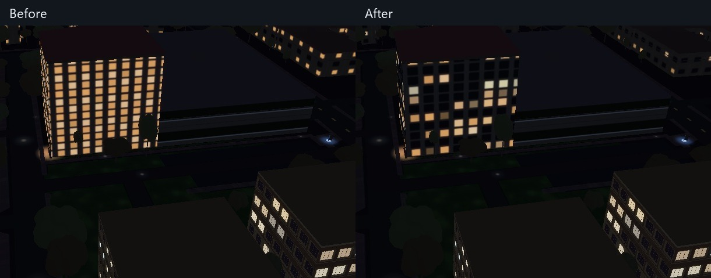
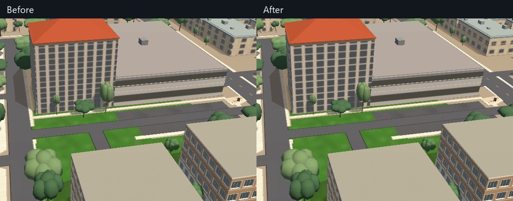

# Facade room variation

The Aerospace Engineering Building exposed two shared fallback-facade defects:
its rooms were almost uniformly lit, and the night pattern repeated after only
a few windows. This pass changes the campus/outer facade atlas in `js/facades.js`.
It does not replace each building's architecture with a common facade.

The final XOR in `hash01` used a sign-preserving shift. That cancels the sign bit
and confines the result to the lower half of the promised probability range.
The corrected zero-fill shift restores the full occupancy and color range,
and also removes the one-sided bias from this module's material scatter.
The existing occupancy and color settings remain the controls for appearance.

Fallback window families now use a four-times-wider repeat, holding more room
pairs without increasing texels per meter. This also reduces rounding error in
the target floor/bay pitches at close zoom. The `TEMPLATE_MUL` setting controls
this choice. Existing anti-shimmer filtering is retained. The grid audit now
reads the active template grids as well as the measured ones.

## Verification

Matched day/night Aerospace, a campus overview and downtown were captured
from the real application with the normal tile path, 196 authored buildings,
loaded tiles and no browser errors. Hardware GL, balanced preset, 1440x900,
DPR 1; each retained screenshot follows a discarded first frame. The hour,
pose and rendering settings match; automatic exposure remains enabled, so
these are visual comparisons rather than calibrated photometry.

The small-translation check on Aerospace's near wall moved 3 m over nine
frames: non-monotonic pixels above the existing threshold dropped from 3.63%
to 0.43%, with substantial pixel movement in both runs. This single localized
check does not establish that distant or oblique walls are stable. The new
report of flickering during idle rotation remains under investigation.

The deterministic probability regression samples 65,536 room coordinates,
checks range coverage and stable repeated values, and rejects the old signed
shift. The live grid audit passes. Registered image data increases from
10,675,908 to 43,853,508 bytes at DPR 1; this is a memory tradeoff, not a speed
improvement or a measured mobile-memory verdict. At DPR 1.5, the atlas rounds
its scale to 2 and registers 169,058,176 bytes. Physical phone memory and
context-loss testing remain open.

## Periodic idle pause

A real-city profile at the live view's performance settings (75% resolution,
651x598 viewport, DPR 1.5, automatic brightness off) identified a periodic
background filter check. It rebuilt plans and deep-cloned/serialized large
geometry filters every 500 ms initially, then every second. Cache the applied
plan and each unchanged layer/filter reference instead. MapLibre 5.24 replaces
that reference on setFilter; a changed filter or newly arriving layer still gets
a deep check. A missing filter field falls back to the public getter.

The CPU regression checks that unchanged polls do no serialization and that
changed, repaired, absent and newly arriving layers are handled. Real-renderer
verification detects and repairs both an overwritten building filter and a
removed/re-added late layer. The repeated serialization hotspot disappeared
from the CPU profile. Frame-time spikes remain, so this is not a claim that
all idle stuttering is fixed.

A second optimization reuses MapLibre's exact tile-detail calculation across
sources. It uses the library's existing function with its verified 5.24.0
defaults, caches all five inputs exactly, bounds memory, preserves custom LOD
functions, and disables itself for an unverified library version. New sources
are attached through source-data events. The unit check covers each input,
eviction, activation through the public version API, late sources, custom
functions and the off switch. The integrated application activates the cache
across 34 sources, matches the library on 2,000 exact calculations, and selects
identical renderable tile keys with the cache off/on. All 196 authored buildings
are present; overwritten and late-layer filters are detected and repaired.
The initial integration test caught an inactive version guard; it was corrected
to use getVersion() and the complete real-city checks rerun.

The [compact verification report](verification/facade-room-variation.json)
records six interleaved 12-second rotations with the integrated full atlas:
hardware GL, performance preset, 651x598, DPR 1.5, 75% resolution, no CPU throttle
or CPU sampling profiler. Only the tile cache changes between those runs.
It reuses more than 98% of requests. Minimum p95 frame time is 92.4 ms uncached
versus 90.0 ms cached; frames longer than 100 ms are 23/12/15 uncached and 4/0/3
cached. Median frame times vary substantially, so this establishes fewer long
pauses in these runs, not a general FPS claim or complete stutter fix. The filter
cache's separate profile confirms removal of repeated filter serialization.

## Remaining work

This is a lighting/repetition repair, not a claim of architectural fidelity for
Aerospace or every fallback building. Its fallback curtain-wall classification,
real floor count, window depth and facade sharpness still need reference-led
review. Rich authored facades retain their building-specific details.

The same signed-shift expression exists in other legacy facade modules. Those
need checks against their own material and geometric uses before changing them.
`js/drag.js` overlaps the parked decision PR #164 and was not edited here.
Distant/oblique flicker and remaining idle pauses take priority over downtown
crown/setback work; an isolated reproduction of the outer
bake followed by the facade bake reproduces the complete current outer-ring
GeoJSON and tower palette as identical parsed JSON, including all 9,149 features.

A four-sample MSAA experiment cleaned up still edges but did not establish a
temporal improvement in the middle-distance rotation check. No graphics preset
or edge-smoothing default is changed in this pass. Investigate authored window
geometry as well as fallback textures in the next motion pass.
