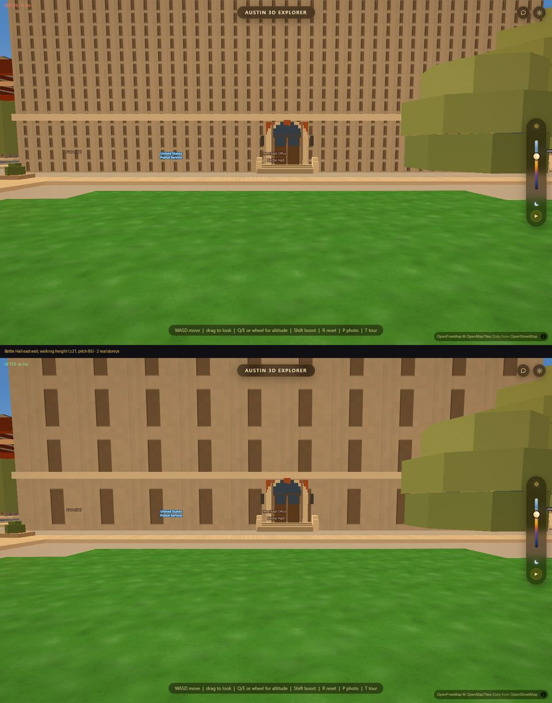
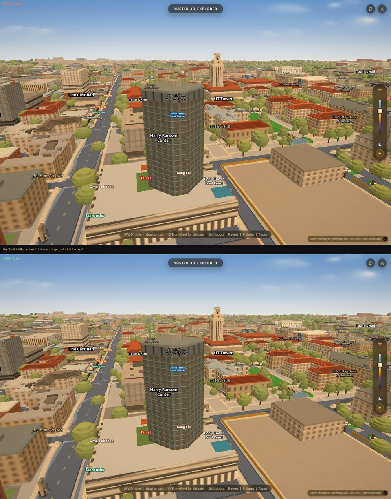
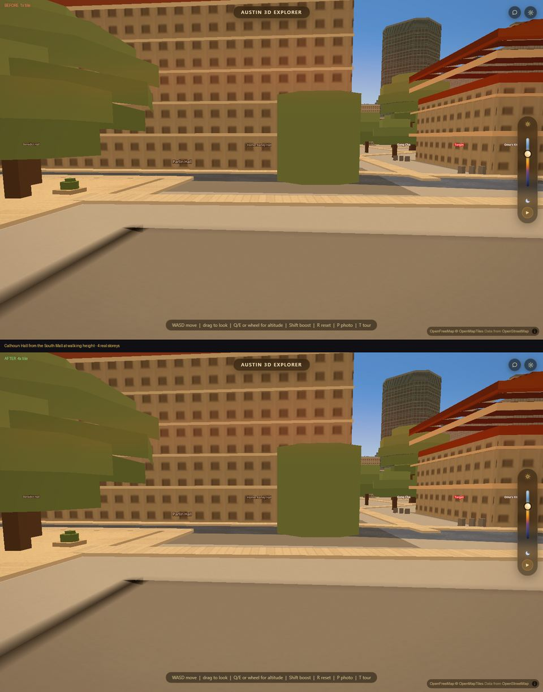

# A measured building gets a bigger tile

*Acer lane, 2026-08-27, branch `acer/cd-facades`. Round 3 of the facade work.*

## The defect, in one picture

This is Battle Hall's east wall from the lawn at walking height — eye height,
gaze lowered, which in this app is camera zoom 21. Battle Hall has **two**
storeys: a rusticated ground floor under one tall floor of round-arched
Palladian bays.



The top half is what shipped. Twenty rows of tiny slits — corduroy, not a
building. The previous round measured the storeys off a photograph and anchored
them in metres, and it was right at every zoom the camera *cruises* at and
still wrong here, by 10.4×.

## Why the metre anchor could not fix it, and what was actually in the way

`rows` is an integer and it is at least 1, so **the coarsest storey pitch a tile
can draw is one repeat**. One repeat covers `TIER_CSS × 67551 / 2^zoom` metres
of wall — 1.03 m at z21. Battle Hall's storeys are 10.75 m apart. No redrawing
of a 64-unit tile reaches that.

Round 2 wrote down the two ways out and started neither, and the arithmetic that
made the first one look unaffordable was for a tile that grows in both axes for
*every* building in the city:

* `displaySize` is `texels / pixelRatio`, and MapLibre carries `pixelRatio` in a
  `Uint16` vertex attribute, so it cannot go below 1. A bigger repeat needs a
  bigger **image**. There is no free scaling knob. That part was right.
* **But `pixelRatio` cancels.** A family drawn in a `TILE·mul` unit space at
  `RES·mul` texels registers at `RES·mul / (TIER_CSS·mul)` — *the same
  pixelRatio it has today* — and lands a `displaySize` of `TIER_CSS·mul` CSS px.
  So the whole change is "this family's image is `mul` times larger per axis".
  Every invariant in the TIERS block survives untouched: both tiers of a family
  still share one scale, and the mip chain is still one drawing at two
  resolutions.
* **A drawing unit is the same number of metres at every `mul`.**
  `TIER_CSS·mul·67551 / 2^z` metres spread over `TILE·mul` units cancels to
  `TIER_CSS·67551 / (2^z·TILE)`. That is why `MIN_PIER`, `MIN_SPANDREL`,
  `WALL.CELL`, the head shadow, the sill and every other pixel constant in
  `js/facades.js` are **left alone and still mean what they meant** — and why
  the aliasing floor is preserved exactly: texels per unit is `SCALE` either
  way, so a `mul` tile is no denser on screen than a template one. Only the
  counts scale, which is why `GRID_CLAMP` is multiplied and nothing else is.
* **Only the sixteen measured buildings pay.** A template family keeps `mul` 1
  and its bytes do not move, so the other ~340 combos in the atlas are
  untouched. `MEASURED_MUL = 4`.

## The numbers

`scripts/verify/facadegrid.mjs` reads the RGBA bytes of the atlas image MapLibre
is actually sampling, at every zoom the camera reaches. Both arms measured on
the same build in the same minute through the new `--mul1` flag, which is
`?facademul=1` — a URL, not a checkout, because an A/B across two checkouts
measures the machine.

| | before | after |
|---|---|---|
| worst rendered-rows ÷ photographed-storeys, LOOK band z16–19 | 2.61× | **1.30×** |
| worst rendered-rows ÷ photographed-storeys, WALK band z20–21 | 10.43× | **2.61×** |
| worst bay residual at z21 (6.6 m bays drawn as…) | 1.03 m | **4.12 m** |
| crawl at walking height, `shimmer.mjs` battle-walk | 44.28 % | **23.97 %** |
| crawl at cruise, mall-battle / mall-south / pcl-plaza | 3.17 / 2.58 / 5.49 % | **3.14 / 2.57 / 5.49 %** |
| facadegrid assertions | — | 0 failing |

Every one of the sixteen improved. The two ratchets came down with it:
`RATCHET_NEAR` 2.7 → **1.4**, `RATCHET_WALK` 10.5 → **2.7**.

**The crawl went the right way, and that was not guaranteed.** A denser grid is
what `docs/shimmer-mechanism.md` convicts for the window crawl; a *coarser* one
has fewer sub-pixel features to alias, and at walking height that halves it.
At cruise nothing moves, because at cruise the `mul` tile draws the same metre
pitch the 1× tile did.



That frame is the point: the change is invisible where the camera spends most of
its time and decisive where Simeon actually stands.



Calhoun Hall has four storeys. Note the building on the right of that frame —
unmeasured, still on its template, and identical in both halves.

## What it cost, measured

`scripts/verify/facadeatlas.mjs` is new and exists for this: it reads the bytes
off the images MapLibre is holding rather than recomputing them from the config,
waits for the atlas to stop growing rather than for a fixed number of seconds
(the first cut of it reported 222 images against 445 for the same city and the
whole difference was that), and takes the minimum of interleaved reps.

```
arm          mul   images   total KB   measured KB   biggest KB   repaint ms   no-op ms   anchor ms
measured     4x      445      10050          5120          256        675.9        0.6       415.5
?mul=1       1x      445       5250           320           36        387.5        0.5       173.7
```

* **The atlas nearly doubles**, 5250 → 10050 KB, and all of the growth is the
  sixteen buildings' own images (320 → 5120 KB). The largest single image goes
  from 36 KB to 256 KB.
* **A full repaint costs 1.7× more** — 388 → 676 ms of main-thread canvas work,
  headless swiftshader. This repo's own calibration for the same class of work
  is that hardware GL runs it about 2.2× faster, so call it ~180 → ~310 ms real.
  That is paid on an hour change and on a zoom-anchor crossing, both of which
  already go through the existing `FLUSH_MS` floor.
* **The per-frame path is unchanged: 0.6 ms against 0.5 ms.** `updateFacades`
  called with nothing moved walks the combo list and draws nothing, and that is
  what a flying frame pays. The 2–3 % main-thread share won on 2026-08-19 is
  about that number, and it did not move.
* Load time to a drawn city: 7431 ms against 7390 ms, minimum of two interleaved
  reps each, which is inside this suite's own documented noise — the four
  readings spanned 7390–7843 ms.

**`MEASURED_MUL` is the whole knob**, and what each value buys, computed over
z16–z21 against the sixteen photographed storey counts:

| mul | 1 | 2 | **4** | 8 | 16 |
|---|---|---|---|---|---|
| worst residual | 10.43× | 5.21× | **2.61×** | 1.30× | 1.30× |
| worst bay residual | 6.40× | 3.20× | **1.60×** | 1.25× | 1.25× |
| atlas cost | +0 % | +17 % | **+91 %** | +285 % | +1140 % |

4 puts the WALK band where the LOOK band already was. **8 is the next honest
step and it is an atlas-budget decision, not a correctness one** — it would take
Battle Hall to 1.30× and quadruple the sixteen buildings' share again.

## Two things in the instrument that had to be fixed first, and one that was lying

The zoom sweep converts a tile's row count into rows-on-a-building through the
repeat. A measured family's repeat is now four times bigger, so:

1. **`facadegrid.mjs` reads each family's OWN repeat** (`facadeFamRepeatMAt`).
   Using the template repeat would have reported a 4× tile as drawing four times
   the rows it draws — the same class of error the sweep exists to catch, made
   by the instrument instead of by the app.
2. **The DFT's bin ceiling scales with the tile.** 16 bins covered every grid a
   64-unit tile could produce; the Tower's 4× tile legitimately asks for 38 rows
   at z16.

And the one that was lying:

3. **The opening-size measurement was an extreme-value estimator.** It took the
   longest dark run on the darkest line, over the whole image, at a threshold
   30 % of the way from the tile's glass level to its wall level. Three separate
   biases, all systematic:
   * a max over more samples reports a bigger number, so the same drawing read
     3×6 at `mul` 1 and **3×13** at `mul` 4;
   * `T/rows` is almost never a whole number of texels, so the rounded openings
     alternate between *n* and *n+1* and the max always reports *n+1*, plus any
     pair the near tier's 0.75-texel soften has fused;
   * the global threshold also catches the head shadow drawn above every
     opening, so heights read long, while the bright pilaster cuts widths short.

   It now measures in one **template-sized window** of the image, takes the
   **median** run rather than the largest, and thresholds at **half-depth on
   that line** (full-width-at-half-maximum, which a symmetric blur does not
   move). The row now prints what the counter **read** beside what the module
   **drew**, so the counter audits itself in public: it lands within one texel
   on both axes for **10 of the 16**, and the six it misses are exactly the
   tiles sitting at their row ceiling, whose openings are physically fused.

   **This is what turned three green assertions into reported numbers, and it is
   worth saying plainly.** Burdine Hall's tile draws a 2×3 opening; the old
   counter reported 2×9 — a fused stack of three — which happened to sit near
   its photographed 5.5:1 and passed. Garrison, Burdine and Perry-Castañeda are
   now printed under **CELL-LIMITED**: their tiles are at the row ceiling, so
   the cell is 6.4 units tall, and a 5.5:1 opening needs 14. That is the
   extrusion height forcing the row count, the same defect already printed under
   HEIGHT-LIMITED, and asserting it as a shape error puts a permanent red on the
   wrong subsystem.

## One change to the drawing itself

`hCap` is `floor(stepY − MIN_SPANDREL)`, and it bites hardest exactly where the
metre anchor works best: getting a storey pitch *right* can make the cell
shorter than the rounded-up one it replaced. On the UT Tower's 4× tile that came
out **4 units wide by 3 tall** — a window wider than it is tall, on a building
whose photographed openings are 1.4:1 the other way. The previous round's
headline was "every window turned portrait"; a cap that quietly turns one back
is a regression of it.

So the orientation is held even when the size cannot be: if the photograph says
taller-than-wide and the cell has forced the opposite, the width comes down to
match the height that survived. It only ever makes an opening narrower, so it
cannot break `MIN_PIER`, and it is a no-op on every template at `REF_ZOOM` and
on thirteen of the sixteen.

## Unchanged, and re-run to prove it

* `facade_parity.py` **PASS 3057/3057**, 14 buckets, 80 combos, bijection.
  `facade-parity.mjs` **PASS**, `wp` and `wf` identical 3057/3057. The
  same-as-template test that assigns a family is deliberately taken at `mul` 1,
  so the family every building wears is byte-identical to the previous round —
  otherwise growing a tile would have handed every building a new family code
  for a reason that has nothing to do with the building.
* `night-silhouette.mjs` **PASS** — night separation 22.5, dusk 10.0, the same
  digits as §199.
* `coplanar.mjs --gate` — no file gained a coplanar pair.
* `campusmeter.mjs` facades **A 0/7, B 3/5**, both unchanged. A is the held-out
  *template* path — it evaluates `familyFor` outside a browser where the
  measured registry is empty by construction, and it stays pinned at 0/7 until
  the templates themselves change. B was made `mul`-aware (it must model the
  derivation the app actually runs) and reports the same 3 of 5 either way,
  because the `mul` multiplies the repeat and the row count together and cancels
  in the number on the wall.
* `harness-drift.mjs` PASS, `boot.mjs` clean.

## Watched failing

* `node facadegrid.mjs --break` — empties the measured registry in the page: 64
  failures.
* `node facadegrid.mjs --break-anchor` — pins the anchor at `REF_ZOOM`: 3
  failures.
* `node facadegrid.mjs --mul1` — the A/B arm, and against the new ratchets it is
  **red, exit 1**: LOOK 2.61× against a 1.4 ratchet, WALK 10.43× against 2.7.
  The ratchet can therefore be watched failing by turning off the thing that
  earned it, which is the strongest form of this guard available.

## What is still wrong

**Battle Hall is still the building this band cannot draw right.** 2.61× at
z21, down from 10.43×, and the picture above shows it: the after has a readable
storey rhythm and it is still not two storeys. The floor is unchanged in kind —
`rows` is an integer ≥ 1 and the coarsest pitch is one repeat, now 4.12 m at z21
instead of 1.03 m. Closing the rest is the same two choices: `MEASURED_MUL = 8`,
which is an atlas-budget decision with a measured price tag in this document; or
geometry, which `data/campus_storeys.geojson` already is and which is the only
route that can also give a wall an opening SHAPE that differs storey to storey.

**Three buildings are cell-limited and one is height-limited for the same
reason:** Burdine's eight floors are extruded into 12.8 m, Perry-Castañeda's
seven into 15.8 m, Jackson's seven into 16.7 m. Those tiles sit at the row
ceiling, their cells are 6.4 units, and no facade change reaches them. It is the
height bake's defect and it is now printed under two headings instead of one.

**Only sixteen buildings have a measured grid**, so ~180 UT buildings and the
whole of downtown still wear one of seven templates at `mul` 1. The mechanism
here is per-building by construction — a building earns the bigger tile by
having been photographed — so the way to spend it is more photographs, not more
code.

**`js/heroes.js`'s seven pattern layers were not given a `mul`.** They were
metre-anchored in round 2 and they have the same floor at z21 that the atlas had
before this round. EER, GDC, NHB and the three curtain walls are the next
obvious application of exactly this change.
