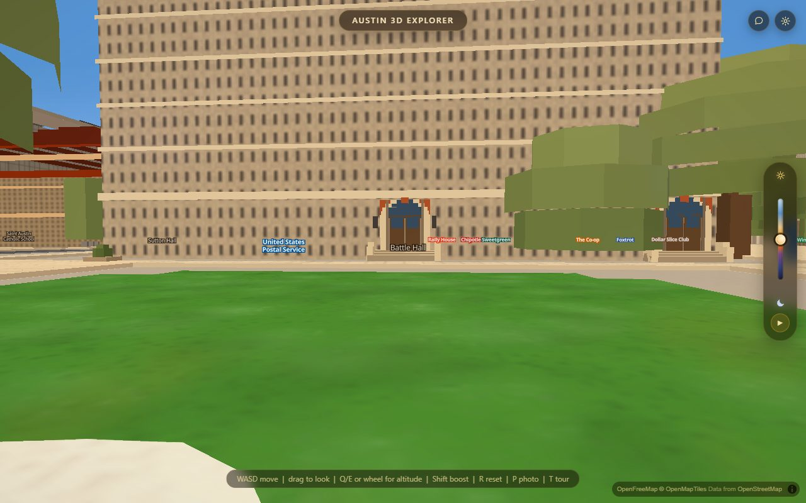
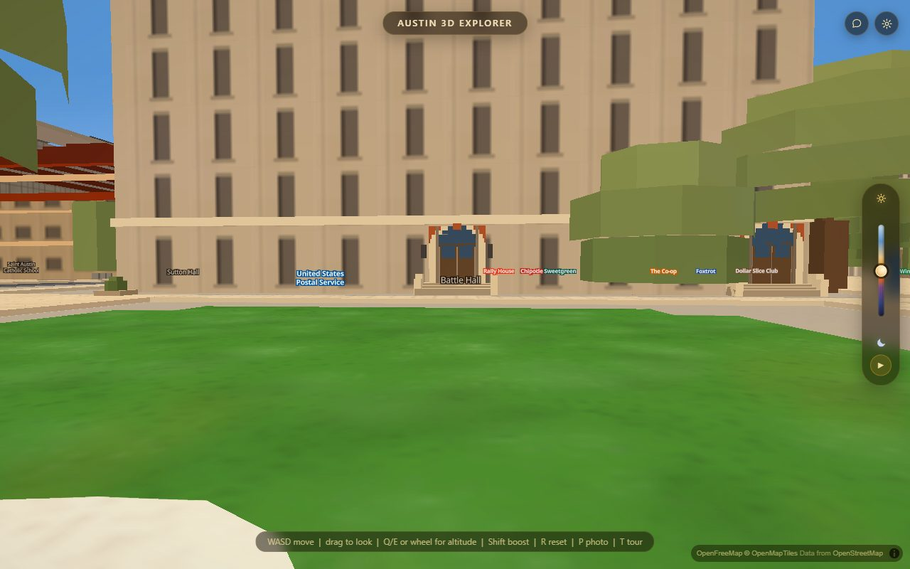
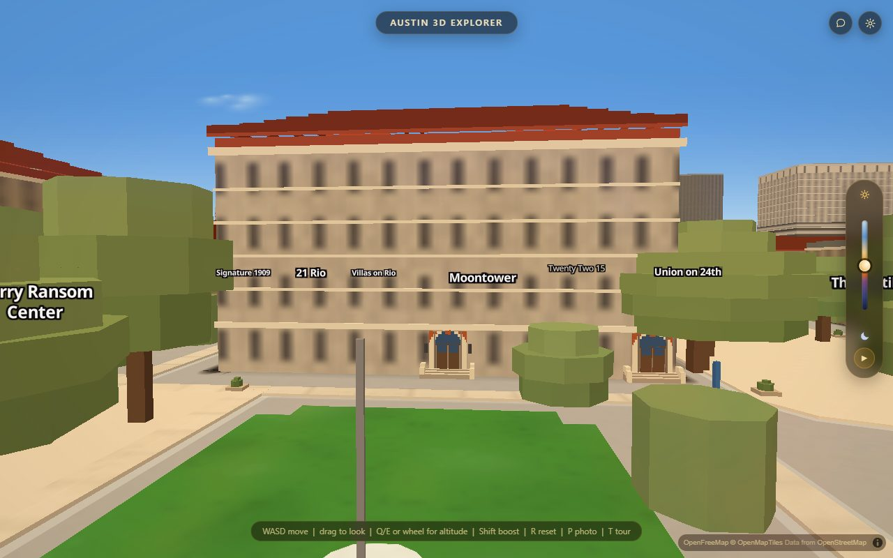
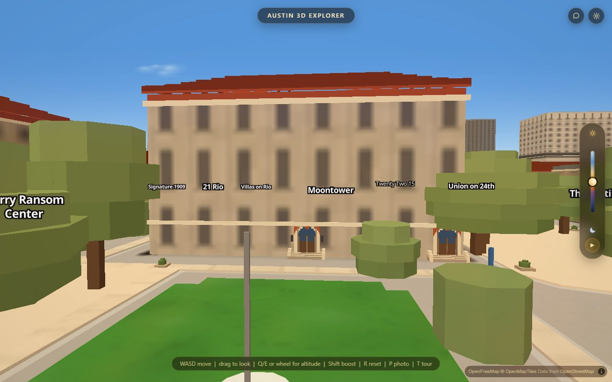
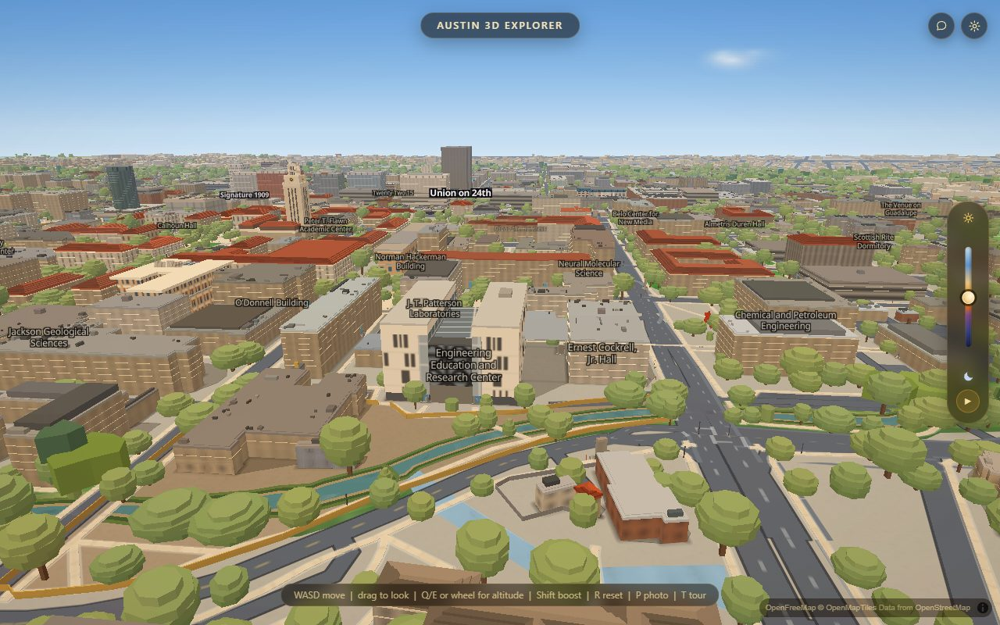

# The window grid is a pitch in metres

*Acer lane, 2026-08-27, branch `acer/cd-facades`. Round 2 of the facade work.*

## What was wrong

The previous pass measured sixteen campus buildings' storeys off licensed
photographs and put those counts into the facade tiles. It was right at **one
zoom** — 16, the level the count-to-tile conversion was anchored at — and the
app does not spend much time there.

One pattern repeat covers `TIER_CSS × 67551 / 2^tileZoom` metres of wall. That
**halves every zoom you come in**, so a tile holding a fixed row count draws a
storey pitch that halves with it:

| camera zoom | 16 | 17 | 18 | 19 | 20 | 21 |
|---|---|---|---|---|---|---|
| metres per repeat | 32.98 | 16.49 | 8.25 | 4.12 | 2.06 | 1.03 |
| `mh`'s 8 rows land every | 4.12 m | 2.06 | 1.03 | 0.52 | 0.26 | **0.13 m** |

Measured on the running app rather than derived: standing 30 m off Battle
Hall's east wall at eye height (1.7 m, pitch 88 — the pose this app's own walk
mode puts you in) the camera is at **z19.93**, and Battle Hall — a *two*-storey
building — rendered about **fifteen** rows of windows. At pitch 85, the other
end of the band walking height can express, it is z21.3 and about thirty. Every
"stand and look at a building" pose placed on the real app came out z17.1–17.8.
Never 16.

## What changed

A family now carries **`pitchM`** (floor-to-floor) and **`bayM`** (bay centres),
both in metres. The row and column counts are derived against the repeat the
camera is currently drawing at, and the tile is redrawn (`updateImage`, same id,
same size, same `pixelRatio`) when the camera crosses an integer zoom.

The authored `GRIDS` table in `js/facades.js` is untouched and is still the
taste knob — the metre form is *derived* from it and reproduces every one of
`rows/cols/w/h` exactly at `REF_ZOOM`, so the z≤16 render is bit-identical.

This **removes a pop rather than adding one.** The repeat already jumps 2× at
every integer crossing, so today the rhythm on a wall visibly doubles as you
cross one. With the count moving in step, the metre pitch is continuous across
it and only the texel resolution changes.

The same anchor was applied to everything else in the file that was a fixed
pixel size and therefore secretly a shrinking size in metres: the wall mottle
cell (a "2 m block face" was 26 cm at walking height), the weathering streaks,
the parking-deck band pitch, the pilasters, and the window head shadow, sill and
reveal.

## And the storey courses are photographed now too

`data/campus_storeys.geojson` draws proud rings — base course, floor line,
cornice — as **geometry in metres**, so unlike the tile it is the same storeys
at every zoom. It was dividing each wall by a nominal 3.46 m or by OSM's
`building:levels`, which gave Battle Hall **five** floor lines.

`scripts/bake_campus_storeys.py` now reads `data/facade_grids.json` first, so a
storey count somebody counted on a photograph of that exact elevation outranks
both. Battle Hall is now a base course, **one grand storey**, and a cornice —
which is what the photograph shows.

| | before | after |
|---|---|---|
| pitch from a photographed count | — | 10 buildings |
| photographed count refused (implied pitch under 2 m) | — | 2 |
| pitch from `num_floors` | 21 | 18 |
| nominal 3.46 m | 323 | 316 |
| storey bands drawn | 747 | 734 |

The two refusals are Burdine and the Jackson School, whose photographed storey
counts do not fit the height the app extrudes them at (Burdine's eight floors
are extruded into 12.8 m). They fall back to the nominal and are counted as
`pitch_photo_rejected` — the same defect `facadegrid.mjs` reports as
HEIGHT-LIMITED rather than grid-wrong. It belongs to the height bake.

## The numbers

From the zoom sweep added to `scripts/verify/facadegrid.mjs`, which reads the
atlas bytes MapLibre is actually sampling at each of z16…z21. Both arms measured
on the same build in the same minute through `?facadeanchor=0`.

| | before | after |
|---|---|---|
| cells where the tile carries its own metre pitch | 16 of 96 (z16 only) | **96 of 96** |
| worst rendered-rows ÷ photographed-storeys, LOOK band z16–19 | 8.4× | **2.6×** |
| worst rendered-rows ÷ photographed-storeys, WALK band z20–21 | 33.7× | **10.4×** |
| crawl, `shimmer.mjs` mall-battle | 4.04 % | **3.23 %** |
| crawl, mall-south and pcl-plaza | unchanged to the digit — both sit at anchor 16 | |
| atlas | 5250 KB / 708 images | **5250 KB / 708 images** |

Cost of a zoom crossing, headless swiftshader on a busy machine (the repo's
hardware-GL figure for the same work is 80.4 ms), minimum of interleaved reps:
`16→17` 180 ms, `17→18` 172, `18→19` 172, `19→20` **3.9**, `20→21` **0.4**. Past
z19 nothing in any tile changes, so nothing is redrawn; and every crossing goes
through the existing `FLUSH_MS` floor, so a scroll wheel pays once per 90 ms
rather than once per crossing.

Unchanged and re-run: `facade_parity.py` PASS 3057/3057, `facade-parity.mjs`
PASS 3057/3057 on both `wp` and `wf`, `night-silhouette` PASS, `dusk` PASS,
`coplanar --gate` no file gained a pair, `campusmeter` facades A 0/7 and B 3/5
(metric A is the held-out **template** path, and this pass deliberately did not
touch the templates' authored numbers).

## Four things the sweep found that no assertion at REF_ZOOM could have

1. The app's idle cinematic was reverting the forced anchor mid-measurement, so
   the first cut of the sweep silently read the REF tile at four of six zooms —
   and it read as "the anchor does not work at z20".
2. Scaling the head shadow and sill into metres closed the spandrel on six
   buildings and fused their rows into one dark field.
3. Holding the glazing **fraction** while the cell grows asks for one enormous
   window per cell once a wall is down to one or two columns — Sutton wanted a
   29 px opening in a 32 px cell. `OPEN_MAX_FRAC` 0.72 is the cap, and it does
   not bite at REF_ZOOM on any template or any of the sixteen.
4. Gregory Gym's colour bucket puts its glass within a few luma of its own
   brick, so its windows are invisible **at every zoom**. `GLASS_MIN_CONTRAST`
   is a day-time floor on that separation, applied in whichever direction the
   wall leaves room for.

## What is still wrong

**A tile cannot draw a storey pitch coarser than one repeat.** `rows` is an
integer ≥ 1, so at z21 — reachable by standing at eye height and lowering your
gaze — the coarsest pitch expressible is 1.03 m, and Battle Hall's storeys are
10.75 m apart. It therefore still renders about twenty rows there where the
building has two. No redrawing of a tile fixes that. The two ways out are:

* a bigger `displaySize`, which needs a bigger **image** — MapLibre carries
  `pixelRatio` as a `Uint16` vertex attribute and it cannot go below 1, so
  `displaySize` is capped at the image's own texel count. Holding a 33 m repeat
  at z21 needs a 1024-texel tile per (family × colour bucket). That is an atlas
  budget question, and the atlas budget was hard-won (its main-thread share went
  from ~46 % to 2–3 % on 2026-08-19).
* **geometry**, which is what `data/campus_storeys.geojson` already is, and why
  the photographed storey counts were pushed into it this round.

Two more, named rather than fixed:

* **`js/heroes.js` has seven pattern layers this work has never reached** (EER,
  Dell CS, the PCL block). They carry their own grids and none of this applies
  to them.
* **The tile has no vertical anchor, so it cannot say that a building's storeys
  differ from each other.** Battle Hall's real elevation is a rusticated ground
  floor under one storey of tall round-arched Palladian bays; the tile can only
  draw one opening shape repeated. Adding arches uniformly would put arches on
  the rusticated base too — on the sixteen measured buildings, almost none has
  the *same* head on every storey — so it was deliberately not done. That is a
  geometry job, not a tile one.

## The seven hero tiles, added the same day

`js/heroes.js` carries seven `fill-extrusion-pattern` layers of its own — EER's
limestone and its lattice cage, GDC's brick, NHB's brick, and three curtain
walls — and the atlas work had never reached them. They have the identical
defect, and this file's own EER comment already named it: *"fill-extrusion-pattern
has no vertical anchor and its world scale halves at every integer zoom."*

They are registered with no `pixelRatio`, so their `displaySize` is 64 and one
repeat is 32.98 m of wall at **z17** — the same 33 m the facade atlas gets at
z16, one zoom apart because the atlas is pixelRatio 2. That is why
`HERO_REF_ZOOM` is 17.

EER's floor line, in metres, against a measured 4.65 m floor
(`bake_heroes.py`'s own number: a 40.5 m parapet over nine floors less a 3.0 m
ground-floor overrun):

| camera zoom | 17 | 18 | 19 | 20 | 21 |
|---|---|---|---|---|---|
| before | 3.66 m | 1.83 | 0.92 | 0.46 | **0.23 m** |
| after | 4.71 m | 4.12 | 4.13 | 4.12 | 2.06 |

GDC, against a measured 4.10 m Pelli module: 4.12 m at every zoom from 17 to 20,
and its authored eight rows already landed on that at z17 — so GDC does not move
at cruise at all, it just stops collapsing as you come in.

EER **does** move at cruise, from nine rows to seven, and that is deliberate:
nine rows put a floor line every 3.66 m on a building whose floors are 4.65 m
apart, and this file's comment had accepted it as "the closest a pattern can
get". It was only the closest while the count was fixed.

The EER **lattice cage** was deliberately left alone. It is one object, not a
rhythm — "the cage is 21.4 m wide and 21.1 m tall and its panels are square" —
so a metre pitch would ask for eight panels where the photograph shows five.
Anchoring it means drawing the cage as geometry at its own size, not changing a
count in a tile.
