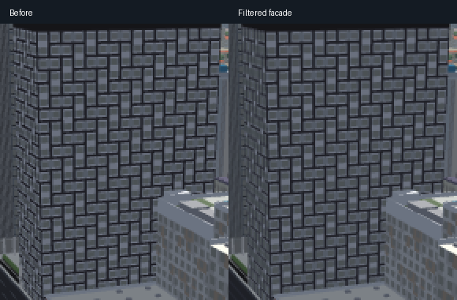
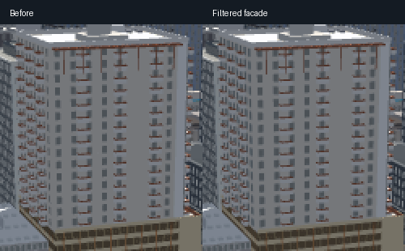

# Filtered apartment windows

Union on 24th and 21 Rio now use filtered versions of their authored facade
patterns on desktop when window details become smaller than a pixel. The
original recessed geometry remains visible close up and supplies the shadows.
Each building keeps its own window arrangement; this does not replace facades
with a common grid.

## Result and scope

The matched Union narrow-wall sequence reduces temporal second difference
about 80%; the wider wall improves about 22%. The corresponding Rio narrow-wall
improvement is about 33%, with a smaller improvement on its wider face. These
are image measurements along a short matched camera path, not a claim that
all shimmer has disappeared. Narrow-wall mean brightness falls about 4.3% at
Union and 2.7% at Rio as the alternating bright and dark details are averaged.

Every accepted sequence uses the complete ready city: all 196 authored
buildings, normal tiles, indexed geometry and no loading veil. Captures use the
second screenshot after each camera change. Graphics auto-detection and idle
drift are cancelled; lighting and exposure are held constant. Private camera
coordinates and owner references are excluded from this document and report.

The final batched close Union comparison changes only 11 pixels by at most
2/255; the night comparison changes zero pixels within 22,592 facade-mask
pixels. Night lighting retains the original geometry because filtering colors
before the emission threshold would change which windows light up.

## Implementation and cost

The texture generator integrates the actual tile rectangles by area, including
fractional boundary coverage. Separate mipmapped texture-array layers preserve
each face without atlas bleeding. There are 89 filtered faces in 12 batches;
the tested view adds 12 draw calls and 178 triangles. GPU texture allocation
including mipmaps is 14,705,940 bytes. Retained CPU pixel arrays add roughly
11 MiB, with additional temporary rasterization and packing allocations. This
is not a measurement of total browser memory.

Four interleaved off/on/on/off ten-second rotation runs at 651×598 CSS pixels,
DPR 1.5, native CPU speed, hardware GL and the normal small-viewport MSAA
default measured best mean frame times of
21.414 ms off and 21.303 ms on. Best p95 values were 35.9 and 35.8 ms. This is
within run variation, not evidence of a speed improvement. The earlier
one-draw-per-face version was rejected for its measured slowdown.

At 1536×864 CSS pixels with the same DPR, CPU and GL settings, a fresh default
load also passes full-city readiness. Four interleaved ten-second runs give
best means of 20.364 ms off and 18.688 ms on, with best p95 values of 36.0 and
18.2 ms. The substantial run variation prevents a speedup claim; neither tested
viewport reproduces the earlier per-face draw overhead after batching. The
large view adds the same 12 calls and 178 triangles. No candidate run has a
frame above 100 ms or a runtime error.

The large default context disables MSAA under the existing pixel budget;
the small default context enables it. A Rio capture after resizing the large
context back to small retained MSAA off and was rejected as mismatched against
the earlier small-context baseline. Final small-view comparisons use a fresh
small default context. The large off/on performance pair uses the same MSAA-off
context on both arms.

The [sanitized verification report](verification/window-filter-summary.json)
records final source hashes, large-viewport results and readiness checks.

## Controls and remaining work

`APARTMENTS.facadeFilter` in `js/slopes-apartments.js` owns the target list,
distance fade, night fade, resolution, anisotropy and allocation limit.
`?facadefilter=0` disables the pilot; `?facadefilter=1` explicitly enables it.
Desktop defaults enable the two-building pilot. Phone defaults remain off.

This is a bounded repair, not citywide acceptance. Other apartment facades,
unidentified narrow walls, nighttime shimmer, physical iPhone Safari/Chrome
performance and memory remain open. Wider coverage needs its own motion and
allocation checks. The production recovery-event delay and explicit time
playback responsiveness are separate unresolved issues.

The CPU verification script checks area integration, coverage rejection,
material masks, actual tile generation, startup defaults, merged attributes,
allocation failure cleanup and shared texture disposal. A deliberate
point-sampling defect is rejected. Harness parity, apartment material response
and map lifecycle checks also pass.
