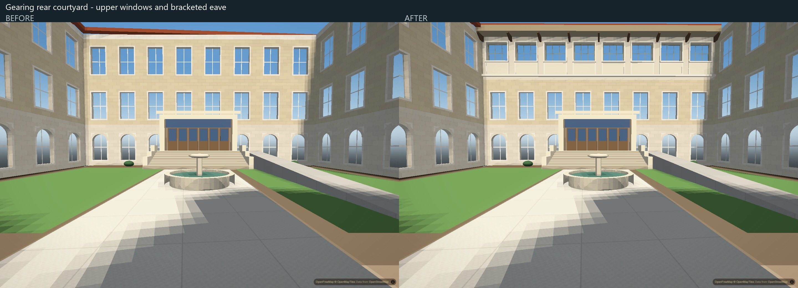
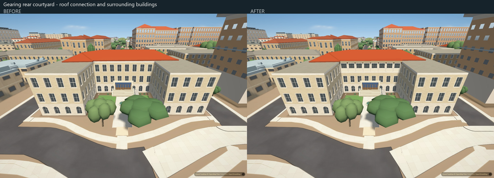

# Gearing rear courtyard upper facade

The rear court previously used a generic tall window row with no deep, bracketed eave. This correction adds eight compact tripartite openings, recessed glazing and sash, pale framed panels, a continuous sillcourse and nine brackets beneath a closed eave. The eave meets the existing skewed roof and continues its tile colours.

## Scope and tuning

Only the upper band of the two connected rear court wall segments changes. The existing lower windows and entrances, side walls, towers, footprint, floor levels, pitched roof rig, garden and ramps remain. All 36 other campus building models are unchanged.

Dimensions, colour triples, materials and upper-window night lighting are adjustable in `scripts/campus_gearing.py`, with per-profile overrides. The new upper windows remain unlit by default. The eave's rear edge follows the roof's existing skew rather than assuming it is parallel to the wall; its rear tile seam is buried approximately 4.5 cm beneath the roof slope.

## Verification

Matched application views use the same normal vegetation, balanced graphics, 74-degree view-width setting, 1440 by 960 viewport, DPR 1 and fixed exposure. The court and oblique cameras are at an actual 1.798 m above ground; the overview is elevated. Day and night captures use the second screenshot after settling. These are application comparisons, not calibrated photo overlays.

The final loaded campus asset matches the tested file's SHA-256. All 196 authored buildings load without missing replacements or page/console errors. Balanced authored geometry increases from 3,046,589 to 3,047,925 triangles, a net addition of 1,336. The sampled courtyard view retains 24 draw calls. These are geometry counts, not a speed or device-memory result.

`python scripts/verify/gearing-court-data.py d449bd4bb914661dd7f22822e6035fe264a5f196` checks all 1,428 added detail triangles for finite, nondegenerate, closed outward geometry, detects a deliberately removed face, confirms continuous spacing of the eight openings across the wall split, and compares the lower bands, other elevations and neighbouring campus models against the baseline. Harness drift passes with 48 matching scripts.

Actual-city checks retain an open courtyard ray and collision volume, valid wing collision, continuous existing ramp height, and no retired duplicate ramp. A 12-second daylight rotation retains all 196 buildings and settles afterward without errors. The first trial incorrectly waited at night for the inactive sunlight-shadow proxy; the corrected check runs in daylight. This is a load and movement smoke check, not citywide flicker or idle-pause acceptance.

## Remaining limits

Dimensions are exterior-view approximations rather than surveyed measurements. Towers, roof vents and texture, lower loggia and gate, fine sash profiles and unphotographed elevations remain simplified or outside this pass. The improvement does not establish full photographic acceptance. Physical iPhone Safari and Chrome performance remain unverified.
