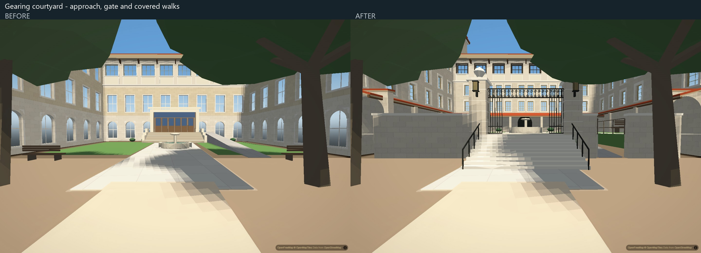
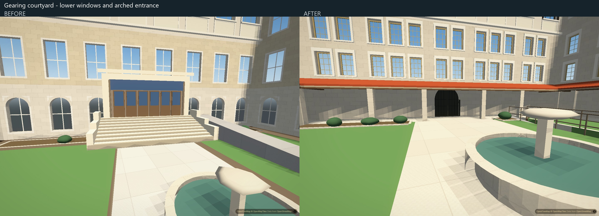
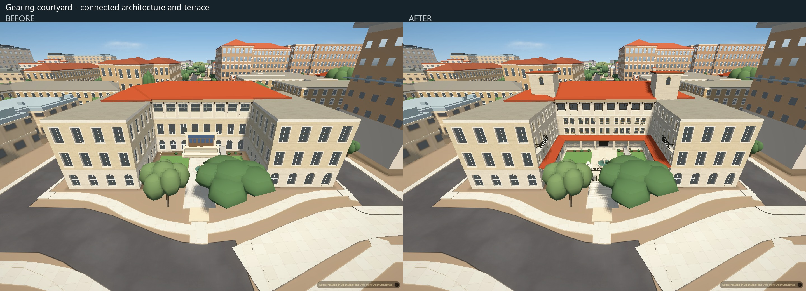
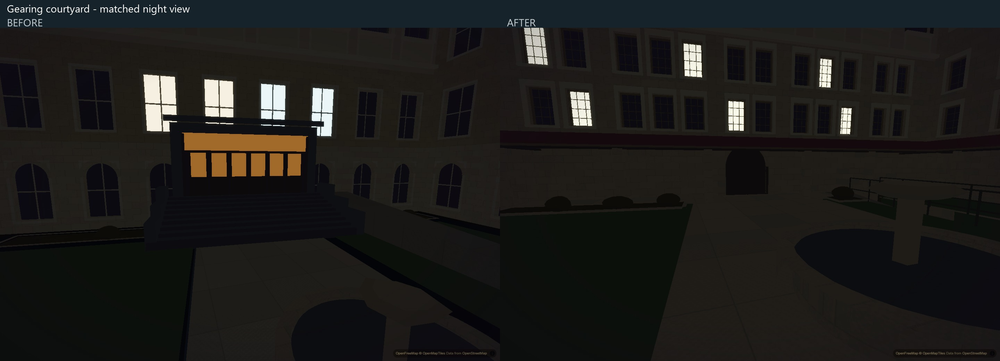

# Gearing courtyard

This pass brings the rear court together: dark upper timber sash, two lower registers of grouped rectangular windows, side windows and balcony doors, a covered arcade and arched entrance, gate piers and metalwork, and two shallow-capped towers. A raised terrace connects the approach steps, garden and retained access ramp. Temporary construction equipment is excluded.

These are second captures from the real application at 1440 x 960, DPR 1, hardware Chromium, the balanced preset, a 74-degree view width and no CPU throttling. Automatic graphics detection and automatic exposure are disabled; time-of-day and camera settings match within each pair. The inside views retain the same absolute camera elevation; the raised terrace therefore changes the eye's height above the ground. The ordinary exterior trees remain, including their foreground occlusion. All images show application output only.

## Architecture and ground

The mapped U-shaped footprint, original floor levels and separately baked main roofs remain. All 36 other campus building models are unchanged. The earlier upper eave and its roof connection remain, while its windows are narrower, higher and darker. The balconies now meet actual door openings. Closed geometry forms the arches, canopy undersides, pier caps, urns, rails and tower cornices.

The courtyard grade is an inferred 1.57 m, matching the existing rear ramp landing; it is not a surveyed elevation. The landscape bake raises and clips the existing garden, keeps planting away from the covered walks, moves the front benches onto the terrace and adds ten walkable stair treads. The original ramp vertices and its four legacy slab records remain unchanged. The added railings stop short of the rear wall to leave a usable crossover from the terrace onto the ramp; their endpoint, like the terrace datum, is inferred. Only the 44 obsolete rear door, stair and railing pieces are retired; all other entrance records retain their order and content.

The architecture values live in `scripts/campus_gearing.py` and `scripts/campus_gearing_court.py`. The ground values live in `scripts/campus_gearing_ground.py`. Stair count, run, width and grade must agree between the two owning bakes; the ground regression checks that relationship. Ground support uses explicit surfaces and a cached spatial index, so a covered walk does not place the camera on its canopy. These local heights assume the application's current flat terrain; a future terrain mesh will need to reconcile its datum with these surfaces.

The walking check exposed an existing collision error: coarse six-metre cells covered part of the open court. Core building collision now uses cached footprint boundaries and courtyard holes at every altitude, while retaining the separate outer-city collision field. Using the same precise boundary throughout avoids a camera jump at the former walking-height switch. The raster remains available for diagnostic accounting; it no longer decides core collisions.

## Verification

The architecture regression checks 1,406 closed outward solids, 8 upper windows, 24 lower rear windows, 36 side openings including four balcony doors, the split rear doorway, tower caps and arch/canopy clearances. Missing-face and reversed-solid controls fail as intended. Upper details contain 1,428 triangles and courtyard details 16,056, within their named budgets. These are detail counts, not a performance result.

Run `python scripts/verify/gearing-court-data.py 5bd19d9`, `node scripts/verify/gearing-ground.cjs` and `node scripts/verify/collision-raster.cjs` for the focused data and ground checks. The ground check exercises the actual floor index and isolated production control statements. The collision check covers concave courts, holes with separate buildings, thin walls, outer obstacles and consistent geometry across the former altitude threshold. Browser walking is a separate requirement.

The final hardware-browser run loads all 196 authored buildings without page or console errors and verifies the loaded bytes of the campus, landscape, entrance and two changed control modules. Open-court ray/collision checks, finite geometry, missing replacements and the original ramp plane pass. A short daylight rotation also completes; it is not a citywide motion-performance result. The 48-script harness matches the application.

Actual keyboard input walks up all ten treads, stops and restarts on the terrace, crosses the rear opening onto the ramp and descends to the outside path. The crossing and descent use one continuous camera path with no pose reset between them. Across 1,925 sampled frames, eye clearance remains between 1.796 and 1.827 m; all five settled stop observations have zero drift. An earlier invalid near-wall ramp start failed and was retained as failure evidence before the collision and crossover corrections.

The shared control harnesses now cancel graphics detection before it can fire, wait for the complete city, and fail if a previous movement does not settle before camera placement. Collision placement uses the current field of view and verifies the resulting pose. Street, tower, touch and glide durations use effective simulation time rather than frame counts. The original failed runs are retained locally: collision silently overwrote poses, while the movement glide sampled only 2.16 simulation seconds and still measured 0.47 m/s. Clearance, street-height, travel-distance and stopping-speed thresholds are retained; the tower check additionally requires a real approach.

The final hardware collision run passes all nine assertions: 528 random-flight samples retain at least 4.00 m roof clearance; street flight stays at 24 m while covering 112 m; the tower approach moves from 140 m to 22.6 m from the sampled point, against a target wall at 22.0 m, and stays at 40 m altitude. Simultaneous joystick movement and looking moves 134.7 m and turns 36 degrees without zoom change. No page errors occur. These are collision/input checks, not physical-device performance evidence.

The final hardware movement run passes all 14 assertions. Cardinal and diagonal travel speeds agree, altitude keys work repeatedly in opposite directions, looking preserves altitude, slider focus keeps flight responsive, and window blur releases held input. The released camera settles from 56.6 m/s to zero over 3.52 seconds of effective simulation time. No uncaught page errors occur.

At the matched exterior poses, the final balanced scene adds 15,323 visible triangles; draw calls remain 25 at the approach, 22 obliquely and 26 in the overview. The exact collision cache contains 3,089 polygons and 36,158 vertices, with 5,370 candidate buckets. CPU comparisons are diagnostic only; no application speedup is claimed.

## Remaining limits

Exterior proportions and materials are approximations. Fine stone carving, weathering, roof vents, gate mechanisms and unseen elevations remain simplified or unverified. Application comparisons are matched to each other, not calibrated photo overlays. No full photographic acceptance, physical iPhone performance, citywide flicker fix or idle-pause fix is claimed.
