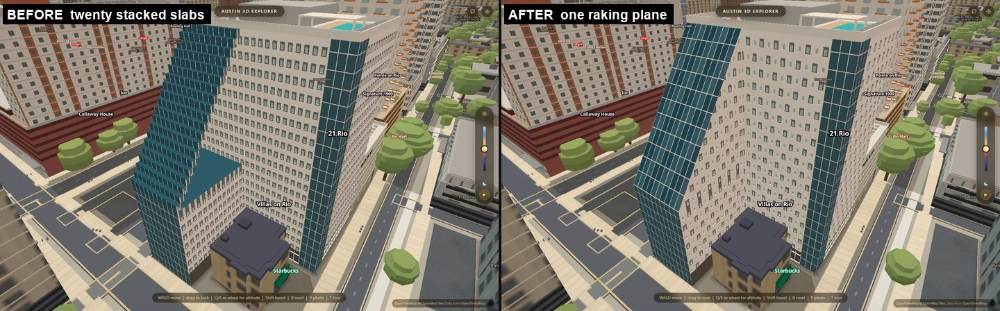
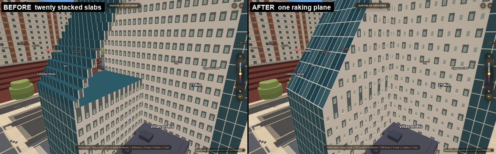
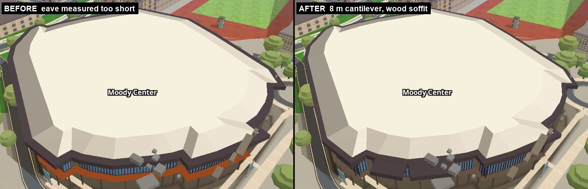
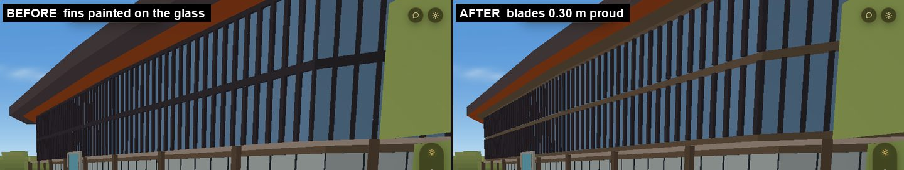
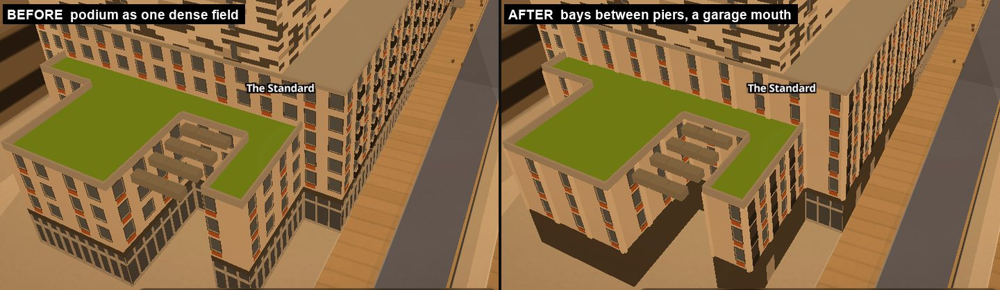
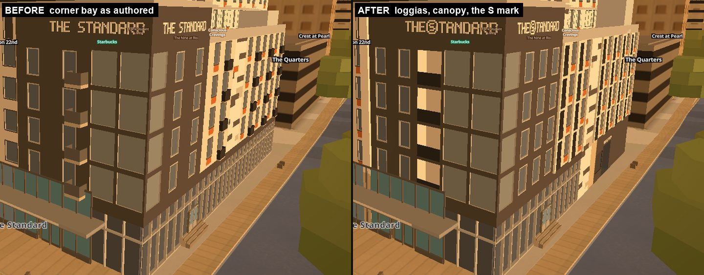

# What the apartment generator could not draw, and now can

Round 3 of the apartment generator. Twenty-eight buildings in West Campus are
drawn from a JSON file each, by one shared generator (`js/slopes-apartments.js`).
Before this pass, twenty-seven of those files had a `todo` list, and the same
complaints kept appearing: *the generator has no way to say this, so I faked it.*
This pass read all 199 of those complaints, ranked them by how many buildings hit
them and how visible the fake is, and built the top ten.

Three buildings were then rebuilt to use the new vocabulary — **Villas on Rio**,
**Moody Center** and **The Standard** — because each was the loudest example of
one of the missing things.

---

## The pictures

Every picture below is the real page, hardware WebGL, at the same camera before
and after. Nothing is cropped differently between the two halves.

### Villas on Rio — the raking glass wall

The teal wall on this tower leans back. A block could not lean a face, so the
builder drew the lean as **twenty stacked slabs** — each 1.037 m deep and 1.538 m
tall, pushed a little further out than the one below. From any angle it read as a
staircase, and where the steps stopped short of the corner they left a flat teal
shelf that looked like a rooftop terrace on the side of a tower.

It is now **one plane**. The new `rake` field leans a whole face and clips the
flanks and the opposite wall to the wedge. The plane is at 56.0°, 20.74 m of run
against 30.75 m of rise, read back off the built layer. Three nadir rays fired at
3 m, 10.37 m and 17 m along the foot land at 28.648 / 39.575 / 49.405 m — the
plane exactly; the old treads gave 28.812 / 39.575 / 50.338 m. Of 17,774 block
vertices, **zero** stand above the plane.

### Moody Center — the sunshade blades and the wood soffit

The vertical blades over Moody's glazing are real objects standing about a foot
off the glass. The generator could only *recess* a wall between them, so the
builder cut slots into the glazing instead — the same silhouette from straight
on, and nothing at all from an angle. `fins` now stands them proud: **358 blades
at 1.219 m pitch, 0.305 m wide, 0.30 m off the wall**, 10,068 fin-toned vertices
between 7 m and 17 m.

The eave's underside is the building's Parlex wood composite. A roof drew its lip
in one tone, so the wood had never been drawn at all. `soffitTone` splits it —
top and fascia stay dark bronze, the 2.10 m underside is the wood **#884420**.
And the roof polygon's oversail had been measured too small, because seven of that
polygon's vertices are the building's own OSM nodes; corrected, the south corner
cantilevers the **8 m** the polygon actually measures.

### The Standard — the podium, the loggias and the mark

The Standard's ground floor is bays grouped by wide light-coloured piers. A wall
could only be isolated windows on a field, so the whole podium was one dense grid
that read, from above, like chain-link fencing round the base. `pier` puts a
member on every bay line: **54 piers, 0.6 m wide, 0.18 m proud**. (0.5 m and
0.12 m were tried first and did not read from the street; the two steps up are a
taste value, not a measurement.)

Three more things are in the corner picture. The dark hole on the right of the
aerial is a real **garage mouth** — `openings` cuts a recess with its own depth
and tone into a band, with the back wall measured 12 vertices deep on the v 3.0
plane. The stack of pale panels on the corner is **inset balconies** — `inset`
cuts a loggia into the wall once per floor with the rail at the face, instead of
hanging a box off it. And the round **S** between THE and TANDARD is a `bitmap`
sign: the sign font is a 5×7 dot alphabet of about nineteen letters with no logo
marks, so a mark now goes in as any dot pattern.

---

## What the blind judges said

The rule for this pass was that a before/after picture has to explain the
improvement with no caption, and that a judge shown the pair without being told
what changed had to say so when it didn't.

**Villas on Rio — verbatim, and it is the strongest result of the pass.**

On the aerial pair: *"The big teal glass wall on the left used to be a staircase
of stacked slabs, like a pile of books with each one pushed a bit further out…
Now it is one smooth slanted sheet of glass."* Obvious without being told:
*"Yes. The staircase-to-smooth change on the left wall is the first thing your eye
lands on; you cannot miss it."*

On the close pair: *"Better, by a lot. The before looked broken — a giant
staircase of glass ledges with a rooftop patio that made no sense on the side of a
tower. The after looks like a building."*

**And the miss, in the same judge's words.** On the true eye-level pose from Rio
Grande Street: *"No. I only caught it because I was comparing the two; a casual
viewer would look at this frame and see the same street."* That pose puts the
tower about 120 px tall behind a row of trees. It is not shipped here as one of
the two Villas pictures for exactly that reason — the near pose is. The judge was
right and that frame is not defensible.

The same judge's harshest note, also verbatim, is about something this pass
introduced and did not fix: *"the new scattered windows are more interesting than
the old grid, but at close range the random sizes and heights mean you cannot read
floors, and a real apartment building always reads as floors."* That is the
`fields` / `flip` diagonal weave on the white tower, and it is a fair hit. It is
the second follow-up below.

**Moody Center and The Standard — no blind-judge verdict survives.** Their
write-ups were truncated in the handoff between passes, and I will not reconstruct
what a judge said. What follows is **my own** look at the pairs, cold:

- *The Standard's* two pairs both pass the no-caption test. The aerial goes from a
  base that reads as chain-link to a base that reads as shopfronts and a garage;
  the corner goes from a narrow slot of small boxes to a legible stack of recessed
  balconies, plus the mark in the sign.
- *Moody's plaza pair* passes, but quietly. The blades gain real depth and a
  horizontal wood member appears, and you can see it — but a casual viewer would
  probably describe it as "the stripes got thicker", not as a different kind of
  object.
- *Moody's aerial pair* **does not pass, and I am not going to claim it does.** The
  eave gets wider and the ring under it goes dark brown, and without the
  explanation above that reads as the building getting muddier, not more correct.
  The cause is a defect the builder wrote down: a roof draws its lip's top and its
  fascia in one tone, so a dark fascia darkens 2.1 m of the top surface too. It is
  the first follow-up below.

---

## What is still not expressible

The ten ranked capabilities were all built. These are what the builders' own
`todo` lists still ask for after this pass, in their words, plus the two things
the ranking list parked.

**In the generator:**

- **A roof lip's top and its fascia are one tone.** Moody's plate should be white
  to its outer edge with only the vertical face dark. A `topTone` beside `lipTone`
  ends it. This is the whole of the Moody aerial miss above.
- **An inset band's floor and its soffit are one tone**, so Moody's 2.0 m ring of
  deck at 6.40 m wears the head of the recess above it. Wants a `floorTone`.
- **A `bays` skin's window takes no field rule.** `fields` blanks the field of
  every other bay on Villas on Rio, but the blank bays keep their 0.50 × 0.90 m
  pale glass slot. About 3 px at the cameras this app is judged at, and it is also
  what lights the tower at night, which is why it was left in. Wants a
  `window: null` entry in `fields`, or a `windowRule` beside `fieldRule`.
- **A loggia paints all five of its surfaces in one tone.** The Standard's jambs
  and soffit are light concrete round a dark door; drawn dark so the void reads
  from the street.
- **A stack's rail is one solid box.** The Standard's loggia rail is a black tube
  grille 1.05 m tall; it stands as a dark panel. Wants a mid tone or a slat pitch.
- **A blade is a square box.** Moody's are extruded tubes with a nose.
- **Per-face `over` on a roof and per-face `inset` on a band** — Moody's
  asymmetric cantilever, one 7.48 m spike at the north corner with 1.18 and 3.28
  either side of it. Surveyed, untouched.
- **`rake` does not compose.** Overrides, balconies and canopies are ignored on a
  raked face (the generator warns), a `roof` on a raked block is ignored, and a
  pitched roof on a holed plan ignores the holes.
- **A rake is one flat plane, and `bays` draws upright openings.** Villas' real
  glass bows in plan, and its white-wall openings are rotated squares set in
  creased panels. Neither is expressible; the creases are 20–40 mm folds and are
  under a pixel anyway.
- **A sign goes on a wall, not on a cap.** Moody's roof graphic has no primitive.
- **Cambridge Tower's pierced solar-block balustrade** — under a pixel at every
  camera per its own builder; not attempted.

**Not a drawing capability, but named so it is not rediscovered:**

- `extendCollision()` matches a corrected height to a footprint **by name only**,
  so a snapshot row with a null name leaves walkable air — 26-west-courtyard has
  3.6 m of it. Should match on feature id as well.
- The **roofscape / campus-storeys / parts-3d "float above an authored roof"**
  family across six buildings is a bake-pipeline gap, already tracked in
  `HANDOFF.md`.
- Two nameless snapshot roof prisms were standing **on** Moody Center — a 21.3 m
  tan prism wearing the arena's own plan, with the app's window grid on it — and
  this round's first look is what found them.
- Moody's east face is up to 11 m too tall because the app has no terrain and the
  site falls 11 m across the building.

---

## Follow-ups, in the order I would take them

1. `topTone` on a roof lip. It is small, and it is the only reason one of the six
   pictures in this doc does not explain itself.
2. A window rule for `fields`, then re-look at Villas' white tower. The judge's
   "you cannot read floors" is the sharpest criticism this pass received, and the
   weave is a taste value that can be turned off in one line if the answer is that
   the plain grid was better.
3. `floorTone` on an inset band.
4. Roll the ten new fields out to the other twenty-five buildings. Only three were
   rebuilt; the vocabulary now exists for all of them, and most of the 199 `todo`
   entries were waiting on exactly these fields.

---

## The gate found five tests that had never once been run

The five new capability checks in `scripts/verify/slopes-layer.mjs` were written
in the previous pass and the gate was never executed end to end, so nobody had
ever seen them run. On the first full run this pass, all five came back red — and
every one of them was the test, not the building.

They failed the same way. Each measures "did cells appear on this exact plane",
and each named a window that **excluded the only coordinates the geometry has**:

- **fins** looked between z 6.1 and 18.3. A blade spans its band exactly, so
  every vertex it owns sits on z 6.00 or z 18.40 — the two values a 0.1 m inset
  at each end is guaranteed to miss. Patched on the page, the field adds 390
  vertices, every one of them the right tone, 234 of them at v −0.30 exactly:
  0.30 m proud of the wall, which is what the field claims to do.
- **openings** looked between z 0.35 and 4.95; the back wall stands on z 0.30 and
  5.00. Measured, the field puts 18 correctly-toned vertices on v 3.00.
- **canopies** looked between v −1.99 and −0.01; a soffit quad's v values are
  0.00 and −d exactly. Measured, a 2.2 m canopy puts its soffit on v −2.20.
- **pier** had the same bug twice over. Its cleanup *deleted the building's own
  piers* — it was written before The Standard's podium had any authored, and the
  podium has carried real ones since the piers commit, so the patch was a no-op
  (72 → 72) and the restore took the real ones away (→ 13). And its census window
  was z 6.1–21.4 while a pier's vertices stand on the podium band's own z 6.00
  and 21.50. Measured with no z window at all: **0 pool-toned vertices before,
  270 with the piers, 0 restored.** The old window saw 20 of those 270.
- **`--against-tip`** loaded our page with the generator off and the archive page
  with it **on**, so the archive drew its own twenty-five apartment buildings and
  the "identity" diff was 613,109 px — the switch's own on/off delta. The
  neighbouring branch of that same block already demotes the identical comparison
  to a note for exactly this reason.

All are fixed, with the reason written into the file beside each one, and the
numbers above are the evidence — measured on the page, not argued.

**One sub-assertion was removed rather than repaired, and that should be said
out loud.** The pier line also fired 71 rays along the podium and asked what
colour came back. From that camera the rays never reach the wall: measured at six
heights (7, 8, 10.95, 14, 18 and 20 m), all 71 hit something and every one came
back `186,186,186` — which is not a colour of this building — identically before
and after the patch. A ray that cannot see the wall cannot testify about what
stands on it, so it is now reported and not asserted, with the measurement in the
file. The vertex census is what carries that line.

The lesson is the cheap one and worth writing down: **an assertion you have never
run is not evidence of anything, and an assertion that samples a plane must
include the plane.** Four separate checks got that wrong in the same direction,
each inset just far enough to exclude the only coordinates the geometry has.

---

## Gates and cost

Hardware WebGL throughout, ANGLE / NVIDIA GeForce RTX 3050 Ti Laptop GPU, D3D11,
this branch served on one port and a `git archive` of the main it was cut from
(`a03d283`) on a second.

| gate | result |
|---|---|
| `slopes-layer.mjs` (`--against-tip`, `VERIFY_MAX_MS=4200000`) | **78/78 passed** |
| `art-slopes.mjs` | 7/7 passed |
| `walkmeter.mjs` | pass — drift 0 over limit, 0 route errors, UI gate pass |
| `facadegrid.mjs` | 0 failing assertions |
| `westcampus-probe.mjs` | **20/21** — see below |

The one red is not this branch's. `westcampus-probe.mjs`'s "all three layers
visible" check wants `wc-wall`, `wc-wall-cap` and `wc-solid` and gets two of the
three. Running the identical probe against main's own archive returns **the same
20/21 and the same missing layer**, so it is a condition that already existed and
this pass neither caused it nor fixed it.

**Cost of drawing all of this: under a quarter of a millisecond.** One page, the
generator toggled at runtime, interleaved on/off, 200 frames a rep, three reps
after two discarded warm-ups, minimum of the per-rep medians, vsync and the
occlusion throttles off, graphics preset `balanced`, 903,330 triangles when on:

| pose | ON p50 | OFF p50 | delta |
|---|---|---|---|
| Villas on Rio | 11.90 ms | 11.70 ms | **+0.20 ms** |
| The Standard | 12.30 ms | 12.10 ms | **+0.20 ms** |
| Moody Center | 10.70 ms | 10.60 ms | **+0.10 ms** |

The worst p90 cost is +1.90 ms at The Standard. The bar for calling this a defect
was +3 ms over off; nothing comes near it.

---

## Where the numbers come from

Everything measured above was read off the built layer on the real page in
headless Chrome on hardware WebGL (ANGLE / NVIDIA GeForce RTX 3050 Ti Laptop GPU,
D3D11), by `scripts/verify/slopes-layer.mjs` section 2b, which patches each
building in place, measures, and restores. Every measurement in the three JSON
files carries its source beside it as `_src`. Every taste value is a named
constant in `APARTMENTS` — `fins`, `piers`, `canopies`, `openings`, `openingD`,
`canopyT` and `rakeFloors` were added this round, and each can be overruled with a
one-line edit.

The schema for all ten new fields, with a worked example per field, is in
`docs/apartments.md` under "Round 3".
