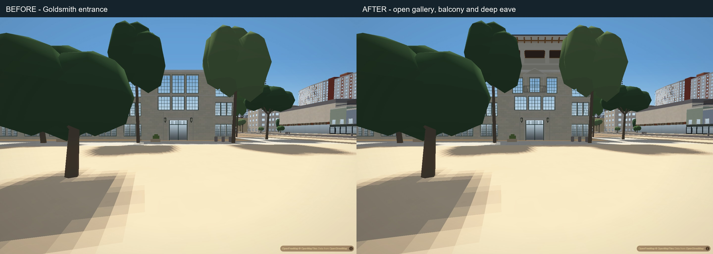
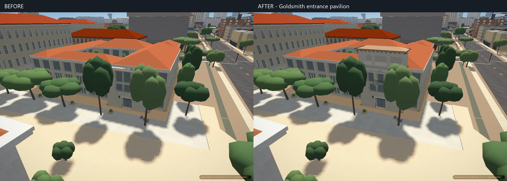

# Goldsmith entrance pavilion

The entrance previously stopped at three closed facade registers and had no roof over its projecting front. This pass adds the missing open upper loggia, a deep bracketed eave and covered hip roof, and a central balcony and pediment. It retains the mapped footprint, open courtyard and all five existing wing roofs.

## Verification

Matched application views retain normal vegetation and lighting, with automatic exposure disabled consistently. The full-height entrance pair uses the application's 74-degree view-width setting; the original oblique and overview comparisons use the default 58 degrees. These are paired application views, not calibrated photo overlays. The second screenshot of each pair is used.

Both original day/night loads contain all 196 authored buildings with no page or console errors. The change adds 1,436 triangles to the balanced authored-building scene (3,045,153 to 3,046,589); draw calls are unchanged in the sampled views. These counts establish the added geometry cost, not a frame-time or physical-phone performance result.

Independent source and generated-geometry review confirms that all 36 other campus models and the five original Goldsmith roofs are unchanged. All 183 component solids have valid outward faces and closed edges. The existing wing roof clears the new pavilion floor by at least 9.6 cm, including its renderer lip. A concave bracket triangulation error and overlapping ceiling surfaces were corrected before these final frames.

The actual-city courtyard ray and collision checks pass, the entrance camera is on walkable ground, and the new height is registered. The complete scene retains all 196 authored buildings and reports no errors through a 12-second camera rotation. This is a load and movement smoke check, not evidence that citywide flicker or idle pauses are fixed. Harness drift passes with all 48 scripts in agreement.

## Remaining limits

Heights and depths are photo-fitted approximations. Fine carving, existing trees, broader stone and glazing character, and unphotographed sides remain simplified. The open upper bays correctly remain dark at night. This is a bounded correction to the missing entrance composition, not full photographic acceptance or a citywide flicker fix. Physical iPhone Safari and Chrome performance remain unverified.
