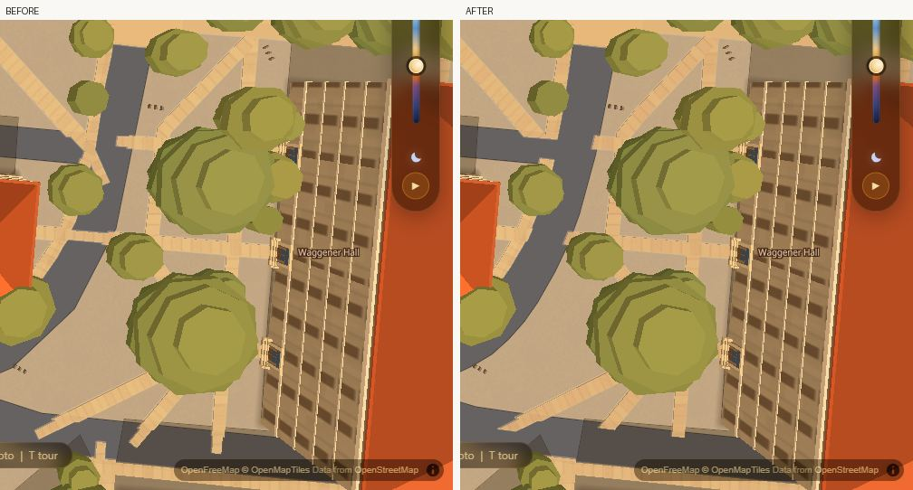
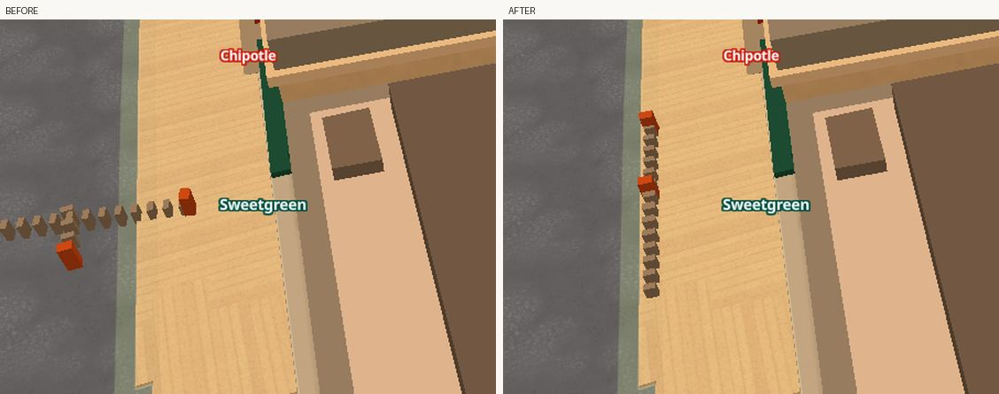

# The street at eye level: curves, kerbs and the things standing on them

Three defects were reported in the street scenes — jagged linework, sidewalks
shooting into the road "like branches", and stray objects on Guadalupe in front
of Sweetgreen. All three are one family: **a rule written for a camera in the
air, still running under a camera at walking height.** Each is fixed as a rule,
each is behind its own switch, and each is measured.

Owned files: `scripts/bake_ground.py`, `data/ground.geojson`,
`scripts/bake_props.py`, `data/props.geojson`, and the two gates
`scripts/verify/kerbmeter.py` and `scripts/verify/kerbshot.mjs`.

---

## 1. Curves stay curves



*Straight down over Inner Campus Drive, west of Waggener Hall. Left: the road is
broken by four pale bars and its bend is a chain of facets. Right: one
continuous carriageway with a curve in it.*

`simplify()` ran Ramer–Douglas–Peucker at **1.2 m** on every road and cycleway
centreline, and its own docstring gave the reason: *"at the tolerance used
nothing moves by more than a quarter of a rendered pixel at the zoom the camera
flies at."* That was true of a flyover. This app walks now, and 1.2 m of lateral
error on a kerb ten metres from the eye is a visible kink.

Measured on `data/osm_cache/roads.json`: **12,124 ways, 70,236 raw vertices, and
RDP at 1.2 m threw away 30,676 of them — 44 % of every curve a mapper drew.**
At 0.25 m it throws away 20,794, so four times the accuracy costs 9,882
vertices.

That is only half of it. Even with RDP off, a curve in OSM is a chain of
straight chords 8–15 m apart, and a 10 m chord on a 30 m radius stands 0.42 m
off the true arc. No tolerance fixes that — the vertices are all the source has.
So the rule has two parts:

* simplify at `CURVE_SIMPLIFY_M` (0.25 m), a walking tolerance;
* then **Chaikin-smooth the runs that are curved, and only those.** A turn
  sharper than `CURVE_CORNER_DEG` (40°) is a corner — a junction, a right-angle
  kerb return — and stays sharp. A turn gentler than `CURVE_MIN_DEG` (4°) is a
  straight run and is left alone.

Sidewalks were the worse case and are fixed by the same rule: they were never
RDP-simplified at all, so every facet in one is the mapper's own node spacing
and nothing but smoothing could have removed it.

**The guard.** Corner-cutting *moves* geometry, and this file's truth rule says
every position comes from OSM. So a run whose smoothed points would stand more
than `CURVE_MAX_DEV_M` (0.60 m) off the polyline they came from is **left
unsmoothed and counted**: `curve_road_run_over_dev` 1,022 and
`curve_walk_run_over_dev` 37, against 4,036 road runs and 1,010 walk runs
smoothed.

Scored by `kerbmeter.py`, the mean turn angle on a curved run falls from
**24.2° to 12.6°** — every facet is half as sharp.

**Cost.** `ground.geojson` 5.76 → 6.89 MB, `roads.geojson` 3.88 → 5.75 MB raw.

---

## 2. The keep-core is for a walk *beside* a road, never one *across* it

The pale bars in the frame above are not a rendering artefact. They are drawn
pavement, and this is where they came from.

`SIDEWALK_KEEP_HALF_M` exempts the core of every **surveyed** walking centreline
from the carriageway cut. It exists for a real case: the carriageway polygon is
*derived* (`w` = lanes × `LANE_M` + `KERB_M`, about 1.4 m per side wider than
the painted edge), while a sidewalk centreline is *surveyed*, so the cut was
deleting 8.24 km of pavement that is really there.

It was applied to **every metre of every walk** — including the metres that run
*into* the street. At every kerb ramp, service entrance and desire line that OSM
tags `footway=sidewalk` rather than `footway=crossing`, the exemption punched a
1.8 m hole in the cutter and painted a walk on the road.

Measured near Waggener before the change: **29 surveyed footways put more than
3 m² of pavement on a carriageway inside one 380 m box**, and three 24 m ways
(1380823430, 1380849647, 1380849648) had 16.5 m² each — 28 % of their own area —
standing in the street.

**The rule, in one sentence: the keep-core is for a walk beside a road, never
one across it.** Segment by segment, the walk's bearing is compared with the
bearing of the nearest road centreline; beyond `SIDEWALK_KEEP_PARALLEL_DEG`
(35°) the carriageway takes it, exactly as it has always taken every crossing.

**Per segment, not per way** — that is the whole point. Way 1245334958 is 419 m
of sidewalk that runs beside Inner Campus Drive for most of its length and turns
into it at the end. A per-way test either loses the 419 m or keeps the branch. A
per-segment test keeps the 400 m and drops the branch, which is what the picture
shows. 1,697 crossing runs were dropped.

`SIDEWALK_KEEP_DEPTH_M` (2.5 m) is the second guard, for a walk that runs
parallel to road A while standing in road B: no keep-core may lie deeper than
that inside a carriageway.

Scored by `kerbmeter.py`:

| | main | this branch |
|---|---:|---:|
| drawn pavement standing on a carriageway | 32,534 m² | 27,221 m² |
| **of it, deeper than 2.5 m inside** | **3,147 m²** | **1,099 m²** |

The shallow remainder is the derived carriageway being wider than the real one,
which is exactly what the keep-core is for. The deep figure is the branches, and
it falls by two thirds.

---

## 3. Furniture stands on pavement



*Guadalupe at Sweetgreen. Left: the UT West Mall @ Guadalupe bike-share station
marching out of the sidewalk, across the bike lane, into the middle of the Drag.
Right: the same station standing along the kerb in front of the shop.*

Sweetgreen is OSM way 366244320, **30.285757 −97.742110** — worth writing down,
because the research pass was posed 500 m north of it.

**Measured, not described:** 805 of the 4,357 furniture and lamp features in
`data/props.geojson` stood inside a mapped carriageway and on no pavement at
all. 506 of them were one dataset — the City of Austin bike-parking and
bike-share racks. Every object was placed at its raw source coordinate with
nothing checking which surface that coordinate lands on.

**Not all of them were wrong**, and a blanket rule gets that backwards. A
traffic signal stands at a junction kerb. A gate and a lift gate are *across* a
road. A bollard's whole job is to stand where a car would go. So `PROP_IN_ROAD`
is a table:

| policy | meaning | kinds |
|---|---|---|
| `keep` | it belongs in a carriageway; never touched | traffic signals, gates, lift gates, bollards, stop lines, hydrants |
| `snap` | move onto pavement within `PROP_SNAP_MAX_M`, **leave** if there is none | street lamps, masts, utility poles, flagpoles, phones, shelters, bus stops |
| `drop` | move onto pavement, or **delete** | everything else — benches, bins, racks, planters, post boxes |

A lamp on a median is real, and losing a real lamp is worse than a lamp standing
a metre inside a guessed kerb line. A bench in the middle of Guadalupe is wrong
at any distance.

**It is footprint-aware, which the first cut was not.** Snapping the anchor still
left nine of the station's fifteen docks in the road — the frame said so, which
is why there were two look-fix cycles here and not one. So the inset clears the
object's own width, and anything at least `PROP_ALIGN_LEN_M` (2.5 m) long is
laid **along the pavement's own edge**: a ten-metre rack does not stand across a
street.

146 objects snapped, 56 of those turned, 67 dropped, 10 poles left. Every moved
object carries `snap` (metres moved) and `snapsrc` in its own properties.

In a carriageway and on no pavement: **805 → 272**, and 140 of the remaining 272
are the `keep` kinds that belong there — so the wrong ones fall **664 → 124**.

### A stale input, found on the way

`bake_props.py` read `data/ground.geojson` for `k=='path'` LineStrings and
`k=='area'` Polygons. **Neither survives in that file.** `widen_paths` turns
every walk centreline into a polygon, and `PEDESTRIAN_AREA_IS_A_WALK` moved the
53 campus malls into `patharea/pedestrian`. So `areas` came back 53 malls short
and `paths` came back **empty** — which means `RoadTest`, whose entire job is
*"nothing we place may stand in a traffic lane"*, was being handed nothing and
answering False to every question.

Re-baking the shipped file unchanged produced **117 plaza planters where it
holds 1,314.** The malls are read again, `RoadTest` is fed from
`data/roads.geojson` (28 planters correctly rejected on the first live run), and
the two lists are returned separately — the first cut of the repair handed roads
back as `paths` and put 24 street lamps, 12 scooters and 6 bike racks down the
middle of carriageways.

**Still open, deliberately:** the walk-ridden procedural rules (`walk_lamp`,
`path_bench`, `entrance_bike`, `crossing_bollard`) place nothing, exactly as
main ships. Turning them back on adds several hundred lamps and benches to the
city, which is a taste decision and not a bake fix. The bake now **warns**
instead of failing silently.

---

## The switches

Each piece is one line, and each was checked rather than claimed.

```
CURVES=0 KEEPANG=90 KEEPDEPTH=0 python scripts/bake_ground.py
```
reproduces `data/ground.geojson` (`e9a6a0de…`) and `data/roads.geojson`
(`b5b454af…`) **to the same SHA-256 as main.**

```
PROPSNAP=0 python scripts/bake_props.py
```
reproduces all **3,555 of main's non-planter features exactly**, feature for
feature and coordinate for coordinate. The planters differ because main's
`props.geojson` predates the mall move and cannot be reproduced by any run of
the bake that made it.

Finer knobs, all named constants at the top of their file: `CURVE_EPS`,
`CURVE_SMOOTH`, `KEEPHALF`, `PROPSNAP_R`.

**This piece is data-only, so its switch is a bake flag rather than a URL
parameter.** `js/ground.js` and `js/props.js` are another lane's files and have
no URL-param mechanism to hang one on; the honest equivalent is the pattern this
bake already uses twice (`RIM`, `KEEPHALF`) — a flag that reproduces the shipped
bytes.

---

## The gates

### `scripts/verify/kerbmeter.py` — the data

Three rules, city-wide, because the failure mode this repo keeps hitting is a
fix that is right where you photographed it and wrong two blocks away.

```
  1. pavement on a carriageway      27221 m2  (ceiling 29000)
     of it, DEEPER than 2.5 m        1099 m2  (ceiling 1400)
  2. worst move off the OSM way       0.66 m  (ceiling 0.75)
     mean turn on a curved run       12.62 deg (ceiling 16.00, over 3931 runs)
  3. furniture in a road, wrong        124     (ceiling 160)
     furniture in a road, right        140     (signals, gates, bollards)
PASS
```

**Every ceiling sits between what this branch scores and what main scores**, and
`--against DIR` proves it rather than asserting it. Pointed at an archive of
main's three files the same gate goes red on all four:

```
  1. pavement on a carriageway      32534 m2  FAIL
     of it, DEEPER than 2.5 m        3147 m2  FAIL
  2. mean turn on a curved run       24.19 deg FAIL
  3. furniture in a road, wrong        664     FAIL
FAIL
```

A sagitta was tried first for the curve metric and is the wrong instrument: a
long gentle curve has a large sagitta and is not a facet, so it scored 35 m on a
file with no defect in it. The turn angle is scale-free and does not have that
failure.

### `scripts/verify/kerbshot.mjs` — the picture

The brief's claim is "the two scenes changed and nothing far away did". The
curve rule is deliberately city-wide, so a far control frame is *supposed* to
change; a gate demanding zero changed pixels there would be a gate against the
feature. The checkable claim is narrower: **everything that changed is ground.**

One extra frame per pose is shot with every ground/road/path/prop layer
repainted flag-magenta. That frame is a mask, and the gate asserts every
differing pixel falls inside it.

```
  waggenerNadir    changed   39801 px (3.16%)  off the ground mask     18 (0.001%)  ok
  sweetgreenKerb   changed    7134 px (0.57%)  off the ground mask    244 (0.019%)  ok
  controlTower     changed   38693 px (3.07%)  off the ground mask     78 (0.006%)  ok  [control]
PASS
```

The control is the Tower and the Main Mall — 300 m from Waggener, 900 m from the
Drag. It changes by 3 % of the frame and **0.006 % of it is not ground**. No
building, tree, roof, label or patch of sky moved.

**One incident worth keeping.** The first run of this gate reported **9,622
non-ground pixels** at Waggener. The picture showed why: the door canopies on
Waggener Hall's east wall were absent from the `before` frame and present in the
`after` one. Nothing in the data moved them — the entrance layer had not
finished loading when the shutter opened, and it had in the other run. Two shots
900 ms apart cannot see that, so `shoot()` now keeps shooting until two
consecutive frames agree to within 0.02 % of the viewport. **9,622 → 18.** The
theory that it was tree-edge antialiasing was wrong and a 2 px mask dilation
only took it to 7,251; looking at the frame was what found it.

### The other gates

* `walkmeter.mjs` — **PASS.** Self-check drift 0.00 m on all 20 pairs, 0 route
  errors, live UI gate pass. Routing is a separate graph
  (`data/walk_graph.json`, untouched) and it is unmoved.
* `plazawalk.mjs` — **PASS.** 3/3 pairs routed with a rasterised ribbon:
  pcl-unb 949 m, gre-mai 578 m, wag-mez 295 m.

---

## What still needs doing

1. **`data/tiles/roads.pmtiles` and `data/tiles/props.pmtiles` hold the OLD
   geometry.** They are built by `scripts/tile.sh`, which needs tippecanoe, and
   tippecanoe is not installed on this machine. Until that is re-run, the live
   site serves the old roads and the old prop positions; every frame in this
   document was shot with `?tiles=0`, which forces the GeoJSON path. **This is
   the one thing standing between this pass and the deployed site.**
2. The walk-ridden procedural rules in `bake_props.py` (several hundred street
   lamps, benches and racks) are switched off by an accident of schema and are
   now warned about. Turning them on is a taste call.
3. 124 furniture features still stand in a carriageway on no pavement, mostly
   the far ends of long racks whose anchor did snap. A footprint-union solver
   rather than an anchor-plus-heading one would take it lower.
