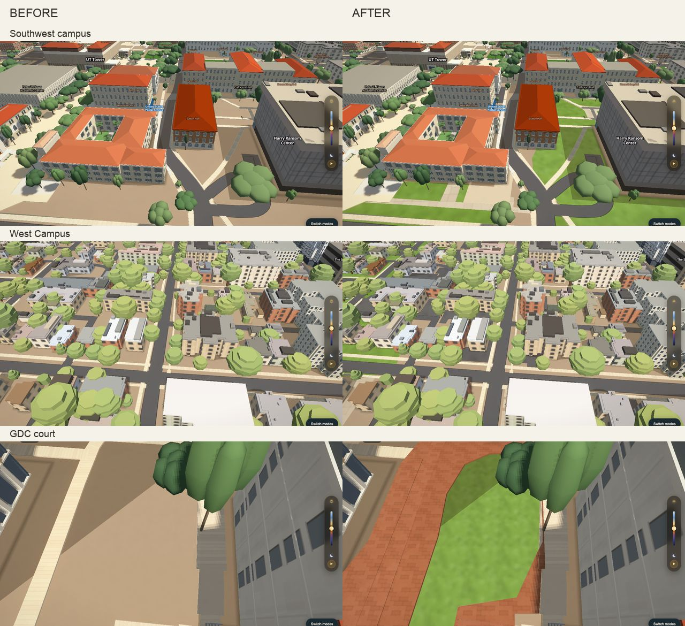

# Ground detail — campus, West Campus and the city

The ground pass restores missing paved areas and separates surfaces which used
to share the same generic treatment. The focus is campus and West Campus, with
larger missing courts and parking surfaces elsewhere in the central city.

Status: verified locally on `codex/ground-detail`; publication pending.



## What changed

- 950 compact selections from the City's 2023 impervious-cover survey: 420 in
  campus, 410 in West Campus and 120 elsewhere. These become more polygons when
  cut around existing paths and buildings. Sidewalks, courts, patios, pavement,
  parking and a few driveway gaps are included. Roof decks, pools, proposed
  sidewalks and arbitrary road geometry are excluded.
- Existing ground wins coverage conflicts. The bake cuts additions around
  existing ground, roads, paths, cycleways and building footprints. A 3 cm guard
  absorbs coordinate rounding; simplification happens **before** the cut.
- Three courts absent from the survey receive compact outlines traced from
  the explicit 2025 aerial mosaic: GDC's brick court and planted bed, the ETC
  west entrance, and McCombs' east forecourt. Photo observations establish
  material; exact application boundaries remain an inference. The courts use
  the existing walking deck and scoring layers, with the renderer's existing
  grade, not a newly measured elevation.
- Fourteen bounded planting areas fill selected unmodeled ground. Visible
  planting/tree clusters guide extent. Ground and borders hidden by trees are
  explicitly inferred. These do not represent a survey of individual beds.
- City sidewalk material attributes distinguish exposed aggregate, brick,
  concrete pavers and asphalt on existing mapped sidewalks. Photo evidence
  takes precedence in its bounded areas, including an obsolete asphalt classification in the ETC forecourt. Prior material/source is retained
  in `_src.previousS` when a material is changed.
- Concrete panels, unit pavers and exposed aggregate use three 64×64 alpha
  images generated once. No imagery downloads, individual paver meshes or new
  rendering layers. Palettes, joint strength and pattern dimensions are in
  `GROUND_DETAIL_MATERIAL`; filtering remains in `GROUND_SOFTEN`.

## Evidence and uncertainty

`scripts/ground-detail-sources.json` is the compact, reproducible bake input.
Its `sources` dictionary resolves the `_src` fields on the emitted features.
Private photo joins stay in the private evidence store; no original photo,
filename, identifier or camera position is shipped.

| Field | Evidence | Remaining inference |
|---|---|---|
| Survey outline | City of Austin, early 2023 aerial digitization; public object ID retained | Clipped to the app's existing ground and footprints; current conditions may differ |
| Survey material default | None beyond the survey's impervious-cover class | Parking → asphalt; walk/driveway → concrete; other paving remains generic |
| Sidewalk material | City's `SIDEWALK_SURFACE`, accessed 2026-10-05, existing sidewalks only | Lateral alignment; 2.4 m width fallback where unrecorded |
| GDC / ETC material | Reviewed owner photographs, 2026-10-03 | Exact extent, individual joints and model grade |
| McCombs material | Reviewed owner photographs, 2026-10-03 | East-apron correspondence provisional; application boundary and joints inferred |
| Planting extent and ground | 2025 aerial review | Borders and grass versus mulch below canopy |
| Procedural texture | Material appearance and existing site palette | Joint spacing, unit variation, age and stains |

Old features without reliable evidence remain unknown. Being near a reviewed
photo does not promote an entire building or district to photo-verified status.
The visible redevelopment south of 21st in the reviewed 2025 aerial is excluded
from new survey additions; temporary construction surfaces are not copied.

Public references (accessed 2026-10-05):

- [City of Austin 2023 impervious cover](https://maps.austintexas.gov/arcgis/rest/services/Shared/PlanimetricsSurvey_1/MapServer/1),
  City of Austin Watershed Protection Department. The service states that
  boundaries were hand digitized from early 2023 aerial imagery.
- [City public sidewalks](https://services.arcgis.com/0L95CJ0VTaxqcmED/ArcGIS/rest/services/Sidewalks_%28Public%29/FeatureServer/0).
- [City 2025 aerial mosaic](https://maps.austintexas.gov/image/rest/services/AerialMosaics/Aerials2025/ImageServer).
  The tiled service is titled “2025 Aerials” but retains a stale “2021 Imagery”
  description. This pass used the explicit `Aerials2025` mosaic and the returned
  export extent, rather than assuming the requested bounding box was preserved.
  No aerial pixels are included in the app.

## Rebuild and verification

The incremental stage preserves the shipped ground rather than rebaking
unrelated OSM-derived surfaces:

```sh
python scripts/bake_ground.py --ground-detail
python scripts/bake_ground.py --ground-detail-audit
python scripts/verify/bug-pass-crossings.py
```

The full bake calls the same final stage. The incremental command records
input/function, footprint, geometry-library and output-feature hashes. A repeat is a no-op only when both
match; editing the input or the output invalidates that cache. The added-surface
building mask is pinned to the tracked 2026-10-05 snapshot.

The audit checks every new/changed polygon, evidence references and intersections
with existing ground and buildings. The current run has no invalid changed
polygons and no occupied-ground overlap at the audit tolerance. Road, cycleway,
creek bank and canopy features are unchanged. The crossing regression and
54-script harness parity checks pass.

An unchanged **full** ground rebuild was tested before editing and differed
from the shipped file: the geometry-library version and newer building
snapshot cause pre-existing drift. That rebuild was discarded. The comparison
baseline is the shipped ground at `3557109` (SHA-256
`ab090a9f4541c68649e574e938f89ae4ca2fb6331426469fe87c44bcc99fda9a`).
The incremental pass uses Shapely 2.1.2 / GEOS 3.14.1 on this Mac.

Matched images use the real page, hardware Chrome, the balanced preset,
1280×800, scale 1, fixed daylight, and canceled graphics auto-detection.
Screenshots are taken twice; the second is used. Phone previews use 390×844
at scale 0.75 on the Mac's GPU; they are not measurements of phone hardware.
Performance and memory comparisons used two interleaved desktop runs per
version, three 2.2-second slow-turn samples per view/run, no CPU throttle, and
minimum mean frame time. Campus: 38.18 → 36.56 ms; West Campus: 33.34 → 35.55 ms.
The change therefore does not establish a general speed improvement. The
phone-sized preview (one run, three samples/view) measured 21.04 → 21.12 ms
and 19.52 → 20.06 ms respectively. The renderer was ANGLE Metal on Intel Iris
Plus 655. These are short local comparisons, not Safari or phone hardware FPS.

In the two desktop views, ground texture atlases increased by 57,888 and
46,080 bytes; retained ground geometry arrays increased by 37,000 and 19,820
bytes. After collection, desktop main-thread used heap grew 2.0–2.8 MB and
backing storage 4.0–8.1 MB; those readings exclude worker heaps. The phone-sized
preview grew 1.7 MB used heap and 0.7 MB backing storage. File size and image
buffers alone are not a total-memory measurement.

The existing MapLibre texture system changes pattern scale at integer zooms.
These new material patterns retain that limitation; unit dimensions are a
visual approximation, not physical measurements. Soft, restrained joints limit
high-frequency contrast. This pass does not claim to resolve the separate
Safari roof/motion-flicker issue.

## Budget

External data/service charges: **$0 of the $100 ceiling**. This excludes the
unmetered cost of the Codex conversation itself. The input is a development
asset, not a runtime fetch. The ground download grows by 174,623 bytes gzip
(Python gzip default level), and the three generated image buffers total
49,152 bytes before per-tile atlas packing. Measured atlas and frame costs are
recorded with the final comparison rather than inferred from these file sizes.
