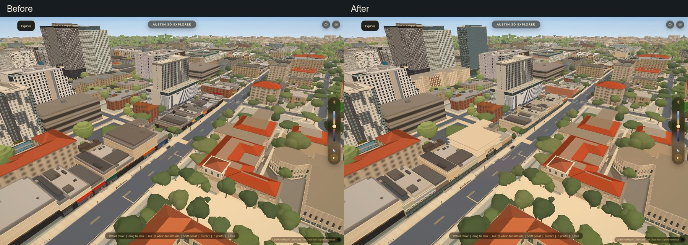
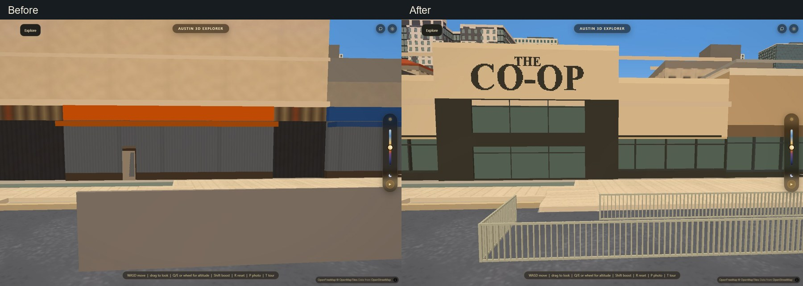
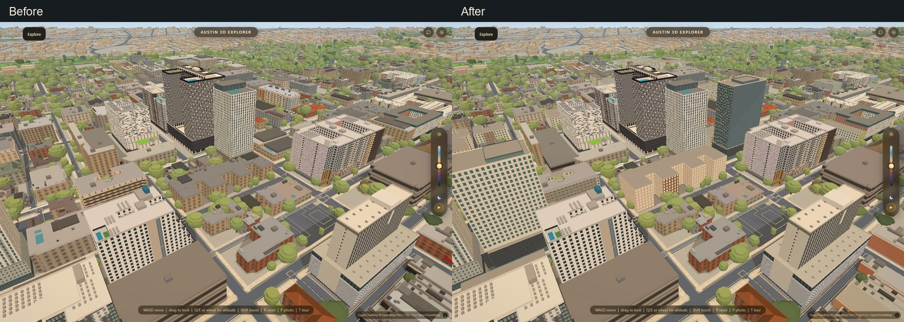
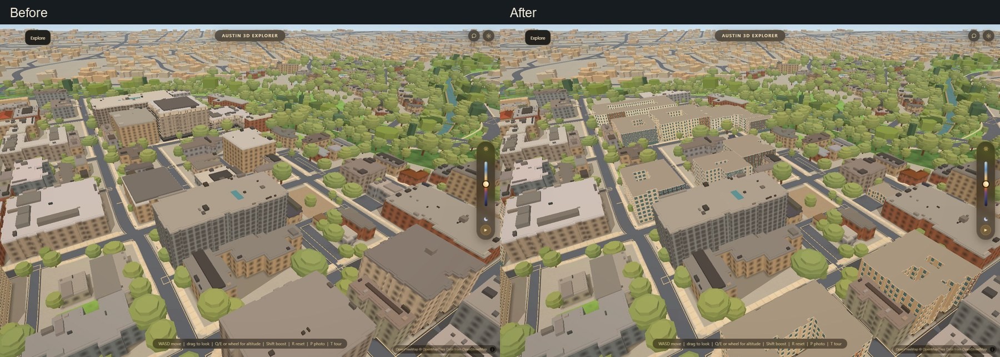

# Guadalupe and the homes around campus

Branch: `codex/guadalupe-neighborhood`. September 12, 2026.

The continuous frontage pass covers 67 mapped buildings beside Guadalupe from
MLK to West 29th Street. Forty-five additional apartment models bring the full
building collection to 188, including the 76 models already shipped.

## The street

Shopfronts follow the actual street-facing edges of each footprint. The models
retain the block divisions and vary height, wall finish, window spacing, cornice,
entry recess and canopy. Rear and party walls stay plain. The old Drag, places
and entrance geometry is hidden only for these replaced building IDs; disabling
the apartment renderer restores it.

Sixty-five buildings retain their existing roof detail where footprint and roof
height still match: 62 surveyed roof decks and three pitched roofs. Buildings with changed
heights or new roof forms retire the old geometry so it cannot float above them.

The Co-op has a lower dark shop base, cream upper wall, raised central entrance
and serif lettering. Its two mapped pedestrian railings are now open metal rails.
Their earlier solid, 1.9-meter fence slabs obstructed the entire storefront.
The new rail height and spacing are approximate proportions from the owner's
2025 photograph. Hole in the Wall has a low yellow front, timber-framed display
windows, green awning and a projecting two-part sign. The lettering is simplified;
the marquee does not claim a current event. Dirty Martin's receives a low profile
and identifying frontage.

Thirty-nine additional existing tree positions beside Guadalupe now use the
continuous crown and branch renderer. The total inventory in that bake is 3,129;
graphics presets determine the number actually drawn. No tree locations were
invented. Existing campus gardens keep their prior geometry.

## Apartments

Torre, Waterloo, Rise and Lark replace short placeholder masses with separate
podiums, residential shafts and roof volumes. Waterloo follows its architect's
30-story, 320-foot description; Rise follows the architect's 24-story description
and setback above the sixth level. Other dimensions are approximate. The small
former Rise leasing office on Guadalupe remains a low commercial frontage.

The 45 added models are:

- Crest at Pearl
- Rio House Apartments
- Envoy Apartments West Campus
- West Campus Flats
- Diplomat West Campus
- 21 Pearl West Campus
- The Texan Shoal Creek
- Waterford Condominiums
- HillTop
- Yugo The Corner
- Texan26
- Barranca Square Student Apartments
- Avia Apartments
- The Nine at West Campus
- The Block on Leon (mapped as The Block)
- Rio Grande Square Student Housing
- Montage Apartments West Campus
- The Venue on Guadalupe
- Block on 25th East
- Block on 25th West
- Yugo Austin Rio
- Yugo Austin Waterloo
- Twenty Two 15
- The Quarters Grayson House
- The Quarters Sterling House
- The Nine at Rio
- Palmetto Apartment Complex
- Rise at West Campus
- Villas on Nueces
- Torre Student Living
- Lark Austin
- Legacy on Rio
- Noble 2500
- The Block on 23rd
- The Block on Pearl North
- The Block on Pearl South
- 1883 at Montgomery House
- Yugo Austin Nueces
- The Quarters Karnes House
- Axis West Campus
- Texan Pearl
- 1883 Cameron House
- Camino Flats
- West 24th Street Apartments
- The Quarters Nueces House

Sparq on Rio was already present under `2623-salado-street-apartments.json` and
The Block on 28th under `2706-rio-grande.json`; neither is duplicated. Villas on
24th, Icon and the earlier dedicated apartments remain in the collection.
Nueces House is at 2300 Nueces; the former Quarters property at 2700 Nueces is now
1883 at Montgomery House. Grayson and Nueces use their operator's eight-story
descriptions. Karnes uses its operator's two-floor description and map pin,
replacing an anonymous 36.6-meter prism.

## Sources and accuracy

- [Rhode Partners' West Campus portfolio](https://www.rhodepartners.com/west-campus-student-housing): Torre, Lark and Legacy photographs and story counts.
- [BOKA Powell's Waterloo project](https://www.bokapowell.com/projects/waterloo-tower): tower height, story count and massing.
- [Niles Bolton's Rise project](https://www.nilesbolton.com/rise-at-west-campus): 24 stories and sixth-level setback.
- [University Co-op](https://www.universitycoop.com/pages/store-hours): location and owner storefront photograph.
- [Texas Exes' Drag photographs](https://www.texasexes.org/our-spots), [Hole in the Wall](https://www.theholeinthewallaustin.com/) and [Dirty Martin's](https://www.dirtymartins.com/): street identities and exterior references.
- [The Block](https://www.americancampus.com/student-apartments/tx/austin/the-block), [Crest at Pearl](https://www.americancampus.com/student-apartments/tx/austin/crest-at-pearl), [Axis](https://www.axiswestcampus.com/gallery/), [Texan Properties](https://www.texanproperties.net/) and [1883](https://www.1883atx.com/): operator addresses and exterior references where available.
- [Grayson](https://www.quartersoncampus.com/graysonhouse/), [Nueces](https://www.quartersoncampus.com/nueceshouse/), [Sterling](https://www.quartersoncampus.com/sterlinghouse/) and [Karnes](https://www.quartersoncampus.com/karneshouse/): operator descriptions; address/map matching distinguishes separate houses.
- [Noble's architect](https://www.markhartarch.com/noble-2500), [Yugo Austin Rio's architect](https://www.markhartarch.com/ruckus-20/) and [Ruckus/Nueces](https://lvcollective.com/work/ruckus/): residential form and address.
- [Camino's registered exterior renovation](https://www.tdlr.texas.gov/TABS/Search/Print/EABPRJB6821726) and [Texas master-meter property inventory](https://www.rrc.texas.gov/media/arjdjwez/08b-pdf-pipes_operators-systems_masmtr_feb10-2026.pdf): property identity for Camino and West 24th.

Per-building source links, observations and editable dimensions are in
`data/guadalupe_profiles.json` and `data/neighborhood_apartment_profiles.json`.
Footprints come from the September 12 snapshot, cross-checked against Esri World
Imagery and public address/map locations. Legacy's envelope repair is approximate.
Most smaller apartment elevations are simplified profiles, not surveyed replicas.
Hidden elevations, facade spacing, trim, colors and most heights remain
approximate. The pass does not establish a complete census of every unnamed
apartment or condominium building, and old tenant names are not proof of current
occupancy. Former Foxtrot and the old Rise office use neutral frontage labels.

## Implementation and verification

Each authoring bake owns one output: `bake_guadalupe.py` writes `guadalupe.json`;
`bake_neighborhood_apartments.py` writes `neighborhood_apartments.json`.
The shared geometry module has no file-writing side effects. The existing
landscape bake owns its expanded tree/railing output. All visual choices are
editable in the profile files.

Bitmap lettering combines adjacent pixels into horizontal runs. The triangle
builder resolves colors before writing any vertex attributes: a rejected palette
previously shifted every following building's geometry. The new guard exercises
that actual failure and requires matching finite position/normal/color buffers.

The Guadalupe guard passes: 188 unique models, finite and aligned geometry,
correct tower/low-office separation, old frontage retirement at four positions
along the street, open rail replacement, restored fallbacks, presets and night.
Its deliberate Karnes-height sabotage fails with a nonzero exit. A buffered
retirement mask handles the map's quantization of the original thin fence ribbons.
The roof guard checks the retained deck at Medici's exact map position; querying
the whole viewport would be fooled by neighboring roofs.

Frame medians, interleaved after/before/before/after/before/after, were
31.6/30.9/30.0/31.0/25.0/30.2 ms. The required minimum of three repetitions is
25.0 ms before and 30.2 ms after, within the predeclared 35% + 2 ms limit.
Settings: hardware GL, 1440 x 960, balanced graphics, no CPU throttle, vsync/frame
limit disabled. Landscaping is held constant; each building swap restores the
complete original facade and roof filters. The variation between repetitions is
material, so these are desktop frame measurements, not a mobile or load-time claim.

The existing campus-apartment and campus-everywhere guards pass, including roof
cuts, preserved rigs, collision, garden/courtyard openings, fallbacks, graphics
presets and day/night. The live-here guard passes all 19 existing route pairs.
Harness parity, the apartment window rule, syntax checks and bake validation pass.
Ten matched camera views cover MLK, the Co-op, the central Drag, Hole in the Wall,
the north end through 29th and the apartment blocks. Exposure is frozen; every
saved image is the second capture. The four cited comparisons use the full,
uncropped frames at the same scale.
The first regression launch encountered a temporary external-resource startup
timeout; a fresh launch completed all three suites.

The complete cloud data build also passed. Its automatic September 13 snapshot
had zero changed building features and identical detailed building/part data;
that unrelated dated duplicate was reverted to keep the existing city baseline
and avoid a net edit to the manifest shared with the older decision lane.
No Mac-owned or other open-lane code/output changes. HANDOFF is the sole shared
documentation overlap with PRs #164 and #189.
