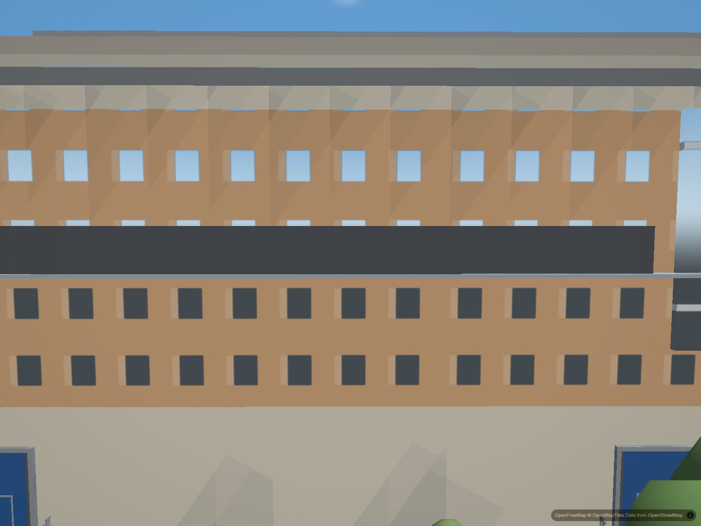
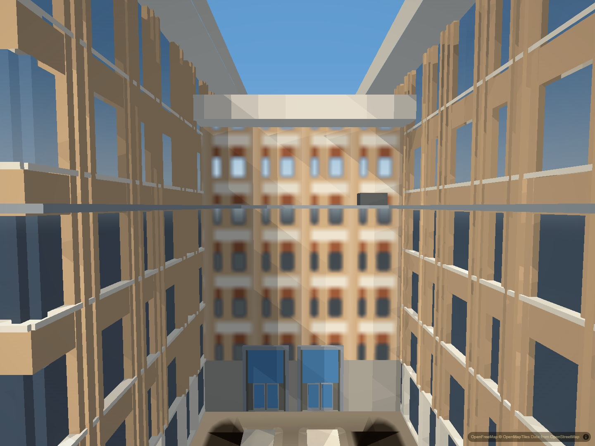
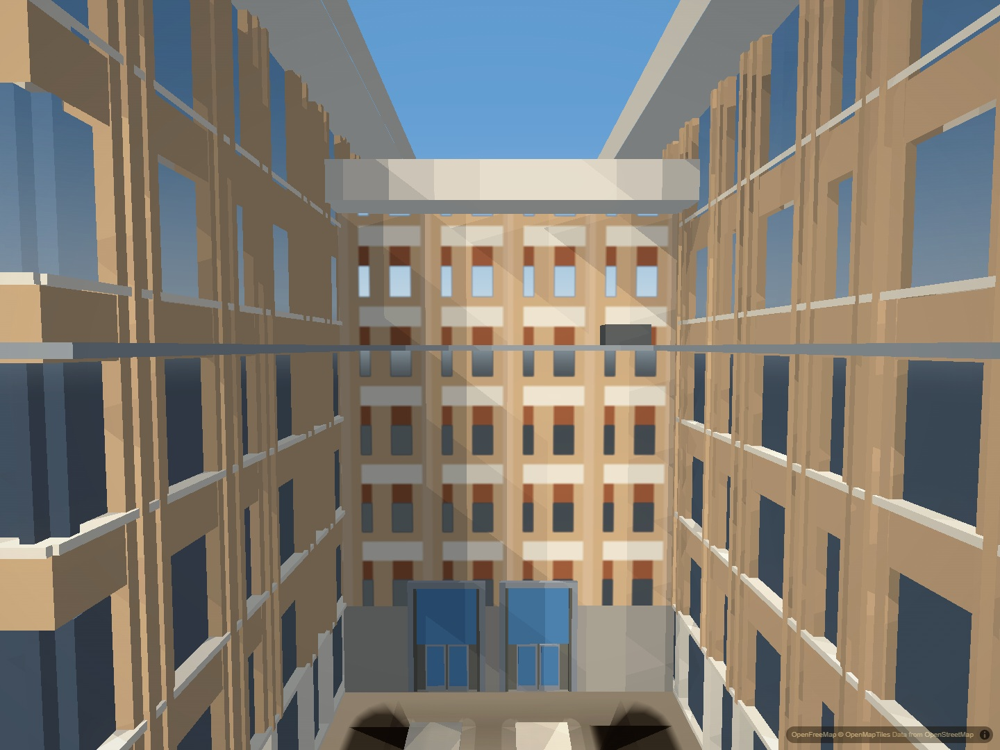
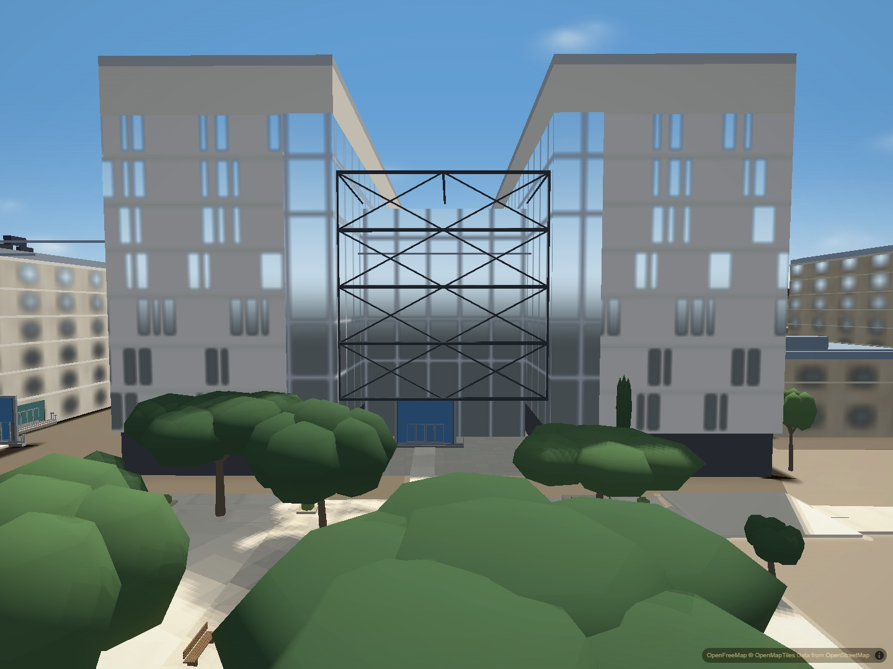
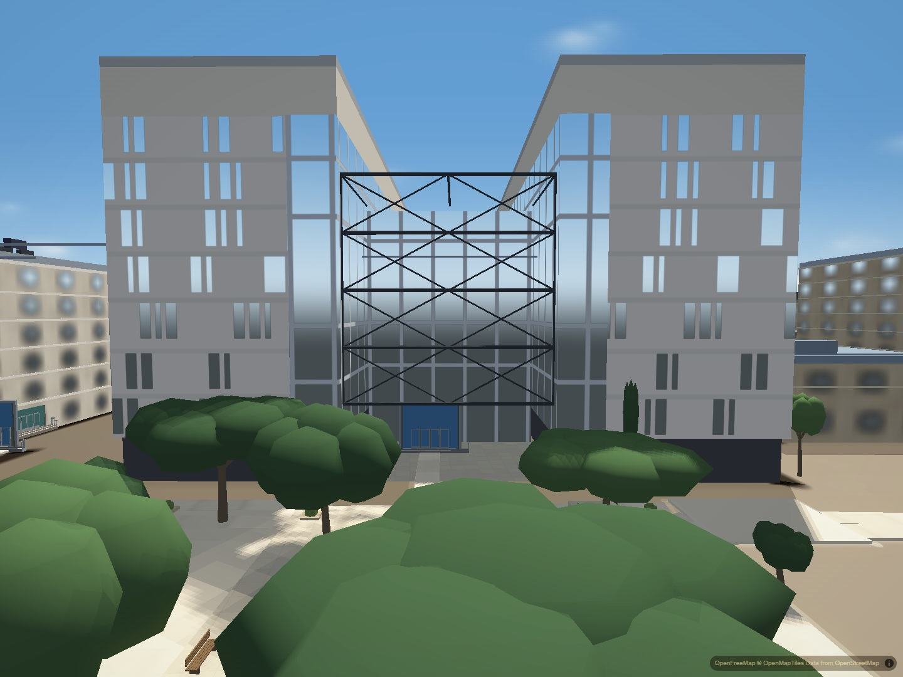

# Campus facade texture definition

The seven hero facade patterns previously spread 64 by 64 texels across a
roughly 33 m repeat at the reference zoom. Small windows occupied only a few
texels, making their corners and the surrounding masonry look blurred nearby.

The backing images are now 256 by 256, registered at pixel ratio 4. Their
logical 64-unit drawing space and world repeat remain unchanged. NHB keeps its
punched openings, GDC its bands and piers, and EER its clustered slots and
curtain walls. This improves raster definition; it does not add missing modeled
window recesses, sunscreen geometry or individual bricks.

`HEROES.textureScale` is the single backing-resolution setting. Seven raw RGBA
images grow from 112 KiB to 1.75 MiB; this excludes MapLibre atlas copies and is
not a total GPU-memory measurement. Physical iPhone acceptance remains open.

Matched second screenshots from the complete ready city: all 196 authored
buildings, normal settled tiles, indexed geometry and no loading veil. Hardware
Chromium used balanced graphics, disabled drift and automatic exposure, and
canceled graphics autodetection. Loaded runtime and baked asset hashes matched
the tested files. These static comparisons do not establish motion stability.

NHB: square openings and pale side reveals retain their shape.

GDC: the rear patterned wall gains definition; modeled side bays are unchanged.

EER: clustered slots and curtain-wall mullions keep distinct edges.

The real-canvas atlas check runs the actual painters and verifies all seven
registrations, logical repeat, full image coverage, semantic glass alpha and
day/night updates. Deliberately breaking pixel ratio or context scaling fails.
Roof lifecycle, syntax and harness parity checks pass. Citywide flicker,
grazing-angle patterns, missing modeled details and physical-phone performance
remain separate work.

NHB night and middle-distance still checks also pass. The latter partly hides
the lower facade behind a neighboring roof; neither is a motion benchmark.
