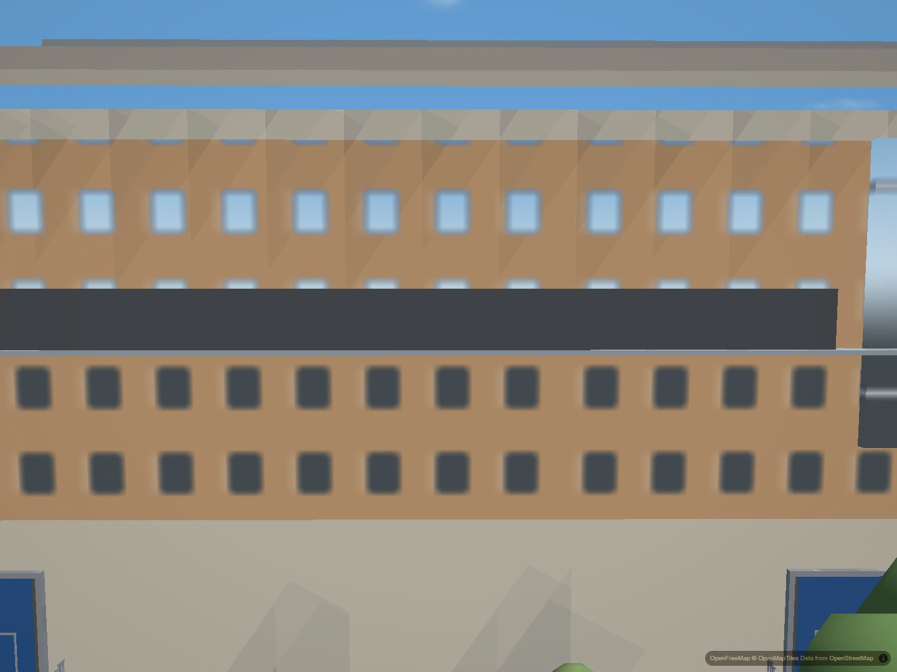
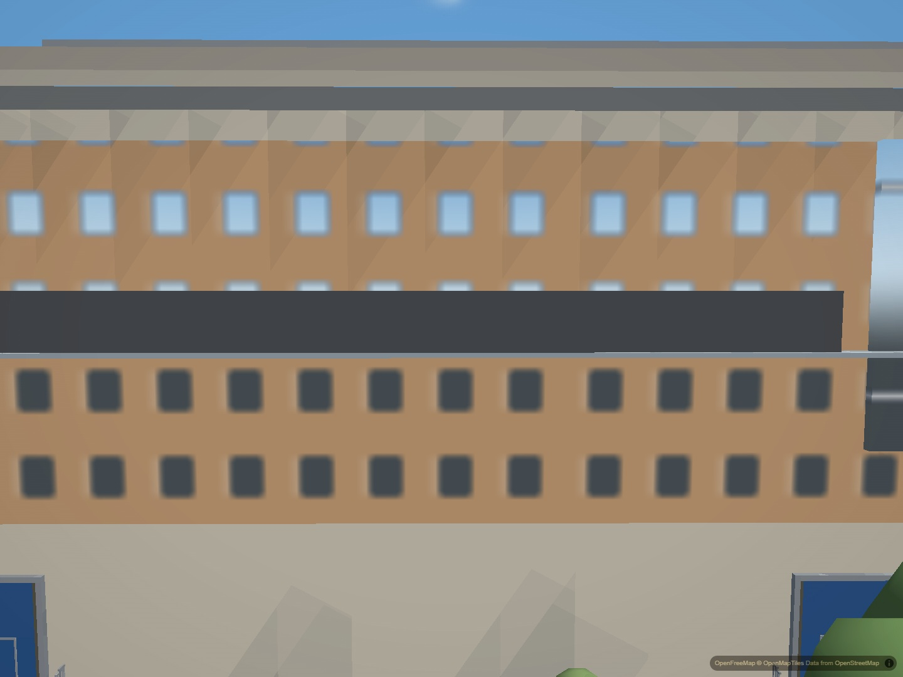

# NHB roof underside

NHB's cantilevered roof deck used a fill-extrusion with no bottom face. From
below the roof, a strip of sky appeared between the walls and fascia. The shared
hero underside renderer now closes this existing slab alongside the three GDC
slabs it already handles.

The new face follows the baked perimeter at its existing 30.1 m base elevation
and uses the existing deck palette. The louvre above the deck is excluded. Roof
height, outline, wall positions and bake ownership are unchanged.

Before:

After:

Verified after integrating current main. Matched second screenshots use the
complete ready city: all 196 authored buildings, normal tiles, indexed geometry
and no loading veil. The desktop balanced preset has drift and automatic graphics
probing disabled; these are below-roof views, not walking-height acceptance.
Loaded runtime and baked asset hashes match disk. GDC's matched regression view
is unchanged; an additional NHB night view keeps the underside dark.

The actual mesh contains four slabs and eleven triangles. Upward ray checks hit
NHB and GDC at their baked base heights; downward rays from above do not hit the
one-sided bottom faces. Lifecycle, perimeter, color and downward-normal checks
pass, and deliberate NHB omission and discarded-group mutations fail at their
intended assertions. Harness parity and JavaScript syntax checks pass. No runtime
errors were recorded. EER is unchanged because its tested views did not establish
a visible underside defect. Physical-phone performance remains unverified.
