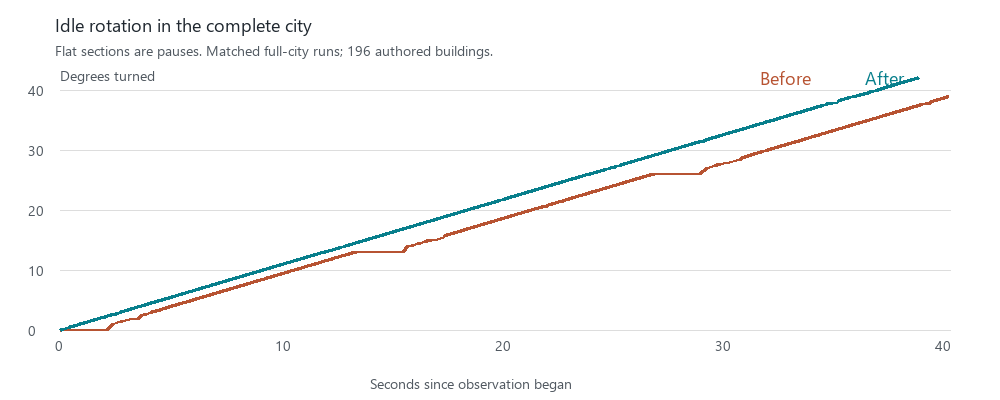
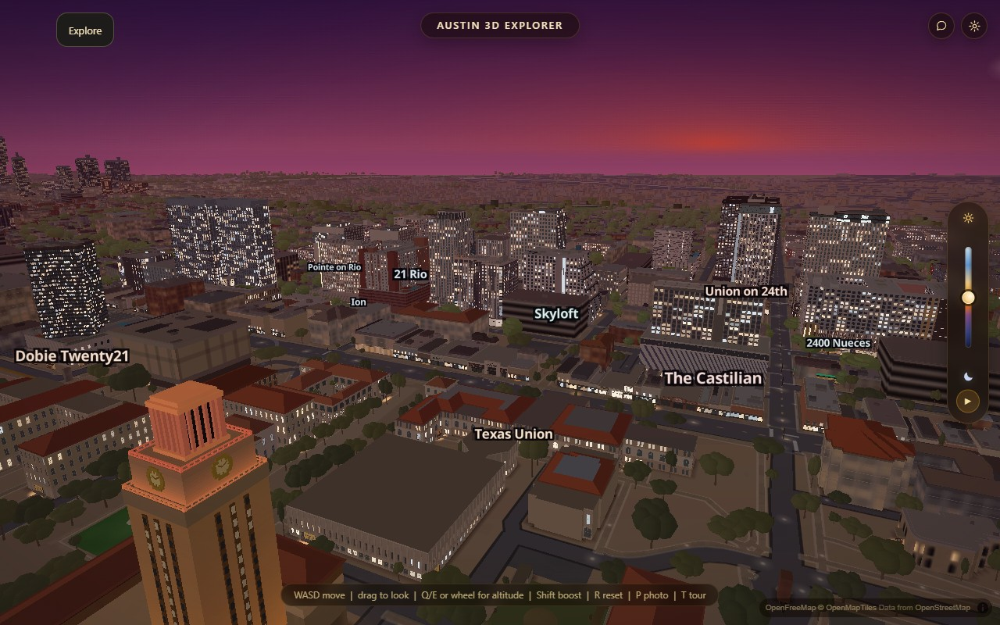

# Continuous idle rotation

Idle rotation now preserves the selected lighting. Previously every twelve-second
camera leg advanced the clock and synchronously repainted the city before the
next leg could start. The time slider and its Play button remain the controls
for changing the hour; their repaint cost is not solved by this change.
`DRIFT.pStep` in `js/app.js` can restore optional clock creep, at the cost of
reintroducing its synchronous updates.

Camera legs now continue from their completion event on the next animation
frame instead of waiting for a duration-plus-60-ms timeout. Generation and leg
identifiers reject stale completions. Input invalidates the active leg before
stopping the map, so the synchronous stop event cannot restart the orbit.
Duplicate completion events cannot schedule multiple next legs.

The small zoom breath alternates between fixed endpoints inside the current
integer zoom band. Near its upper boundary it breathes inward, avoiding the
facade rebuild caused by crossing that boundary. Unknown zoom conventions
preserve zoom. Hidden pages and reduced-motion preferences stop automatic drift.
Manual camera movement retains its normal behavior.

`node scripts/verify/idle-cinema.mjs` exercises the actual driver with deterministic
camera completions, cancellation, stale/duplicate events, boundary zooms, bearing
wrap, visibility, reduced motion, selected-time preservation and optional clock
behavior. `--break` deliberately crosses a zoom band; `--break-clock` restores
unwanted time changes. Both must fail. Syntax and harness parity pass.

## Full-city verification

Four interleaved runs (before/after/after/before) used hardware Chrome, balanced
graphics, 1280x800, DPR 1 and CPU 1x. Each arm required all 196 authored
buildings, indexed geometry, normal tiles, no veil and full readiness before
measurement and after stopping. Auto-detection was cancelled; only the initial
idle countdown was held until readiness. No runtime errors occurred.

Rotation handoff pauses were 1484.1–1604.4 ms before and 36.8–73.6 ms after.
Comparing the minimum of each set gives a 97.5% reduction. Neither candidate
run triggered a time-of-day repaint. General frame timing varied across runs;
this result establishes the removal of the long idle seam, not a broad FPS gain.
Each observation waited 39 seconds after the initial synchronous begin call;
frame counts and task totals are not equal-duration throughput comparisons.

The [sanitized measurements](verification/idle-continuous/report.json) retain
relative motion samples without private camera positions. The two fixed-pose,
fixed-exposure second screenshots are pixel-identical: the change affects
motion, not the selected city's appearance.

Before:

After:

The loaded-city interaction pass held time, slider and atlas values over 27
seconds of motion starting at zoom 17.98, without leaving its atlas band.
Pointer input stopped rotation. Manual time input updated lighting, Play
advanced time, and reduced motion blocked idle orbit. The final city remained
ready with all 196 buildings and normal tiles. Stopping Play passed through a
direct DOM click, which validates its handler only: a normal Playwright click
timed out during expensive playback. Ordinary Stop-button responsiveness is
therefore not accepted by this pass.

Physical iPhone Safari/Chrome performance and memory acceptance remain open,
as does the production recovery-event delay. Explicit time playback still
incurs synchronous repaint cost. Window flicker and grazing-angle patterns
remain a separate visual task.
