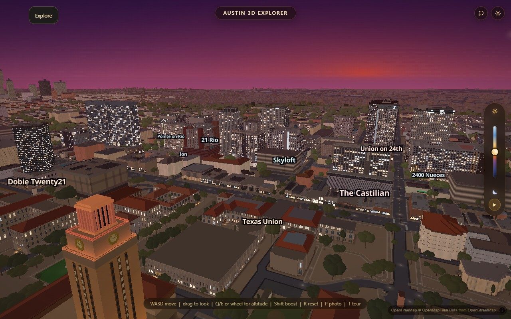

# Facade resize cost during idle rotation

The lower-resolution facade tier averages each 2 by 2 block of the authored
image. A direct four-sample path avoids repeated nested-loop indexing for this
common case. Other divisors retain the generic implementation. Every RGB and
semantic-alpha byte, including ties-to-even rounding, remains unchanged.

This is an incremental reduction of synchronous repaint work, not a complete
repair of idle-spin pauses. The current city still stalls between rotation legs.
No timer, exposure, palette, filtering strength or texture resolution changes.

`node scripts/verify/facade-decimation.mjs` checks 1,054 exact RGBA cases against
an independent block-sum oracle: image sizes 2 through 2048, all quarter-valued
averages, alpha, constants, unchanged input, independent output storage, and
fallback divisors. `--break` corrupts an alpha sample and must fail. Syntax and
harness parity also pass.

Four interleaved native idle runs (baseline, candidate, candidate, baseline)
each observed 39 seconds of normal rotation after all 196 authored buildings
were ready. Hardware Chrome used balanced graphics, 1280 x 800, DPR 1, no CPU
throttle or profiler, normal exposure, settled tiles, indexed geometry and no
veil. Auto-detect was canceled; only the startup idle countdown was held.
Every arm passed the final readiness gate, with no runtime errors.

Across repetitions, the minimum pause between motion legs fell from **1515.4
to 1459 ms (3.7%)**; minimum synchronous time update fell from **1438.7 to
1401.5 ms (2.6%)**. Median frame time stayed about 18 ms and p95 stayed 54 ms.
This does not remove the remaining roughly 1.5-second interruption. The
39-second wait begins after the initial synchronous update, so frame totals
are not compared as equal-duration throughput.

Separate forced updates in one loaded city used the same interleaved order at
time fractions 0.3, 0.62 and 0.9. Minimum update cost fell by 2.9-3.7%. All 318
registered raw atlas images matched SHA256 at every hour across every arm.
The matched fixed-exposure second screenshots below are pixel-identical:

[Retained measurements](verification/idle-decimation/report.json) exclude
private camera positions. The implementation adds no retained cache and keeps
the same output allocation. Physical iPhone Safari/Chrome memory and performance
acceptance remains open, as do citywide flicker and the production recovery-event
delay. The next idle pass should address the larger remaining synchronous work;
this small arithmetic improvement is not completion of that priority.
