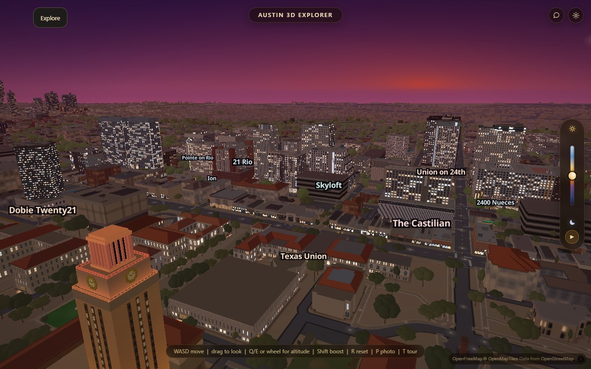

# Reduce the repaint stall between idle rotations

The city pauses while the next idle leg synchronously repaints its facade
atlases. A full-city CPU profile identified the shared wrapped box blur as a
major part of that work. Visiting contiguous rows and reusing wrapped sample
indices cuts this work without changing any filtered pixel, palette, blur radius
or motion setting. The idle timer itself is unchanged.

Two interleaved before/after repetitions used the actual idle driver with all
196 authored buildings ready, tiles settled, hardware Chrome, balanced graphics,
1280 x 800 at DPR 1, no CPU throttle and no sampling profiler. The auto-detect
probe was canceled. Only the startup countdown was held until full-city readiness;
the native 12-second motion legs and synchronous time updates ran normally.

The minimum measured pause between native motion legs fell from **3.680 s to
1.574 s (57%)**. Across both repetitions, pauses were 3.680-4.179 s before and
1.574-1.707 s after. The minimum synchronous time-of-day update fell from
3.531 s to 1.500 s. These are interleaved minima, not a single reading.

This is a partial repair. Median frame time remained 36 ms, and the remaining
1.5-second repaint still interrupts idle motion. A separate diagnostic holding
exposure fixed reduced median frame time to 18 ms; the profile identified
`graphics.js::aeMeter` readbacks as another hotspot. No exposure behavior changes
in this pass. These measurements are desktop results, not physical-phone proof.
The 39-second observation wait begins after the first synchronous update, so
raw frame counts and task totals are deliberately not compared as equal-duration
throughput. An earlier profiled candidate run failed its final tile-readiness
gate and is excluded. The retained interleaved runs all pass that gate.

## Preserve the actual city image

Matched second screenshots, same camera and fixed exposure, before and after:

The two displayed JPEGs are byte-identical. At three time fractions (0.25, 0.62,
0.97), every one of 708 registered raw atlas images matched exactly, including
alpha. Each side forces a repaint and independently checks all 196 authored
buildings, readiness and settled tiles. The other screenshot pairs differ by
less than 0.002 average RGB codes out of 255; their atlas bytes are identical.
[Retained measurements and aggregate image hashes](verification/idle-repaint/report.json)
contain no private camera positions or reference imagery.

## Implementation and regression

The horizontal Float32 intermediate stays unchanged. Vertical running sums use
Float64, matching the old JavaScript-number accumulators, but the traversal
visits contiguous rows. Every channel receives the same additions/subtractions
in the same order. Wrap-index scratch is keyed by both resolution and radius;
capacity grows only to the largest resolution seen. Additional retained scratch
is 40 bytes per side texel (80 KiB at 2048 pixels), with no per-image pixel cache.

Run `node scripts/verify/pattern-lowpass.mjs`: 242 exact RGBA cases compare against
the frozen original traversal, covering growing/shrinking sizes, alpha, fractional
blends, wrapped radii larger than the image, and Float32 rounding stress.
`node scripts/verify/pattern-lowpass.mjs --break` deliberately shifts one wrap
index and must fail. The test does not require Git history or a browser.
`node --check js/pattern-lowpass.js`, `harness-drift.mjs`, and `git diff --check`
also pass. No bake, neighboring model, facade taste or idle scheduling changes.
