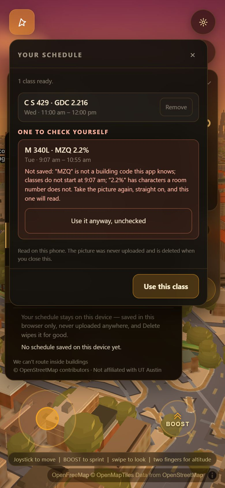
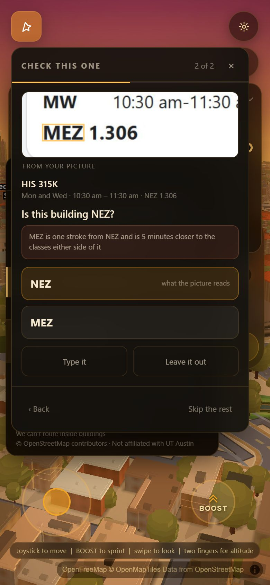

# What counts as unsure, and the screen that asks

`js/schedimg.js` reads a photograph of a schedule. `js/schedconfirm.js` decides
how much to believe it and puts everything it does not believe in front of the
student as a tap. Separate files on purpose: the threshold is an argument that
has to be re-run against a corpus every time somebody changes it, and a reader
that also grades itself can never be re-graded. `js/walkgraph.js` is the third,
added in round two — it answers "how many minutes is it from here to there" and
nothing else, so that the strongest cross-check in this feature has something
pure to call.

| | |
|---|---|
| the model and the screen | `js/schedconfirm.js` |
| the walking probe it cross-checks against | `js/walkgraph.js` |
| the gate | `scripts/verify/schedconfirm.mjs` |
| where the line goes | `scripts/verify/confirm-line.mjs` |
| the evidence the reader now hands over | `js/schedimg.js`, `evidenceFor()` |

---

## Round three: the promise at the top of the file was false in two places

The header of `js/schedconfirm.js` has said the same sentence since round one:

> NOTHING THIS APP IS NOT SURE OF IS EVER WRITTEN DOWN SILENTLY.

It was not true. It was never *enforced* anywhere — it was an emergent property
of "every doubt happens to get a question", and there turned out to be two ways
for a doubt not to get a question. Both were found by **running the module**, not
by reading it, and both are now closed by the same function.

### 1. The cap, which is the one the last round's critic found

`CONF.ask.maxQuestionsPerClass` is 2. A reading has four fields. The old safety
net in `applyGroup()` — *"if anything is unanswered and the reading is weak,
drop it"* — counted only the questions it had **built**, so it could not see a
doubt the cap had thrown away.

Executed against the real module in the real page, a reading scored
`building 0.30 / room 0.45 / time 0.19` — three fields under the 0.72 line —
produced **two** questions. Answer both, and:

```
   { building: "MZQ", room: "2.2%", start: "09:00", end: "11:00",
     confirmed: true, needsConfirm: false }
```

`"2.2%"` is a value this file's own grammar check had already flagged as
containing characters a UT room number cannot contain. It is sitting inside a
class tagged `confirmed: true`. Nobody was ever shown it.

The code even said what should have happened — *"a class needing three answers
is a class to re-photograph, and the screen says so"* — and computed
`g.tooManyDoubts` to do it with. `grep` finds exactly one occurrence in 1,947
lines. It was written and never read.

### 2. The recover lane, which is worse, because it wrote a false sentence

Nothing found this one; it was looked for after the first, on the theory that a
bug with this shape rarely has one instance. `review()`'s `recover` list takes
rows `js/schedimg.js` **refused** to write down and offers the student a tap.
Those rows were never scored at all — not once, anywhere — and `apply()` stamped
the whole row confirmed on the strength of that one tap:

```
   in:   { building: "WEL", room: "2.22", reason: "cut-off",
           why: "this one runs off the edge of the picture, so part of it is missing" }
   out:  { building: "WEL", room: "2.22", confirmed: true, needsConfirm: false,
           why: "confirmed by you from the picture" }
```

The student was shown one button reading `WEL`. They were never shown the room.
The app then put a sentence in its own record saying they had confirmed it — and
the room in question is one the reader had already said out loud was cut in half.
A second row, `13:07–14:55`, failed the clock grammar on **both** ends and came
through the same way.

### The fix is one function, because it was one bug

`openDoubts(doubted, answered)`. A field is settled when the student answered it,
or when the model believed it in the first place. Everything else is open, and an
open doubt now decides three things, in both lanes:

* **`confirmed` requires an empty open list.** Not "every question answered" —
  every *doubt* answered. This is the invariant, and it is asserted across a
  matrix of one, two, three and four doubtful fields in
  `scripts/verify/schedconfirm.mjs` §8.
* **A class kept with open doubts says which ones.** `unconfirmedFields`, plus a
  `why` in plain words: *"you were not asked about the building or the time —
  'MZQ' is not a building code this app knows"*. Never "confirmed by you".
* **Over the cap, the screen asks nothing and saves nothing.** Two questions that
  cannot settle three doubts are two taps that fix nothing — the same reason
  `time.tooTight` was moved out of the asking band last round. The reading goes
  to a **re-take list** on the summary, out of the ready count, with the app's own
  reason printed under it and one full-width button to keep it anyway as
  explicitly unchecked. Left out is the default, because the asymmetry this whole
  file turns on is that "unsure" costs one tap and "confidently wrong" costs a
  missed class.



A one-option "recovery" is not a choice, so those rows — the cut-off case — go to
the same list rather than being asked about and then declared confirmed. A
recover row with a **real** choice keeps its question, because the tap is worth
having; whatever the tap does not reach rides out as `unconfirmedFields`. Asked
and honest beats not asked.

### What it costs on the real corpus: nothing, and that is also the honest limit

```
                          round two            round three
   STRICT                 28 of 136, 16 taps   28 of 136, 16 taps
   LOOSE                  39 of 39 caught      39 of 39 caught
   option coverage        37 of 37             37 of 37
   answer key             0 of 49 asked        0 of 49 asked
   re-take list           (did not exist)      0 rows, STRICT and LOOSE
   image-bench            134/171, 100% prec.  134/171, 100% prec.
   the gate               86 checks            101 checks
```

**Zero.** Not one reading in the fifteen-image corpus has more doubtful fields
than the cap can ask about, on either pass — measured, both ways, before the fix
was designed. So the new path costs nothing measurable, and **the corpus cannot
validate it either.** Every proof that it works is synthetic: the matrix in §8,
the critic's own reading replayed, the cut-off row, and the screen measured in
pixels on a 390x844 frame. That is a real limit and it is stated here rather than
in a footnote.

It also means the fix was never about a number. It was about a sentence at the
top of a file being true.

**`CONF.ask.overCap` is the one-line overrule.** `'retake'` ships; `'ask'`
ignores the cap and asks about all four fields instead, costing up to four taps
on one row and never leaving anything out. The gate runs both.

### The benchmark number did not move, and this time it could not have

`134 / 171`, precision `100.0%`, 0 hallucinations, 0 near misses — run after the
change, on this tree. `image-bench.mjs` scores `js/schedimg.js` through
`schedimg-extract.mjs`; there is no confirm screen and no student anywhere in
that path, so a change confined to `js/schedconfirm.js` cannot move it in either
direction. It is reported because the brief asks for it, not because it measures
this piece. The numbers that belong to this piece are **16 taps**, **39 of 39**,
and now **0 re-takes**.

---

## Round two: the hole that was named last round is partly closed, and the measurement that closed it found a defect on the way

The previous version of this document ended by naming its own worst failure, and
it was the right one to name:

> `MEZ` is Mezes Hall, on the South Mall. `NEZ` is the North End Zone Building,
> inside the football stadium. They are one stroke apart, they are **both real
> codes in the register**, and the corpus's own schedule s3 puts a class in
> `MEZ 1.306`. If the engine reads one as the other, every check in this file
> scores it 1.00 and it is saved in silence.

It also named the one check that could see into that hole — the campus walking
graph — and why it was **inert**: `window.wayfindRoute` is async and
side-effecting, so there was no quiet probe to call and the whole safety net
protected nobody.

Three things changed, in this order, and the second one is the interesting one.

**1. The probe was built, so the check is live.** `js/walkgraph.js` is a second
reader of `data/walk_graph.json` — 300 lines, no DOM, no globals, no side
effects, and the cost model taken out of the graph file's own `tune` block
rather than typed in. `minutes('MEZ','WEL')` is synchronous, memoised, and
returns `null` rather than a number it cannot stand behind. `prepare()` loads it
by default, so a caller who passes no options at all now gets every cross-check
this file has.

**2. Switching it on immediately made the screen worse, and the measurement is
what said so.** A new gate section runs the benchmark's **own answer key** —
forty-nine meetings that are correct by definition — straight through the model
with no OCR anywhere. The first run asked about **twelve of the forty-nine**,
all one shape:

```
   Tue 09:30-11:00 RLP 0.106   only 0 minutes between this and CMA, which is a 13-minute walk
   Tue 11:00-12:30 CMA 6.146   only 0 minutes between this and CMA, which is a 13-minute walk
   ...
```

A printed university timetable is written in **blocks**, so back-to-back is what
a real one looks like — the passing period is inside the block, and a student
with that pair knows perfectly well they leave early. The walking check was
telling four real schedules that they were impossible.

And the question it produced **could not be answered**. This file's own rule is
that a question whose options do not contain the truth costs a tap and fixes
nothing; *"there is not enough time to walk this"* has no candidate correction
at all, so the only button is the reading and the only possible answer is "yes,
that is what my schedule says."

So `CONF.time.tooTight` moved from **0.55 to 0.85** — out of the band that asks
on its own and into the band that corroborates. The campus graph did not stop
being the strongest thing this app knows. It stopped being asked the wrong
question.

**3. Where it does have a candidate answer, it asks about the BUILDING.**
`neighbourDoubt()` is the new check and it is the one that closes the hole:

> **Is this building NEZ?**
> *MEZ is one stroke from NEZ and is 8 minutes closer to the classes either
> side of it*
> `NEZ` what the picture reads · `MEZ` Mezes Hall



The reading still leads, because there is nothing wrong with these four
characters — `NEZ` is a real building and this is a **relational** doubt in
exactly the sense the rest of this document uses the word. A student who
genuinely has a class in the North End Zone Building pays one tap for that.

### What it costs: nothing

```
                       before this round      after
   answer key           12 of 49 asked        0 of 49 asked
   STRICT               28 of 136, 16 taps    28 of 136, 16 taps
   LOOSE                39 of 39 caught       39 of 39 caught
   option coverage      37 of 37              37 of 37
   image-bench          134/171, 100% prec.   134/171, 100% prec.
   cross-checks live    graph OFF             graph, neighbours, register names ON
```

The line did not move and the plateau did not move: `confirm-line.mjs` still
reports 28 classes and 16 taps at every threshold from 0.60 to 0.78, because all
three new penalties were placed **at or below 0.70** by construction and the
0.70/0.85 gap that puts the line at 0.72 is untouched.

### And how far it actually reaches — measured pair by pair, not claimed

This is the part to read sceptically, because it is where the honest limit is.
The gate walks all thirteen confusable pairs against the real graph:

```
   MEZ/NEZ    9 min / 803 m apart    <- the graph can separate these
   TSC/TSG   20 min / 1762 m apart   <- the graph can separate these
   PAI/PAT    2 min / 250 m apart      (too close to separate)
   PHD/RHD    0 min / 55 m apart       (too close to separate)
   BE1/BEL, ETC/FTC, FS1/FSL, FTC/FTG, GHE/GHF, GRE/GRF, ICB/TCB,
   MMS/NMS, PRH/RRH                    not both in the graph at all
```

**Four of thirteen pairs have both members in the walk graph, and the graph can
separate two of them.** `CONF.walk.gainMin` is 5 for exactly that reason and it
is derived rather than fitted: a class has at most two adjacent walks, so by the
triangle inequality no `PAI`/`PAT` swap — the closest pair the graph can see —
can ever gain more than 2 × 2 = 4 minutes on any schedule. 5 is the first value
the pair the graph *cannot* resolve can never reach.

So a **second** witness was needed for the pairs the graph cannot separate, and
it is UT's own printed name for the building out of `data/ut_buildings.json`.
The gate runs the shipping regex over all thirteen pairs and prints what it
finds:

```
   FTC/FTG  FOOTBALL TRAINING COMPLEX GARAGE    vs  FOOTBALL TRAINING COMPLEX
   GRE/GRF  GREGORY AQUATIC FOOD SERVICE BLDG.  vs  GREGORY GYMNASIUM
   PRH/RRH  DOBIE PAISANO RANCH HOUSE           vs  ROBERT B. ROWLING HALL
   TSC/TSG  27TH STREET GARAGE                  vs  LEE & JOE JAMAIL TEXAS SWIMMING CTR
```

Nobody is taught in a car park. `CONF.venue.unlikely` is a deliberately short
list, and stadiums, gyms and residence halls are **not on it** — UT really does
teach in all three, and `NEZ`, the case this whole check exists for, is itself
inside the stadium.

**Between the two witnesses: five of thirteen pairs now raise a question, and
eight do not.** The gate prints both sets and names `PAI/PAT` — the one pair of
real teaching buildings in the residue — on its own line rather than letting it
disappear into a count.

### The probe agrees with the app's own router, checked rather than asserted

A second reader that disagrees with the first is worse than no reader: the
confirm screen would call a walk impossible while the app's own route card, on
the same two buildings, printed a time that fits. So §2d drives the real
`window.wayfindRoute` and compares:

```
   MEZ -> WEL    probe  2 min /  221 m     router  5 min /  502 m     diff -3
   NEZ -> WEL    probe  7 min /  657 m     router  8 min /  691 m     diff -1
   GDC -> RLP    probe  4 min /  412 m     router  4 min /  395 m     diff +0
   PAI -> BUR    probe  3 min /  284 m     router  3 min /  327 m     diff +0
   JES -> CMA    probe 13 min / 1082 m     router 13 min / 1091 m     diff +0
   MEZ -> NEZ    probe  9 min /  803 m     router  9 min /  809 m     diff +0
   WEL -> GDC    probe  0 min /   58 m     router  1 min /  145 m     diff -1
   TSC -> TSG    probe 20 min / 1762 m     router 21 min / 1767 m     diff -1
```

**Never over, worst gap 3 minutes**, and always in the safe direction: the probe
drops the router's door-role handicap (it is not drawing a route, so any door is
a legal end), which can only make a walk shorter. A check that fires when even
the optimistic number does not fit is making the strong claim, which is the only
one worth a tap.

---

## The line is two lines, and that is the one real design decision here

A single threshold makes two different questions share one answer:

| | |
|---|---|
| am I sure enough to save this **without asking**? | `CONF.askBelow` = **0.72** |
| am I sure enough to put this **in the first button**? | no named defect, and `CONF.trustBelow` = **0.34** |
| am I sure enough to keep this when **nobody answered**? | `CONF.keepUnansweredAbove` = **0.34** |

They are not the same question. When nothing specific is wrong and the reading
merely came off the page faintly, offering it first, pre-selected, saves a tap —
the question reads *"Is this 9:30 am to 11:00 am?"* and one press ends it. When
the app can **name** what is wrong with what it read, offering it first is a
**trap**: a student tapping the top button on a list of three is confirming a
wrong answer this app put under their thumb. Then the correction leads, nothing
is pre-selected, and the wording becomes an open question:

> **Which building is this?**
> *it could be CPE or GRE — one letter apart*
> `CPE` Chemical and Petroleum Engineering · `GRE` Gregory Gymnasium ·
> `CRE` what the picture reads

`CRE` is not an invented example. It is one confusable character from two real
codes in the app's own register, and those two buildings are four hundred metres
apart on opposite sides of Speedway. `scripts/verify/schedconfirm.mjs` §2b
asserts that against `data/ut_buildings.json` itself rather than against a
fixture, and prints the **thirteen** pairs of real UT codes that are one such
character apart.

### Two kinds of doubt, and they are not interchangeable

That distinction is the second real decision in this file and it is not a
threshold at all.

- A **defect** is something wrong with the reading itself: a code that is not a
  code, a room with a percent sign in it, an end time nothing ends at. The
  correction leads.
- A **relational** doubt is about the reading's neighbours: two classes at one
  hour, a walk that does not fit in the gap. There the four characters are
  exactly what the picture says and one of the two classes is fine, so the
  reading leads and the clash is printed as the reason for asking.
- And a reading this file has **already corrected** — `PAL` repaired to `PAI`,
  the only real code it can be — shows `PAI` in the first button, because there
  is nothing wrong with `PAI` and `repairCode()` only ever repairs when exactly
  one real code fits.

Merging those into one comparison produced a screen that offered *"9:30 pm"* as
the leading answer to a class the picture plainly said was in the morning.
`scripts/verify/schedconfirm.mjs` §3 asserts all three cases.

---

## Confidence is a product of cross-checks, not a feeling

Each field starts at **1.0** — the reading is what the picture says — and is
multiplied by one factor per check that fails. The engine's own word confidence
is one of those factors and only bites at the bottom, below 62 on Tesseract's
0–100 scale; the measurement below is why it is not the base.

**Multiplied and not averaged**, because the checks are near-independent and any
one of them has to be able to drag a field under the line on its own. An average
lets a perfect time and a perfect day carry a room that is not a room.

**The field's confidence is its WORST word, and the class's is its WORST field.**
A phrase with one unreadable word in it is an unreadable phrase, and a class
with a wrong room is a wrong class no matter how certain the other three are.

### What the checks actually check — all against data this app already has

| check | source of truth | factor |
|---|---|---|
| the code is on UT's own register | `data/ut_buildings.json` + wayfind's extras, 209 codes | 1.00 |
| repaired by one confusable character, exactly one real code fits | the same register | 0.62 |
| code-shaped but not a code this build knows | the same register | 0.30 |
| **two or more real codes fit** | the same register | 0.12 → always asked |
| a field cut by the edge of a **crop** | the frame | 0.10 |
| an undotted room where every other room read in **that building on this picture** is dotted | the student's own other classes | 0.55 |
| a bare four-digit room (`2122`, where UT writes `2.122`) | UT's room syntax | 0.62 |
| characters a room number does not contain (`2.2%`) | UT's room syntax | 0.45 |
| the room was **borrowed** from the same class on another day | the across-days vote | 0.55 |
| ...but **agreed** with a second copy of the same class | the across-days vote | 1.15 |
| the day came from the **column it was drawn in** | geometry, not reading | 1.00 |
| no am/pm printed anywhere | the picture | 0.50 |
| the calendar's hour ruler and the block's own caption **disagree** | two witnesses | 0.45 |
| a start time that is not a real UT class hour (`9:07`) | the clock | 0.70 |
| a length nothing is taught in | the clock | 0.85 |
| **two classes at the same hour on one day** | the student's own other classes | 0.30 |
| two classes that partly overlap | the student's own other classes | 0.85 |
| not enough minutes to walk it | the app's own campus graph | 0.85 |
| **a one-stroke neighbour makes an impossible walk possible** | the campus graph × the register | 0.55 |
| **a one-stroke neighbour fits the rest of the day 5+ minutes better** | the campus graph × the register | 0.62 |
| **UT's own name for this building is a car park** | `data/ut_buildings.json` | 0.62 |

The last four are the ones this app can do that nothing else on the phone can,
and the difference between the first of them and the other three is the whole
lesson of round two. *"There is not enough time to walk this"* is true, useful
and **unanswerable** — there is no button that fixes it — so it corroborates at
0.85 and never asks alone. *"MEZ is one stroke from NEZ and eight minutes closer
to the classes either side of it"* is the same evidence pointed at the field
that is actually likely wrong, and it comes with a button.

All four are **silent when the graph is not loaded** rather than guessing, and
`review()` returns a `walkCheck` block saying which of them were live — a check
that quietly does nothing when its data is missing is worse than one that says
so, and this is the line the gate reads to prove the strongest check in the file
is not inert.

### What is NOT here, and why

The brief asked for a floor check — *a room number in a building with four
floors that starts with a 9 is suspect* — and it is a good check. **This repo
has no floor data, so it is not in the file.** Measured rather than assumed:

- joining `data/entrances.geojson` (147 building-id→code pairs) to
  `data/places.geojson`'s heights yields **8 buildings**, and gives **JES** — a
  27-storey dormitory — a height of **5.35 m**. The join is wrong as well as
  sparse.
- `data/osm_cache` carries `building:levels` beside a UT `ref` on **26**
  features, none of them the academic buildings classes are in.
- `data/campus_storeys.geojson` is 640 facade *course* details, not storeys.

A floor table assembled from any of that would be a guess wearing a number, and
guessing is the failure this file exists to prevent. `CONF.room.floorOver` and
`roomFloorSuspect()` are the two places a real one plugs in, and the function
returns "no opinion" until it is handed one.

---

## "Here are the two it might be" — never a text field first

`repairCode()` in `js/schedimg.js` answers *"may I write this down myself?"* and
its answer has to be **no** whenever two real codes fit: silently picking one of
CPE and GRE sends a student across Speedway. But *"I cannot write this down"*
and *"I have nothing to show you"* are different sentences, and the second one
was never true — the reader knows exactly which two buildings it might be.

So `codeCandidates()` is a **new, separate** export that returns the whole
candidate set, and nothing that writes an answer down may reach it. That turns
the round's worst refusal into one tap.

The same shape everywhere else:

| field | the taps offered |
|---|---|
| building | every real code within one confusable character, the reading itself, `Type it` |
| room | the reading, the dotted/undotted twin, other rooms read in that building, `Type it` |
| time | the reading, the same hours snapped to the grid a calendar really draws, one confusable hour digit (3↔8, 1↔7, 5↔6, 9↔4), and the other half of the day **only where no am/pm was printed** |
| **days** | **five chips, pre-filled with what was read** |

Days are a multi-select and get a multi-select control. A list of single days
where picking Wednesday silently deletes Monday and Friday is a trap, and it is
the one this screen shipped with for an hour before the day question was moved
off the meeting and onto the reading.

### One question per READING, not per meeting

A Tuesday/Thursday course is **two rows** in `classes` and **one line** of the
picture. `js/schedimg.js` now hands both rows the *same* evidence object by
reference, which is what makes them identifiable as one reading; `review()`
groups on it, asks once, and `apply()` writes the answer onto every copy. The
gate asserts that one tap on `CRE` → `CPE` rewrites both meetings, and that
answering the day chips with Mon+Wed yields **two** meetings and not three.

---

## The screen


One question at a time. A list of seven classes each with two flags is a form,
and a form is what a student abandons; a stepper shows one crop, one sentence
and two or three buttons, and tells you how many are left.

**The crop is the student's own picture**, rectified so it is upright even when
they photographed their screen at an angle, with the four characters in doubt
ringed in the app's own accent so the ring reads as this app pointing rather
than as something that was on the page. It is never the field alone — the crop
is padded out to the row around it, because four characters on their own are
unrecognisable and the whole point is that a student can check the answer
without hunting through the original.


Everything that ends a step is **at least 44 px tall** and sits in the **lower
two-thirds** of the panel, which on a 390×844 phone is where a thumb is; the
crop and the question sit above it, which is where eyes are. Measured on the
frame, not asserted — these are the numbers the gate printed on the run that
produced the frames above, and they move when the screen does: panel
**344×540 at (16, 68)** in a 390×844 viewport, bottom edge at 608, no sideways
scroll, five controls with a minimum height of **44 px**, topmost answer button
at **y = 369**, and the crop's luma spread at **49.7** on this question and
**61.5** on the `MEZ`/`NEZ` one — a blank canvas is 0.

Then the summary, and the promise the whole round is built on:


> Read on this phone. The picture was never uploaded and is deleted when you
> close this.

`destroy()` makes the second half of that true rather than polite: it sets the
canvas holding the schedule photograph to 1×1 and drops it, so an emptied
backing store cannot be recovered by anything that kept a reference.

---

## Nothing leaves the browser

- No analytics, no upload, no image anywhere but a `<canvas>` cut from the one
  `js/schedimg.js` already made on this device.
- **Two fetches, both same-origin, both of the app's own data files, and
  neither carries anything.** `data/ut_buildings.json` is the register the
  reader was already using; `data/walk_graph.json` is the file the app's own
  walking feature reads. They are `GET`s of static files this repo ships —
  nothing about the student's schedule is in the URL, and there is no body.
  Round two added the second one and §4 of the gate is what proves it did not
  add a destination: the allowlist is **measured**, and the run above reports
  the only off-box host contacted after the image was handed over as
  `tiles.openfreemap.org`, which is the basemap and was there before this
  feature existed.
- The rectified page is kept as a **canvas** rather than pixels. That is a
  safety property, not an implementation detail: a canvas does not survive
  `structuredClone`, so it cannot cross into a worker, a message or a fetch body
  without somebody writing the conversion out by hand.
- **Every string that came off the picture reaches the DOM through
  `textContent` and never through `innerHTML`.** The text is arbitrary bytes
  from an image and this screen is the one place it is drawn.
- The module is **not referenced from `index.html`** and its stylesheet is
  inside it, so the app's cold load pays nothing.

`scripts/verify/schedconfirm.mjs` §4 asserts it on the real page at the network
level — context-level capture so a worker's own fetches are in scope, plus a raw
TCP sink that depends on no Playwright behaviour — and then **proves the
instruments are not blind** by firing a canary through `fetch` and through a
real `Worker` and requiring both to catch it.

The allowlist for "did anything leave the box" is **measured, not written
down**: the set of hosts the app already talked to before the image was handed
over is the allowlist, and one new host fails. The app fetches basemap tiles
from a public host and did so before this feature existed; the promise being
made here is that *importing a schedule adds no destination*.

---

## Running it

```bash
node scripts/verify/schedconfirm.mjs                    # the gate (starts its own server)
cd scripts/verify && node confirm-line.mjs              # where the line goes
cd scripts/verify && node image-bench.mjs ./schedimg-extract.mjs --name ours
```

`confirm-line.mjs` runs the corpus **twice** and the second pass is the point of
it — see below. It now calls `prepare()` rather than a bare `review()`, so what
it measures is the shipping configuration; it prints which cross-checks were
live above every table, because a confidence model measured with its strongest
check switched off is a different model.

The gate section to run while moving a weight is **§2** (synthetic readings, no
OCR, a second or two) followed by **§2e** (the answer key, no OCR either). §2e
is the cheap one that catches an expensive mistake: forty-nine readings that are
correct by definition, and any question at all is a false question.

---

## Where the line came from

### The honest difficulty, stated first

The shipping pipeline scores 136 predictions on the fifteen-image corpus with
**zero wrong answers** (`docs/img-extract.md`). **A threshold cannot be
calibrated against errors that are not there.** A sweep over a population with
no errors in it proves only that the line is not costing taps, which is half the
question and the less important half.

So `confirm-line.mjs` runs the corpus twice:

- **STRICT** — the shipping tune. Measures the **cost**: how many *correct*
  classes the line asks about needlessly.
- **LOOSE** — the same engine, the same images, the same readers, with the four
  hard refusals the previous lane installed switched off through `TUNE`: the
  edge-of-crop guard, the class-length guard, the across-days room vote and the
  quarter-hour snap. Those four guards are *the reason* the strict pass has no
  errors, so switching them off reproduces **exactly the wrong answers they were
  built for** — real OCR mistakes, from the real engine, on the real corpus,
  rather than errors invented to be caught. Measures the **danger**.

A threshold that is cheap on STRICT and safe on LOOSE is the one to ship, and
neither pass on its own can tell you that.

### The first line was wrong, and the measurement is what said so

Round one of this file used Tesseract's word confidence as the **base** of every
field, mapped 15→0 and 95→1. `confirm-line.mjs` scored it:

```
              classes asked about        wrong answers
              (of 136, all correct)      caught / let through
  STRICT      48   (35.3%), 34 taps      —
  LOOSE       49                          4 of 39      35 in silence
```

**Expensive and blind at the same time**, which is the worst quadrant. Four
things came out of reading the two passes class by class, and each is a reason
rather than a fit — that distinction matters, because a threshold tuned against
fifteen images is worthless if it was tuned by sliding it until the number went
green.

| what the measurement showed | what changed, and why it is not just fitting |
|---|---|
| every correct reading on the corpus spans word-confidence 41–96, and every wrong reading in the loose pass is carried at 90+ | **OCR confidence is not the base any more.** It has no discriminating power here because the errors are geometric, not optical — a block's painted bottom read short. The base is 1.0 and confidence only bites below 62, which is barely above `js/schedimg.js`'s own noise floor of 26. |
| **37 of the 39** loose errors are one shape: `10:55` for `11:00`, `12:25` for `12:30`, `13:55` for `14:00` | **The end time is now checked against the clock, not only the start.** Nothing at UT ends at five to. The "ok" list deliberately contains `:15 :20 :45 :50`, which this corpus does not contain at all, precisely so the rule is about UT and not about these fifteen images. |
| six false questions came from an "overlap" penalty firing on **the answer key's own data**: schedule s3 has C S 429 at 10:00–11:00 MWF and HIS 315K at 10:30–11:30 MW, both `required`, on three images | **Exact and partial clashes are now different checks.** Two classes at the same hour in two buildings is a misread every time; a 30-minute clash is a thing real students carry. |
| `JES A121A` was called *"not a shape UT room numbers take"* — it is one | **The room grammar allows a letter prefix**, which UT residence and annex rooms use. |

And one thing that came out of it that is not a threshold at all: **there are two
kinds of doubt and they need different questions.** A defect the app can NAME in
the reading ("nothing ends at 10:55", "CRE is not a code") must not leave the
reading in the first button. A doubt about the reading's NEIGHBOURS ("this
overlaps your history class") leaves the four characters entirely credible, so
the reading stays first and the clash is the printed reason for asking. Merging
those two into one `trustBelow` comparison produced a screen that offered
*"9:30 pm"* as the leading answer to a class the picture plainly said was in the
morning.

---

### Where it landed

Run against the committed tree, `askBelow = 0.72`, with the walking graph, the
confusable-neighbour check and the register names **all live** — which
`confirm-line.mjs` now prints above every table, because a confidence model
measured with its strongest check switched off is a different model:

```
  cross-checks live: walking graph=true  confusable neighbours=true
                     register names=true  [walk_graph.json @ 2026-07-30T16:47:30Z]

             classes asked about      wrong answers          taps across
             (of 136, all correct)    caught / in silence    15 images
  STRICT     28   (20.6%)             —                      16
  LOOSE      67                       39 of 39  /  0         56
```

and **the buttons contained the right answer on 37 of 37** of the wrong classes
the line asked about — a question whose options do not contain the truth costs a
tap and fixes nothing.

Per image, on the shipping tune: **nine of the fifteen ask nothing at all.**
Image 09, a dark-mode registrar table whose type comes off the page at
word-confidence 55, costs eight taps; image 05, an angled table, costs four;
images 01, 03, 07 and 10 cost one each. **Sixteen taps for a hundred and
thirty-six classes across fifteen schedules** — about one per picture.

And the separation is not marginal: every one of the 39 wrong answers scores
between **0.19 and 0.47**, and the line clears the highest of them by 0.25.

### 0.72 is derived, not fitted — and that matters more than the number

Look at the STRICT column between 0.60 and 0.78: it does not move. 28 classes,
16 taps, at every one of those thresholds. That plateau is not luck, it is the
shape of the penalty table:

- every penalty meant to **trigger a question on its own** is at most **0.70**
  (`offGrid`, the largest of them);
- every penalty meant only to **corroborate** is at least **0.85**
  (`oddLength`, a partial overlap).

0.72 is the gap between those two sets. Any single named defect asks; no single
corroborating hint does. No penalty value lies between 0.70 and 0.85, which is
exactly why nothing changes as the line moves across that range.

**Round two added three penalties and moved one, and this is the rule that said
where each of them goes.** The two confusable-neighbour checks and the venue
check are all **at or below 0.70** — each of them is a specific, nameable claim
about one reading with a button that answers it, so each has to be able to ask
on its own. `tooTight` went the other way, to **0.85**, because it is the one
kind of doubt in this file with no button behind it. The plateau is unchanged:
STRICT still reports 28 classes and 16 taps at 0.60, 0.66, 0.72 and 0.78. That
is the check that the architecture survived the round, and it is worth more than
the fact that the totals happened to match.

**It is also why 0.50 is not the answer**, even though on this corpus 0.50 is
strictly better — 7 classes asked instead of 28, and still 39 of 39 caught. The
39 errors cluster at 0.43–0.47 and a 0.50 line clears them by 0.03. But those 39
are one error wearing two coats: `endOffGrid` (0.55) times `oddLength` (0.85).
A variant of the same seam whose length happened to be standard would score
**0.55 on the single signal alone** and slip straight under a 0.50 line. 0.72
catches it. A threshold with three hundredths of margin against a mono-culture
of errors is a threshold that has been fitted, not derived.

### The benchmark number did not move, and that is the correct outcome

```
image-bench  ours   (15 images, 171 scored meetings)
  ALL FOUR FIELDS RIGHT   134 / 171    78.4%
  precision               100.0%   (136 predictions, 0 matched nothing)
  hallucinations 0    three-of-four near miss 0    end-time-only losses 0
```

Identical to `acer/img-extract`, image for image, against a bar of 36/171. That
is what this piece had to do to the bench: **nothing.** `image-bench.mjs` calls a
function fifteen times and there is no student in it, so what it scores is the
proposal set — and a confirm flow that changed the proposal set would be doing
the reader's job rather than its own. What it must not do is regress it, and the
run above is against the committed tree.

The numbers that belong to this piece are the two in the table above: **16 taps**
and **39 of 39**.

---

## What is still weak

**A class kept from the re-take list is marked unchecked and NOTHING
DOWNSTREAM SHOWS IT.** This is now the weakest thing here, and it is the direct
cost of the round-three fix. `unconfirmedFields` and `needsConfirm: true` are
written onto the class and the confirm screen paints it warm-red — but the moment
the student presses "Use", the class leaves this file, and `grep` finds **zero**
occurrences of `needsConfirm` or `unconfirmedFields` in `js/wayfind.js`. In the
day view an unchecked class looks exactly like a checked one. The disclosure is
real at the point of saving and evaporates afterwards. Fixing it means a schema
change in another lane's file, so per `CLAUDE.md` it is written down here as a
request rather than made: **the day view needs a not-checked mark, driven off
`needsConfirm`, and a tap that reopens the question.**

**The re-take path has never run on a real image.** Zero rows on the fifteen-image
corpus, both passes, measured before the fix was designed. Every proof that it
behaves is synthetic — the matrix in §8, the critic's reading replayed, the
cut-off row, and the screen measured in pixels. A corpus with a genuinely
half-legible schedule in it would price the one thing this path trades away:
**readings that are now left out by default and used to be silently kept.** On
this corpus that trade is free because the population is empty; it will not stay
free, and nothing here knows how expensive it gets.

**And the second hole was found by looking for it, not by a test.** The recover
lane had never been scored by anything, in any round, and no gate noticed for two
rounds. The invariant in §8 covers both lanes now, but the lesson is about
coverage, not about the fix: a promise in a file header is not enforced by being
written down.

**Eight of the thirteen confusable pairs are still invisible, and that is now
the biggest thing here.** Round one could not see any of them. Round two raises
a question on **five of thirteen** — `MEZ/NEZ` and `TSC/TSG` from the walking
graph, and `GRE/GRF`, `FTC/FTG`, `PRH/RRH`, `TSC/TSG` from UT's own printed
names. That count is computed from the register and the graph inside
`scripts/verify/schedconfirm.mjs` §2c and printed pair by pair, so it is a
measurement rather than a list somebody typed. What is left:

| pair | why it is still invisible |
|---|---|
| `PAI/PAT` | **the dangerous one.** Painter Hall and Patterson Labs are both real teaching buildings, 250 m and two minutes apart, and the corpus's own schedule s3 has a class in `PAI 3.02`. Two minutes cannot clear `gainMin`, and neither name is a car park. Nothing in this repo can separate them, and the gate says so out loud rather than counting it as covered. |
| `PHD/RHD` | two residence halls 55 m apart. Real, and low-stakes: they are next door to each other. |
| `BE1/BEL`, `ETC/FTC`, `FS1/FSL`, `GHE/GHF`, `ICB/TCB`, `MMS/NMS` | at least one member has no door in `data/walk_graph.json` (135 of the register's 198 codes are routable), so the graph cannot compare them at all. |

The measurement still cannot see this hole either — the corpus contains no
instance of a confusable misread, so the 16 taps and the 39-of-39 above are both
silent about it. What changed is that the two synthetic cases in §2c are run
against the **real** register and the **real** graph rather than a fixture, and
the third one is a real reading off a real picture with one stroke changed.

**A better fix for `PAI/PAT` exists and this repo does not have the data for
it**: a room register. `PAI 3.02` and `PAT 3.02` are not both real rooms, and a
building→room table would settle the pair in one lookup. Same shape as the floor
table below, same reason it is not here: guessing one from
`data/entrances.geojson` would be a guess wearing a number.

**The line was calibrated against errors made by switching guards off, and 37 of
those 39 errors are one shape.** That is a real error population from a real
engine on real images, which is much better than errors invented to be caught —
but it is a mono-culture, and a model tuned on a mono-culture can be blind to a
shape the corpus does not contain. Every constant above is in `CONF` for exactly
that reason.

**Moving `tooTight` into the corroborating band means a student is no longer
told when their day genuinely does not fit.** That is the honest cost of the
change, and it is the right trade — the question could not be answered — but it
is a loss, not a free win. The evidence is still computed and still written into
the class's `why`; what does not exist yet is a place on the **summary** screen
to print it as a warning that costs no tap. `review()` would need to return the
contradictions it found and the summary would need a line for them. Deliberately
not built here rather than half-built.

**`CONF.walk.gainMin` is derived from the register but validated on one case.**
The triangle-inequality argument that puts it at 5 is sound and it is the reason
the number is not fitted — but the corpus contains no confusable misread, so
nothing measured how often a gain of exactly 5 shows up on a **correct** reading.
The answer-key run (§2e, 0 of 49) and the corpus run (28 asked, unchanged) are
the two pieces of evidence that it costs nothing, and both are on schedules with
no confusable code in them except `MEZ` and `PAI`, whose true readings are
silent. A campus with more `MEZ`-scale pairs in a student's day would cost taps
this corpus cannot price.

**The screen is still not reachable from the app**, and this branch still does
not touch `js/wayfind.js` — it is another lane's file and `git diff --stat`
between this branch and `acer/img-extract` shows zero lines of it. What changed
is the size of the seam. Round one needed a caller who knew about `schedimg`,
`review`, `mount`, `apply` **and** a `routeMinutes` it had no way to obtain.
There is now one call that does all of it and loads its own cross-checks:

```js
const { classes } = await confirmFromFile(file, host);
```

That is the whole integration, and everything under it — the reader, the
confidence model, the walking graph — is a dynamic `import()`, so an app that
never calls it still pays nothing.

**The day question is what still costs the most on this corpus** — day letters
photographed at 9 pt come back at word-confidence in the forties and there is
nothing specific to say about them, so the screen asks. The chips make it one
tap for a whole MWF course, which is the mitigation, not a fix.

**There is no floor table**, above.
