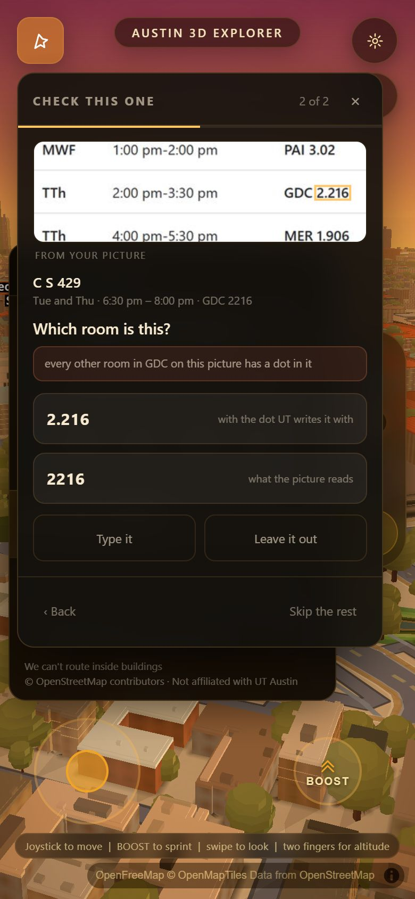
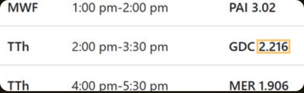
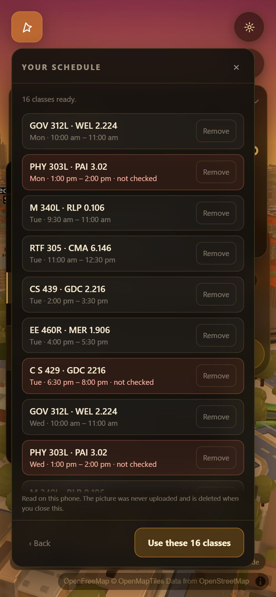

# What counts as unsure, and the screen that asks

`js/schedimg.js` reads a photograph of a schedule. `js/schedconfirm.js` decides
how much to believe it and puts everything it does not believe in front of the
student as a tap. Two files on purpose: the threshold is an argument that has to
be re-run against a corpus every time somebody changes it, and a reader that
also grades itself can never be re-graded.

| | |
|---|---|
| the model and the screen | `js/schedconfirm.js` |
| the gate | `scripts/verify/schedconfirm.mjs` |
| where the line goes | `scripts/verify/confirm-line.mjs` |
| the evidence the reader now hands over | `js/schedimg.js`, `evidenceFor()` |

---

## The line is two lines, and that is the one real design decision here

A single threshold makes two different questions share one answer:

| | |
|---|---|
| am I sure enough to save this **without asking**? | `CONF.askBelow` = **0.72** |
| am I sure enough to put this **in the first button**? | no named defect, and `CONF.trustBelow` = **0.34** |
| am I sure enough to keep this when **nobody answered**? | `CONF.keepUnansweredAbove` = **0.34** |

They are not the same question. When nothing specific is wrong and the reading
merely came off the page faintly, offering it first, pre-selected, saves a tap —
the question reads *"Is this 9:30 am to 11:00 am?"* and one press ends it. When
the app can **name** what is wrong with what it read, offering it first is a
**trap**: a student tapping the top button on a list of three is confirming a
wrong answer this app put under their thumb. Then the correction leads, nothing
is pre-selected, and the wording becomes an open question:

> **Which building is this?**
> *it could be CPE or GRE — one letter apart*
> `CPE` Chemical and Petroleum Engineering · `GRE` Gregory Gymnasium ·
> `CRE` what the picture reads

`CRE` is not an invented example. It is one confusable character from two real
codes in the app's own register, and those two buildings are four hundred metres
apart on opposite sides of Speedway. `scripts/verify/schedconfirm.mjs` §2b
asserts that against `data/ut_buildings.json` itself rather than against a
fixture, and prints the **thirteen** pairs of real UT codes that are one such
character apart.

### Two kinds of doubt, and they are not interchangeable

That distinction is the second real decision in this file and it is not a
threshold at all.

- A **defect** is something wrong with the reading itself: a code that is not a
  code, a room with a percent sign in it, an end time nothing ends at. The
  correction leads.
- A **relational** doubt is about the reading's neighbours: two classes at one
  hour, a walk that does not fit in the gap. There the four characters are
  exactly what the picture says and one of the two classes is fine, so the
  reading leads and the clash is printed as the reason for asking.
- And a reading this file has **already corrected** — `PAL` repaired to `PAI`,
  the only real code it can be — shows `PAI` in the first button, because there
  is nothing wrong with `PAI` and `repairCode()` only ever repairs when exactly
  one real code fits.

Merging those into one comparison produced a screen that offered *"9:30 pm"* as
the leading answer to a class the picture plainly said was in the morning.
`scripts/verify/schedconfirm.mjs` §3 asserts all three cases.

---

## Confidence is a product of cross-checks, not a feeling

Each field starts at **1.0** — the reading is what the picture says — and is
multiplied by one factor per check that fails. The engine's own word confidence
is one of those factors and only bites at the bottom, below 62 on Tesseract's
0–100 scale; the measurement below is why it is not the base.

**Multiplied and not averaged**, because the checks are near-independent and any
one of them has to be able to drag a field under the line on its own. An average
lets a perfect time and a perfect day carry a room that is not a room.

**The field's confidence is its WORST word, and the class's is its WORST field.**
A phrase with one unreadable word in it is an unreadable phrase, and a class
with a wrong room is a wrong class no matter how certain the other three are.

### What the checks actually check — all against data this app already has

| check | source of truth | factor |
|---|---|---|
| the code is on UT's own register | `data/ut_buildings.json` + wayfind's extras, 209 codes | 1.00 |
| repaired by one confusable character, exactly one real code fits | the same register | 0.62 |
| code-shaped but not a code this build knows | the same register | 0.30 |
| **two or more real codes fit** | the same register | 0.12 → always asked |
| a field cut by the edge of a **crop** | the frame | 0.10 |
| an undotted room where every other room read in **that building on this picture** is dotted | the student's own other classes | 0.55 |
| a bare four-digit room (`2122`, where UT writes `2.122`) | UT's room syntax | 0.62 |
| characters a room number does not contain (`2.2%`) | UT's room syntax | 0.45 |
| the room was **borrowed** from the same class on another day | the across-days vote | 0.55 |
| ...but **agreed** with a second copy of the same class | the across-days vote | 1.15 |
| the day came from the **column it was drawn in** | geometry, not reading | 1.00 |
| no am/pm printed anywhere | the picture | 0.50 |
| the calendar's hour ruler and the block's own caption **disagree** | two witnesses | 0.45 |
| a start time that is not a real UT class hour (`9:07`) | the clock | 0.70 |
| a length nothing is taught in | the clock | 0.85 |
| **two classes at the same hour on one day** | the student's own other classes | 0.30 |
| two classes that partly overlap | the student's own other classes | 0.85 |
| **not enough minutes to walk it** | the app's own campus graph | 0.55 |

The last one is the one this app can do that nothing else on the phone can. Two
classes twelve minutes apart in buildings nineteen minutes apart on foot is not
a tight passing period, it is a contradiction — and one of the two readings is
wrong. It is fed a `routeMinutes(a, b)` and is **silent when the graph is not
loaded**, rather than guessing; the gate asserts both halves of that.

### What is NOT here, and why

The brief asked for a floor check — *a room number in a building with four
floors that starts with a 9 is suspect* — and it is a good check. **This repo
has no floor data, so it is not in the file.** Measured rather than assumed:

- joining `data/entrances.geojson` (147 building-id→code pairs) to
  `data/places.geojson`'s heights yields **8 buildings**, and gives **JES** — a
  27-storey dormitory — a height of **5.35 m**. The join is wrong as well as
  sparse.
- `data/osm_cache` carries `building:levels` beside a UT `ref` on **26**
  features, none of them the academic buildings classes are in.
- `data/campus_storeys.geojson` is 640 facade *course* details, not storeys.

A floor table assembled from any of that would be a guess wearing a number, and
guessing is the failure this file exists to prevent. `CONF.room.floorOver` and
`roomFloorSuspect()` are the two places a real one plugs in, and the function
returns "no opinion" until it is handed one.

---

## "Here are the two it might be" — never a text field first

`repairCode()` in `js/schedimg.js` answers *"may I write this down myself?"* and
its answer has to be **no** whenever two real codes fit: silently picking one of
CPE and GRE sends a student across Speedway. But *"I cannot write this down"*
and *"I have nothing to show you"* are different sentences, and the second one
was never true — the reader knows exactly which two buildings it might be.

So `codeCandidates()` is a **new, separate** export that returns the whole
candidate set, and nothing that writes an answer down may reach it. That turns
the round's worst refusal into one tap.

The same shape everywhere else:

| field | the taps offered |
|---|---|
| building | every real code within one confusable character, the reading itself, `Type it` |
| room | the reading, the dotted/undotted twin, other rooms read in that building, `Type it` |
| time | the reading, the same hours snapped to the grid a calendar really draws, one confusable hour digit (3↔8, 1↔7, 5↔6, 9↔4), and the other half of the day **only where no am/pm was printed** |
| **days** | **five chips, pre-filled with what was read** |

Days are a multi-select and get a multi-select control. A list of single days
where picking Wednesday silently deletes Monday and Friday is a trap, and it is
the one this screen shipped with for an hour before the day question was moved
off the meeting and onto the reading.

### One question per READING, not per meeting

A Tuesday/Thursday course is **two rows** in `classes` and **one line** of the
picture. `js/schedimg.js` now hands both rows the *same* evidence object by
reference, which is what makes them identifiable as one reading; `review()`
groups on it, asks once, and `apply()` writes the answer onto every copy. The
gate asserts that one tap on `CRE` → `CPE` rewrites both meetings, and that
answering the day chips with Mon+Wed yields **two** meetings and not three.

---

## The screen



One question at a time. A list of seven classes each with two flags is a form,
and a form is what a student abandons; a stepper shows one crop, one sentence
and two or three buttons, and tells you how many are left.

**The crop is the student's own picture**, rectified so it is upright even when
they photographed their screen at an angle, with the four characters in doubt
ringed in the app's own accent so the ring reads as this app pointing rather
than as something that was on the page. It is never the field alone — the crop
is padded out to the row around it, because four characters on their own are
unrecognisable and the whole point is that a student can check the answer
without hunting through the original.



Everything that ends a step is **at least 44 px tall** and sits in the **lower
two-thirds** of the panel, which on a 390×844 phone is where a thumb is; the
crop and the question sit above it, which is where eyes are. Measured on the
frame, not asserted: the gate reports the panel at **344×565 at (16, 68)** in a
390×844 viewport, no sideways scroll, topmost answer button at **y = 352**, and
the crop's luma spread at **61.5** — a blank canvas is 0.

Then the summary, and the promise the whole round is built on:



> Read on this phone. The picture was never uploaded and is deleted when you
> close this.

`destroy()` makes the second half of that true rather than polite: it sets the
canvas holding the schedule photograph to 1×1 and drops it, so an emptied
backing store cannot be recovered by anything that kept a reference.

---

## Nothing leaves the browser

- No fetch, no worker, no analytics, no image anywhere but a `<canvas>` cut from
  the one `js/schedimg.js` already made on this device.
- The rectified page is kept as a **canvas** rather than pixels. That is a
  safety property, not an implementation detail: a canvas does not survive
  `structuredClone`, so it cannot cross into a worker, a message or a fetch body
  without somebody writing the conversion out by hand.
- **Every string that came off the picture reaches the DOM through
  `textContent` and never through `innerHTML`.** The text is arbitrary bytes
  from an image and this screen is the one place it is drawn.
- The module is **not referenced from `index.html`** and its stylesheet is
  inside it, so the app's cold load pays nothing.

`scripts/verify/schedconfirm.mjs` §4 asserts it on the real page at the network
level — context-level capture so a worker's own fetches are in scope, plus a raw
TCP sink that depends on no Playwright behaviour — and then **proves the
instruments are not blind** by firing a canary through `fetch` and through a
real `Worker` and requiring both to catch it.

The allowlist for "did anything leave the box" is **measured, not written
down**: the set of hosts the app already talked to before the image was handed
over is the allowlist, and one new host fails. The app fetches basemap tiles
from a public host and did so before this feature existed; the promise being
made here is that *importing a schedule adds no destination*.

---

## Running it

```bash
node scripts/verify/schedconfirm.mjs                    # the gate (starts its own server)
cd scripts/verify && node confirm-line.mjs              # where the line goes
cd scripts/verify && node image-bench.mjs ./schedimg-extract.mjs --name ours
```

`confirm-line.mjs` runs the corpus **twice** and the second pass is the point of
it — see below.

---

## Where the line came from

### The honest difficulty, stated first

The shipping pipeline scores 136 predictions on the fifteen-image corpus with
**zero wrong answers** (`docs/img-extract.md`). **A threshold cannot be
calibrated against errors that are not there.** A sweep over a population with
no errors in it proves only that the line is not costing taps, which is half the
question and the less important half.

So `confirm-line.mjs` runs the corpus twice:

- **STRICT** — the shipping tune. Measures the **cost**: how many *correct*
  classes the line asks about needlessly.
- **LOOSE** — the same engine, the same images, the same readers, with the four
  hard refusals the previous lane installed switched off through `TUNE`: the
  edge-of-crop guard, the class-length guard, the across-days room vote and the
  quarter-hour snap. Those four guards are *the reason* the strict pass has no
  errors, so switching them off reproduces **exactly the wrong answers they were
  built for** — real OCR mistakes, from the real engine, on the real corpus,
  rather than errors invented to be caught. Measures the **danger**.

A threshold that is cheap on STRICT and safe on LOOSE is the one to ship, and
neither pass on its own can tell you that.

### The first line was wrong, and the measurement is what said so

Round one of this file used Tesseract's word confidence as the **base** of every
field, mapped 15→0 and 95→1. `confirm-line.mjs` scored it:

```
              classes asked about        wrong answers
              (of 136, all correct)      caught / let through
  STRICT      48   (35.3%), 34 taps      —
  LOOSE       49                          4 of 39      35 in silence
```

**Expensive and blind at the same time**, which is the worst quadrant. Four
things came out of reading the two passes class by class, and each is a reason
rather than a fit — that distinction matters, because a threshold tuned against
fifteen images is worthless if it was tuned by sliding it until the number went
green.

| what the measurement showed | what changed, and why it is not just fitting |
|---|---|
| every correct reading on the corpus spans word-confidence 41–96, and every wrong reading in the loose pass is carried at 90+ | **OCR confidence is not the base any more.** It has no discriminating power here because the errors are geometric, not optical — a block's painted bottom read short. The base is 1.0 and confidence only bites below 62, which is barely above `js/schedimg.js`'s own noise floor of 26. |
| **37 of the 39** loose errors are one shape: `10:55` for `11:00`, `12:25` for `12:30`, `13:55` for `14:00` | **The end time is now checked against the clock, not only the start.** Nothing at UT ends at five to. The "ok" list deliberately contains `:15 :20 :45 :50`, which this corpus does not contain at all, precisely so the rule is about UT and not about these fifteen images. |
| six false questions came from an "overlap" penalty firing on **the answer key's own data**: schedule s3 has C S 429 at 10:00–11:00 MWF and HIS 315K at 10:30–11:30 MW, both `required`, on three images | **Exact and partial clashes are now different checks.** Two classes at the same hour in two buildings is a misread every time; a 30-minute clash is a thing real students carry. |
| `JES A121A` was called *"not a shape UT room numbers take"* — it is one | **The room grammar allows a letter prefix**, which UT residence and annex rooms use. |

And one thing that came out of it that is not a threshold at all: **there are two
kinds of doubt and they need different questions.** A defect the app can NAME in
the reading ("nothing ends at 10:55", "CRE is not a code") must not leave the
reading in the first button. A doubt about the reading's NEIGHBOURS ("this
overlaps your history class") leaves the four characters entirely credible, so
the reading stays first and the clash is the printed reason for asking. Merging
those two into one `trustBelow` comparison produced a screen that offered
*"9:30 pm"* as the leading answer to a class the picture plainly said was in the
morning.

---

### Where it landed

Run against the committed tree, `askBelow = 0.72`:

```
             classes asked about      wrong answers          taps across
             (of 136, all correct)    caught / in silence    15 images
  STRICT     28   (20.6%)             —                      16
  LOOSE      67                       39 of 39  /  0         56
```

and **the buttons contained the right answer on 37 of 37** of the wrong classes
the line asked about — a question whose options do not contain the truth costs a
tap and fixes nothing.

Per image, on the shipping tune: **nine of the fifteen ask nothing at all.**
Image 09, a dark-mode registrar table whose type comes off the page at
word-confidence 55, costs eight taps; image 05, an angled table, costs four;
images 01, 03, 07 and 10 cost one each. **Sixteen taps for a hundred and
thirty-six classes across fifteen schedules** — about one per picture.

And the separation is not marginal: every one of the 39 wrong answers scores
between **0.19 and 0.47**, and the line clears the highest of them by 0.25.

### 0.72 is derived, not fitted — and that matters more than the number

Look at the STRICT column between 0.60 and 0.78: it does not move. 28 classes,
16 taps, at every one of those thresholds. That plateau is not luck, it is the
shape of the penalty table:

- every penalty meant to **trigger a question on its own** is at most **0.70**
  (`offGrid`, the largest of them);
- every penalty meant only to **corroborate** is at least **0.85**
  (`oddLength`, a partial overlap).

0.72 is the gap between those two sets. Any single named defect asks; no single
corroborating hint does. No penalty value lies between 0.70 and 0.85, which is
exactly why nothing changes as the line moves across that range.

**It is also why 0.50 is not the answer**, even though on this corpus 0.50 is
strictly better — 7 classes asked instead of 28, and still 39 of 39 caught. The
39 errors cluster at 0.43–0.47 and a 0.50 line clears them by 0.03. But those 39
are one error wearing two coats: `endOffGrid` (0.55) times `oddLength` (0.85).
A variant of the same seam whose length happened to be standard would score
**0.55 on the single signal alone** and slip straight under a 0.50 line. 0.72
catches it. A threshold with three hundredths of margin against a mono-culture
of errors is a threshold that has been fitted, not derived.

### The benchmark number did not move, and that is the correct outcome

```
image-bench  ours   (15 images, 171 scored meetings)
  ALL FOUR FIELDS RIGHT   134 / 171    78.4%
  precision               100.0%   (136 predictions, 0 matched nothing)
  hallucinations 0    three-of-four near miss 0    end-time-only losses 0
```

Identical to `acer/img-extract`, image for image, against a bar of 36/171. That
is what this piece had to do to the bench: **nothing.** `image-bench.mjs` calls a
function fifteen times and there is no student in it, so what it scores is the
proposal set — and a confirm flow that changed the proposal set would be doing
the reader's job rather than its own. What it must not do is regress it, and the
run above is against the committed tree.

The numbers that belong to this piece are the two in the table above: **16 taps**
and **39 of 39**.

---

## What is still weak

**The one this file cannot do anything about, and it is the biggest.** `MEZ` is
Mezes Hall, on the South Mall. `NEZ` is the North End Zone Building, inside the
football stadium. They are one stroke apart, they are **both real codes in the
register**, and the corpus's own schedule s3 puts a class in `MEZ 1.306`. If the
engine reads one as the other, every check in this file scores it 1.00 and it is
saved in silence — the lexicon says it is a building, the room grammar says it is
a room, the clock says nothing is wrong.

There are **thirteen** such pairs in the app's 209 codes, and the gate enumerates
them from the data rather than taking my word for it: `BE1/BEL`, `ETC/FTC`,
`FS1/FSL`, `FTC/FTG`, `GHE/GHF`, `GRE/GRF`, `ICB/TCB`, `MEZ/NEZ`, `MMS/NMS`,
`PAI/PAT`, `PHD/RHD`, `PRH/RRH`, `TSC/TSG`. The corpus contains no instance of
one, so the measurement cannot even see the hole.

There is exactly one check in this file that would catch it, and it is the one
that is switched off: **the campus graph.** A wrong building changes every
distance around it, and a class that is now a nineteen-minute walk from the one
before it in a twelve-minute gap is a contradiction the app can measure and
nothing else on the student's phone can. It is built, it is tested against an
injected `routeMinutes`, and it is inert in the real app because
`window.wayfindRoute` is **async and side-effecting** — it calls `buildUI()`,
fills both router inputs and draws the ribbon on the city — so it cannot be used
as a quiet probe. **`HANDOFF.md` carries the request: a pure
`window.wayfindMinutes(fromCode, toCode)` with no UI in it.** One function, and
the strongest cross-check in this file turns on.

**The line was calibrated against errors made by switching guards off, and 37 of
those 39 errors are one shape.** That is a real error population from a real
engine on real images, which is much better than errors invented to be caught —
but it is a mono-culture, and a model tuned on a mono-culture can be blind to a
shape the corpus does not contain. Every constant above is in `CONF` for exactly
that reason.

**The screen is not reachable from the app yet.** `js/wayfind.js` is another
lane's file this round and this branch does not touch it. The seam is three
lines inside `impFromFile`, and it is written into `HANDOFF.md` rather than made
here.

**The day question is what still costs the most on this corpus** — day letters
photographed at 9 pt come back at word-confidence in the forties and there is
nothing specific to say about them, so the screen asks. The chips make it one
tap for a whole MWF course, which is the mitigation, not a fix.

**There is no floor table**, above.
