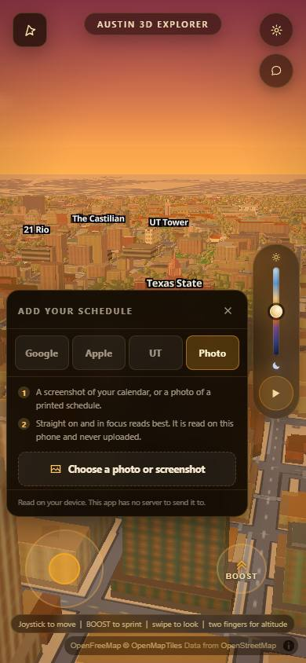
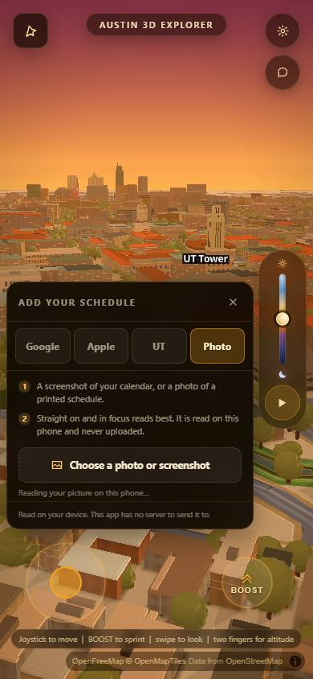
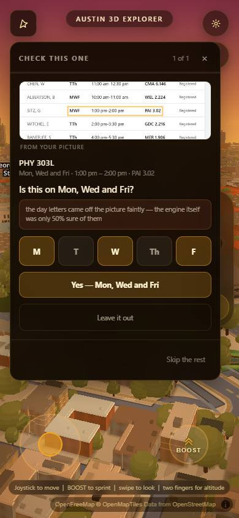
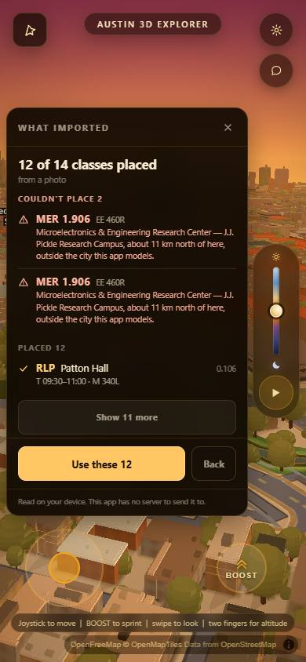
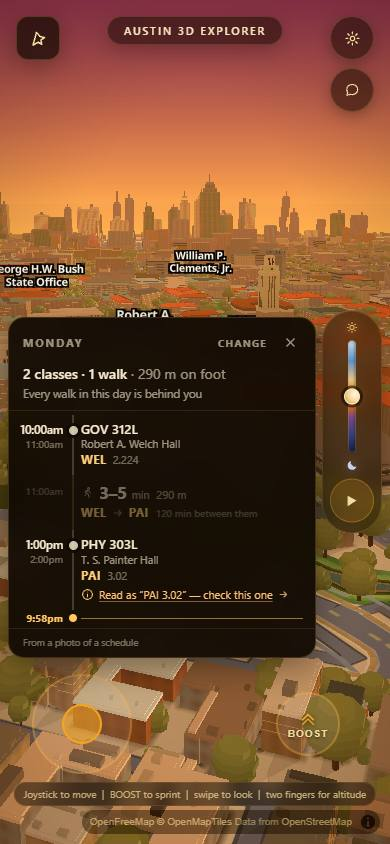
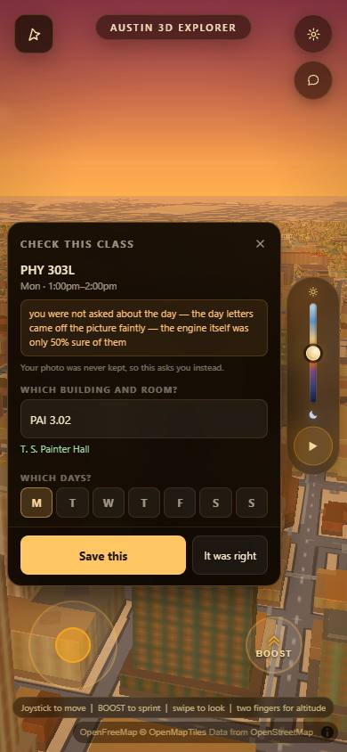
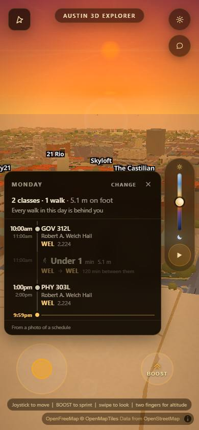

# A photograph is the fourth tab

`js/schedimg.js` reads a picture of a schedule. `js/schedconfirm.js` decides how
much of it to believe and asks about the rest. Neither of them was reachable
from the app. This is the pass that made a photograph a **source** of the import
sheet that already ships — beside Google Calendar, Apple Calendar and the UT
paste — rather than a mode bolted on beside it.

| | |
|---|---|
| the fourth source, the producer, the screen | `js/wayfind.js` (`IMP_SOURCES`, `impRowsFromImage`, `impRowFromRead`, `impResultFrom`) |
| the answer to the mark (round 2) | `js/wayfind.js` (`WF_FIX`, `fixOpen`, `scheduleCorrectClass`) |
| the gate | `scripts/verify/img-import.mjs` — **67 passed, 0 failed** |
| the score, end to end | `scripts/verify/img-import-extract.mjs` through `image-bench.mjs` |

---

## The number, measured on the shipped screen

`image-bench.mjs` normally scores a function. This piece is not a function, so
`img-import-extract.mjs` scores the **device**: it hands the real page a `File`,
presses the real controls, and reads back
`window.wayfindSchedule.events` after the student has pressed "Use these".
Nothing in it reaches past the UI.

```
image-bench   (15 images, 171 scored meetings)

                                      all four fields right   precision
  the bar (docs/img-bar.md)             36 / 171   21.1%        16.1%
  the reader alone, js/schedimg.js     134 / 171   78.4%       100.0%
  SHIPPED, student answers nothing     131 / 171   76.6%       100.0%
  SHIPPED, student answers             134 / 171   78.4%       100.0%
```

**131 of 171 for a student who answers no question at all**, against a bar of
36 — and **zero** wrong answers, zero hallucinations, zero three-of-four near
misses, on both passes. All three of ours were run on this tree, on the same
corpus, by the same scorer.

Two things about that table are worth more than the headline.

**The gap between 131 and 134 is three meetings, all of them on image 05, and it
is the feature working.** Image 05 is the angled table; the confirm screen asks
four questions on it. A student who skips them loses three readings — because
`applyGroup()` refuses to keep a reading nothing believed that nobody confirmed.
That is the whole asymmetry this feature is built on, priced: **skipping costs
three meetings out of 171 and buys zero wrong answers.** Answering gets all
three back, image for image identical to the reader.

**Precision is 100% on both passes, and that is the number that matters.** A
schedule importer that emits a confident wrong room sends a student to the wrong
side of campus; 133 predictions, none of which matched nothing, is the claim the
piece is actually making.

`SCHEDULE_ANSWER=lead` is the second pass. It presses the top button on every
question, which is **not a ceiling and must not be read as one** — when the app
can name a defect in the reading, the top button is deliberately the
*correction*, so that student is sometimes agreeing to a change and sometimes to
the reading without knowing which. It exists to price exactly one thing, and it
priced it: the 3-meeting gap is unanswered questions, not placement.

```bash
cd scripts/verify && node image-bench.mjs ./img-import-extract.mjs --name shipped
cd scripts/verify && SCHEDULE_ANSWER=lead node image-bench.mjs ./img-import-extract.mjs --name shipped-answered
node scripts/verify/img-import.mjs --shots ../../shots/img-integrate
```

---

## It is one row of a table, and that was the design's own prediction

`js/wayfind.js`'s import header has said this since before an OCR reader
existed:

> So adding image-OCR later is adding `impDecodeImage(pixels) -> RAW ROWS` and
> one row to IMP_SOURCES. […] Neither touches the placement, the failure
> taxonomy, or one line of this screen.

That held. The fourth source is a row of `IMP_SOURCES` with `accepts: ['image']`,
one new control kind in `impRenderAdd`, and one producer. Everything below the
joint — `impPlace`, the de-duplication, the failure taxonomy, the result screen,
`impUse`, `impStoreDoc`, `store.save()`, `window.wayfindSchedule`, the
`wayfind:schedule` event, the day view, the privacy panel, Delete — is the code
a Google export already ran through, unmodified.



`impBuild` was split in two so both producers share the far half:

```
  bytes ──[ impRawRows  ]──┐
                           ├──> RAW ROWS ──[ impResultFrom ]──> classes + rejects + events
  a File ──[ impRowsFromImage ]──┘                                    │
                                                                 impUse ──> store.save()
                                                                          + window.wayfindSchedule
                                                                          + wayfind:schedule
```

There is no second path. `scripts/verify/img-import.mjs` §4 asserts the result
object names `decoder: 'image'`, and that `events.length === classes.length +
rejects.length` — two views of one list, built in one loop, exactly as the
calendar routes are.

**The one thing that is genuinely different is not a shape.** A calendar file is
bytes a machine wrote and this screen may believe all of it. A photograph is a
reading. So the photo producer is the only one with a **person in the middle of
it**: `confirmFromFile()` puts every field it is not sure of in front of the
student before a single row reaches `impPlace`. The rows that arrive at the
joint have already been looked at, which is why nothing downstream had to learn
a new rule.

---

## What the student sees, in order

**1. A fourth tab, not a fourth screen.** Four tabs, 69 px each on a 390 px
phone, none clipped; the panel is 308 px wide and ends at y=658 in an 844 px
window — the same numbers it had with three. The sheet behind it is untouched:
**430 px tall holding 428 px**, one door, privacy line and Delete on screen. §2
and §3 of the gate measure all of it rather than asserting it.

**2. While it reads, the panel stays up and says what it is doing.**



The engine is ~5 MB and the read takes seconds. The first cut hid the panel as
soon as the file was picked, which left the phone completely blank for the
longer of the two waits. The panel now goes away only when the screen that
replaces it **exists in the DOM** — a `MutationObserver` on the host, not a
timer — and the busy line names which of the two phases is running
(`Getting the reader ready…` / `Reading your picture on this phone…`).

**3. The check screen replaces the panel in the same corner.**



Both position themselves absolutely at the same top-left of the same root, so
two glass panels stacked on a 390 px phone is the "which one am I looking at"
failure. §4 asserts the import panel is hidden at the moment the check screen
is up, and visible again on the far side.

**4. The result screen is the one an .ics gets.**



`12 of 14 classes placed · from a photo`, with the two `MER 1.906` meetings
named and explained — *Microelectronics & Engineering Research Center — J.J.
Pickle Research Campus, about 11 km north of here* — rather than dropped. Not
one line of that screen is new.

**5. And the day view marks what nobody checked.**



---

## The request `docs/img-confidence.md` ended on is closed

That document's own "what is still weak" section named this first:

> **A class kept from the re-take list is marked unchecked and NOTHING
> DOWNSTREAM SHOWS IT.** […] `grep` finds **zero** occurrences of `needsConfirm`
> or `unconfirmedFields` in `js/wayfind.js`. In the day view an unchecked class
> looks exactly like a checked one. […] **the day view needs a not-checked mark,
> driven off `needsConfirm`, and a tap that reopens the question.**

**The mark already existed and had never had a producer.** §11 of `js/wayfind.js`
has carried this branch since before an OCR importer was built:

```js
if (row.place.kind !== 'unplaced' && row.item.raw &&
    row.item.codeConfidence < WF_DAY.confidenceSure) {
  body.appendChild(dayChip('info', SAY_D.lowConf(row.item.raw)));
}
```

...and the comment above it says exactly why: *"An OCR of a photographed
timetable […] will hand over `MA1` for `MAI` with 0.6 of a belief — and a
renderer with no branch for 'the code might be wrong' would have to grow one,
which is exactly the rewrite. So the branch is here now and today's importers
simply never take it."* Three lanes wrote the two halves of this months apart
and neither knew the other existed. Joining them was two fields.

So the schema change that document asked for was not needed, and none was made:

| field | who reserved it | what it now carries |
|---|---|---|
| `confidence` on the stored class | `normaliseSchedule`, *"Reserved for OCR. An .ics sets 1; a photo will not."* | `IMP.image.uncheckedConfidence` (0.5) when `needsConfirm`, else 1 |
| `provenance` on the stored class | `normaliseSchedule`, passed through untouched | `{ read:'photo', confirmed, unconfirmedFields, why }` |
| `'image-ocr'` in `SCHEDULE_SOURCES` | listed as forward compatibility before it existed | the privacy panel reads *"14 classes from a photo of a schedule, on this device only"* |

**`confidence` is a flag wearing a number and it says so.** Nothing anywhere
reads its value — only whether it is under `WF_DAY.confidenceSure`, which is 1 —
so it is named in the taste block rather than computed. **The real per-field
score is not available across the shipped seam**: `js/schedconfirm.js`'s
`apply()` attaches scores to the *reading* and returns *meetings*, and
`score(cls, ctx)` needs a `cls.ev` that `applyGroup()` deletes. That is a
request to that lane, written down rather than guessed at: **if `applyGroup()`
put `g.score.overall` on each copy it returns, this becomes a measurement in one
line.** The fields that were actually left open travel in `provenance` in the
meantime, and they survive a reload — §7 reads them back off the device:

```
after reload: {"restored":true,"n":14,"source":"image-ocr","unchecked":3,
  "prov":{"read":"photo","confirmed":false,"unconfirmedFields":["day"],
    "why":"you were not asked about the day — the day letters came off the
           picture faintly — the engine itself was only 50% sure of them"}}
```

The half of the request that round 1 left open was the tap. **It is closed now**
— see the next section.

---

## Round 2: the mark had no answer, and that was worse than not marking

Round 1 called the tap "the next thing here", and that understated it. A chip
that names a doubt and cannot settle it is not an unfinished feature — it is a
**trap**. The only way to resolve *"Read as 'PAI 3.02' — check this one"* was to
delete the whole schedule and photograph it again, so a student who saw that chip
in August saw the identical unresolved chip every day until December. The app
correctly identified its own uncertainty and then locked the student inside it.

**The chip is a control now.**


### It could not re-mount the confirm screen, and that turned out to be the point

`js/schedconfirm.js`'s screen asks *"is this what the PICTURE says?"* and answers
it by cropping the picture and putting the pixels beside the reading. `review()`
needs a `cls.ev` carrying a page and a box. **None of that survives, and none of
it should** — keeping a photograph of a student's timetable on the device until
December is exactly what the privacy rule forbids. So re-mounting was never
available, and pretending otherwise would have meant storing the picture.

Losing it changes the question, and changes it for the better:

> not *"did we read your picture right"* — which only the picture can settle —
> but *"where is this class, actually"*, which a student can answer from memory,
> on a bus, without the photograph.

And the app brings real things to that question: every UT building code, its own
type-ahead, and its own router.



Four parts, each there because of what the round-1 record already stored:

| what is on the sheet | where it comes from |
|---|---|
| the class and its hour | the day row that was tapped |
| the amber sentence | `provenance.why` **verbatim** — the words `js/schedconfirm.js` wrote at import time and the store kept. Not a fresh sentence: two sentences about one doubt is two doubts |
| which controls are drawn | `provenance.unconfirmedFields`. The class above was doubted on the **day**, so it gets day toggles; the gate asserts that correspondence rather than assuming it |
| `T. S. Painter Hall`, live, under the field | `wayfindSearch` — the app's own type-ahead, answering **before** anything is saved. Type `ZZQ` and it says *"Not a building code this map knows"*, and offers near misses as a question, never a substitution |

**"Your photo was never kept, so this asks you instead"** is on the sheet in
plain words. A student who expects their picture back should find that out here,
not by hunting for it.

### It writes back through the one path, and there is no second one

`scheduleCorrectClass()` re-places the corrected row through **`impPlace`** — the
same placement a Google export's rows go through, so `MER` corrected to `GDC`
stops being off-map and `GDC` corrected to `MER` starts being — and then does the
three things `impUse()` does, in the same order: `store.save()`,
`window.wayfindSchedule`, `wayfind:schedule`. The day view, the privacy panel,
the egress guard's watchlist and Delete all pick it up with no branch for it.

One thing it does not inherit: `scheduleSyncPublished()` refuses to overwrite a
live import (*"A LIVE IMPORT WINS"*), which is right for a save and wrong for an
edit — after an edit the DEVICE is the newer copy. So the correction republishes
explicitly rather than loosening that rule for everybody.



### Two answers, and they read differently on disk

| the tap | what is stored |
|---|---|
| **Save this** | the corrected fields, `confidence: 1`, and `provenance.correctedFrom: "PAI 3.02"` — what the picture had said, which is the one fact nothing could reconstruct afterwards |
| **It was right** | `confidence: 1` and `correctedFrom: null` |

The second button is not a cancel — closing the sheet is the cancel. It is the
answer *"the reading was right all along"*, which is a real answer and probably
the commonest one, and it had to be one tap or nobody would give it.

Measured on the run that produced the frames above, on a schedule that came
**off disk** after a reload — the case that actually matters, where the import
screen is long gone:

```
  the chip is a BUTTON, not a label            Read as “PAI 3.02” — check this one
  the field holds what the chip quoted         "PAI 3.02" -> "PAI 3.02"
  it asks about the field that was open        ["day"] -> 7 day controls
  the answer button is ON SCREEN               y 601..645 in an 844 window, 44 px tall
  written to the device                        {"ok":true,"hit":1,"status":"ok","classes":14}
  it corrected a class rather than adding one  14 of 14
  exactly one mark cleared                     3 -> 2 stored, 2 published
  and it survives the next reload              2 unchecked, WEL 2.224 conf=1
```

**The button-on-screen assertion exists because the first cut failed it.** Every
control was in the DOM and the sheet's own height assertion passed — and on a
390x844 phone with a route drawn, `Save this` sat 40 px below the sheet's bottom
edge, reachable only by scrolling a panel that did not look scrollable. The frame
caught it; nothing else did. The actions are a pinned footer now.

### And the frame caught a second one, on a path this round did not touch

The footer of a **restored** photo schedule read **"From typed in"**.
`daySourceOf()` has two branches — a string id, and the store's source *record* —
and only the string branch knew about photographs. The three older sources
survived the object branch by accident of their labels ("Google Calendar" happens
to contain "google"; "UT registration" happens to contain "registration"). The
photo route's label is "a photo of a schedule" and matched nothing, so it fell
through to manual. Every student who reloaded the page saw it. `kind` is asked
first now, and §8 of the gate asserts it.

### An iPhone HEIC now fails as a format

HEIC has been the default camera format on every iPhone since 2017, so "choose a
photo of your timetable" hands this app a HEIC for a large share of the people
this feature is for. Chrome and Firefox have no decoder and `createImageBitmap`
rejects; the sentence a student got for that was *"That picture could not be read
on this device"* — blaming their photograph for a format their browser never
supported, arriving seconds and ~5 MB late.

`IMP.image.heicBrands` sniffs the ISO-BMFF brand out of the first 32 bytes —
**the bytes, not `f.type` and not the filename**, because a phone picker hands
over files with neither — and only a file that really is HEIC pays for a decode
attempt. Safari decodes it and carries on exactly as before. Everywhere else:

```
  refused in 271 ms
  That is an iPhone HEIC photo, and this browser has no reader for that format.
  Take a screenshot of your schedule and choose that instead — a screenshot is
  always a format this can read.

  and it was refused BEFORE the ~5 MB reader was fetched   no engine request
```

A JPEG pays one 32-byte read.

---

## The picture never leaves the browser, and this is the first gate that could prove the shipped alarm

`scripts/verify/img-import.mjs` §6 captures every request from the moment the
file is handed over — context-level, so the OCR worker's own fetches are in
scope — beside a raw TCP sink that depends on no Playwright behaviour. Measured
on the run that produced the frames above:

```
  111 requests since the picture was handed over, 29 needles checked
  no request carries a course, a room or a picture            none
  and not one request since had a body of ANY kind            111 requests, 0 with a body
  importing a schedule adds no destination                    tiles.openfreemap.org, 127.0.0.1 — both already in use
  the raw socket sink was never contacted
```

The needles are built from `schedule-images/truth.json` itself rather than typed
out, and the allowlist is **measured**: the hosts the app talked to *before* the
picture existed are the allowlist, and one new host fails.

**And then the shipped guard was fired at, which `si-integration.mjs` §6 could
never do.** Its own note records why: the guard arms its watchlist from the
**stored** schedule, and at the time it was written nothing called
`store.save()`, so *"at the exact moment the schedule is in memory and on screen
the guard is watching nothing"*. A photo import saves, so the guard is armed off
the student's own rooms. Fire a real leak at it with the room it is watching:

```
  armed canary: fetch -> blocked: [wayfind] blocked: fetch carried stored
                schedule content. The schedule never leaves this device.
  and the sink confirms nothing got out       0 sink hits total
```

Then, and only then, the guard is disarmed and the same leak is fired again
through `fetch` **and** through a real `Worker`, and both instruments must catch
both — because with the guard armed a clean sheet proves the guard rather than
the instrument. Both do; the guard is re-armed; §6 ends with `watched=32`.

**The cold load pays nothing.** `js/schedconfirm.js`, `js/schedimg.js`,
`js/walkgraph.js` and the ~5 MB engine are not referenced from `index.html` and
not fetched at page load — asserted at the network level over the 98 requests
the real page makes, not by reading the HTML. The only way in is a dynamic
`import()` at the moment a student picks a file.

One measured detail worth writing down, because the obvious guess is wrong and
cost a run: **a dynamic `import()` in a classic script resolves against the
script's own URL, not the document's.** Every `fetch` in `js/wayfind.js` is
document-relative (`data/walk_graph.json`), so `./js/schedconfirm.js` looks
right and asks for `/js/js/schedconfirm.js`. The 404 surfaced as *"That picture
could not be read on this device"* — a sentence about the student's photograph
for a fault that had nothing to do with it. It is `./schedconfirm.js`.

---

## Nothing else moved

| | |
|---|---|
| `scripts/verify/si-integration.mjs` | **50 passed, 0 failed** — re-run after round 2 |
| `scripts/verify/dayview.mjs` | **100 ok, 2 failed** — re-run after round 2; identical to the baseline in `docs/si-seams.md` §6, and both failures are that merge's, not this one's |
| `scripts/verify/schedimg.mjs` | **26 passed, 0 failed** — `js/schedimg.js` is byte-identical, not re-run |
| `scripts/verify/schedconfirm.mjs` | **101 passed, 0 failed** — `js/schedconfirm.js` is byte-identical, not re-run |
| `WAYFIND.on` | still `false`, untouched |

`IMP.image.on = false` puts the panel back to the three tabs it shipped with and
nothing in this pass runs; `WF_FIX.on = false` puts the chip back to the label it
was and nothing in round 2 runs. Every other value either introduces — the module
path, the accept string, the size ceiling, the HEIC brand list, the
unchecked-confidence flag, the host, the sheet's width, its day list, the number
of suggestions — is in one of those two blocks (CLAUDE.md rule 11).

The bench was re-run on this tree after round 2, on both passes, and neither
moved: **131 / 171 skipping every question, 134 / 171 answering, 100.0% precision
and 0 hallucinations on both.** Every by-image line is identical to round 1's.

---

## What is still weak

**The floor number is 131 and the corpus cannot tell me whether that is the
right floor.** The three lost meetings are all on one image, and they are lost
because a student skipped four questions on an angled photograph. Whether real
students skip is not a thing fifteen synthesized images can answer, and the
whole 131-vs-134 trade turns on it. What is measured is the direction: skipping
costs meetings and never costs correctness.

**The sheet cannot rescue a class the import DROPPED, only correct one it
kept.** `applyGroup()` refuses readings nothing believed and nobody confirmed,
and those never reach the store — so they have no row on the day view and no chip
to tap. The three meetings between 131 and 134 are exactly that population: a
student who skips the questions during the import cannot get them back afterwards
from the day view, only by importing the picture again. Closing that means either
storing the refused readings (with a surface that shows them) or a partial
re-import, and neither is a line. It is the biggest thing still open here.

**One picture, not fifteen, goes through the GATE.** `img-import.mjs` runs image
01 end to end because it exercises the placed path, the off-map reject path and
an unanswered question in one 14-second run. The other fourteen are covered by
the bench, which scores the far end but asserts nothing about the screen. A
picture whose result screen behaves differently — one that places nothing at all,
say, and shows `errImgNothing` — is not photographed anywhere. `--image` takes
any corpus file, so it is one flag away; it is not a run that happens today.

**`impRowsFromImage` swallows the difference between "cancelled" and "closed by
the guard".** `confirmFromFile` resolves with an empty list in several cases and
only `onCancel` separates one of them; anything that throws inside the reader
becomes the same `errImgRead` sentence. HEIC is now carved out of that with its
own gate and its own sentence — it was the likeliest of these failures by a wide
margin — but a student whose phone runs out of memory decoding a 40 MP photograph
is still told the picture could not be read, which is true and unhelpful.

**The HEIC gate is proved on a synthetic header, not on a real iPhone file.**
§10 of the gate builds a genuine ISO-BMFF `ftyp`/`heic` header and Playwright's
Chromium really does refuse it, so the sniff, the refusal and the sentence are
all measured on a browser that genuinely has no decoder — but a real HEIC from a
real iPhone has still never been through this, and neither has Safari's
succeeding path. The corpus is fifteen JPEGs.

**A corrected class keeps the old reading and nothing shows it.**
`provenance.correctedFrom` is written and survives a reload, and no surface
prints it. A student who mistypes a correction has no way to see what the picture
had originally said — the data is there, the sentence is not.
