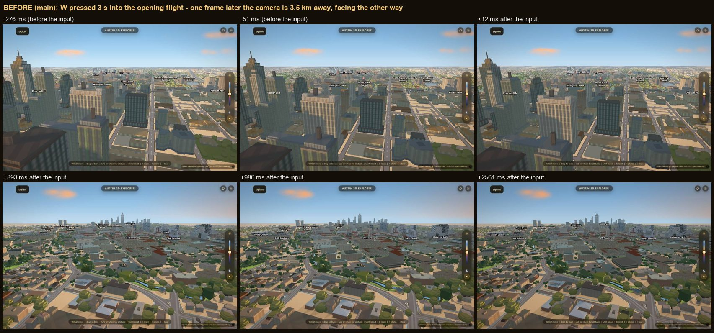
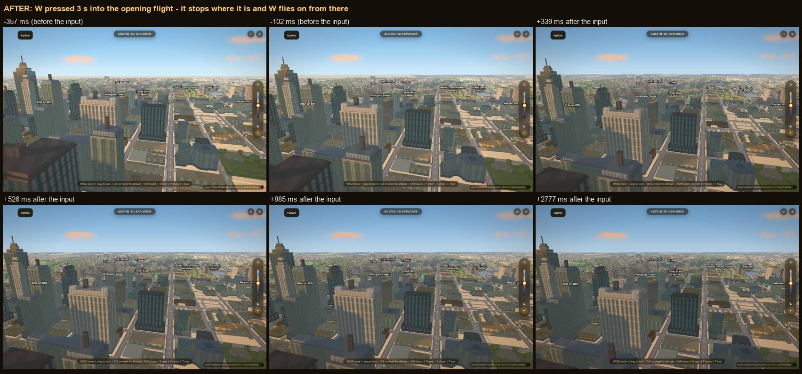

# Touching the controls during the opening flight keeps the camera

Branch `acer/intro-keep-camera`, 2026-09-19. Code: `js/app.js` (`primeIntro`),
`js/controls.js` (the takeover). Guard: `scripts/verify/intro-interrupt.mjs`.

**Reported:** "moving during the intro teleports me behind campus."

**Now:** the first navigation input stops the flight on the frame you're
looking at, and you fly on from exactly there. Nothing jumps, and the flight
doesn't start up again on top of you later.

## What was actually happening (measured on `main` @ c656249)

Measured with the new harness against the unchanged `js/app.js` and
`js/controls.js`, served from `main` next to the same data:

1. **Any input was a cut to the flight's last frame.** `primeIntro()`'s cancel
   was `map.stop(); map.jumpTo(INTRO.end)`, on `mousedown`, `wheel`, `keydown`
   and `touchstart` anywhere on the page. `INTRO.end` is over north campus
   facing south (bearing 202), so pressing W 3.6 s into the flight, while
   looking north up Congress, moved the camera **3,524 m and 162° in one
   frame**, and W then flew you forward from a place you'd never seen. The
   wheel (3,471 m), the phone joystick (3,568 m) and a phone swipe (3,583 m)
   did the same, and so did W under the veil: the city appeared already at the
   end pose.
2. **A mouse drag didn't cancel anything.** The controller's `pointerdown`
   calls `preventDefault()`, which suppresses the compatibility `mousedown`.
   Measured: every real mouse drag the harness sent logged `pointerdown` and no
   `mousedown`, on both branches. So the drag itself worked, but the intro never
   heard about it and its leg-2 timer stayed armed. Measured end to end: a quick flick 2.1 s into leg 1 on `main`, then
   hands off. Leg 2's timer fired four seconds later (first eased frame at
   reveal+6178 ms, its `leg1Ms + 30`) and carried the camera **3,597 m and 162
   degrees** onto `INTRO.end` — away from the view the user had just aimed. The same
   flick on this branch cancels the flight (`cancelled by input`) and nothing eases
   after it: 0 m. It bites only when the flick has decayed before the timer fires;
   in the harness's own `drag@leg1` case on `main` the controller still had the
   camera, so the resumed ease was killed after one frame (0.03 m in 14 s).
3. **Leg 2 was a timer that `map.stop()` couldn't reach.** Anything that
   stopped the flight without going through the intro's own cancel (the drag
   above, wayfind's `Walk it`, the landmark orbit) was overridden
   `leg1Ms + 30` ms after departure. `js/wayfind.js` already documents this
   happening to a walk (its ROUND 6 note). The same timer also cut leg 1 short
   when frames were slow: on this machine leg 2 started from 98% of the way
   to the crest instead of the crest itself.
4. **The first wheel notch from rest did nothing.** At the takeover,
   `syncFromMap()` zeroed the pending wheel/look input, so the notch that woke
   the controller was thrown away. Measured with `?intro=0`, one notch from
   rest, two interleaved reps: **+0.0% altitude on `main`, +54% on this
   branch**, both reps identical. A drag was not affected (its press takes the
   camera a frame before its first movement): a 60 px step turned 12° on both.

Two more found while building the fix:

- **The idle drift could start under the veil.** Its 25 s countdown starts at
  load, so when the veil outlasts it (on this laptop the default-path veil ran
  91–97 s) the screensaver started turning the camera before anyone could see
  it. Measured with the drift on, as in production: on `main` five drift legs
  ran under the veil and the flight departed from **bearing −55 instead of the
  authored 5** (it still ended on `INTRO.end`). On this branch *before* the
  guard below, the flight's new "has anyone moved the camera?" check saw the
  drift and **didn't depart at all**; the drift carried on and the camera was
  2.5 km from where the flight should have ended. Now the drift waits while the
  flight is primed or flying: bearing 5.0 at the reveal, flight `done`, ends on
  `INTRO.end`. The harness case `none-drift` fails on the unguarded build and
  passes on this one (both after a 91–93 s veil).
- Once the takeover was the only cancel, **a thumb resting on the joystick
  didn't count** until it moved past the deadzone, so the flight kept flying
  under a held stick (one run on an intermediate build: another 753 m before
  the thumb's first movement reached the page). A finger resting on the canvas
  has always counted; the joystick now does too.

## The fix

- **Navigation input is defined by the controller, not by a list of DOM
  events.** When `js/controls.js` takes the camera, it fires `flycam:takeover`
  on `window` *before* it stops the running ease and re-reads the pose.
  `primeIntro()` cancels on that. So keys, drag-look, the wheel, pinch,
  tap-drag and the joystick count on every device, and a click on a panel or a
  key typed into a text field doesn't.
- **Cancel keeps the camera.** If one of the intro's own legs is running it's
  stopped with `map.stop()`, which leaves MapLibre's transform on the last
  frame drawn. There is no `jumpTo` anywhere in the cancel path.
- **Leg 2 starts from leg 1's completed `moveend`, not from a timer.** Each
  leg is tagged (`{introLeg: n}`) and its `moveend` checks it arrived on its
  target; if anything else stopped it short, the flight is over and whoever
  moved the camera keeps it. There's no timer left to cancel, and leg 1 always
  finishes on the crest.
- **Under the veil the flight is only primed.** If the camera isn't still on
  `INTRO.start` when the veil lifts (the user drove under the veil, or R's home
  ease is running), it doesn't depart.
- **Controller sync** (`js/controls.js`): the takeover re-reads centre,
  bearing, pitch and altitude from the map and zeroes velocity, as before, but
  now keeps the pending input that caused it (`syncFromMap(true)`), and a thumb
  on the joystick counts as input. In every case below `__fly.eye()` agrees
  with MapLibre's own camera position to within 0.3 m once the controller has
  it, so its first update can't snap to the intro's end, the spawn pose, or a
  stale pose.
- **The idle drift waits for the flight** (`initIdleCinema`'s `canRun`): it
  doesn't start while `__intro.flight` is `primed` or `flying`.
- `window.__intro.flight` is the live state: `primed | flying | done |
  cancelled`, the leg, what cancelled it, and the pose it stopped on.
  `window.__fly.home()` returns the pose R goes back to.

**Two behaviour changes to know about.**

- Input that isn't navigation (a click on a panel, the time slider, a key the
  controller doesn't use, typing in a field) used to skip to the end frame. It
  now leaves the flight alone and it keeps playing. Anything that moves the
  camera (a landmark, a tour, `Walk it`, R) still takes over from the flight,
  and the flight stands down.
- With `prefers-reduced-motion`, MapLibre runs both legs at duration 0.
  Measured on `main`: the camera cut to the crest as the veil lifted, held it
  until leg 2's timer (six seconds nominal; 10.1 s on this loaded machine,
  because the timer was starved), then cut to the end in front of the user.
  Now both steps happen at the reveal: the camera is on the end pose as the
  veil fades, and nothing cuts after it.

## Results

Inputs: W, Left arrow, Q, a 200 px mouse drag, two wheel notches (desktop
1280×800); the on-screen joystick and a 150 px one-finger swipe (390×844
touch viewport). Moments: under the veil before departure, the reveal, 3 s
into leg 1, the leg 1 → 2 handover, 3 s into leg 2, and the settle onto the
Tower, plus two synthetic cases fired from inside the page at the exact
instant (`reveal-exact`: in the microtask after the veil lifts, before the
flight's first frame; `boundary-exact`: inside leg 1's own `moveend`).
Each "pass" cell also names what the input did from the stopped pose.

**Before: `main` @ c656249 (12 cases, same harness)**

| input \ moment | under the veil | reveal | leg 1 | leg 1 -> 2 | leg 2 | settle |
|---|---|---|---|---|---|---|
| W (forward) | **CUT 3646 m / 163°** in one frame | not run | **CUT 3524 m / 162°** in one frame | not run | **CUT 3102 m / 155°** in one frame | not run |
| mouse drag (look) | not run | not run | flight not cancelled | not run | no cut | not run |
| mouse wheel (climb) | not run | not run | **CUT 3471 m / 162°** in one frame | not run | not run | not run |
| phone joystick | not run | not run | **CUT 3568 m / 162°** in one frame | not run | not run | not run |
| phone swipe (look) | not run | not run | **CUT 3583 m / 162°** in one frame | not run | **CUT 1338 m / 84°** in one frame | not run |

**Full matrix on this branch (49 cases)**

| input \ moment | under the veil | reveal | leg 1 | leg 1 -> 2 | leg 2 | settle |
|---|---|---|---|---|---|---|
| W (forward) | pass, 13 m | pass, 13 m | pass, 19 m | pass, 31 m | pass, 15 m | pass, 5 m |
| Left arrow (strafe) | pass, 6 m | pass, 11 m | pass, 22 m | pass, 39 m | pass, 23 m | pass, 16 m |
| Q (climb) | pass, +5% alt | pass, +5% alt | pass, +8% alt | pass, +8% alt | pass, +10% alt | pass, +7% alt |
| mouse drag (look) | pass, 40 deg turn | pass, 40 deg turn | pass, 40 deg turn | pass, 40 deg turn | pass, 40 deg turn | pass, 40 deg turn |
| mouse wheel (climb) | pass, +137% alt (landed in leg 1) | pass, +137% alt | pass, +137% alt | pass, +137% alt | pass, +137% alt | pass, +137% alt |
| phone joystick | pass, 20 m | pass, 35 m | pass, 49 m | pass, 38 m | pass, 30 m | pass, 22 m |
| phone swipe (look) | pass, 27 deg turn | pass, 27 deg turn | pass, 27 deg turn | pass, 27 deg turn | pass, 27 deg turn | pass, 27 deg turn |

- `key-w@reveal-exact`: pass (leg1 +2 ms, 20 m)
- `key-w@boundary-exact`: pass (leg1 end +1 ms, leg2 began +3 ms, 22 m)
- `none`: pass (flight drew 2.44 fps; largest single flight step 741.68 m)
- `none-probe`: pass (flight drew 3.31 fps; largest single flight step 732.98 m)
- `home`: pass
- `tour`: pass
- `autopilot`: pass

**Live run of the final harness on this branch (18 cases)**

| input \ moment | under the veil | reveal | leg 1 | leg 1 -> 2 | leg 2 | settle |
|---|---|---|---|---|---|---|
| W (forward) | pass, 9 m | not run | pass, 9 m | not run | not run | not run |
| Left arrow (strafe) | not run | not run | not run | not run | pass, 15 m | not run |
| Q (climb) | not run | not run | pass, +11% alt | not run | not run | not run |
| mouse drag (look) | not run | pass, 40 deg turn | not run | pass, 40 deg turn | pass, 40 deg turn | not run |
| mouse wheel (climb) | not run | not run | not run | pass, +137% alt | not run | pass, +137% alt |
| phone joystick | not run | not run | pass, 52 m | not run | not run | pass, 25 m |
| phone swipe (look) | pass, 27 deg turn | not run | not run | not run | pass, 27 deg turn | not run |

- `key-w@reveal-exact`: pass (leg1 +2 ms, 20 m)
- `key-w@boundary-exact`: pass (leg1 end +1 ms, leg2 began +4 ms, 34 m)
- `none`: pass (flight drew 2.76 fps; largest single flight step 604.61 m)
- `none-reduced-motion`: pass (flight drew 1.97 fps; largest single flight step 3646.31 m)
- `home`: pass

**Default path** (authored apartments on, the veil waits for them; 15 cases,
same code): `autopilot` pass; `drag@leg2` pass; `drag@reveal` pass; `home` pass; `joystick@leg1` pass; `key-w@leg1` pass; `key-w@veil` pass; `none-probe` pass; `tour` pass; `wheel@boundary` pass; `wheel@leg1` pass; `wheel@leg2` pass; `wheel@reveal` pass; `wheel@settle` pass; `wheel@veil` pass.

Live run: camera at the input and 0.25 / 0.5 / 1 / 2 s later, every case

`flight -> takeover`: how far the flight itself carried the camera between the last frame drawn before the input and the pose the controller took over from (snapshotted at `flycam:takeover`); every frame in that span is checked to lie on the flight’s own path. The later columns are relative to that takeover pose: horizontal metres / bearing change / altitude change, at the first frame drawn at or after that moment. `input took`: from the first event of the gesture reaching the page to its last (a key is held 1 s; under load a drag arrived over several seconds, so its turn often lands after +2 s). `eye`: `__fly.eye()` distance from the camera at +2 s.

| case | landed | input took | flight -> takeover | +0.25 s | +0.5 s | +1 s | +2 s | eye |
|---|---|---|---|---|---|---|---|---|
| key-w@veil | veil (994 ms before lift) | 1.1 s | 0 m / +0° / +0% | 0 m / +0° / +0% | 1 m / +0° / +0% | 7 m / +0° / +0% | 12 m / +0° / +0% | 0.1 m |
| key-w@leg1 | leg1 +3296 ms | 1.0 s | 124 m / -1° / +47% | 0 m / +0° / +0% | 6 m / +0° / +0% | 6 m / +0° / +0% | 13 m / +0° / +0% | 0.0 m |
| key-arrow@leg2 | leg1 end +3190 ms, leg2 began +1 ms | 1.3 s | 281 m / -10° / -5% | 2 m / +0° / +0% | 6 m / +0° / +0% | 11 m / +0° / +0% | 21 m / +0° / +0% | 0.1 m |
| key-q@leg1 | leg1 +3501 ms | 1.0 s | 61 m / -0° / +17% | 0 m / +0° / +5% | 0 m / +0° / +5% | 0 m / +0° / +11% | 0 m / +0° / +11% | 0.1 m |
| drag@reveal | leg1 +2579 ms | 16.7 s | 15 m / -0° / +5% | 0 m / +0° / +0% | 0 m / +0° / +0% | 0 m / +0° / +0% | 0 m / +0° / +0% | 0.0 m |
| drag@boundary | leg1 end +76 ms, leg2 began +1 ms | 11.8 s | 0 m / +0° / +0% | 0 m / +0° / +0% | 0 m / -4° / +0% | 0 m / -4° / +0% | 0 m / -8° / +0% | 0.1 m |
| drag@leg2 | leg1 end +1613 ms, leg2 began +1 ms | 19.7 s | 99 m / -3° / -2% | 0 m / +0° / +0% | 0 m / +0° / +0% | 0 m / +0° / +0% | 0 m / +0° / +0% | 0.1 m |
| wheel@boundary | leg1 end +1485 ms, leg2 began +1 ms | 1.6 s | 123 m / -4° / -2% | 0 m / +0° / +54% | 0 m / +0° / +54% | 0 m / +0° / +54% | 0 m / +0° / +137% | 0.2 m |
| wheel@settle | leg1 end +5814 ms, leg2 began +1 ms | 1.2 s | 36 m / -4° / -2% | 0 m / +0° / +54% | 0 m / +0° / +54% | 0 m / +0° / +54% | 0 m / +0° / +137% | 0.1 m |
| joystick@leg1 | leg1 +3189 ms | 3.3 s | 4 m / -0° / +1% | 0 m / +0° / +0% | 1 m / +0° / +0% | 3 m / +0° / +0% | 21 m / +0° / +0% | 0.1 m |
| joystick@settle | leg1 end +6273 ms, leg2 began +1 ms | 3.1 s | 1 m / -0° / -0% | 0 m / +0° / +0% | 0 m / +0° / +0% | 1 m / +0° / +0% | 6 m / +0° / +0% | 0.0 m |
| touch-look@veil | veil (4930 ms before lift) | 5.8 s | 0 m / +0° / +0% | 0 m / +3° / +0% | 0 m / +3° / +0% | 0 m / +5° / +0% | 0 m / +8° / +0% | 0.0 m |
| touch-look@leg2 | leg1 end +4725 ms, leg2 began +1 ms | 5.7 s | 146 m / -11° / -6% | 0 m / +3° / +0% | 0 m / +3° / +0% | 0 m / +5° / +0% | 0 m / +11° / +0% | 0.0 m |
| key-w@reveal-exact | leg1 +2 ms | 4.0 s | 0 m / +0° / +0% | 1 m / +0° / +0% | 1 m / +0° / +0% | 7 m / +0° / +0% | 14 m / +0° / +0% | 0.0 m |
| key-w@boundary-exact | leg1 end +1 ms, leg2 began +4 ms | 1.8 s | 31 m / -0° / +4% | 3 m / +0° / +0% | 8 m / +0° / +0% | 14 m / +0° / +0% | 34 m / +0° / +0% | 0.0 m |

Before, on `main`: camera around every input

Camera eye position relative to the last frame drawn BEFORE the input. Each cell: horizontal metres / bearing change / altitude change, at the first frame drawn at or after that moment. `input took`: first to last event of the gesture as the page saw it.

| case | landed | input took | first frame after the input | +0.25 s | +0.5 s | +1 s | +2 s |
|---|---|---|---|---|---|---|---|
| key-w@veil | veil (4784 ms before lift) | 1.0 s | 3646 m / -163° / +11% | 3645 m / -163° / +11% | 3645 m / -163° / +11% | 3635 m / -163° / +11% | 3627 m / -163° / +11% |
| key-w@leg1 | leg1 +3578 ms | 1.1 s | 3524 m / -162° / -33% | 3522 m / -162° / -33% | 3522 m / -162° / -33% | 3513 m / -162° / -33% | 3508 m / -162° / -33% |
| key-w@leg2 | leg1 end +3021 ms, leg2 began +241 ms | 1.1 s | 3102 m / -155° / -56% | 3102 m / -155° / -56% | 3102 m / -155° / -56% | 3098 m / -155° / -56% | 3094 m / -155° / -56% |
| drag@leg1 | leg1 +3308 ms | 12.1 s | 29 m / -0° / +8% | 29 m / -0° / +8% | 29 m / -0° / +8% | 29 m / -0° / +8% | 29 m / -4° / +8% |
| drag@leg2 | leg1 end +2885 ms, leg2 began +1930 ms | 13.6 s | 15 m / -0° / -0% | 15 m / -0° / -0% | 15 m / -0° / -0% | 15 m / -0° / -0% | 15 m / -4° / -0% |
| wheel@leg1 | leg1 +3876 ms | 0.6 s | 3471 m / -162° / -41% | 3471 m / -162° / -41% | 3471 m / -162° / -41% | 3471 m / -162° / -9% | 3471 m / -162° / -9% |
| joystick@leg1 | leg1 +3403 ms | 3.6 s | 3568 m / -162° / -38% | 3568 m / -162° / -38% | 3568 m / -162° / -38% | 3568 m / -162° / -38% | 3561 m / -162° / -38% |
| touch-look@leg1 | leg1 +3196 ms | 5.8 s | 3583 m / -162° / -35% | 3583 m / -162° / -35% | 3583 m / -159° / -35% | 3583 m / -157° / -35% | 3583 m / -154° / -35% |
| touch-look@leg2 | leg1 end +3617 ms, leg2 began +43 ms | 4.5 s | 1339 m / -84° / -37% | 1339 m / -84° / -36% | 1339 m / -82° / -36% | 1339 m / -82° / -36% | 1339 m / -74° / -36% |
| key-w@boundary-exact | leg1 end +2 ms, leg2 began +5 ms | 1.6 s | 3263 m / -161° / -58% | 3263 m / -161° / -58% | 3259 m / -161° / -58% | 3256 m / -161° / -58% | 3246 m / -161° / -58% |

Full matrix: camera around every input (this run predates the takeover snapshot)

Camera eye position relative to the last frame drawn BEFORE the input. Each cell: horizontal metres / bearing change / altitude change, at the first frame drawn at or after that moment. `input took`: first to last event of the gesture as the page saw it.

| case | landed | input took | first frame after the input | +0.25 s | +0.5 s | +1 s | +2 s | eye |
|---|---|---|---|---|---|---|---|---|
| drag@boundary | leg1 end +935 ms, leg2 began +1 ms | 12.9 s | 41 m / -1° / -1% | 41 m / -1° / -1% | 41 m / -5° / -1% | 41 m / -5° / -1% | 41 m / -9° / -1% | 0.1 m |
| drag@leg1 | leg1 +4223 ms | 14.4 s | 41 m / -0° / +8% | 41 m / -0° / +8% | 41 m / -0° / +8% | 41 m / -0° / +8% | 41 m / -4° / +8% | 0.1 m |
| drag@leg2 | leg1 end +3403 ms, leg2 began +1 ms | 12.2 s | 584 m / -22° / -11% | 584 m / -22° / -11% | 584 m / -26° / -11% | 584 m / -26° / -11% | 584 m / -26° / -11% | 0.0 m |
| drag@reveal | leg1 +2171 ms | 15.4 s | 9 m / -0° / +4% | 9 m / -0° / +4% | 9 m / -0° / +4% | 9 m / -0° / +4% | 9 m / -0° / +4% | 0.0 m |
| drag@settle | leg1 end +6066 ms, leg2 began +1 ms | 9.4 s | 8 m / -1° / -0% | 8 m / -1° / -0% | 8 m / -5° / -0% | 8 m / -5° / -0% | 8 m / -9° / -0% | 0.1 m |
| drag@veil | veil (1350 ms before lift) | 19.3 s | 0 m / +0° / +0% | 0 m / +0° / +0% | 0 m / +0° / +0% | 0 m / +0° / +0% | 0 m / +0° / +0% | 0.0 m |
| joystick@boundary | leg1 end +350 ms, leg2 began +1 ms | 3.3 s | 1 m / -0° / -0% | 1 m / -0° / -0% | 2 m / -0° / -0% | 2 m / -0° / -0% | 21 m / -0° / -0% | 0.0 m |
| joystick@leg1 | leg1 +4318 ms | 4.0 s | 66 m / -0° / +14% | 66 m / -0° / +14% | 67 m / -0° / +14% | 67 m / -0° / +14% | 72 m / -0° / +14% | 0.0 m |
| joystick@leg2 | leg1 end +5268 ms, leg2 began +1 ms | 2.9 s | 33 m / -3° / -2% | 33 m / -3° / -2% | 33 m / -3° / -2% | 33 m / -3° / -2% | 34 m / -3° / -2% | 0.0 m |
| joystick@reveal | leg1 +392 ms | 2.3 s | 0 m / -0° / +0% | 0 m / -0° / +0% | 1 m / -0° / +0% | 7 m / -0° / +0% | 22 m / -0° / +0% | 0.1 m |
| joystick@settle | leg1 end +6533 ms, leg2 began +1 ms | 3.4 s | 2 m / -0° / -0% | 2 m / -0° / -0% | 2 m / -0° / -0% | 2 m / -0° / -0% | 6 m / -0° / -0% | 0.0 m |
| joystick@veil | veil (7115 ms before lift) | 7.0 s | 0 m / +0° / +0% | 0 m / +0° / +0% | 0 m / +0° / +0% | 0 m / +0° / +0% | 0 m / +0° / +0% | 0.0 m |
| key-arrow@boundary | leg1 end +608 ms, leg2 began +1 ms | 1.0 s | 7 m / -0° / -0% | 7 m / -0° / -0% | 17 m / -0° / -0% | 24 m / -0° / -0% | 35 m / -0° / -0% | 0.1 m |
| key-arrow@leg1 | leg1 +3300 ms | 1.2 s | 51 m / -0° / +16% | 50 m / -0° / +16% | 49 m / -0° / +16% | 48 m / -0° / +16% | 49 m / -0° / +16% | 0.0 m |
| key-arrow@leg2 | leg1 end +3667 ms, leg2 began +1 ms | 1.1 s | 638 m / -24° / -12% | 632 m / -24° / -12% | 632 m / -24° / -12% | 622 m / -24° / -12% | 612 m / -24° / -12% | 0.0 m |
| key-arrow@reveal | leg1 +229 ms | 1.0 s | 0 m / +0° / +0% | 1 m / +0° / +0% | 1 m / +0° / +0% | 7 m / +0° / +0% | 15 m / +0° / +0% | 0.0 m |
| key-arrow@settle | leg1 end +6122 ms, leg2 began +1 ms | 1.5 s | 62 m / -6° / -3% | 58 m / -6° / -3% | 54 m / -6° / -3% | 51 m / -6° / -3% | 46 m / -6° / -3% | 0.0 m |
| key-arrow@veil | veil (18982 ms before lift) | 1.1 s | 0 m / +0° / +0% | 1 m / +0° / +0% | 1 m / +0° / +0% | 4 m / +0° / +0% | 7 m / +0° / +0% | 0.1 m |
| key-q@boundary | leg1 end +717 ms, leg2 began +1 ms | 1.2 s | 7 m / -0° / -0% | 7 m / -0° / +5% | 7 m / -0° / +8% | 7 m / -0° / +8% | 7 m / -0° / +8% | 0.0 m |
| key-q@leg1 | leg1 +3300 ms | 1.0 s | 101 m / -1° / +41% | 128 m / -1° / +50% | 128 m / -1° / +54% | 128 m / -1° / +62% | 128 m / -1° / +62% | 0.0 m |
| key-q@leg2 | leg1 end +3044 ms, leg2 began +1 ms | 1.1 s | 541 m / -18° / -9% | 541 m / -18° / -5% | 541 m / -18° / +0% | 541 m / -18° / +0% | 541 m / -18° / +0% | 0.0 m |
| key-q@reveal | leg1 +224 ms | 1.0 s | 0 m / +0° / +0% | 0 m / +0° / +3% | 0 m / +0° / +3% | 0 m / +0° / +5% | 0 m / +0° / +5% | 0.0 m |
| key-q@settle | leg1 end +5851 ms, leg2 began +1 ms | 1.0 s | 18 m / -2° / -1% | 18 m / -2° / +3% | 18 m / -2° / +6% | 18 m / -2° / +6% | 18 m / -2° / +6% | 0.0 m |
| key-q@veil | veil (17243 ms before lift) | 1.7 s | 0 m / +0° / +0% | 0 m / +0° / +3% | 0 m / +0° / +3% | 0 m / +0° / +5% | 0 m / +0° / +5% | 0.0 m |
| key-w@boundary-exact | leg1 end +1 ms, leg2 began +3 ms | 4.7 s | 63 m / -0° / +9% | 63 m / -0° / +9% | 63 m / -0° / +9% | 63 m / -0° / +9% | 325 m / -8° / +4% | 0.1 m |
| key-w@boundary | leg1 end +233 ms, leg2 began +1 ms | 1.1 s | 0 m / +0° / -0% | 8 m / +0° / -0% | 14 m / +0° / -0% | 14 m / +0° / -0% | 37 m / +0° / -0% | 0.0 m |
| key-w@leg1 | leg1 +3184 ms | 1.1 s | 20 m / -0° / +5% | 25 m / -0° / +5% | 25 m / -0° / +5% | 34 m / -0° / +5% | 41 m / -0° / +5% | 0.0 m |
| key-w@leg2 | leg1 end +3063 ms, leg2 began +1 ms | 1.2 s | 268 m / -9° / -5% | 269 m / -9° / -5% | 269 m / -9° / -5% | 272 m / -9° / -5% | 275 m / -9° / -5% | 0.0 m |
| key-w@reveal-exact | leg1 +2 ms | 3.6 s | 0 m / +0° / +0% | 1 m / +0° / +0% | 4 m / +0° / +0% | 7 m / +0° / +0% | 14 m / +0° / +0% | 0.0 m |
| key-w@reveal | leg1 +138 ms | 1.1 s | 0 m / +0° / +0% | 1 m / +0° / +0% | 1 m / +0° / +0% | 10 m / +0° / +0% | 17 m / +0° / +0% | 0.0 m |
| key-w@settle | leg1 end +6075 ms, leg2 began +1 ms | 1.2 s | 11 m / -1° / -1% | 11 m / -1° / -1% | 11 m / -1° / -1% | 11 m / -1° / -1% | 12 m / -1° / -1% | 0.0 m |
| key-w@veil | veil (26220 ms before lift) | 2.3 s | 0 m / +0° / +0% | 4 m / +0° / +0% | 7 m / +0° / +0% | 10 m / +0° / +0% | 10 m / +0° / +0% | 0.0 m |
| touch-look@boundary | leg1 end +354 ms, leg2 began +1 ms | 6.3 s | 1 m / -0° / -0% | 1 m / +3° / -0% | 1 m / +5° / -0% | 1 m / +5° / -0% | 1 m / +8° / -0% | 0.1 m |
| touch-look@leg1 | leg1 +3549 ms | 6.1 s | 5 m / -0° / +1% | 5 m / +3° / +1% | 5 m / +5° / +1% | 5 m / +5° / +1% | 5 m / +11° / +1% | 0.1 m |
| touch-look@leg2 | leg1 end +4848 ms, leg2 began +1 ms | 5.5 s | 61 m / -5° / -3% | 61 m / -2° / -3% | 61 m / +0° / -3% | 61 m / +0° / -3% | 61 m / +6° / -2% | 0.1 m |
| touch-look@reveal | leg1 +554 ms | 6.7 s | 0 m / -0° / +0% | 0 m / +3° / +0% | 0 m / +3° / +0% | 0 m / +3° / +0% | 0 m / +8° / +0% | 0.1 m |
| touch-look@settle | leg1 end +6248 ms, leg2 began +1 ms | 5.0 s | 1 m / -0° / -0% | 1 m / +3° / -0% | 1 m / +5° / -0% | 1 m / +5° / -0% | 1 m / +16° / +0% | 0.1 m |
| touch-look@veil | veil (2037 ms before lift) | 4.6 s | 0 m / +0° / +0% | 0 m / +3° / +0% | 0 m / +3° / +0% | 0 m / +5° / +0% | 0 m / +11° / +0% | 0.0 m |
| wheel@boundary | leg1 end +4018 ms, leg2 began +1 ms | 0.8 s | 1194 m / -46° / -22% | 1194 m / -46° / +21% | 1194 m / -46° / +21% | 1194 m / -46° / +86% | 1194 m / -46° / +86% | 0.0 m |
| wheel@leg1 | leg1 end +918 ms, leg2 began +1 ms | 1.4 s | 26 m / -1° / -0% | 26 m / -1° / +53% | 26 m / -1° / +53% | 26 m / -1° / +53% | 26 m / -1° / +136% | 0.3 m |
| wheel@leg2 | leg1 end +6020 ms, leg2 began +1 ms | 1.2 s | 16 m / -2° / -1% | 16 m / -2° / +53% | 16 m / -2° / +53% | 16 m / -2° / +53% | 16 m / -2° / +135% | 0.1 m |
| wheel@reveal | leg1 end +749 ms, leg2 began +1 ms | 0.9 s | 10 m / -0° / -0% | 10 m / -0° / +54% | 10 m / -0° / +54% | 10 m / -0° / +137% | 10 m / -0° / +137% | 0.3 m |
| wheel@settle | leg1 end +6623 ms, leg2 began +1 ms | 0.4 s | 1 m / -0° / -0% | 1 m / -0° / +54% | 1 m / -0° / +137% | 1 m / -0° / +137% | 1 m / -0° / +137% | 0.0 m |
| wheel@veil | leg1 +2652 ms | 0.5 s | 20 m / -0° / +12% | 20 m / -0° / +72% | 20 m / -0° / +72% | 20 m / -0° / +166% | 20 m / -0° / +166% | 0.1 m |

**Other checks on this branch**

- The uninterrupted flight still plays both legs and ends exactly on
  `INTRO.end` (centre 0.000 m off, zoom 16.45, pitch 74, bearing 202), in 12.9 s
  of easing, and `__intro.flight.state` reads `done` (`none`, `none-probe`,
  `none-reduced-motion`, and `none-drift` with the drift on after a 93 s veil).
- R during leg 1 still eases to the spawn pose and nothing moves the camera
  after it lands (`home`: 0 of 8 frames off home after arriving).
- `?tour=1` and `?autopilot=1` still replace the intro and still move.
- `scripts/verify/intro-timeline.mjs` (landscape with `apartments=0`, and
  portrait on the default path): exit 0, no page errors. Landscape shows the
  veil, the departure and the climb over downtown; on the portrait run the veil
  held to about 13 s (it waits for the authored apartments) and its last two
  frames show the departure. This script is screenshots only, no assertions.
- `scripts/verify/movement.mjs`: 14/14 on this branch and 14/14 on `main`, both hardware GL, with the
  same numbers to three digits: forward 56.71 m/s displacement (56.65 per-frame
  median), east/north 1.000, diagonal/cardinal 1.000, Q's climb 16.50 -> 16.33
  zoom. It loads with `?intro=0`, so it does not exercise the takeover-from-an-ease
  path at all; it is here as the regression guard on the controller itself, and the
  `syncFromMap(keepInput)` change moves none of its readings.

## How it was measured, and what it doesn't show

`scripts/verify/intro-interrupt.mjs` loads the real `index.html` once per
case, logs the camera on every animation frame (map pose, MapLibre's own camera
position and altitude, `__fly.eye()`), fires one real input through Chrome
DevTools (keyboard, mouse, or touch events on a touch viewport for the phone
rows) and asserts on the logged path:

- **No cut.** Until the controller takes over, the flight may still draw a
  frame or two, and each one must sit on the flight's own path. Zoom, pitch and
  bearing are linear in the eased progress, so each frame is checked exactly,
  and it can't be further along than the clock allows. The uninterrupted `none`
  case runs the same test over a whole flight, which is what shows the model is
  right.
- **Handover.** The controller's first frame is within one of its own ticks of
  the pose the flight left (snapshotted at the `flycam:takeover` event), and
  every step after that is within the controller's own speed.
- **Stopped.** No ease runs after the takeover, so neither leg resumes.
- **Effect.** The input did its job from that pose: W forward along the
  bearing, the arrow sideways, Q and the wheel up in place, a drag turns in
  place. `__fly.eye()` matches the camera afterwards.

Honest limits:

- **The laptop was heavily loaded** (three other lanes rendering the whole
  time). The flight drew at 2–3 fps and synthetic input reached the page up to
  ~1 s late, so between the input and the controller's first frame the flight
  still drew one or two frames of its own (the `flight -> takeover` column: up
  to 281 m at this frame rate, every frame checked to be on the flight's own
  path). On a machine drawing 60 fps that span is one frame. The veil lifted on
  its ceiling in every run, before this change as well as after it.
- **The full 49-case matrix ran with `?apartments=0`** and is an earlier run of
  the same app code, re-checked with the final assertions from its saved frame
  logs (`--reanalyse`); it predates the takeover snapshot, so its camera record
  is relative to the last frame before the input. The 18-case live run used
  the final harness end to end. The default path (authored apartments on) was
  run on 15 cases; there the veil waits up to 90 s for the apartments, which
  made the full matrix impractical.
- **The before column is a subset** (12 cases), because every case on `main`
  fails the same way. On `main` the path model itself doesn't hold (item 3:
  the leg-2 timer cut leg 1 short), so the before cells are read from the jump
  itself, not from the path check.
- **Phone rows are emulated touch in desktop Chrome,** not a phone.
- **Not exercised here:** pinch and tap-drag (they take the camera through the
  same takeover), and wayfind's `Walk it` / the landmark orbit / the T key
  during the flight (they end a leg short, which is the same `moveend` path R
  takes, and R is tested).
- The frames in `docs/shots/intro-interrupt-*.jpg` come from a screencast,
  which only delivers a frame when the compositor has a new one; that's why
  the before sheet's first frame after the key press still shows the old view.
  The frame log timestamps the cut within one frame of the key.

## Stale notes elsewhere (not edited here, outside this lane's files)

- `js/wayfind.js` around the `fitWhenFree` note ("a user who touches anything
  cancels the intro in js/app.js — which jumps the camera to the end pose")
  and the ROUND 6 `holdWalk` note ("the intro cancels itself on `mousedown`",
  "the 30 ms gap between the intro's two legs") describe the old behaviour.
  Both still hold as defences; only the description is out of date.
